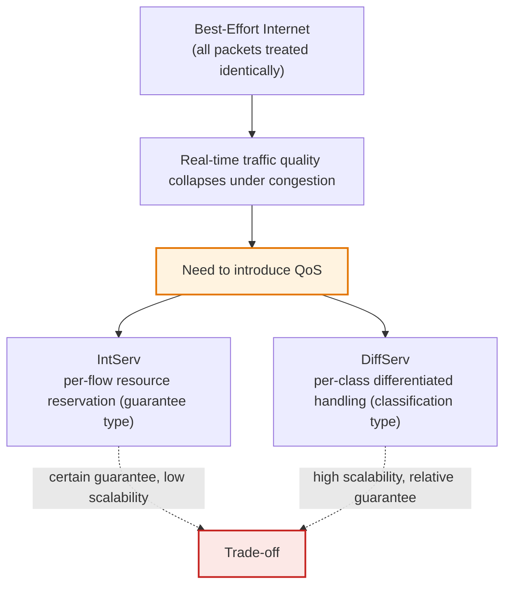
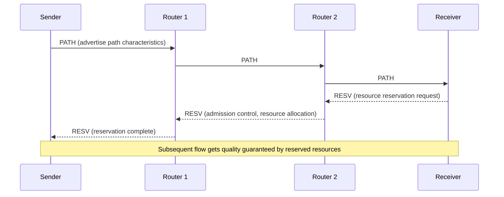
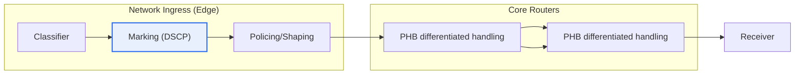

# QoS — DiffServ and IntServ

## 1. Overview

### A. Definition of QoS
> **QoS (Quality of Service)** is a technical framework that **guarantees or differentially provides** service-quality metrics such as **bandwidth, delay, jitter, and loss** for specific traffic in a network, and **IntServ (Integrated Services)** and **DiffServ (Differentiated Services)** are the two representative architectures that realize this in IP networks.

### B. Background and Necessity
The fundamental reason QoS is needed lies in the fact that "**if all traffic is treated identically, the quality of the truly important traffic collapses.**" The Internet was originally designed on the premise of **Best-Effort delivery**. Routers process all packets without discrimination, in arrival order (FIFO), and when congested, drop packets starting with the ones that arrived latest (tail drop). When links have spare capacity in normal times, this simple principle is sufficient, but the problem arises during congestion.

During congestion, differences in the nature of traffic become decisive. Real-time voice (VoIP) and video conferencing are **sensitive to delay, jitter, and loss**. VoIP typically must maintain **one-way delay within 150 ms, jitter within 30 ms, and loss rate within 1%** to ensure call quality; even a slight delay or loss causes the voice to cut out and the picture to break up. In contrast, large file transfers (FTP) and backups are insensitive to delay and only need throughput to be secured. If such traffic with conflicting requirements is treated identically in a best-effort manner, the quality of real-time traffic cannot be guaranteed.

QoS solves this problem by **differentially allocating priority and resources** to traffic. But the philosophy splits into two branches at the question of "how to differentiate." **IntServ** guarantees per-flow quality with certainty by pre-'**reserving**' the required resources on every router along the path before communication begins, while **DiffServ** has each router process traffic differentially by that grade after a priority is '**marked**' on the packets. The former is certain but heavy, the latter is light but its absolute guarantee is weak. In other words, the two approaches are fundamentally **different choices between 'certainty of guarantee (strong guarantee)' and 'scalability'**. This trade-off becomes the axis of every comparison that follows.

## 2. IntServ (Integrated Services) — Per-Flow Resource Reservation

IntServ reserves the required bandwidth on every router along the path using **RSVP (Resource reSerVation Protocol)** prior to communication. Conceptually, it mimics circuit reservation of the telephone network on top of IP, similar to the way you 'reserve a line before placing a call.'

Looking at the **operating principle** step by step: first, the sender sends a **PATH message** to advertise the path and traffic characteristics downstream. The receiver that gets this then requests the required resources back upstream with a **RESV message**, and each router along the path uses **Admission Control** to judge whether spare resources exist, and if possible, reserves (allocates) the resources. If resources are insufficient, it rejects the reservation and does not accept the new flow, thereby protecting the quality of existing flows. Because the flow starts only when **a reservation is established across the entire path** in this way, quality is guaranteed with certainty (hard guarantee).

The **key components** are: ① RSVP (signaling), which negotiates reservations; ② admission control, which decides whether to accept a new flow; ③ the packet scheduler (e.g., WFQ), which manages queues according to the reserved grade; and ④ classification and policing (classifier and policer), which check whether a flow adheres to the traffic spec it promised. IntServ divides service grades into **Guaranteed Service (guaranteed delay bound)** and **Controlled-Load Service (quality close to that of a lightly loaded network)**.

**The decisive limitation is scalability.** This is because each router must **maintain state proportional to the number of flows**. On a large-scale backbone where flows number in the thousands or tens of thousands, the state and signaling load the router must manage explode. Moreover, since **every** router along the path must support RSVP, the guarantee is broken if even one does not support it. Because of these two issues, IntServ was virtually never adopted on the large-scale Internet.

| Characteristic | Description |
|---|---|
| **Quality guarantee** | Certain per-flow guarantee (hard guarantee) |
| **Core technology** | RSVP signaling, admission control |
| **State management** | Routers maintain per-flow state (stateful) |
| **Limitation** | State and signaling proportional to number of flows → low scalability |

## 3. DiffServ (Differentiated Services) — Per-Class Differentiated Handling

DiffServ is an architecture that changed direction to '**per-class differentiation**' by giving up per-flow reservation, in order to solve IntServ's scalability problem. The core idea is '**do the complex judgment only once at the network edge, and have the core process simply and quickly based only on the marking**.'

**The operating principle** is as follows. At the ingress (edge) router where traffic enters the network, the traffic is **classified**, and a class is **marked** in the **DSCP (DiffServ Code Point)** field of the IP header (the upper 6 bits of the IPv4 ToS / IPv6 Traffic Class byte). At the ingress, **policing and shaping**—which drop or delay traffic exceeding the agreed spec—are also performed. From then on, the **core routers maintain no flow state at all** and only perform differentiated handling according to the **PHB (Per-Hop Behavior)** designated by the packet's DSCP marking.

**PHB (Per-Hop Behavior)** is a rule defining how each router treats packets of a specific class, and the standardized types are as follows. ① **EF (Expedited Forwarding)** is the highest-priority class that minimizes delay, jitter, and loss, used for real-time traffic such as VoIP and video. ② **AF (Assured Forwarding)** is divided into 4 classes each with 3 levels of drop priority, differentiating the order in which packets are dropped under congestion (for enterprise data, etc.). ③ **BE (Best-Effort, Default)** is the existing best-effort as is.

**The advantage is excellent scalability.** Since core routers maintain no per-flow state (stateless), they operate regardless of the number of flows and are suited to large-scale backbones. **The disadvantage is the absence of an absolute guarantee.** Because it is 'relative priority' rather than reservation, it is hard to assert that a specific class is guaranteed to be within a certain number of ms (soft guarantee). Therefore, in practice, quality is secured statistically by managing and designing **SLAs (Service Level Agreements)** and the total volume of traffic per class.

| Characteristic | Description |
|---|---|
| **Quality guarantee** | Relative per-class differentiation (soft guarantee) |
| **Core technology** | DSCP marking, PHB (EF/AF/BE) differentiated handling |
| **State management** | Core is stateless, judgment is at the edge |
| **Advantage** | No flow state needed → high scalability |

## 4. Comparison and Cases — Why DiffServ Became Mainstream

The difference between the two architectures ultimately stems from '**where and how much state is maintained**,' which leads to the trade-off between guarantee level and scalability.

| Category | IntServ | DiffServ |
|---|---|---|
| **Processing unit** | Per-flow | Per-class |
| **Guarantee level** | Certain per-flow guarantee (hard) | Relative per-class differentiation (soft) |
| **State management** | Each router maintains flow state | Core stateless (classification only at edge) |
| **Signaling** | RSVP required (advance reservation) | Not required (replaced by packet marking) |
| **Scalability** | Low (proportional to number of flows) | High (independent of number of flows) |
| **Application domain** | Small-scale, end segments | Large-scale backbone, Internet, SP networks |

**The fundamental reason the difference arises** is that IntServ bought certainty with the heavy machinery of 'per-flow state + advance signaling,' whereas DiffServ replaced that machinery with a '6-bit marking in the packet header' to gain scalability. Once state was removed from the core, routers could operate independently of the number of flows, and this **statelessness** became a decisive advantage at Internet scale.

**First case — carrier (ISP) backbone**: On a backbone where hundreds of thousands of flows run simultaneously, per-flow reservation (IntServ) is unrealistic because it cannot handle router memory and CPU. Therefore, large-scale networks in practice adopt DiffServ as the standard, operating with voice mapped to EF, critical business data to AF, and general traffic to BE.

**Second case — enterprise VoIP deployment**: If a company introducing IP telephony experiences video conferencing delay problems, it marks voice packets as DSCP EF (value 46) at switches and routers and places them in a priority queue to send them out ahead of data traffic. Here, the actual bandwidth allocation is not completed by DiffServ marking alone; **queuing and scheduling techniques** such as WFQ and LLQ (Low Latency Queuing) carry it out.

**Third case — hybrid design**: The two approaches are not mutually exclusive. End segments where quality is extremely important (e.g., a campus access network) can be guaranteed with certainty via IntServ/RSVP, while the backbone where traffic aggregates is handled with DiffServ, achieving both guarantee and scalability in a hybrid. In fact, RSVP-TE is still used for path and bandwidth reservation in the traffic engineering of MPLS networks.

## 5. Deep Dive — Linkage of QoS Mechanisms and Recent Trends

DiffServ and IntServ are merely '**policy frameworks that decide what to prioritize**'; actual quality is completed only when that policy is combined with the lower-level mechanisms that execute it. The QoS execution system consists largely of four axes: ① **Classification and Marking**, ② **Congestion Management (queuing, scheduling)**, ③ **Congestion Avoidance (WRED, etc.)**, and ④ **Policing and Shaping**.

In particular, **queuing and scheduling** are the core. Even if DiffServ marks a packet as EF, for a router to send that packet out first, algorithms such as **PQ (Priority Queuing), WFQ (Weighted Fair Queuing), CBWFQ, and LLQ** are needed. For example, LLQ gives a strict priority queue to delay-sensitive traffic such as voice, but places a bandwidth cap to prevent starvation of other traffic. On the congestion avoidance side, **WRED (Weighted Random Early Detection)** probabilistically drops low-priority packets in advance before the queue fills up, preventing TCP's global synchronization. In other words, DiffServ's AF drop priority becomes meaningful only when paired with WRED. [[wfq]]

**As for recent trends**, the center of gravity is shifting from physical circuit reservation to software policy. **SD-WAN** is application-aware, selecting the optimal path and queue in real time, thereby implementing 'intent-based' QoS beyond traditional DSCP marking. In **SDN**, the controller has an overview of the whole network and centrally controls policy at the flow level, so attempts are being made to reconcile IntServ's per-flow control with DiffServ's scalability in software. 5G core **network slicing**, in that it logically divides one physical network to guarantee per-slice QoS (such as ultra-low-latency URLLC), can also be seen as a flow that reinterprets IntServ's 'guarantee' philosophy with virtualization technology.

## 6. Considerations and Implications (Professional Engineer's Perspective)

1. **Scalability dominates the choice of architecture.** At Internet scale, per-flow reservation (IntServ) is unrealistic due to state and signaling load, so stateless, highly scalable DiffServ became the de facto standard in practice. When designing QoS, the professional engineer must judge the trade-off between 'certainty of guarantee' and 'scalability' according to network scale, and a layered choice—DiffServ for the backbone and IntServ for end segments when needed—is reasonable.

2. **QoS is not a single technology but an end-to-end policy system.** If DiffServ marking is ignored or re-marked at any segment along the path, the quality guarantee is broken. Therefore, formalizing the **DSCP trust boundary and consistency of marking policy** when crossing different carrier networks into an SLA is a key consideration.

3. **An economic comparison with over-provisioning (excess bandwidth allocation) is needed.** In segments where link bandwidth has become sufficiently cheap, securing ample bandwidth may be more advantageous in terms of total cost of ownership (TCO) than designing complex QoS. The professional engineer must weigh the operational complexity of introducing QoS against the cost of bandwidth expansion to present the optimal point.

4. **Integrated design with lower-level queuing and congestion avoidance mechanisms determines success or failure.** DiffServ's EF/AF marking is realized as quality only when combined with actual scheduling such as WFQ, LLQ, and WRED. If there is only marking and no queue policy, QoS is QoS in name only, so the four axes—marking, queuing, avoidance, and shaping—must be designed and verified consistently.

5. **Prepare for the transition to software-based QoS such as SDN, SD-WAN, and 5G slicing.** Since the paradigm is shifting from static DSCP policy to dynamic QoS based on application and intent awareness, it is desirable to strategically prepare an evolution path that layers central control and automation on top of the existing DiffServ design.

## References
- RFC 2205 — Resource ReSerVation Protocol (RSVP), IntServ signaling
- RFC 2475 — An Architecture for Differentiated Services (DiffServ)
- RFC 2597 / RFC 3246 — Assured Forwarding (AF) / Expedited Forwarding (EF) PHB

---

> **In one line**: In QoS, IntServ *pre-reserves per-flow resources with RSVP to guarantee with certainty (hard)* but has low scalability due to maintaining flow state, while DiffServ *performs per-class differentiated handling with DSCP marking and PHB (soft)* to achieve a stateless, highly scalable core but with a relative guarantee; on large-scale networks DiffServ is mainstream, and it is completed by being combined with queuing and congestion-avoidance mechanisms such as WFQ and WRED, as well as SDN, SD-WAN, and 5G slicing.
