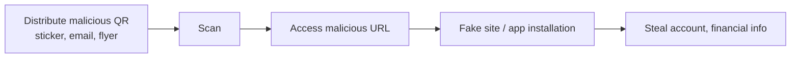

# Qshing (QR code + Phishing)

## 1. Overview

### A. Definition
> A **QR-code-based phishing** attack that uses a **QR code (Quick Response Code)** as bait to lure users to malicious sites or induce them to install malicious apps, thereby stealing account and financial information.

Qshing is an evolved form of smishing (text-based phishing), with its essence being that the attack vector has shifted from "link text" to "images (QR)." People can visually verify a URL string to some degree, but a QR code is a pattern of black-and-white dots, so its destination is completely unknown before scanning. This **destination opacity** is Qshing's core weapon.

### B. Background and Necessity
As contactless payments and simple payments spread after COVID-19, QR codes settled into everyday places such as payments, access authentication, electronic menus, and flyers. Users came to perceive QR codes as a "convenience method that is naturally trustworthy," and this **learned trust** itself became an attack surface. Moreover, a QR code can be easily planted in physical space with a single paper sticker, and when inserted as an image into an email body, it can bypass URL-based spam filters, so from the attacker's standpoint the cost-effectiveness is very high. For this reason, Qshing has become a rapidly increasing attack type recently, and given the characteristic that after-the-fact awareness is difficult, establishing a preemptive prevention system is urgent.

## 2. Attack Flow (Architecture)

Qshing generally goes through the four stages of **① distribution → ② scan inducement → ③ access → ④ theft**. The attacker scatters QR codes disguised as legitimate services through physical and electronic channels and induces scanning under social-engineering pretexts such as "parking settlement," "event prizes," or "package tracking." Immediately upon scanning, the browser navigates to a malicious URL, which is either a phishing page visually identical to the legitimate site or a malicious APK download link. The moment the user enters login information or a card number, or the moment they approve excessive permissions after installing an app, the information is stolen. In particular, the fact that mobile screens display the address bar briefly, making domain forgery hard to notice, magnifies the damage.

## 3. Attack Types and Techniques

Qshing is divided as follows according to the channel where the QR is placed and the technique used. The commonality is that all of them create a **"QR that looks legitimate."**

- **QR sticker overlay**: A malicious QR sticker is physically pasted over the genuine QR attached to parking-payment machines, restaurant tables, shared payment terminals, etc. For example, in the United States, numerous cases have been reported of fake QRs being pasted over payment QRs in public parking lots to divert payment information. Because it is possible with physical access alone, detection is very difficult.
- **Phishing email/text (Quishing)**: A QR is inserted into the email body or an attached image. Since there is no text URL, traditional spam and URL filters cannot filter it out, and the user ends up scanning with their "personal mobile phone rather than a PC," escaping corporate security controls (EDR, proxies).
- **Inducing malicious app installation**: After scanning, the user is induced to install an APK directly from an external link rather than the official app market. The installed app requests SMS, contacts, and accessibility permissions, leading to OTP theft or even remote control.
- **Payment/transfer fraud**: A forged account or merchant QR makes the user transfer money to the wrong place.

| Type | Technique | Risk point |
|---|---|---|
| **QR sticker overlay** | Attach malicious QR over genuine QR (parking, payment machines) | Physical access, hard to notice afterward |
| **Phishing email/text** | Bypass URL filters with QR in attachment/body | Escapes control via personal device |
| **Malicious app install** | Induce APK download after scanning | Excessive permissions, OTP theft |
| **Payment fraud** | Induce transfer with forged QR | Direct financial loss |

## 4. Countermeasures

Because of destination opacity, the key for Qshing is not "verify after scanning" but **"verify before accessing and before entering information."** Countermeasures are divided into multi-layered defenses by users, technology, and institutions.

- **User side**: Refrain from scanning QRs of unclear origin (street stickers, spam emails), and after scanning, always check the **URL preview** rather than letting it open automatically. For payment and login, the safest habit is to access directly via the **official app or bookmarks** rather than a QR.
- **Technology side**: The QR scanner app displays the URL before access, and blocks malicious domains via **reputation lookups** based on threat intelligence. Control malicious app installation with antivirus and MDM.
- **Institution/service side**: Periodically inspect the **integrity (tampering)** of posted QRs, prevent forgery and tampering with **authenticated QRs** containing digital signatures, and run user awareness campaigns in parallel.

| Actor | Countermeasure |
|---|---|
| **User** | Refrain from scanning QRs of unknown origin, check URL preview, access official app directly |
| **Technology** | URL verification and reputation lookup on scan, antivirus and MDM |
| **Institution** | QR integrity checks, signature-based authenticated QR, awareness raising |

## 5. Considerations and Implications
Because QR codes have high destination opacity, damage is often noticed only after it has occurred, so from a professional engineer's perspective, a **preemptive-verification-centered prevention architecture** is the key. First, combine it with the **zero-trust** principle of not trusting any access, treating access even after a QR scan as subject to continuous verification. Second, link mobile security (EDR, MDM, mobile antivirus) with threat intelligence to block malicious domains and apps in real time. Third, introduce **digital signatures and dynamic QRs (one-time)** for payment and authentication QRs to neutralize forgery and tampering itself. Ultimately, Qshing is a security problem entangling people and technology that diminishes only when **user awareness, service design, and regulation** move together, not technology alone.

---

> **In one line**: Qshing is phishing that *exploits the destination opacity of QR codes to lure users to malicious sites and apps and steal information*, and against techniques such as sticker overlays, email QRs, and malicious apps, preemptive prevention—refraining from scanning QRs of unknown origin, verifying the URL before access, and securing QR integrity via signatures—is the key.
