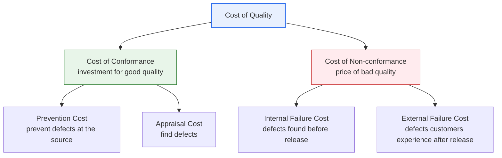
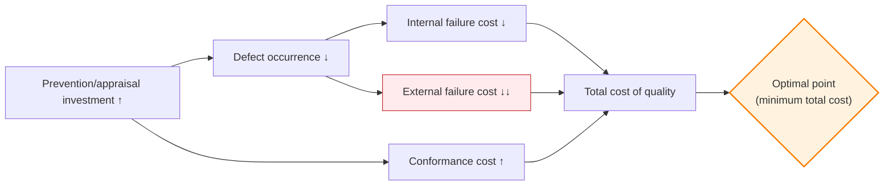

# Software Cost of Quality

## 1. Overview

### A. Definition
> **Cost of Quality (CoQ)** is the sum of all costs incurred to secure, maintain, and manage the quality of software, composed of the **Cost of Conformance (= prevention cost + appraisal cost)** for making good quality, and the **Cost of Non-conformance (= internal failure cost + external failure cost)** paid because of bad quality.

The core insight embodied in the concept of cost of quality lies in the fact that **"quality always costs something, but at which stage you spend that cost determines the total cost."** Many organizations, captured by the intuition that "raising quality increases cost," try to cut verification activities. However, cost-of-quality theory directly refutes this intuition. If you invest in prevention and appraisal in advance, defects decrease and failure costs such as rework and compensation plummet, and as a result **the total cost of quality actually decreases**. Conversely, if you neglect upstream control, defects accumulate and failure costs explode downstream. In other words, cost of quality is not a matter of "whether to spend or not," but a matter of **allocation—"where to spend it (on prevention, or on cleaning up failures)."**

The quantitative basis for this insight is precisely the **law of stage-by-stage amplification of defect-fixing cost**. The later a defect is discovered, the more exponentially its fixing cost grows. According to classic studies by Boehm, IBM, and others, a defect that costs 1 to fix if found at the requirements stage grows to several times that at the design stage, tens of times at the coding/testing stage, and **tens to hundreds of times** at the operational (post-release) stage. This is because an operational-stage defect goes beyond simple code fixes to trigger a chain of costs: incident response, emergency patch deployment, customer notification, and trust recovery. Because of this law, the conclusion that "upstream prevention investment is economical" is backed not by theory but by numbers.

### B. Background and Necessity
The concept of cost of quality originated with Juran and Crosby, thinkers of manufacturing quality management (TQM). Crosby's famous proposition, *"Quality is Free,"* means that "the cost invested in prevention is recovered through far greater savings in failure cost, so properly made quality ultimately incurs no cost." As this idea was introduced into software engineering, it developed into a tool for **measuring and making visible in monetary units** the costs of rework, overtime, and customer churn that were previously hard to see. Because software is intangible, its quality—good or bad—does not immediately manifest, and defects have the characteristic of exploding into major incidents at the operational stage, so the need to **manage quality activities from a cost-benefit perspective** is especially great. If you invest in verification without cost-of-quality analysis, you waste resources on excessive quality; if you do not invest, failure costs snowball due to under-quality; therefore cost of quality is required as the **basis for management decision-making that finds the optimal investment point.**

## 2. The Four Components of Cost of Quality

### A. Overall Classification Structure
Cost of quality is divided broadly into two axes—"active investment to make good quality (cost of conformance)" and "the after-the-fact price incurred by bad quality (cost of non-conformance)"—and each axis is further subdivided into two items.

The core logic of this four-way classification is the offsetting relationship in which **"the more you invest on the left (prevention, appraisal), the more the right (internal, external failure) decreases."** And since the cost grows destructively as you move right, especially toward external failure cost, investment priority naturally tilts left (prevention > appraisal).

### B. Prevention Cost — Investment to Block Defects at the Source
Prevention cost is the cost invested proactively to block the very occurrence of defects. This includes developer education and training, establishing coding standards and development processes, formulating quality plans, requirements and design reviews, introducing static analysis tools, and architecture reviews. The essence of prevention cost is that it lies in **"eliminating the root cause of defects."** For example, if a certain type of null-pointer error recurs, prevention is not fixing it each time (failure cost) but adding coding rules and static analysis rules so that this type does not arise again.

Prevention has **the highest return on investment (ROI)** among the four items. This is because, by blocking defects before they are created, it saves downstream appraisal and failure costs in a chain. However, its effect is not immediately visible (prevented defects are "events that did not happen," so they are hard to measure), and it is also the first item to be cut under performance pressure. A consistent observation of cost-of-quality analysis is that the more mature an organization is, the higher its proportion of prevention cost.

### C. Appraisal Cost — Inspection to Find Defects
Appraisal cost is the **inspection and measurement cost to find** whether defects exist in already-produced deliverables. Dynamic testing (unit, integration, system, acceptance testing), code reviews and inspections, audit reviews, quality audits, and the cost of building and maintaining test environments belong here. The essence of appraisal is not "eliminating defects" but "acting as a filter that finds defects and prevents them from leaking downstream (to operations)."

The important thing to understand about appraisal cost is its relationship with prevention. Since appraisal **only finds defects but does not prevent them**, relying on appraisal alone falls into the wasteful cycle of "continuously finding and fixing defects." The ideal improvement path is to feed back the defect patterns repeatedly found in appraisal into prevention activities, gradually reducing the very defects caught in appraisal. That said, strengthening appraisal indefinitely is not the answer either. This is because there exists a point where the marginal cost of raising test coverage from 99% to 100% exceeds the failure cost it thereby prevents.

### D. Internal Failure Cost — Handling Defects Found Before Release
Internal failure cost is the cost of handling defects that are discovered **before** the product is delivered to the customer. Bug fixing, rework, retesting, defect root-cause analysis, and design changes fall under this. Although this cost is "the price of bad quality," it is **much cheaper than external failure in that it was at least caught before reaching the customer.**

Internal failure cost has the two-sidedness of being a product of appraisal activities. Strengthening testing (increasing appraisal cost) catches more defects before release, so internal failure cost increases, but this is actually a healthy sign. This is because it is overwhelmingly better than the same defect being released without being filtered and blowing up as external failure. Therefore, internal failure cost should be seen not as "the lower the better" but as an indicator that judges the soundness of the quality process by its **ratio to external failure cost (internal/external).**

### E. External Failure Cost — The Most Destructive Cost
External failure cost is the cost incurred after a defect **reaches the customer** post-release, and it is **the largest and most destructive** of the four. It includes customer compensation and refunds, recalls, emergency patch and hotfix deployment, call-center and technical-support burden, contractual penalties, and above all **decline in brand trust and customer churn.** While the preceding three costs are relatively clearly measured in money within the organization, external failure cost has the characteristic of including **losses that are hard to measure but actually the largest**, such as loss of trust and reputational damage.

The scale can be gauged from concrete cases. In 2012, a defect in a global brokerage firm's order-processing software caused a loss of about 440 million dollars in 45 minutes and drove the company to the brink of bankruptcy. Airline reservation system outages, transfer errors in banking apps, and large-scale personal information breaches are all cases where post-release defects (external failures) led to compensation, fines, and stock-price declines. In this way, external failure cost can exceed development cost by tens of times, creating the paradox that "skimping on pre-release verification is the most expensive saving."

| Item | Nature | Representative activities/cases | Timing |
|---|---|---|---|
| **Prevention cost** | Conformance (investment) | Training, coding standards, process, design review, static analysis tools | Before development / throughout |
| **Appraisal cost** | Conformance (investment) | Testing, code review, inspection, audit review, quality audit | During development |
| **Internal failure cost** | Non-conformance (price) | Bug fixing, rework, retesting, root-cause analysis | Before release |
| **External failure cost** | Non-conformance (price) | Customer compensation, recall, hotfix, trust decline, penalties | After release |

## 3. Relationships Among Quality Costs and the Optimal Investment Point

### A. Offsetting Relationship and the Total Cost Curve
The four cost items are not independent but move interlocked with one another. The core dynamic is the **trade-off** relationship in which **"increasing conformance cost (prevention, appraisal) decreases non-conformance cost (failure)."** Graphed, as the quality level rises, conformance cost increases upward to the right and failure cost decreases downward to the right, and the **total cost of quality**, which sums the two, draws a **U-shaped curve.**

### B. Interpretation of the Optimal Point
Initially, the more prevention/appraisal investment is increased, the more failure cost drops significantly, decreasing total cost. However, past a certain point, the marginal cost of the investment itself becomes larger than the failure cost that additional investment can prevent, so total cost increases again. The **point where total cost is minimized is the optimal quality investment level.** That said, the modern view has evolved somewhat: with the development of automated testing, CI/CD, and static analysis tools, the marginal cost of appraisal and prevention has dropped significantly, so the optimal point has **moved toward higher quality** than before. In other words, the classic conclusion that "perfect quality is uneconomical" has been considerably eased today, when verification cost has plummeted thanks to automation.

The point that must be emphasized here is **the weighting of external failure cost.** Because external failure cost hides unmeasurable loss of trust when calculating total cost, it is **safer to invest more upstream** than the nominally calculated optimal point. If you optimize only with visible costs, you underestimate the real risk (brand collapse).

### C. Reading Process Maturity by the Ratio Among Items
Cost of quality is useful for diagnosing an organization's quality maturity not only by absolute amount but also by the **ratio among items.** For example, if failure cost (internal + external) accounts for most of the total cost of quality while prevention cost is negligible, that is a sign that the organization is at an immature stage of "creating defects and cleaning up afterward." Conversely, if the proportion of prevention cost is high and failure cost is low, it is a mature organization that controls defects upstream. In particular, a high **ratio of internal failure cost to external failure cost** is interpreted as a positive indicator that "defects are being filtered well before being sent out to the customer." In this way, cost of quality serves not as a mere expenditure record but as a **compass pointing to the direction of process improvement.**

Also, cost of quality is more meaningful when viewed as a **trend** rather than by individual defects. By tracking costs per item per sprint or release, you can confirm with data whether failure cost actually decreases over several months after increasing prevention investment. Only with this feedback loop can you quantitatively prove to management that "quality investment is effective" and secure a sustained budget.

## 4. Deep Dive — Cost of Quality and Shift-Left in the Agile/DevOps Era

Traditional cost-of-quality theory, against the backdrop of the waterfall model, emphasized "thorough verification before release." However, in agile and DevOps environments, since deployment iterates in short cycles, the way cost of quality is managed has also evolved. The core strategy is **Shift-Left**, that is, pulling quality activities **further upstream (to the left)** in the development lifecycle. This is the logical consequence of the aforementioned "law of defect-fixing cost amplification"—an approach that catches defects as early as possible to sever the roots of failure cost.

Concrete practices include: ① **TDD (Test-Driven Development)**, which makes tests first before writing code to prevent defect introduction; ② running automated tests and static analysis on every commit in the **CI (Continuous Integration)** pipeline to find defects immediately; and ③ using **static analysis tools (SonarQube, etc.)** to automatically detect vulnerabilities and code smells before code review. These all make prevention and appraisal costs **cheap through automation**, filtering defects upstream at far lower cost than in the days when people did it manually. As a result, it became possible to achieve the same quality at far lower total cost.

The effect of this automation fundamentally changes the cost-of-quality curve. In the past, appraisal activities (testing, review) were repetitive human labor with a high marginal cost, so raising quality beyond a certain level soon broke economic viability. However, if you write tests as code, running them thousands of times afterward incurs almost zero additional cost, so **much denser verification** becomes possible on the same budget. In other words, automation changes the nature of appraisal cost from "a variable cost incurred each time" to "a fixed investment made once," blurring the boundary between prevention and appraisal. This is because a well-written automated test suite functions both as an appraisal means to find defects and simultaneously as a prevention device (regression prevention) that blocks future defect introduction.

Meanwhile, the concept of **Shift-Right** has also been discussed recently as a complement. It is an approach that detects problems during actual use early through observability, canary deployment, feature flags, and A/B testing in the operational environment, and rolls back quickly, thereby suppressing external failure cost before it spreads into a major incident. In other words, the modern cost-of-quality strategy is developing into **two-way defense** that combines "upstream prevention (Shift-Left)" and "early detection and rapid recovery at the operational stage (Shift-Right)," blocking cost before it explodes no matter where a defect leaks. Furthermore, the latest trend where AI-based code review and defect prediction tools raise the efficiency of prevention cost once again is also noteworthy.

## 5. Considerations and Implications (Professional Engineer's Perspective)

1. **Prevention-first investment allocation** — Since prevention has the highest ROI among the four costs, the quality budget should be allocated first to prevention activities such as reviews, standards, education, and automation tools rather than to cleaning up failures. The transition from an "organization that finds and fixes defects" to an "organization that keeps defects from arising" is the key to minimizing total cost of quality, and this is directly linked to improving the organization's process maturity (CMMI, etc.).

2. **Recognizing the hidden size of external failure cost** — External failure cost includes, beyond explicit costs such as compensation and recalls, **losses that are hard to measure but fatal**, such as decline in brand trust, customer churn, and regulatory fines. Therefore, it is safer to invest conservatively somewhat upstream of the nominally calculated optimal investment point, and this principle is absolute especially in finance, healthcare, and safety-related domains.

3. **Data-driven decision-making through measuring and visualizing cost of quality** — Unless the four costs are measured and tracked in monetary units, quality investment relies on gut feeling. You must quantify indicators such as rework time, defect density, number of leaked defects, and per-item cost ratios (e.g., prevention:appraisal:internal:external), and argue for quality in the language management understands (cost savings, ROI) to continuously secure support for quality investment.

4. **Movement of the optimal point through automation** — If you lower the marginal cost of prevention and appraisal with CI/CD, static analysis, and automated testing, the optimal quality level that minimizes total cost itself moves higher. In other words, automation investment is a lever that achieves "higher quality at lower total cost," so cost-of-quality optimization and DevOps automation strategy must be designed together.

5. **Combining Shift-Left/Right and built-in quality across the lifecycle** — Quality must be built into the entire lifecycle of requirements, design, coding, and operations (built-in quality) rather than being a gate at a specific stage (pre-release testing). Combining upstream prevention (Shift-Left) with operational early detection (Shift-Right), and suppressing the ripple effects of external failure with observability and canary deployment, is the aim of modern cost-of-quality management.

## References
- Philip Crosby, *Quality Is Free: The Art of Making Quality Certain* (source of the concept)
- Juran's Quality Handbook — Cost of Quality framework
- ISTQB Foundation Level Syllabus — explanation of Cost of Quality / Cost of Defects — https://www.istqb.org/

---

> **In one line**: Cost of quality is composed of *four items—cost of conformance (prevention, appraisal) and cost of non-conformance (internal, external failure)*, and since the later a defect is found, the more exponentially its fixing cost grows (external failure cost being the most destructive), it is economical to invest in upstream prevention and appraisal in advance to minimize total cost; today it is developing in the direction of achieving higher quality at lower total cost through automation and Shift-Left/Right.
