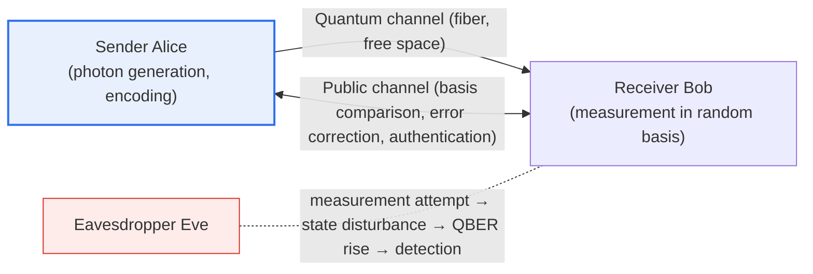

# Quantum Cryptography Communication

## 1. Overview

### A. Definition

> **Quantum cryptography communication** is a communication technology that uses the fundamental principles of quantum mechanics (disturbance of state by measurement, impossibility of copying) to **securely distribute encryption keys in a way that makes eavesdropping physically detectable.** Its representative implementation is **QKD (Quantum Key Distribution)**, and the key distributed here is combined with a one-time pad (OTP) or symmetric-key cipher to protect the actual data.

The core idea of quantum cryptography communication is that '**security is guaranteed by the laws of physics themselves, not by mathematical computational difficulty.**' Existing public-key ciphers such as RSA and ECC rely for their security on a 'computational complexity assumption'—that mathematical problems such as integer factorization or discrete logarithms cannot be solved within a realistic time. However, if a large-scale fault-tolerant quantum computer capable of running Shor's algorithm appears, this assumption collapses and existing public-key ciphers may be neutralized.

In contrast, quantum cryptography communication bases its security on natural laws, not computation. A quantum state (a single photon) has two fundamental properties. First, **measuring it necessarily disturbs the state (Heisenberg's uncertainty principle)**. Second, **an unknown quantum state cannot be perfectly copied (the No-Cloning Theorem)**. Therefore, if an eavesdropper (usually denoted Eve) intercepts and measures a photon in transit, its trace necessarily remains as state disturbance and an increased error rate, and the sender and receiver (Alice and Bob) statistically detect this and immediately discard the contaminated key. In other words, since 'the very attempt to eavesdrop is physically detected,' even an eavesdropper with the most powerful computer cannot steal the key without being caught. This property is **unconditional (information-theoretic) security**, which promises security that remains valid even in the era of quantum computers.

### B. Background and Necessity

Almost all trust in a digital society (e-commerce, finance, defense communication, e-government) is built upon the security of key exchange. Yet with the progress of quantum computing, the concern has grown that the widely used public-key-based key exchange could be broken in the future. In particular, the **HNDL (Harvest Now, Decrypt Later)** threat—where an attacker stores currently encrypted communications and later decrypts them with a quantum computer—poses an ongoing risk to national, medical, and financial data requiring long-term confidentiality.

Against this background, a means of key distribution that is 'fundamentally' secure based on the laws of physics rather than computational complexity was required, and quantum cryptography communication emerged as one answer. Unlike post-quantum cryptography (PQC), which requires only swapping the software algorithm, it requires dedicated optical hardware, but it has independent value in the ultra-high-security domain in that it provides a theoretical upper bound of 'information-theoretic security.'

## 2. Principles and Composition of Quantum Key Distribution (QKD)

QKD carries key bits on the quantum state of a photon (polarization, phase, etc.), transmits them over a **quantum channel**, and then compares and refines the results over a **public (classical) channel** to create a secret key shared only by Alice and Bob. The separation of the roles of the two channels, and the fact that eavesdropping is revealed through the error rate, are the core of the overall structure.

**The quantum channel** is a physical path that carries the quantum state contained in each individual photon, using optical fiber or a satellite-to-ground free-space link. Photons passing through this channel are disturbed by an eavesdropper's measurement, so the channel itself doubles as an eavesdropping-detection sensor. **The public channel** is an ordinary communication network such as the Internet, used to compare which bases were used for sending and measuring after transmission, and to correct errors. However, while the public channel's content may be exposed, separate authentication (based on a pre-shared secret or certificates) must be conducted in parallel to prevent **man-in-the-middle (MITM) attacks.** Without this authentication, Eve could establish separate keys with Alice and Bob and relay/wiretap the communication, so the key practical caveat is that "QKD is secure only on the premise of an authenticated classical channel."

### A. Operation of the BB84 Protocol

The most representative protocol is **BB84**, proposed in 1984 by Bennett and Brassard. Alice randomly picks one of two kinds of bases (e.g., the rectilinear basis + and the diagonal basis ×) for each bit, encodes it in the photon's polarization, and transmits it. Bob likewise measures each photon in a random basis. When transmission ends, the two compare over the public channel only 'which basis was used' (without revealing the bit values), keep only the bits at positions where the bases matched, and discard the rest. This process is called **Sifting**, and statistically about half remain.

Even if the eavesdropper Eve tries to measure the photons in the middle, since Eve does not know which basis Alice used, she has no choice but to measure in a random basis. If she chooses the wrong basis for measurement, the state is disturbed, and when that photon is delivered to Bob, there is a chance that even if Bob measures in the correct basis, a result different from the original value emerges. As a result, the **QBER (Quantum Bit Error Rate)** rises, and Alice and Bob estimate the QBER by publicly comparing a sample of the remaining key. If the QBER exceeds a theoretical threshold (known to be around 11% for BB84), they judge it as eavesdropping or excessive noise, discard the key, and retry.

The intuition can be organized with a simple numerical example. If Alice sends 100 photons in random bases and Bob measures in random bases, since the ratio of bases coinciding by chance is about 50% on average, about 50 bits remain after basis comparison. If the eavesdropper Eve here measures all photons in random bases and retransmits them in an 'intercept-resend' manner, errors are induced in the half of the photons where Eve's basis is wrong, and half of those again appear as actual errors in Bob's measurement, so theoretically about 25% QBER occurs. In other words, a sharp rise in error rate that is clearly distinguished from the low noise-based error (within a few %) when there is no eavesdropping is observed, so eavesdropping can be detected statistically. This example shows how the principle that 'measurement leaves a trace' leads to quantitative detection.

### B. Key Post-Processing — Error Correction and Privacy Amplification

Even for bits where the bases matched, Alice's and Bob's keys are not completely identical because of channel noise and equipment imperfections. So **Information Reconciliation** is performed over the public channel to make the two keys identical. Since some information leaks over the public channel in this process and Eve may have partial information, **Privacy Amplification** is applied next. This is a hash-function-family transformation that compresses the key to be shorter, lowering the amount of information Eve can know to a negligible level. After going through this post-processing, a secure symmetric key known only to Alice and Bob is finally completed.

## 3. Key Element Technologies

The effectiveness of quantum cryptography communication depends on the hardware technology that precisely generates, transmits, and detects photons, and on the relay technology to overcome the long-distance limit. The following elements must be combined with one another for a practical system to hold up.

| Technology | Description | Practical implication |
|---|---|---|
| **Single-photon generation/detection** | Precisely generate and measure photons one at a time | Multi-photon emission becomes a PNS attack surface |
| **Quantum-state encoding** | Encode key information in polarization, phase, or time bins | Choose a method suited to the channel environment |
| **Key post-processing** | Error correction, privacy amplification | Secure the security of the final key |
| **Quantum repeater / satellite QKD** | Relay signals for long-distance transmission | Bypass the fiber loss limit |

**Single-photon generation** is especially important. Ideal QKD must carry one bit per photon, but actual light sources sometimes emit multiple photons at once. In this case, a **PNS (Photon Number Splitting) attack**, in which Eve siphons off only the extra photons, becomes possible. To prevent this, in practice the **Decoy State technique**, which randomly varies the signal intensity, is widely adopted to recover security despite the imperfection of the single-photon source.

**The Secret Key Rate** is also an important practical metric. Because it handles faint signals at the single-photon level and discards a considerable number of bits during post-processing, QKD's amount of secure key generated per second is low compared to classical communication and plummets as the transmission distance increases. Therefore, rather than encrypting large volumes of data with OTP every time, a practical approach is to periodically renew and supply the key obtained via QKD as the session key of a symmetric cipher such as AES. In this way, balancing the 'key generation rate versus required renewal cycle' becomes the core performance challenge in designing a QKD system.

**Long-distance transmission** is a fundamental constraint of QKD. In optical fiber, photons are lost exponentially with distance, and simply amplifying (copying) the signal as in classical communication violates the No-Cloning Theorem and destroys the quantum state. Therefore, to bypass loss, **quantum repeaters**, trusted-node methods, or **satellite-based QKD** using high-altitude paths with low atmospheric loss are being researched and built. In fact, China's Micius satellite performed satellite-to-ground QKD and continental-scale quantum communication experiments, showing that free-space satellite links can complement the distance limit of ground-based optical fiber.

## 4. Vulnerabilities and Limitations

Unconditional security is, after all, a theoretical property premised on 'ideal equipment and protocols,' and several vulnerabilities and constraints exist in actual implementation. The gap between theory (protocol) and implementation (equipment) is the greatest concern of practical security.

| Category | Description |
|---|---|
| **Implementation (side-channel) vulnerabilities** | Attacks targeting imperfect light sources and detectors (PNS, detector blinding, etc.) |
| **Distance/rate limits** | Long-distance and high-speed transmission constrained by photon loss; relay infrastructure needed |
| **Authentication required** | Separate authentication system needed to prevent public-channel MITM attacks |
| **Cost/infrastructure** | High deployment and operating cost of dedicated optical equipment and dedicated lines |

The items in this table differ in nature. Implementation vulnerabilities and the need for authentication threaten 'security' itself, whereas distance/rate limits and cost/infrastructure constrain 'practicality and economics.' Therefore, the response must be dualized: threats to security are approached with protocol/equipment improvements (MDI-QKD, decoy states, robust authentication), while practicality constraints are approached with architectural choices (satellite, relay, trusted node) and investment feasibility reviews.

The most realistic threat is the **side-channel attack.** Even if the protocol is secure, attacks such as an actual light source emitting multiple photons (PNS) or 'detector blinding'—shining strong light on the detector to cause malfunction—can exploit flaws in the physical equipment. In response, protocols such as **MDI-QKD (Measurement-Device-Independent QKD)**, which eliminates detector-side vulnerabilities at the source, have been proposed, and research continues on maintaining security even in untrusted equipment environments.

It must also be clearly recognized that QKD handles **only key distribution.** QKD itself does not encrypt data or authenticate the communicating party, and the distributed key must be combined with a separate symmetric-key cipher (AES, etc.) or OTP to provide actual confidentiality. For this reason, some agencies such as the U.S. NSA take a cautious stance of recommending standardized PQC over QKD for broad national security communications, citing QKD's hardware dependency, distance constraints, and authentication issues. In other words, since the standing of QKD is evaluated differently depending on the field and threat model, definitive judgments of superiority should be avoided.

Synthesizing these constraints, QKD positions itself not as 'a general-purpose technology that replaces all communication' but as 'a specialized technology that physically protects specific high-value segments.' For example, a layered deployment—placing QKD at points where distances are relatively short and the highest level of confidentiality is required, such as the backbone line between two data centers, a dedicated link between a financial institution's disaster-recovery centers, or the core segment of a defense command-and-control network, and protecting other wide-area and general-purpose segments with PQC—is discussed as a realistic form of adoption. Here, integrated design that links the key distributed in the QKD segment with existing crypto infrastructure (key management systems, VPNs, etc.) becomes the key in practice.

## 5. Deep Dive: Relationship with PQC and Domestic/Overseas Trends

Security responses in the quantum era are divided broadly into two axes: **QKD (hardware-based physical security)** and **PQC (software-based mathematical security).** QKD physically distributes keys securely with dedicated optical equipment, aiming for information-theoretic security, but has large distance, cost, and authentication constraints. In contrast, PQC (post-quantum cryptography) is an algorithm based on mathematical problems—such as lattice-, hash-, and code-based—that are considered hard to solve even for quantum computers, and can be applied to existing network equipment with only a software update, giving it high scalability and economy.

The differences in nature between the two approaches are organized as follows.

| Category | QKD (Quantum Key Distribution) | PQC (Post-Quantum Cryptography) |
|---|---|---|
| **Basis of security** | Laws of physics (information-theoretic security) | Mathematical hard problems (computational complexity) |
| **Implementation method** | Dedicated optical hardware, dedicated lines | Software applied to existing equipment |
| **Distance/scalability** | Distance-constrained by photon loss, relay needed | Wide-area application without network constraints |
| **Authentication issue** | Separate authentication needed for public channel | Self-authentication via signature algorithms |
| **Main use** | Ultra-high-security segments such as defense and finance | General-purpose Internet, e-government, commerce |

It is reasonable to understand these two as **complementary** rather than competing. As the table shows, QKD provides a theoretical upper bound of physical security but has large distance, cost, and authentication constraints, while PQC has high scalability and economy but, after all, relies on the assumption of 'a mathematical problem not yet solved.' Therefore, a hybrid configuration—using PQC for public-channel authentication and combining QKD for key distribution—is also possible, and they are chosen or used together depending on the threat model, cost, and required security level.

On the standardization side, the U.S. NIST officially announced PQC standards in 2024, including FIPS 203 (ML-KEM, based on CRYSTALS-Kyber), FIPS 204 (ML-DSA), and FIPS 205 (SLH-DSA), and the PQC transition is being fully launched. In the QKD camp, the aforementioned satellite QKD experiments and the construction of city-scale quantum communication networks (quantum backbones) continue to be pursued as national strategic projects, and domestically, test-network construction and demonstrations have been proceeding centered on telecom carriers and research institutions. However, since standards, versions, and construction status are rapidly updated, an attitude of reconfirming specific figures and timings against the latest standard documents is necessary.

From the perspective of a professional engineer's exam answer, this topic is effectively organized by contrasting QKD and PQC within the larger frame of 'quantum computing threats and responses,' then showing principled depth through the operation of BB84, QBER, and post-processing, then pointing out implementation realities such as side-channel vulnerabilities and distance limits, and concluding with actual application in ultra-high-security domains such as defense and finance, and a hybrid strategy.

## 6. Considerations and Implications

1. **The gap between theoretical security and implementation security must be managed.** Even if the quantum principle itself is secure, side-channel attacks targeting the imperfection of actual light sources and detectors are possible, so implementation-security techniques such as MDI-QKD and decoy states, along with an equipment verification and authentication system, must be conducted in parallel.

2. **QKD and PQC must be combined complementarily.** QKD handles physical key distribution, and PQC handles software-based algorithmic defense—different layers. Considering the organization's threat model (especially HNDL risk) and cost/distance constraints, a layered strategy of deploying QKD for ultra-high-security segments and PQC for wide-area and general-purpose segments is realistic.

3. **The practical constraints of distance, cost, and authentication must be reflected early in the design.** The distance limit due to fiber loss, the cost of dedicated equipment and lines, and the public-channel authentication requirement are key variables that determine the feasibility of adopting QKD. Architectural choices such as satellite QKD, quantum repeaters, and trusted nodes must be reviewed together with the required security level and budget.

4. **It must be approached from the perspective of national infrastructure and a transition roadmap.** Because of its eavesdropping-proof characteristic, QKD is applied first to ultra-high-security communications in defense, finance, and government, and at the same time, securing 'Crypto-Agility'—identifying the organization's overall crypto assets and transitioning to PQC in stages—must be conducted in parallel to maintain security continuity in the quantum era.

## References

- Wikipedia, "Quantum key distribution". https://en.wikipedia.org/wiki/Quantum_key_distribution
- Wikipedia, "BB84". https://en.wikipedia.org/wiki/BB84
- NIST, "NIST Releases First 3 Finalized Post-Quantum Encryption Standards" (2024). https://www.nist.gov/news-events/news/2024/08/nist-releases-first-3-finalized-post-quantum-encryption-standards

---

> **In one line**: Quantum cryptography communication is a technology that *detects eavesdropping through the quantum-mechanical principles of disturbance-upon-measurement and no-cloning* to securely distribute keys (QKD, BB84), refining the key with QBER and post-processing (error correction, privacy amplification), but it has side-channel, distance, and authentication constraints, so it is used complementarily with PQC.
