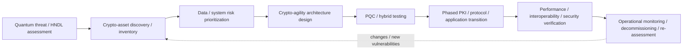
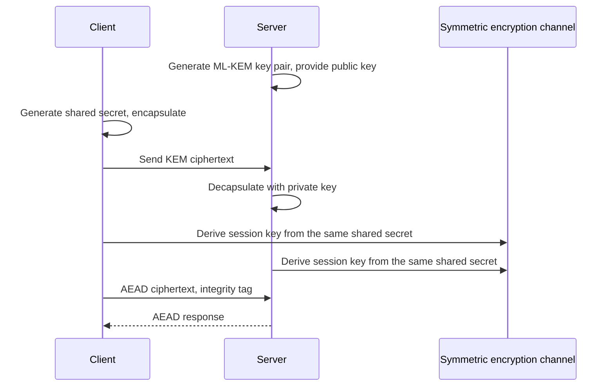

# Post-Quantum Cryptography (PQC) and Crypto Transition Strategy

## 1. Overview

> **Definition**: Post-quantum cryptography (PQC) is a cryptographic technology designed to maintain confidentiality, integrity, and authentication even if a sufficiently large quantum computer appears, by replacing the core problems of existing public-key ciphers with quantum-resistant mathematical problems.

Current RSA, Diffie–Hellman, and elliptic-curve cryptography rely for their security on the computational difficulty of integer factorization and discrete logarithms.
Because solving these problems for large keys on a classical computer requires an extremely long time, they have been widely used in the Internet's key exchange, digital signatures, and certificate systems.
However, if a cryptographically relevant quantum computer (CRQC) capable of running Shor's algorithm becomes a reality, the security assumptions of these public-key systems are fundamentally weakened.

Symmetric-key ciphers and hash functions are also affected by quantum attacks, but the nature of the impact differs from that on public-key ciphers.
Grover's algorithm lowers the complexity of symmetric-key and hash search to roughly the square-root level, so there is room to mitigate it by increasing the key length or output length.
In contrast, Shor's algorithm presents the possibility of efficiently solving the underlying problems of RSA, DH, and ECC, so simply increasing the key length a little is not sufficient.

The PQC transition is not a simple encryption project of selecting and swapping in one new algorithm.
Certificates, key management, TLS/VPN/SSH, code signing, firmware updates, database connections, and devices' crypto libraries and vendor dependencies must all be investigated together.
In particular, the 'Harvest Now, Decrypt Later (HNDL)' threat—decrypting later the ciphertext collected now—is the reason organizations with long data-secrecy lifetimes must prepare now.

The U.S. National Institute of Standards and Technology (NIST) finalized FIPS 203, 204, and 205 in 2024, presenting the first three pillars of PQC standards.
FIPS 203 specifies the key-encapsulation mechanism ML-KEM, FIPS 204 the general-purpose digital signature ML-DSA, and FIPS 205 the hash-based digital signature SLH-DSA.
In a professional engineer's exam answer, one should not stop at memorizing algorithm names but explain the governance and architecture that lead from risk analysis of current cryptography to crypto-asset inventory, prioritization, testing, and phased transition.

## 2. The Quantum Threat and the Need for Transition

### 2.1 The Impact of Quantum Algorithms on Existing Cryptography

RSA is based on the factorization of large integers, and DH and ECC on the computational difficulty of the discrete-logarithm problem.
In classical computing, increasing the key length sufficiently could realistically raise the cost of attack, but in quantum computing, Shor's algorithm has the potential to handle these problems efficiently.
Therefore, RSA certificates, ECDH key exchange, and ECDSA signatures all become targets for replacement at the same time once quantum computers develop sufficiently.

For symmetric ciphers, the security strength is re-evaluated in light of the effect of Grover's algorithm.
For example, since the quantum-search security of a 128-bit symmetric key can theoretically be lowered, in areas requiring long-term protection, longer keys such as AES-256 are considered.
That said, an actual attack requires many conditions—quantum error correction, the number of logical qubits, circuit depth, implementation flaws, and so on—so one must not conclude that 'all cryptography will be broken outright tomorrow.'

The goal of PQC is not to use a quantum computer, but to provide cryptography that runs on a classical computer even against an attacker who has a quantum computer.
Therefore, quantum-resistant algorithms are also not free from traditional risks such as implementation errors, random-number-generation failures, side channels, poor key management, and certificate misissuance.
Even if the algorithm is changed, if operational controls are weak, the overall security level does not improve.

### 2.2 HNDL and the Secrecy Lifetime of Data

Even if an attacker cannot break current cryptography immediately, they can collect network traffic and stored data.
When future quantum-computing capability becomes sufficient, they can decrypt the ciphertext collected in the past to steal medical information, state secrets, industrial design materials, and long-term contract documents.
This threat is especially important for organizations whose confidentiality-retention period is longer than the time it takes to complete a crypto transition.

Risk assessment must consider data sensitivity and secrecy lifetime together.
Material to be published a week later and source-technology material that must be protected for 20 years have different priorities, even for the same RSA usage.
The crypto-asset inventory should record not just the algorithm but also data classification, creation date, retention period, likelihood of ciphertext exposure, the party performing decryption, and the difficulty of replacement.

### 2.3 The Overall Transition Flow

In this flow, the first thing to do is not to decide on an algorithm but to identify where cryptography is currently used.
This must include not only the libraries you call directly but also the cryptography used internally by operating systems, web servers, certificate authorities, cloud services, network equipment, and external SaaS.
The discovery results must be linked to system owners, and crypto usage without an owner is classified as a management risk in itself.

Next, use data importance, likelihood of exposure, difficulty of replacement, supply-chain dependency, and impact of failure to determine the transition order.
Communications handling long-term confidential data and code signing should be reviewed faster than a simple test server, but a core service where availability is critical should not be replaced immediately without compatibility testing.
The transition must verify not only security but also performance, key size, certificate size, network MTU, storage, and whether legacy equipment supports it.

## 3. PQC Standards and Core Algorithms

### 3.1 The Role Distinction of the NIST Standards

The three standards NIST finalized are not a list competing for the same function.
ML-KEM is in the key-encapsulation family, in which two communicating parties establish a shared secret over a public channel, while ML-DSA and SLH-DSA are in the digital-signature family, for message integrity and signer authentication.
Actual TLS or applications may need both session key establishment and server/client authentication, so KEM and signatures are combined in the design.

| Standard | Algorithm | Main function | Underlying mathematics | Role in transition |
|---|---|---|---|---|
| FIPS 203 | ML-KEM | Key encapsulation / shared-secret establishment | Module-lattice based | Key establishment for TLS/VPN/message encryption |
| FIPS 204 | ML-DSA | General-purpose digital signature | Module-lattice based | Signing certificates, code, documents, tokens |
| FIPS 205 | SLH-DSA | Stateless hash-based digital signature | Hash-function based | Alternative trust root, algorithm diversity |

Misunderstanding this table's functional distinction leads to errors such as signing a document with ML-KEM or using ML-DSA as a key-exchange algorithm.
Key encapsulation is for securely agreeing on a symmetric session key, and a digital signature is for verifying a signature with a public key to confirm origin and whether it was altered.
Therefore, in requirements analysis, one must separate the confidentiality-centered path from the authentication/integrity-centered path, and then map the appropriate standard.

### 3.2 ML-KEM and Key Encapsulation

ML-KEM is a module-lattice-based key-encapsulation mechanism derived from the CRYSTALS-Kyber submission.
The receiver generates a public key and a private key, and the sender encapsulates using the receiver's public key to create a ciphertext and a shared secret.
The receiver decapsulates the ciphertext with the private key to obtain the same shared secret, and subsequent bulk data is processed with a symmetric cipher such as AES-GCM—a hybrid structure that is common.

The advantage of key encapsulation is that it establishes a short shared secret rather than directly encrypting the entire plaintext with public-key cryptography.
However, since the public key and ciphertext can be larger than with existing ECDH, one must measure certificate, handshake, and packet sizes and processing latency.
Especially in small IoT devices, old VPN equipment, and networks with a strict MTU, fragmentation and buffer limits can lead to connection failures.

### 3.3 ML-DSA and General-Purpose Digital Signatures

ML-DSA is a module-lattice-based digital-signature standard derived from the CRYSTALS-Dilithium submission.
The signer signs a message with the private key, and the verifier uses the public key and the signature to confirm whether the message was altered and that the signer possesses the public key.
It can be applied to certificates, application packages, container images, firmware, API tokens, and electronic documents.

ML-DSA has high versatility, but its public-key and signature sizes can be larger than existing ECDSA signatures.
When the signature size grows, it affects the size of certificate chains and code-distribution packages, verification time, cache efficiency, and log and database storage.
Therefore, rather than simply swapping the algorithm name, one must perform end-to-end testing that includes certificate-chain length and maximum message size.

In code signing, the trust root and the recovery procedure upon update failure may be more important than changing the algorithm.
Check whether the device can revert to a safe previous version when signature verification fails, whether it blocks rollback attacks, and how access to offline signing keys is controlled.
If the signature format of vendor-generated binaries and internal build artifacts differs, the entire distribution pipeline must be standardized together.

### 3.4 SLH-DSA and Algorithm Diversity

SLH-DSA is a stateless hash-based digital signature derived from the SPHINCS+ submission.
Since it is based on the properties of hash functions rather than structured lattice problems, it can be an alternative with different assumptions from ML-DSA.
It is meaningful from the perspective of algorithm diversity, which seeks to lower the risk that all trust systems collapse simultaneously when a single mathematical assumption develops a problem.

In return, its signature size and processing characteristics can differ from ML-DSA, so choosing it as the default for all paths requires caution.
For bandwidth-limited devices or services that sign very frequently, measure the performance/storage/transmission burden and apply it preferentially to areas that value conservative assumptions over speed, such as long-term trust anchors.
Algorithm diversity is not unconditionally using multiple algorithms at once, but a principle of designing a balance between independent failure possibilities and operational complexity.

## 4. Crypto-Agility and Hybrid Transition

### 4.1 The Concept of Crypto-Agility

Crypto-agility is a system's capability to replace cryptographic algorithms, key lengths, protocols, and certificates without large-scale rewriting of surrounding business logic.
If algorithm names are hardcoded throughout the source code, or if certificate formats and key stores are tied to a specific implementation, replacement time grows long when a vulnerability is found.
In the PQC transition, agility is not a one-time quantum countermeasure but a sustainable quality attribute that responds to subsequent standard changes and algorithm vulnerabilities as well.

Applying a common API that abstracts crypto services, central key management, policy-based algorithm negotiation, versioned certificate profiles, and automated key/certificate rotation can reduce the scope of replacement.
However, if the abstraction layer hides the actual algorithm's parameters and error behavior, performance and security verification can become difficult, so a standardized interface and observable metadata must be designed together.
The success criterion of crypto-agility is measured not by the declaration that "we can change it anytime" but by how many steps and deployments it takes to replace an approved algorithm in a specific service.

### 4.2 The Meaning of Hybrid Cryptography

The hybrid approach is one that uses an existing public-key method and a PQC method together, designed so that even if one side fails, the security of the other side can be utilized.
In key establishment, you can combine secrets derived from classical ECDH and ML-KEM to derive a key, and in signatures, you can have a policy that verifies an existing signature and a PQC signature together.
This approach helps with interoperability verification and gradual transition, but if the combination method and verification policy are poorly designed, it can instead create the weakest configuration or complex failure paths.

Hybrid combination is not a matter of simply concatenating two ciphertexts or signatures.
You must specify the source of each secret in the key-derivation function and define whether to treat the entire session as failed when any one component fails, whether downgrade is allowed, and whether to record negotiation results in the audit log.
Also, since the handshake size and throughput increase while both algorithms are verified, test with an actual combination of network, equipment, and clients.

### 4.3 Comparison of Existing Cryptography and PQC

| Category | RSA/DH/ECC | PQC | Implication for transition |
|---|---|---|---|
| Security assumption | Factorization, discrete log | Different problems such as lattice, hash | Check algorithm diversity and verification history |
| Quantum attack | Vulnerable to Shor's algorithm | Designed considering quantum attacks | Transition long-term confidential data first |
| Key/signature size | Relatively small | Larger in some configurations | MTU/certificate/storage measurement needed |
| Ecosystem | Long-standing implementation, interoperability | Library/equipment support developing | Hybrid and phased application needed |
| Operational risk | Familiar but long-term risk exists | Risk of implementation/standard/supply-chain change | Secure crypto inventory and agility |

The core of the comparison is not the claim that PQC is superior to existing cryptography in every item.
PQC provides a security goal against the quantum threat, but costs can arise in key size, performance, and the implementation ecosystem.
Therefore, reflect the system's security lifetime, performance budget, fault tolerance, and regulatory requirements to decide whether to apply hybrid or a single PQC scheme.

## 5. Crypto-Asset Inventory and the Phased Transition Procedure

### 5.1 Discovery and Cataloging

A crypto-asset inventory is a list recording which cryptography is used for what purpose across systems, applications, equipment, and data flows.
Include, as minimum items, the algorithm, mode, key length, library version, owner of keys and certificates, lifetime, storage location, dependent protocols, vendor, and replacement method.
Since source-code static analysis alone may not find hardware security modules, cloud-managed certificates, external APIs, and operator manual procedures, combine multiple detection methods.

In the discovery process, use network scans, certificate-store analysis, software-composition analysis, code search, cloud-configuration queries, vendor inquiries, and interviews together.
Mark the detection time, accuracy, and unconfirmed areas for each result, and manage crypto usage not automatically discovered as separate residual risk.
The inventory must be operated not as a static spreadsheet but as a continuous data product connected to the CMDB, asset management, key management, and deployment pipelines.

### 5.2 Risk Prioritization

Priority is not determined by the single fact that cryptography is old.
Evaluate the data's secrecy lifetime, attack exposure, system importance, lead time required for replacement, vendor support schedule, and business impact of failure together.
For example, an externally exposed TLS endpoint may have high exposure risk and be easy to replace, but a discontinued industrial control device may have limited exposure yet a large replacement lead time and safety impact.

| Priority | Representative targets | Basis for judgment | Recommended action |
|---|---|---|---|
| Very high | Long-term confidential data, core PKI, code/firmware signing | HNDL, trust collapse, replacement lead time | Immediate inventory/design/vendor planning |
| High | Internet TLS, VPN, IAM/API authentication | External exposure and large-scale impact | Hybrid testing, certificate/protocol roadmap |
| Medium | General internal services and short-term data | Relatively low secrecy lifetime and impact | Apply standard libraries/agility, then transition in sequence |
| Low | Public data, assets scheduled for end-of-support | Low protection value or residual lifetime | Exception approval, replacement or decommissioning plan |

This table is not an automatic decision rule but a starting point for risk assessment.
Even for high priority, verify interoperability, performance, and failure recovery before actual application; and even for low priority, adjust the order if laws or contracts require a separate deadline.
Exceptions must be approved by the system owner, security lead, and procurement/legal stakeholders, and must specify an expiration date and compensating controls.

### 5.3 Implementation, Testing, and Deployment

Start the pilot with a service that is representative yet can limit the scope of failure.
Select different crypto paths one by one—such as a public TLS endpoint, internal service-to-service mTLS, code signing, VPN, and database connections—and confirm the supported libraries and algorithm parameters.
Test results should include not just average latency but p99 handshake latency, maximum message size, CPU/memory usage, connection failure rate, certificate-chain processing, and rollback time.

Divide deployment into stages of development, verification, partial traffic, and full traffic, and return a safe error on negotiation failure while not silently downgrading to a vulnerable algorithm.
Place expiration dates and automatic checks so that experimental feature flags do not remain in operation and re-enable disallowed algorithms.
After the transition is complete, rather than deleting existing certificates and keys immediately, review dependencies and retention obligations before securely decommissioning them and leaving evidence of decommissioning.

## 6. Application Cases and Related Technologies

### 6.1 A Financial Institution's External-Channel Transition Case

Assume a large financial institution operates TLS for its mobile app and Internet banking, internal API mTLS, customer certificates, and electronic-document signing.
First, inventory the certificate-issuance/renewal paths and client versions, and distinguish long-retained transaction documents from short-term session data.
Next, test hybrid key exchange for the server, the latest mobile client, and the API gateway, and measure the failure rate and communication packet size for older clients.

Even if only the server supports PQC, if older devices cannot handle the new certificates and handshake, a service outage occurs.
Therefore, app updates, compatible crypto libraries, certificate chains, call-center error handling, and rollback on failure must be bundled into one release plan.
Since the digital signing of transaction documents is a separate path from key establishment, also decide on the application of ML-DSA/SLH-DSA and the signature-format and timestamp policy for long-term verification.

### 6.2 Manufacturing/IoT Firmware-Signing Case

On a manufacturing floor, there can be sensors, gateways, PLCs, and vehicle controllers with lifetimes of 10 years or more.
Even if a device is not directly connected to the Internet, malicious firmware can be introduced via the supply chain or a maintenance laptop, so long-term protection of firmware signing and update keys is important.

The transition plan starts by checking whether the bootloader can verify the new signature algorithm, whether the trust root fixed in ROM can be changed, and whether there is flash space to store the signature size.
If it is hard to replace older devices all at once, strengthen update-package verification at the security gateway, build crypto-agility into new devices first, and reflect device end-of-life and replacement budgets in the roadmap.
This case shows the problems of hardware lifetime, on-site accessibility, and safe-shutdown procedures that are not solved by algorithm choice alone.

### 6.3 Linkage of PKI and the Software Supply Chain

The PQC transition is connected not only to the root/intermediate CA and leaf certificates of PKI but also to code signing, container images, package repositories, and build workflows.
When certificate sizes and signature formats change, proxies, security appliances, client SDKs, and signature-verification tools are affected in a chain.
In the software supply chain, protect the signing keys of the build environment and record, together with provenance, which algorithm and key signed which artifacts and when.

## 7. Deep Dive: Standardization/Operational Trends and Exam Linkage

After releasing FIPS 203, 204, and 205 in 2024, NIST maintains a flow of developing additional standards and backup algorithms.
Therefore, rather than memorizing a candidate list at a specific point in time as a permanent correct answer, it is important to distinguish whether something is a final standard or a draft, whether it is for key establishment or digital signatures, and whether the applied product has been validated.
Confirm the latest standard status against the NIST PQC project and the FIPS originals, and evaluate product-vendor marketing descriptions separately from standard requirements.

NIST's transition direction is to identify vulnerable public-key usage, prioritize systems and data, and move toward a structure in which cryptography can be replaced.
This perspective connects to information-security governance, PKI, secure coding, software-supply-chain security, privacy, and disaster recovery.
In a professional engineer's exam answer, describing "PQC adoption" as an expansion into changes across the enterprise's asset management, procurement, development, operations, and audit systems—rather than reducing it to a security team's algorithm swap—raises the logical coherence.

An expected essay can be organized in a form that combines the principles of the quantum threat and a comparison of response algorithms, a transition roadmap considering HNDL, building a crypto-asset inventory, designing crypto-agility, the pros and cons of hybrid transition, and PKI/code-signing application cases.
The answer can be developed in the order of threat and necessity, standards and components, transition procedure, cases and comparison, risk and governance, and professional-engineer implications, which leads from cause to execution.

## 8. Considerations and Implications

### A. Standards/Interoperability Management

Even if the PQC standard is finalized, not all operating systems, browsers, network equipment, and HSMs support it simultaneously.
Check the standard version, parameter set, validation status of the crypto module, the implementation library's side-channel countermeasures, and the licensing and maintenance owner.
In hybrid negotiation, perform joint testing with vendors on whether the combination of the two implementations actually interoperates, and document user impact and rollback paths on failure.

### B. Performance/Capacity/Availability Trade-offs

The increase in key/signature/ciphertext size can increase network bandwidth, MTU, certificate storage, cache, database columns, and log costs.
Do not make decisions on average performance alone; perform load testing that includes traffic peaks, reconnection surges, mobile low-bandwidth, CPU-limited devices, and bulk verification during failure recovery.
Since availability can drop in exchange for higher security strength, choose parameters and deployment stages that satisfy user experience and service-level objectives.

### C. Key Management/Operational Controls

PQC can also be vulnerable to private-key theft, random-number-generation errors, key-backup exposure, and privilege abuse.
Define as policy the HSM/KMS algorithm support, key generation and decommissioning, dual approval, access logs, backup encryption, automatic certificate renewal, and emergency replacement.
Make regular reconciliation and owner confirmation an operational control so that the data of the crypto-asset inventory and the key-management system do not diverge.

### D. Long-Term Governance and Investment

PQC must be operated as a continuous program of discovery, prioritization, replacement, and re-verification rather than the completion declaration of a short-term project.
Create a decision-making structure centered on the CISO or chief information-security officer, involving system owners, network, PKI, development, procurement, legal, and audit, and manage vendors' support schedules and contractual responsibilities.
Have new systems use approved crypto APIs and replaceable certificate profiles from the start, and assign an end date, compensating controls, and budget to legacy exceptions.

### E. The Professional Engineer's Outlook

Post-quantum cryptography is not a topic of quantum computing alone but a topic of redesigning the long-term crypto infrastructure of a trustworthy digital society.
Going forward, a CBOM that tracks crypto assets like software components, automated certificate/key lifecycle management, supply-chain provenance, and policy-based crypto negotiation will become important.
The professional engineer must not stop at recommending a specific algorithm but present a transition architecture and an executable roadmap that reflect the organization's risk, data lifetime, service quality, and procurement constraints.

## References

- [NIST Post-Quantum Cryptography project](https://csrc.nist.gov/projects/post-quantum-cryptography)
- [NIST FIPS 203: Module-Lattice-Based Key-Encapsulation Mechanism Standard](https://csrc.nist.gov/pubs/fips/203/final)
- [NIST FIPS 204: Module-Lattice-Based Digital Signature Standard](https://csrc.nist.gov/pubs/fips/204/final)
- [NIST FIPS 205: Stateless Hash-Based Digital Signature Standard](https://csrc.nist.gov/pubs/fips/205/final)
- [NIST IR 8547: Transition to Post-Quantum Cryptography Standards](https://csrc.nist.gov/pubs/ir/8547/ipd)
- [NIST NCCoE Migration to Post-Quantum Cryptography FAQ](https://pages.nist.gov/nccoe-migration-post-quantum-cryptography/FAQ/)

---

> **In one line**: The PQC transition is not a matter of choosing ML-KEM, ML-DSA, and SLH-DSA, but a strategy of discovering crypto assets, prioritizing risk, and then moving the enterprise's PKI, protocols, and supply chain to a quantum-resistant structure through crypto-agility and phased verification.
