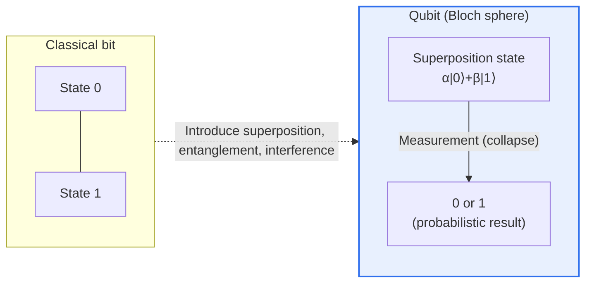
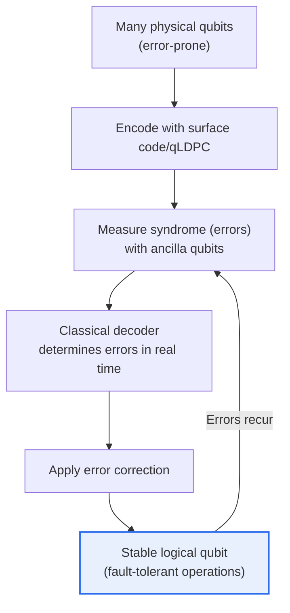

# Qubit

## 1. Overview

### A. Definition
> A **qubit (quantum bit)** is the smallest unit of information in a quantum computer; unlike a classical bit, which holds only one of 0 or 1, it is a quantum information unit in which **the states 0 and 1 can exist simultaneously overlapped with probability amplitudes (superposition)**.

The starting point for understanding qubits is the quantum mechanical property that "**it is not 0 or 1, but can be 0 and 1 at the same time**." A classical bit is a deterministic state holding only one of two values—a transistor's on (1) or off (0). A qubit, by contrast, thanks to **superposition**, simultaneously holds the two basis states |0⟩ and |1⟩ with their respective complex amplitudes. Mathematically it is expressed as |ψ⟩ = α|0⟩ + β|1⟩ (|α|²+|β|²=1), and the fact that α and β are complex numbers carries phase information, decisively distinguishing it from classical probability. A single qubit state is visualized as a point on the surface of a sphere of radius 1, i.e., a vector on the **Bloch Sphere**, where the north pole is |0⟩, the south pole is |1⟩, and the equator corresponds to fully superposed states.

The real power of qubits shows as their number grows. Since n qubits represent 2ⁿ basis states simultaneously, 50 qubits hold 2⁵⁰ (about 1.126 quadrillion) and 300 qubits hold more combinations than there are atoms in the universe within a single state vector. Add **entanglement**, in which multiple qubits are bound into one joint state that cannot be described individually, and a strong correlation forms in which the measurement result of one qubit instantly determines the state of another. Finally, by using **interference** to cancel the probability amplitudes of wrong answers and reinforce those of the correct answer, the desired solution is extracted with high probability from exponentially many candidates. This trio of superposition, entanglement, and interference is the source of quantum computers' performance that overwhelms classical computers on specific problems such as prime factorization, optimization, and quantum simulation.

### B. Background and Necessity
Classical computers practically cannot solve classes of problems whose computational load grows exponentially with problem size (large-scale molecular simulation, combinatorial optimization, factoring large numbers). For example, factoring a 2,048-bit RSA key with a classical computer would take billions of years even on today's supercomputers, but a quantum computer with sufficient qubits could do it in polynomial time using Shor's algorithm. Moreover, the quantum states of molecules that govern new drugs, catalysts, and battery materials inherently follow quantum mechanics, so simulating them with qubits operating on the same quantum principles is natural and efficient. This is precisely the need Richard Feynman pointed out in 1982—"to simulate nature, the computer itself must be quantum"—and qubits are the means to realize it.

## 2. Structural Comparison of Classical Bits and Qubits

First, from an overall structural perspective, the difference in how classical bits and qubits hold information is summarized in a concept diagram. A classical bit is a discrete switch between two values, whereas a qubit is a continuous vector pointing to any point on the Bloch sphere that collapses to 0 or 1 only at the moment of measurement.

The table summarizes the key differences between the two, but what matters is "why" each item is so. **Expressiveness** diverges—linear (n) for bits and exponential (2ⁿ) for qubits—because superposition places basis states in parallel. **Measurement** is probabilistic for qubits because the wave function collapses to a single classical value the moment a superposed state is observed. Because of this collapse, qubits have the constraint that "they perform exponentially many computations simultaneously, but the answer can be read out only once, and only probabilistically." Hence the essence of quantum algorithm design lies in "orchestrating interference well to maximize the probability that the correct answer is read."

| Category | Classical bit | Qubit |
|---|---|---|
| **State** | 0 or 1 (deterministic) | α\|0⟩+β\|1⟩ superposition (probability amplitudes) |
| **Expressiveness** | n bits = n states | n qubits = 2ⁿ states simultaneously |
| **Operations** | Logic gates (AND, OR), sequential | Unitary quantum gates (reversible) |
| **Measurement** | Always the same value (non-destructive) | Probabilistic, destructive (collapses on measurement) |
| **Copying** | Freely copyable | Cannot be copied (No-Cloning theorem) |
| **Errors** | Mainly bit flips | Bit + phase flips, decoherence |

## 3. Key Quantum Properties and Physical Implementation

### A. How Superposition, Entanglement, and Interference Work
**Superposition** is the property that lets a single qubit hold multiple possibilities at once; applying a Hadamard gate to |0⟩ creates the full superposition (|0⟩+|1⟩)/√2. Superposition alone is not fundamentally different from classical probabilistic computing. What makes the difference is **entanglement**. Entangling two qubits produces a Bell state such as (|00⟩+|11⟩)/√2, so if the first qubit is measured as 0, the second is instantly fixed as 0 as well. This correlation holds no matter how far apart the two qubits are, creating "information as a whole" that cannot be decomposed into the states of individual qubits. Finally, **interference** manipulates probability amplitudes like the reinforcement and cancellation of waves; Grover's search algorithm repeatedly amplifies the amplitude of the correct state to find the desired item in √N steps (N for classical). Only when these three properties interlock does "quantum advantage" hold.

### B. Decoherence and Errors — The Biggest Challenge
The biggest weakness of qubits is **decoherence**. If a qubit interacts even slightly with the external environment—heat, vibration, electromagnetic noise—it loses its phase and superposition information. The metric for this retention time is coherence time (T1: energy relaxation, T2: phase relaxation), and current superconducting qubits are at the microsecond-to-millisecond level. That is, computation must finish within this short time. For this reason, the superconducting approach isolates qubits inside a dilution refrigerator at about 15mK (millikelvin, colder than the cosmic background radiation), close to absolute zero. Even so, errors of about 0.1–1% occur per gate, so practical algorithms using millions of gates cannot be run as-is.

### C. Quantum Error Correction and Logical Qubits
The orthodox solution to this problem is **Quantum Error Correction (QEC)**. Because the No-Cloning theorem prevents simple copy-and-majority-vote as in classical systems, multiple **physical qubits** are entangled to form one stable **logical qubit**, and ancilla qubit measurements detect and correct only the errors without collapsing the state. Representatively, the Surface Code is widely used in the superconducting approach because its lattice arrangement is easy to implement, and only when the physical qubit error rate drops below a certain threshold is the "break-even" reached, where adding more qubits reduces logical errors. Below is a concept diagram of the flow of building logical qubits from physical qubits and using them for computation.

### D. Quantum Gates and Representative Algorithms
Operations that manipulate qubits are **quantum gates**. Unlike classical logic gates, quantum gates must be reversible, unitary transformations that do not lose information. Representative single-qubit gates include X (NOT), which flips the state; Z, which changes the phase; and Hadamard (H), which creates superposition. With the CNOT gate, which entangles two qubits, a universal set capable of approximating any quantum operation is formed. Arranging these gates in time order constitutes a **quantum circuit**, and an algorithm is essentially circuit design.

Representative algorithms help us understand both the power and the limits of qubits. **Shor's algorithm** factors large numbers in polynomial time, showing exponential advantage that threatens RSA; this is the direct trigger for the PQC transition. **Grover's algorithm** provides square-root-level acceleration, completing a search over N unsorted items in √N steps. **VQE (Variational Quantum Eigensolver)**, expected to be practical in the NISQ era, is a classical-quantum hybrid approach in which the quantum computer prepares and measures states while a classical computer optimizes parameters, applied to chemistry simulations such as molecular energy calculations. Thus, the advantages of qubits manifest not for all problems but only for problems with specific structures (periodicity, search, quantum simulation).

| Algorithm | Target problem | Advantage | Industrial application |
|---|---|---|---|
| **Shor** | Prime factorization, discrete logarithm | Exponential | Breaking public-key cryptography (→ triggering PQC) |
| **Grover** | Unsorted data search | Square root (√N) | DB search, inverse function search |
| **VQE/QAOA** | Chemistry, combinatorial optimization | Problem-dependent (hybrid) | New materials, new drugs, logistics optimization |

### E. Diversity of Implementation Approaches
What to physically build qubits from has not yet been standardized, and each approach has different trade-offs in speed, stability, and scalability. Whatever the approach, it must satisfy the five **DiVincenzo Criteria**—scalable qubits, initialization, long coherence, a universal gate set, and measurement—to become a practical quantum computer.

| Implementation approach | Representative players | Characteristics |
|---|---|---|
| **Superconducting** | IBM, Google | Fast gates, favorable for integration, requires cryogenic temperatures |
| **Trapped Ion** | IonQ, Quantinuum | Excellent coherence and precision, slow speed |
| **Photonic** | PsiQuantum, Xanadu | Room temperature, network-friendly, difficult gate implementation |
| **Neutral Atom** | QuEra, Pasqal | Flexible qubit rearrangement, promising scalability |
| **Spin/Silicon** | Intel, etc. | Can leverage existing semiconductor processes |
| **Topological** | Microsoft | Inherently error-resistant in principle, early demonstration stage |

## 4. Development Stages and Comparison of Industry Trends

We are currently in the **NISQ (Noisy Intermediate-Scale Quantum)** era, in which error correction is not yet complete, as named by John Preskill in 2018. It is a stage of limited experiments with tens to hundreds of noisy qubits. In 2019, Google claimed "quantum supremacy" with its 53-qubit Sycamore, showing overwhelming speed over classical supercomputers on a specific random circuit sampling task, and in late 2024, with its **Willow** chip, it demonstrated "below-threshold" error correction in which errors decrease as qubits are added, showing that QEC had moved beyond proof of principle into engineering progress. IBM grew its physical qubit counts with the 127-qubit Eagle in 2021, the 433-qubit Osprey in 2022, and the 1,121-qubit Condor in 2023, then shifted from a simple count race toward modularity and error correction. IBM's roadmap targets **Starling** in 2029 (200 logical qubits, a large-scale fault-tolerant quantum computer at the 100-million-gate level) using qLDPC codes and real-time decoding, presenting Loon, Kookaburra, and Cockatoo as preceding stages (based on the announced roadmap; schedules may change).

The practical implication of this trend is that no approach has yet clearly won. Superconducting has fast gates and touch points with semiconductor processes, favoring integration, but the cost of cryogenic infrastructure is high; trapped ion has excellent qubit quality (precision, coherence) but slow operation speed, a disadvantage for large circuits. Therefore, the suitable approach differs depending on the nature of the application (precision-first vs. throughput-first), and multiple approaches are likely to coexist and develop for the time being.

A point to note here is that **performance must not be judged by the "number" of qubits alone**. However many qubits there are, meaningful circuits cannot be run if error rates are high and coherence is short. Therefore, metrics such as **Quantum Volume**, a composite indicator combining qubit count, connectivity, gate fidelity, and error rate, or effective operations per second (e.g., CLOPS) are used together. For example, the number "127 qubits" is only the physical qubit count; converted into error-corrected logical qubits, it is far fewer. From a Professional Engineer's perspective, when assessing the maturity of quantum computing, one must look at physical qubit count, logical qubit count, gate fidelity, and coherence time together so as not to be misled by exaggerated marketing.

## 5. Advanced — Cryptographic Threats and the PQC Transition

The most urgent impact of qubits on industry and society is the **threat to public-key cryptography**. A quantum computer with logical qubits of sufficient scale and quality can solve large-number factorization and discrete logarithm problems in polynomial time with Shor's algorithm, neutralizing RSA and ECC (elliptic curve) public-key cryptography, the foundation of today's internet security. Symmetric keys (AES) and hashes only see search speed increase by a square-root factor with Grover's algorithm, which can be countered by doubling key length, but public-key cryptography must in principle be replaced.

The problem is the "**Harvest Now, Decrypt Later**" threat. Attackers can store encrypted communications and data now and retroactively decrypt them in the future when a cryptographically relevant quantum computer (CRQC) emerges, so data requiring long-term confidentiality must be protected in advance, before quantum computers are actually completed. Accordingly, in August 2024, the U.S. NIST officially published lattice- and hash-based **Post-Quantum Cryptography (PQC)** standards — ML-KEM (FIPS 203, key encapsulation), and ML-DSA (FIPS 204) and SLH-DSA (FIPS 205, digital signatures). Domestic and international organizations are also establishing cryptographic asset inventories (securing crypto-agility) and phased PQC transition roadmaps. The structure is such that advances in qubit technology directly determine the urgency of the cryptographic transition.

## 6. Considerations and Implications (Professional Engineer Perspective)

1. **Overcoming errors and decoherence is the decisive variable for commercialization.** Beyond the race for physical qubit counts, the key to practicality is how much the QEC overhead of building one stable logical qubit (hundreds to thousands of physical qubits per logical qubit) can be reduced. Progress in surface codes, qLDPC codes, and real-time classical decoders must be watched together.

2. **It must be understood as a technology specialized for specific problems.** Quantum computers are not superior in all computations; they are effective only for problem classes with exponential advantage, such as factorization, quantum simulation, combinatorial optimization, and quantum machine learning. Rather than replacing general-purpose computing, they are expected to be used in a **hybrid (classical + quantum)** structure sharing roles with classical HPC, and discovering algorithms and applications is as important as hardware.

3. **Cryptographic transition (PQC) is a strategic task to start now.** Because of the Harvest Now, Decrypt Later threat, action must be taken before quantum computers are completed. Organizations must inventory their cryptographic usage, secure crypto-agility (flexibility to replace cryptographic algorithms), and establish phased transition plans reflecting the NIST PQC standards.

4. **An approach from the perspective of national strategy and supply chains is needed.** The quantum hardware supply chain and workforce—cryogenic refrigerators, control electronics, materials—are concentrated in a few countries and companies, making technological sovereignty a major issue. Since cloud-based quantum computing (QCaaS) is lowering the barrier to access, an investment strategy that combines securing in-house hardware with using the cloud is realistic.

5. **A portfolio strategy premised on uncertainty about implementation approaches is required.** Since the trade-offs of each approach—superconducting, trapped ion, neutral atom, photonic—are distinct and the winner is undecided, rather than becoming locked into a particular approach early, it reduces risk to monitor standards and maturity trends while preparing applications (algorithms, talent, use cases) in advance.

## References
- IBM Quantum, "IBM lays out clear path to fault-tolerant quantum computing": https://www.ibm.com/quantum/blog/large-scale-ftqc
- IBM Quantum Hardware and roadmap: https://www.ibm.com/quantum/hardware
- NIST, Post-Quantum Cryptography standards (FIPS 203/204/205): https://csrc.nist.gov/projects/post-quantum-cryptography

---

> **In one line**: A qubit is a quantum information unit in which n qubits simultaneously represent 2ⁿ states through *superposition, entanglement, and interference*, the source of quantum computers' exponential computing power; it faces the challenge of overcoming decoherence and error vulnerability via logical qubits (QEC), and by threatening public-key cryptography through Shor's algorithm, it is driving the transition to NIST PQC standards.
