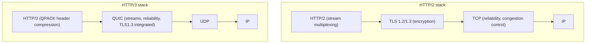
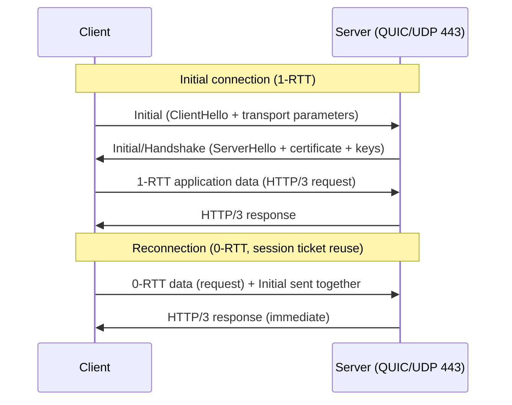

# QUIC and HTTP/3

## 1. Overview

> **QUIC (Quick UDP Internet Connections)** is a transport protocol that runs over UDP yet integrates TCP's reliability and ordering guarantees, TLS 1.3 encryption, and stream multiplexing into one. **HTTP/3** is the next-generation version of HTTP redefined to use QUIC as its transport layer; they were standardized by the IETF as RFC 9000 (QUIC, 2021) and RFC 9114 (HTTP/3, 2022), respectively.

The fundamental background behind QUIC and HTTP/3 is the recognition that **the bottleneck of web performance is no longer bandwidth but latency and the protocol structure itself**. The early web long used HTTP/1.1's text-based request-response structure, and because of the constraint of processing requests sequentially on a single connection (Head-of-Line Blocking, HOL Blocking), browsers had to resort to the workaround of opening multiple TCP connections per domain in parallel. HTTP/2 improved on this by multiplexing multiple streams within a single TCP connection, resolving application-layer HOL Blocking, but a fundamental limitation remained.

The crux of the problem is that **HTTP/2 relies on TCP for reliability**. Since TCP is a protocol that delivers a single byte stream in order, the multiplexed streams actually sit on top of a single TCP sequence. Therefore, if even one packet is lost midway, TCP cannot hand any subsequently arrived data to the application and waits for retransmission. Because logically independent streams physically share a single TCP queue, **transport-layer HOL Blocking** is reproduced as-is. On top of this, the TLS handshake (2 RTT for TLS 1.2, 1 RTT for 1.3) is layered serially on the TCP 3-way handshake (1 RTT), making connection establishment latency high, and there was also the rigidity (ossification) problem that kernel-embedded TCP is slow to improve and deploy, on the scale of years. QUIC circumvents all these problems by **reimplementing reliability, encryption, and multiplexing over UDP in user space**.

## 2. QUIC Protocol Structure and Key Characteristics

In terms of OSI layers, QUIC sits on top of UDP (transport), but it is a "converged transport layer" that absorbs the stream control of TCP, TLS, and HTTP/2 wholesale. The concept diagram below contrasts the layer structures of the existing HTTP/2 stack and the HTTP/3 stack.

QUIC's characteristics can be summarized along four axes. First, **independent per-stream transmission**. QUIC holds multiple streams within one connection but manages the ordering and retransmission of each stream individually. Therefore, even if a packet of stream A is lost, streams B and C are delivered to the application unaffected. This is how QUIC fundamentally eliminates transport-layer HOL Blocking, and the perceived effect is greater in mobile and wireless environments with high loss rates.

Second, **encryption by default**. QUIC integrates TLS 1.3 into the protocol and always encrypts part of the header and the entire payload. Since there is no separate plaintext QUIC, it structurally prevents not only eavesdropping and tampering but also ossification, in which intermediate devices (middleboxes) inspect protocol details and come to rely on particular behaviors.

Third, **Connection ID-based connection migration**. A TCP connection is identified by the 4-tuple (source IP/port, destination IP/port), so when a smartphone switches from Wi-Fi to LTE and its IP changes, the connection breaks. QUIC, on the other hand, identifies connections by a **Connection ID** independent of IP and port, so communication can continue on the same connection even when the network changes. This is a practical advantage that greatly reduces reconnection and re-handshake costs on highly mobile devices.

Fourth, **agility due to user-space implementation**. TCP is embedded in the OS kernel, so it takes a long time for improvements to be deployed, but QUIC is implemented at the application level in browsers and libraries, so replacing congestion control algorithms or improving features can be reflected quickly with just an application update.

## 3. HTTP/3 Connection Establishment and 0-RTT Procedure

What determines HTTP/3's performance advantage is **shortened connection establishment latency**. QUIC merges the transport handshake and TLS 1.3 cryptographic negotiation into a single process, so a new connection can start transmitting data in 1 RTT, and a reconnection to a previously visited server in 0-RTT. The sequence diagram below shows the QUIC connection establishment and 0-RTT resumption flow.

On the first connection, the client sends an Initial packet containing QUIC transport parameters and the TLS ClientHello, and when the server responds with ServerHello, certificate, and key material, encrypted application data can be exchanged in just 1 RTT. Compared to TCP+TLS 1.2, which consumed at least 3 RTTs, initial loading latency is greatly reduced. Meanwhile, for servers already communicated with, **0-RTT** is possible, using the **session ticket (PSK)** received in the previous session to send request data immediately on the first round trip without waiting for handshake completion. However, since 0-RTT data can be vulnerable to replay attacks, the server needs defenses such as allowing it only for idempotent requests like lookups (GET) and deferring non-idempotent requests such as payments and orders until after 1-RTT establishment.

The header compression method also changes. HTTP/2 used HPACK, but HPACK depends on the order of dynamic table updates, which conflicts with QUIC's out-of-order delivery. Accordingly, HTTP/3 introduced **QPACK**, which separates synchronization of header compression state into a separate stream, eliminating header redundancy without undermining stream independence.

## 4. HTTP/2 (TCP) vs. HTTP/3 (QUIC) Comparison

The difference between the two protocols is not a simple version upgrade but stems from a difference in design philosophy: **at which layer reliability is handled**. Because HTTP/2 delegated reliability to TCP, the benefits of multiplexing were trapped in a single TCP queue, whereas HTTP/3 has QUIC directly manage reliability per stream, so the benefits of multiplexing persist even under loss. The table below summarizes the main items.

| Category | HTTP/2 (over TCP) | HTTP/3 (over QUIC) |
|------|-------------------|--------------------|
| Transport layer | TCP | UDP-based QUIC |
| Multiplexing HOL Blocking | Occurs at transport layer | Resolved by stream independence |
| Connection establishment | TCP 1-RTT + TLS 1-~2-RTT | QUIC 1-RTT (0-RTT on reconnection) |
| Encryption | TLS as a separate layer (optional) | TLS 1.3 always built in |
| Connection identification | 4-tuple (IP, port) | Connection ID |
| Network switch | Reconnection required | Maintained via connection migration |
| Header compression | HPACK | QPACK |
| Implementation location | Kernel (TCP) | User space |

As the table shows, the most practically meaningful difference is **robustness in lossy and mobile environments**. For example, a user opening a web page while moving on the subway experiences packet loss and Wi-Fi↔LTE switching at the same time; with HTTP/2, a single loss stalls all streams and an IP change breaks the connection, whereas with HTTP/3, only the affected stream is briefly delayed and the connection is maintained. However, in stable wired, low-loss environments, TCP is already well optimized, so QUIC's advantages may be relatively small, and the CPU load from UDP processing may actually work against it.

## 5. Adoption Status and Practical Considerations (Advanced)

QUIC began around 2012 as Google's in-house experimental protocol (gQUIC), underwent large-scale validation by being applied to Chrome, YouTube, and search traffic, and was later established as a vendor-neutral protocol through IETF standardization. Today, major browsers such as Chrome, Firefox, and Edge, and large CDNs and services such as Cloudflare, Google, and Meta support HTTP/3, and a considerable share of global web traffic is already handled over HTTP/3 (exact figures vary by research organization and timing, so this is generalized). Typically, a browser first connects via HTTP/2, learns of HTTP/3 availability through the **Alt-Svc (Alternative Services)** header sent by the server, and switches to QUIC from the next connection.

In practice, several constraints must be considered when adopting it. First, many corporate firewalls and NATs block or throttle UDP port 443, so a dual-support configuration is needed so that browsers automatically fall back to TCP-based HTTP/2 in such cases. Second, because UDP packets are processed in user space, CPU usage can be higher than TCP for the same traffic, so optimizations such as kernel bypass and GSO, or hardware offloading, should be considered together. Third, because all packets are encrypted, existing network equipment (IDS, proxies) has difficulty inspecting payloads, so a strategy for securing security visibility (endpoint-based inspection, policy redesign) must be prepared in advance.

## 6. Considerations and Implications (Professional Engineer Perspective)

- **Adoption strategy**: HTTP/3 should be introduced gradually on the premise of parallel support with HTTP/2, not as a wholesale replacement. It is reasonable to guarantee service continuity even in UDP-blocked environments using Alt-Svc and fallback, and to maximize the effect by applying it first to mobile services with high loss and mobility.
- **Trade-offs**: The benefits of reduced latency and mobility conflict with the costs of increased CPU load and reduced visibility for existing security equipment. A judgment is required to quantitatively analyze traffic characteristics (loss rate, RTT, mobility) and infrastructure conditions and selectively apply it to workloads where benefits exceed costs.
- **Security perspective**: Always-on encryption strengthens privacy but makes network-based threat detection difficult, so an architectural shift moving the center of gravity of security controls from the network perimeter to endpoints and applications (aligned with zero trust) must proceed in parallel. 0-RTT should be limited to idempotent requests, with attention to replay attacks.
- **Outlook and related technologies**: Beyond HTTP/3, QUIC is expanding into DNS over QUIC, media transport (WebTransport, Media over QUIC), and further into the low-latency transport foundation for 6G and edge computing environments. Leveraging the agility of user-space implementation, rapid evolution in congestion control (BBR, etc.) and multipath (Multipath QUIC) is expected, and linkage with observability, CDN, and service mesh design should be considered together.

## References

- IETF RFC 9000, "QUIC: A UDP-Based Multiplexed and Secure Transport", https://www.rfc-editor.org/rfc/rfc9000
- IETF RFC 9114, "HTTP/3", https://www.rfc-editor.org/rfc/rfc9114
- IETF RFC 9204, "QPACK: Field Compression for HTTP/3", https://www.rfc-editor.org/rfc/rfc9204

---

> **In one line**: QUIC is a transport protocol that integrates TLS 1.3, stream multiplexing, and reliability over UDP to eliminate transport-layer HOL Blocking and realize 0-RTT connections and connection migration, and HTTP/3, which uses it, is a next-generation web protocol that is especially strong in lossy and mobile environments.
