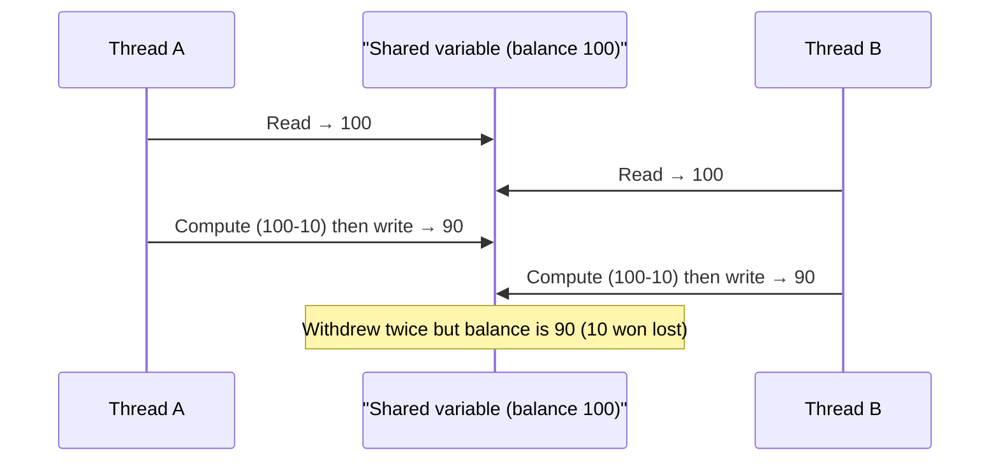
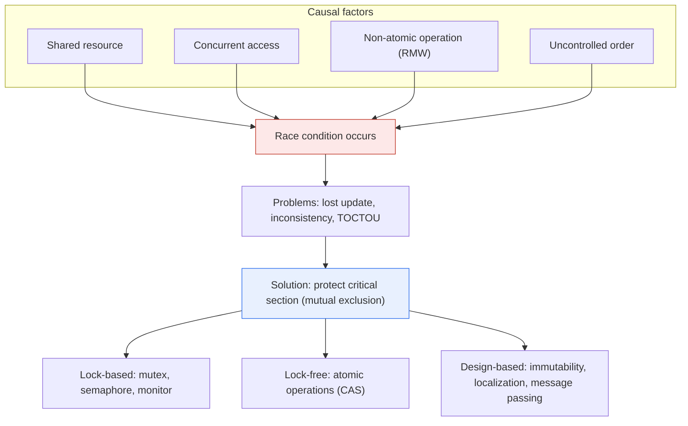

# Race Condition

## 1. Overview

### A. Definition
> A **race condition** is an error situation in which, **when two or more processes or threads access a shared resource concurrently, the final result differs depending on their execution order (timing)**. In other words, it is a state in which the correctness of a program depends on the uncontrollable chance of "who executes first."

What makes race conditions especially dangerous is that "**you never know when they will strike, and they are hard even to reproduce**." When multiple threads read and write the same variable simultaneously, the result differs each time depending on when the scheduler interleaves each thread. For example, suppose two threads simultaneously withdraw 10 won each from an account with a balance of 100 won. Each withdrawal consists of three steps—"read the current balance → subtract 10 → write it back"—and if both threads read 100 almost simultaneously, each computes and writes 90, so despite two withdrawals, the balance becomes 90 instead of 80. Ten won has vanished into thin air.

The nastiness of this problem lies in the fact that it occurs "**only occasionally**." In most executions the order happens to work out and the program behaves normally, and the error occurs only in extremely rare cases where specific timings overlap. Therefore, it is fine in development and test environments but blows up in high-load production environments, and only intermittently at that, making the cause extremely difficult to find. Because of this non-determinism, race conditions are called a representative example of a "Heisenbug (a bug that disappears when you try to observe it)."

The root cause is that an update consisting of multiple instructions is **not atomic**, so another execution flow can interleave in the middle. The code section in which such interleaving breaks data consistency is called the **Critical Section**, and protecting this critical section so that only one execution flow passes through it at a time is the core of the solution.

A common misconception must be addressed here. The idea that "a single line of code is atomic" is wrong. Even a single high-level line such as `balance = balance - 10;` is split upon compilation into multiple machine instructions—"read the value from memory into a register → subtract → write to memory"—and the scheduler can insert another thread in between. Moreover, on multicore systems, CPU caches and memory reordering add a **visibility** problem in which a value written by one thread is not immediately visible to another thread, so race conditions extend beyond a simple ordering problem to a problem at the level of the memory model.

### B. Conditions and Background
A race condition holds when (1) a **shared resource** (global variable, file, DB record, hardware, etc.) exists, (2) two or more parties **access** that resource **concurrently**, (3) that access is a non-atomic operation such as **read-modify-write**, and (4) **the execution order is not controlled**. Inverting these four conditions directly provides clues to the solution. That is, eliminating sharing (removing 1), serializing concurrent access (removing 2), making operations atomic (removing 3), or enforcing order (removing 4) makes the race condition disappear. The solution techniques discussed later all work by breaking one or more of these four conditions.

As multicore CPUs became ubiquitous and asynchronous and parallel programming became routine, this defect—which did not surface in single-threaded programs in the past—emerged as a core reliability and security threat to modern software. In the security domain in particular, it is exploited through **TOCTOU** attacks, which target the short gap between the Time-Of-Check and the Time-Of-Use. For example, if an attacker swaps a file for a symbolic link between checking its permissions and actually opening it, the check passes but access is actually made to an unauthorized file.

## 2. How It Occurs

The essence of a race condition is that "an update that should be atomic is split midway and another flow interleaves." The sequence diagram below shows how, in the balance withdrawal example described earlier, the reads and writes of two threads interleave and cause a lost update.

The key point of the figure is that B interleaves between A's "read" and "write," before A has applied 90, and reads the stale value 100. If A's three steps had been bound atomically so that B could not interleave in between, B would have read 90 and written 80, and the result would have been correct. In other words, a race condition stems not from "concurrency itself" but from "**concurrent access to an unprotected critical section**."

Race conditions can be divided into several types by their manifestation. The **lost update**, as in the example above, is the most common; other representative types are the **dirty read**, in which an intermediate state during the update of two resources is exposed to another flow, and **TOCTOU** (exploiting a state change between check and use), which is a security concern. The diagram below structurally organizes the relationship between the causal factors of race conditions and the layers of solutions.

## 3. Solutions

Solutions to race conditions ultimately converge on one principle: allow **only one execution flow into the critical section at a time (Mutual Exclusion)**, or eliminate sharing altogether. However, the means of implementation divide broadly by layer into lock-based, lock-free, and design-based approaches, each with different trade-offs. Before the table, let us examine the principle of each approach.

**A. Lock-based mutual exclusion.** The most intuitive method: acquire a lock before entering the critical section and release it when leaving, preventing other flows from entering. A **Mutex** is a binary lock that lets only one flow through, while a **Semaphore** controls the number of resources that can be accessed simultaneously to N via P (wait) and V (signal) operations (a mutex can be seen as the special case N=1). A **Monitor**, like Java's `synchronized`, encapsulates locks and condition variables at the language/runtime level, reducing the mistake of developers forgetting to release a lock. Lock-based approaches are easy to understand and powerful, but at the cost that locks become performance bottlenecks and, if misused, cause deadlock.

There is a principle that must be observed when using lock-based techniques: lock acquisition and release must be paired even in exceptional situations. If an exception occurs inside the critical section and the lock is not released, all other flows wait forever, so release must be guaranteed with `try-finally` or the RAII (Resource Acquisition Is Initialization) pattern. This is precisely why monitors are preferred at the language level: the language prevents the risk of a missed release on the developer's behalf.

**B. Lock-free atomic operations.** Updates are made safely without locks using atomic instructions provided by hardware, most representatively **CAS (Compare-And-Swap)**. CAS performs, as a single atomic operation, the compare-and-exchange "replace with the new value only if the memory value equals the expected value I read," so if another flow changed the value in the meantime, it returns failure and causes a retry. With no locks there is no deadlock, and performance is good when contention is low, but under heavy contention retries explode, and there are subtle pitfalls such as the "ABA problem," making implementation difficult.

**C. Design-based avoidance.** The most fundamental solution is "eliminating sharing itself." Using **immutable objects** whose values do not change means no problem even with concurrent reads, and **thread-local** variables, which keep state separately per thread, fundamentally block races because nothing is shared. Furthermore, the Actor model (Erlang, Go channels), which communicates only via **message passing** without sharing state, eliminates a large portion of concurrency errors at the design stage.

| Technique | Layer | Core principle | Caveats |
|---|---|---|---|
| **Mutex** | Lock | Mutual exclusion of critical section (N=1) | Deadlock, bottleneck |
| **Semaphore** | Lock | Control access count N via P/V | Deadlock if ordered incorrectly |
| **Monitor** | Lock | Language-level synchronization encapsulation | Requires language support |
| **Atomic operations (CAS)** | Lock-free | Compare-and-swap, retry | ABA, retry explosion under contention |
| **Immutable/local/message** | Design | Eliminate sharing itself | Cost of design change |

Practical guidance for choosing a technique depends on "the nature of contention." If the critical section is short and contention rare, lock-free techniques such as spinlocks or CAS are advantageous by saving context-switch costs; if the critical section is long or waits may be lengthy, a mutex that puts threads to sleep prevents CPU waste. When reads vastly outnumber rare writes, a **read-write lock (RW Lock)**, which allows multiple concurrent reads but locks only writes exclusively, greatly increases throughput. In other words, the balance point between performance and safety is not "always a mutex" but analyzing the access pattern and choosing the right tool.

## 4. Practical Cases and Relationship with Deadlock

Race conditions are not a theoretical problem; they have caused real major accidents. Most notably, the **Therac-25** radiation therapy machine accidents of the 1980s are known to have delivered radiation overdoses to patients because a race condition between operator input and equipment control threads caused safety checks to be bypassed, and they remain a classic lesson of software concurrency defects leading to loss of life. In web services, overselling—where two orders for a product with a stock of 1 arrive simultaneously and both succeed—and, in banking, the double withdrawal seen earlier are typical cases. Such problems must be controlled not only with application locks but also with the database's transaction isolation level and optimistic/pessimistic locking.

At the database layer, race conditions appear as a matter of transaction isolation level. A low isolation level (e.g., Read Uncommitted) offers good performance but exposes race phenomena such as dirty reads and lost updates as-is, while a high one (Serializable) is safe but reduces throughput due to lock contention. In practice, a **Pessimistic Lock** locks the target records in advance, or an **Optimistic Lock (version column comparison)** retries only on conflict, implementing at the data layer the same principles as the application-layer mutex and CAS seen earlier. That is, race condition control must be designed with a consistent strategy on both the application and database sides.

Meanwhile, overusing locks to prevent race conditions leads to the opposite problem, **Deadlock**. It is a situation in which two threads wait forever for locks held by each other, occurring when all four conditions—mutual exclusion, hold and wait, no preemption, and circular wait—hold.

Therefore, the essence of practice lies in the balance of "using locks, but **setting a consistent lock order and minimizing lock scope** to control both deadlock and performance degradation." Unifying lock order globally breaks the circular wait condition and prevents deadlock, and minimizing the critical section reduces performance degradation from serialization. Since race conditions and deadlocks induce each other, addressing only one worsens the other. Concurrency control is a task like two sides of a coin, requiring the two to be handled together as a single design problem.

## 5. Advanced — Detection Techniques and Language-Level Responses

Because race conditions are hard to reproduce, **proactive detection tools and language-level prevention** are becoming more important than after-the-fact debugging. **ThreadSanitizer (TSan)**, a dynamic analysis tool, catches data races by tracking, during actual program execution, whether different threads access the same memory without synchronization, and is widely used in C/C++, Go, and others. Go provides this functionality built in via the `-race` flag. Static analysis finds potential race patterns in code without execution, and stress and fuzzing tests artificially perturb scheduling to force rare timings to surface.

Language-level mechanisms dealing with visibility are also important. Java's `volatile` and memory barriers guarantee that a value written by one thread is definitely visible to other threads and establish the **happens-before** relationship that restricts instruction reordering. In other words, a modern response to race conditions is complete only when it handles not just "mutual exclusion" but also "visibility and ordering guarantees," which means one must accurately understand each language's memory model.

Responses at the language design level are also a notable trend. **Rust** enforces at compile time the constraint that "only one mutable reference can exist at a time" through its ownership and borrowing rules, thereby **fundamentally blocking a large portion of data races at the compilation stage** ("fearless concurrency"). This is a fundamental shift in contrast to the conventional approach relying on runtime checks, elevating concurrency safety to a problem of the type system.

**Go**'s channel-based CSP (Communicating Sequential Processes) model reduces shared mutable state by having goroutines exchange data via channels, under the philosophy "Do not communicate by sharing memory; instead, share memory by communicating." Functional languages' emphasis on immutability is in the same vein; they commonly aim to "eliminate races at the design stage by reducing shared mutable state." This trend shows that the center of gravity of race condition responses is shifting from "blocking with locks at runtime" to "making them impossible in the first place at the design and compile stages."

## 6. Considerations and Implications

From a Professional Engineer's perspective, the following should be comprehensively considered when dealing with race conditions.

1. **Always recognize the cost of synchronization.** Locks prevent race conditions, but excessive use causes performance degradation (serialization) and deadlock. Reducing lock scope (critical section) to the necessary minimum and, when using multiple locks, keeping the acquisition order globally consistent to break circular waits is the key to deadlock prevention.

2. **Design on the premise that this defect is hard to catch with testing.** Race conditions are intermittent and non-deterministic, so they are not reproduced by ordinary tests. Therefore, concurrency detection tools such as ThreadSanitizer, stress and fuzzing tests, and focused code reviews of shared resource access should be permanently incorporated into the development process, aiming for "proactive blocking" rather than "post-hoc discovery."

3. **Note that it leads directly to security vulnerabilities.** Race conditions such as TOCTOU exploit the gap between permission checks and actual use for privilege escalation and authentication bypass. Defend with designs that atomically bind check and use or eliminate the timing gap, such as file-descriptor-based access, and explicitly include race conditions in security review items.

4. **Prioritize designs that "eliminate sharing."** Rather than protecting after the fact with locks, reducing shared mutable state itself through immutable objects, thread-local state, and message passing (actors/channels) is a fundamental and scalable solution. When designing new systems, it is desirable to actively consider the concurrency-safety models of languages such as Rust and Go to exclude defects at the design stage.

---

> **In one line**: A race condition is *a non-deterministic error in which results vary with execution order due to unprotected concurrent access to a shared resource*; it is resolved by mutually excluding critical sections with mutexes, semaphores, and atomic operations (CAS) or eliminating sharing itself through immutability and message passing, while also controlling deadlock, performance degradation, and TOCTOU security threats.
