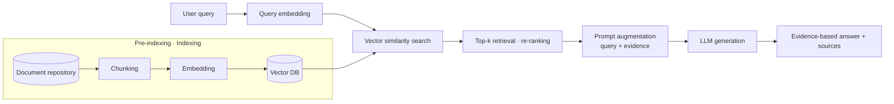

# RAG (Retrieval Augmented Generation)

## 1. Overview

### A. Definition
> A technique in which, before an LLM generates an answer, it **retrieves documents relevant to the query from an external knowledge base (Retrieval)**, combines that content into the prompt (Augmentation), and **generates an answer grounded in the retrieved evidence (Generation)**.

In other words, RAG is a structure that combines "**non-parametric memory (external documents)**" with "**parametric memory (the LLM's internal parameters)**". An LLM compresses and memorizes knowledge in its parameters at training time, but this alone cannot know about information that emerged after training or internal company documents that were not included in the training data. RAG fills this gap by **looking up the necessary knowledge externally at inference time** and inserting it into the prompt.

### B. Background and Need
LLMs have fundamental limitations: **hallucination**, i.e., generating plausible but factually wrong answers; **lack of recency**, i.e., not knowing anything after the training data cutoff; and the absence of enterprise-internal and specialized domain knowledge. Solving these through fine-tuning (retraining) incurs high data-building and GPU costs, and the model must be retrained whenever knowledge changes. RAG can reflect up-to-date and proprietary knowledge simply by updating the knowledge base, **without retraining the model**, and it can **present sources (evidence) alongside answers**, improving reliability and verifiability. For these reasons it has become the de facto standard architecture for enterprise LLM adoption.

## 2. Processing Flow (Architecture)

RAG is divided into two stages. In **① pre-indexing (offline)**, documents are chunked, embedded, and indexed in a vector DB. In **② query processing (online)**, the user query is transformed into the same embedding space, similar chunks are retrieved, and these are combined into the prompt so that the LLM generates the answer. Because retrieval quality determines final answer quality, most of the focus of RAG performance improvement lies in "**retrieval**" rather than "generation".

## 3. Components

Each component operates as follows, and if any one of them is weak, the overall answer quality degrades.

- **Document processing · Chunking**: Splits the source text into chunks, which are the units of retrieval and injection. Chunks that are too large mix in unnecessary content and become noise; chunks that are too small break the context. Hence paragraph/semantic-boundary-based splitting and **overlap** between chunks are used.
- **Embedding model**: Converts text into high-dimensional vectors such that texts closer in meaning are closer as vectors. Using a domain-specific embedding raises retrieval accuracy.
- **Vector DB**: Stores large numbers of embeddings and quickly finds similar chunks via **approximate nearest neighbor search (ANN, e.g., HNSW, IVF)** (FAISS, Pinecone, pgvector, etc.).
- **Retriever**: Returns the Top-k chunks similar to the query. **Hybrid search**, which combines vector (semantic) search and keyword (BM25) search, is common.
- **Generator (LLM)**: Receives the retrieved evidence as prompt context, generates an answer within that scope, and cites the sources.

| Component | Role | Quality factors |
|---|---|---|
| Chunking | Splitting into retrieval units | Chunk size · overlap · boundaries |
| Embedding | Vectorizing meaning | Model performance · domain fit |
| Vector DB | Indexing · similarity search | ANN algorithm · index |
| Retriever | Selecting Top-k evidence | Hybrid · re-ranking |
| Generator (LLM) | Evidence-based generation | Prompt · context length |

## 4. Advanced RAG Types

Basic (Naive) RAG is a simple "retrieve → inject → generate" pipeline and is vulnerable to retrieval failures or the inclusion of irrelevant documents. Representative techniques that compensate for this are as follows.

- **Hybrid search + re-ranking**: Merges vector and keyword search results and then precisely re-sorts them with a Cross-Encoder re-ranker to raise the accuracy of the top evidence.
- **Query transformation (Query Rewriting/HyDE)**: Expands or rewrites ambiguous queries, or generates a hypothetical answer, to improve the retrieval hit rate.
- **GraphRAG**: Structures entities and relationships with a knowledge graph to handle questions requiring reasoning across multiple documents.
- **Self/Corrective RAG**: Self-evaluates the relevance of retrieval results and, if unsuitable, re-retrieves or supplements them with web search.

## 5. RAG vs Fine-tuning

The two are not substitutes; **their roles differ**. Fine-tuning internalizes knowledge into the weights, so it is strong at teaching the **format, tone, and specific capabilities** of responses, but it requires retraining when knowledge changes. RAG, by contrast, injects **facts and up-to-date information** externally, so updates are fast and sources can be presented. Therefore, in practice the two are often used together: "**capabilities via fine-tuning, knowledge via RAG**".

| Category | RAG | Fine-tuning |
|---|---|---|
| Knowledge injection | Combined into prompt via external retrieval at inference | Internalized into weights via training |
| Recency/updates | Update only the knowledge base (fast) | Retraining required (slow · costly) |
| Source citation | Possible (evidence citation) | Difficult |
| Strengths | Up-to-date, evidence-based factual answers | Format · tone · specialized capabilities |
| Cost | Retrieval infrastructure | Training cost · data |

## 6. Limitations and Evaluation

Most of RAG's weaknesses originate in the **retrieval stage**. If relevant documents are not found (lower Recall), answers become poor; if irrelevant documents are mixed in (lower Precision), they can actually induce hallucination. **Latency** caused by retrieval and re-ranking, context-length limits, and handling conflicting evidence are further challenges. For this reason, retrieval accuracy, faithfulness to evidence, and answer relevance must be continuously measured and improved using an **evaluation framework such as RAGAS**.

## 7. Considerations and Implications
- **Retrieval quality is answer quality**: Prioritize investment in the retrieval pipeline—chunking, embedding, re-ranking—over generation.
- **Governance · security**: Because it is based on internal documents, access control, personal data (sensitive information filtering), and source management are essential.
- **Evaluation · operations**: Quantify quality with RAGAS and A/B testing, and automate document update and re-indexing pipelines.
- **Application**: It is the core architecture for internal knowledge search, customer-service chatbots, and business automation, and is being extended to agents (tool use) and GraphRAG.

---

> **In one line**: RAG is a technique that *combines external knowledge retrieval results into the LLM prompt* to **reduce hallucination and generate up-to-date, evidence-based answers** without retraining; its performance is determined by the retrieval pipeline (chunking, embedding, hybrid search, re-ranking), and it complements fine-tuning.
