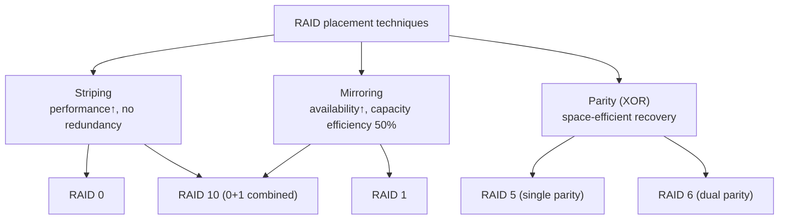
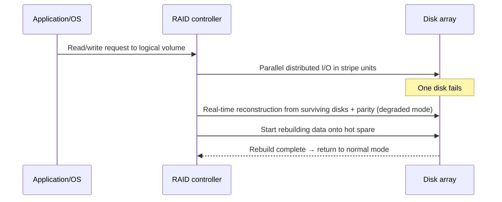

# RAID (Redundant Array of Independent Disks)

## 1. Overview

### A. Definition
> A storage technology that groups multiple physical disks into a single logical storage device and arranges **data via Striping, Mirroring, and Parity** to simultaneously achieve **performance improvement and Fault Tolerance**.

The essence of RAID is "grouping multiple cheap, low-reliability disks through software/hardware placement techniques so that they appear as a single fast and stable disk." Originally the 'I' stood for Inexpensive, but today it is commonly read as Independent, encompassing enterprise disks as well. The core idea rests on two axes—**parallelism through distribution** and **recoverability through redundancy**—and RAID levels are defined by how these two axes are combined.

### B. Background and Need
A single disk has limits in both performance (rotational and seek latency) and reliability (MTBF). In particular, as disk capacity and count grow, the failure probability of the array as a whole rises sharply—even if a single disk's annualized failure rate (AFR) is 1%, grouping 100 of them makes failure events far more frequent from the array's perspective. Thus, on the premise that each disk will inevitably fail someday, the requirement arises to **continue service without losing data even if one or two disks die**. At the same time, increasing the throughput of large data requires **distributing I/O in parallel across multiple disks**. RAID emerged to economically meet this "performance and availability at once" requirement using combinations of low-cost disks.

## 2. Core Principles and Configuration Methods

RAID can be understood as a combination of three basic placement techniques. **Striping** splits a piece of data finely across multiple disks (in stripe units) so it can be read and written in parallel, improving performance, but it provides no redundancy by itself. **Mirroring** replicates the same data in two or more copies so that if one side dies the other can take over immediately, but capacity efficiency drops by half. **Parity** stores error-correction information computed by XOR, restoring the loss of any one (or two) disks with little capacity overhead.

The principle of parity is simple. If, for data blocks D1, D2, D3, parity P = D1 ⊕ D2 ⊕ D3 (XOR) is stored, then even if any one block (e.g., D2) is lost, it is restored as D2 = D1 ⊕ D3 ⊕ P. RAID 6 uses two different independent parities (P, Q — Q is based on Galois field arithmetic) to withstand **two simultaneous disk failures**. Thanks to this principle, RAID 5 uses only one disk's capacity out of N as redundancy, and RAID 6 only two, while still securing recoverability.

## 3. Comparison of Major RAID Levels

Each level chooses a different point on the trade-off among performance, availability, and capacity efficiency. RAID 0 performs only striping without redundancy, so it offers the highest performance and maximum capacity, but if even one disk dies all data is lost—in other words, its reliability is actually worse than a single disk. Conversely, RAID 1 provides excellent availability through mirroring and good read performance, but usable capacity is half. RAID 5 was long used as a de facto standard as the balance point between capacity efficiency and availability, and RAID 6 has become practically essential in the era of large-capacity disks as the risk of a second failure during rebuild has grown.

| Level | Min. disks | Redundancy method | Fault tolerance | Usable capacity | Characteristics |
|---|---|---|---|---|---|
| RAID 0 | 2 | None (striping) | 0 | 100% | Highest performance · max capacity, no protection |
| RAID 1 | 2 | Mirroring | 1 (per pair) | 50% | Excellent reads · simple recovery |
| RAID 5 | 3 | Distributed single parity | 1 | (N-1)/N | Balanced, parity write burden |
| RAID 6 | 4 | Distributed dual parity | 2 | (N-2)/N | Large capacity · rebuild safety |
| RAID 10 | 4 | Mirror + stripe | 1 per group | 50% | High performance · high availability, preferred for DBs |

### Write Penalty and Performance Implications
The most important practical point of parity-based RAID is the **write penalty**. In RAID 5, updating any single block requires **4 I/Os**: (1) read old data, (2) read old parity, (3) write new data, (4) write new parity. RAID 6 has two parities, so this increases to **6 I/Os**. In contrast, RAID 1/10 finishes with 2 writes, one to each side. For this reason, RAID 10 is recommended over RAID 5/6 for OLTP databases with heavy random writes. In practice, this penalty is mitigated by the controller's write cache (NVRAM) and full-stripe writes.

## 4. Operational Flow: Normal → Failure → Rebuild

In the normal state, the controller splits requests into stripe units and processes them in parallel across multiple disks. When one disk fails, the array switches to **degraded mode**, computing lost blocks in real time from the remaining disks and parity—the data survives, but every access carries a reconstruction computation and becomes slower. At this point, an automatic rebuild begins onto a pre-provisioned **Hot Spare** disk. The problem is that rebuilding large disks (tens of TB) takes hours to days, and if another disk fails in the meantime, RAID 5 loses the data completely. This "rebuild window" risk gave rise to the need for RAID 6 and the declustered RAID described below.

## 5. Advanced: Limitations and Latest Trends

Traditional RAID has hit limits in large-capacity, large-scale environments. First, rebuild time grows in proportion to disk capacity, increasing the risk of double failures. Second, the rebuild load concentrates on a specific spare disk and becomes a bottleneck. The trends addressing this are as follows.

- **Declustered RAID**: Scatters parity and spare space across all disks so that all disks participate in parallel during rebuild. This greatly shortens rebuild time (by several to tens of times), reducing the risk window. Adopted by NetApp RAID-DP, IBM, and others.
- **Erasure Coding**: Uses mathematical codes such as Reed-Solomon to distribute data into n fragments + k parities, recovering from the loss of any k. It can be viewed as a generalization of RAID 6 and is widely used in object storage and distributed file systems (e.g., Ceph, HDFS EC) for geo-level fault tolerance.
- **File-system-integrated (ZFS RAID-Z, Btrfs)**: Integrates volume manager, file system, and RAID to fundamentally eliminate the "write hole" (the problem of power loss while parity and data are inconsistent), and guarantees integrity with block-level checksums.
- **Hardware vs software RAID**: Dedicated controllers (including battery-backed cache) are advantageous for performance and CPU offload but carry vendor lock-in and controller single-point-of-failure risk; software RAID (mdadm, Storage Spaces) is flexible and low-cost but uses host CPU.

## 6. Considerations and Implications

- **RAID ≠ backup**: RAID is merely an **availability** measure against physical disk failure; it cannot protect data from user error, ransomware, logical corruption, or site disasters. It must be combined with separate backups, snapshots, and remote replication (DR). This should be designed together with the 3-2-1 backup rule.
- **Workload-aligned design**: Random-write-centric workloads (OLTP DB) favor RAID 10, which has no write penalty, while sequential reads, archives, and large capacity favor RAID 6/EC with good capacity efficiency. Choosing among the four-way trade-off of performance, capacity, cost, and availability according to workload characteristics is the core of a professional engineer's judgment.
- **Rebuild risk management**: With the trend toward larger disks, RAID 5 should be avoided due to the increased risk of double failure and URE (unrecoverable read error) during rebuild, and the risk window should be managed through RAID 6, declustered RAID, and multiple hot spares.
- **Extension to software-defined storage (SDS) and cloud**: Traditional controller-centric RAID is evolving into distributed storage (SDS, object storage) that combines node- and site-level replication with erasure coding, and the boundary of fault tolerance is expanding from disks to nodes and regions. Future storage design will shift toward prioritizing **distributed redundancy and erasure-coding-based architectures** over single-array RAID.

---
> **In one line**: RAID is a technology that groups multiple disks through combinations of striping, mirroring, and parity to gain performance and fault tolerance at once; levels should be chosen considering workload-specific trade-offs (especially write penalty and rebuild risk), and it must always be combined with backup.
