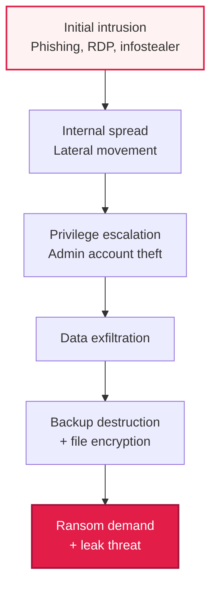

# Ransomware and RaaS (Ransomware as a Service)

## 1. Overview

### A. Definition

> **Ransomware** is malicious software that **encrypts or locks systems and files to render them unusable, then demands money (a ransom) in exchange for recovery**, while **RaaS (Ransomware as a Service)** is a **subscription-based criminal business model** that produces and rents out ransomware like a cloud service, enabling even non-experts without technical skills to carry out attacks.

The reason ransomware is especially threatening compared with other malware lies in its structure of "**taking data hostage to extort money directly from the victim**." Unlike an infostealer that steals information to resell to a third party, or a backdoor that lurks quietly, ransomware immediately encrypts data tied directly to the victim's operations, paralyzing their business and leveraging that pain itself to extract a ransom. Because the victim's business grinds to a halt without their data, the pressure to pay is intense, and because the attacker can bill the victim directly rather than having to find a buyer for stolen data, it is the fastest attack to "monetize."

**The heart of the problem is that RaaS has industrialized this threat.** In the past, only a handful of advanced hackers who could write powerful cryptographic routines and propagation code could carry out ransomware attacks. RaaS, however, created a **division of labor** in which the ransomware developer (Operator) handles "**development and infrastructure operation**," while a separate attack executor, the "**Affiliate**," handles the actual intrusion and distribution, and they split the proceeds (the ransom). As a result, even criminals without coding ability can rent ransomware on the dark web to launch attacks, causing the number of attacks to explode—effectively transplanting the software industry's SaaS model directly into the criminal underground.

### B. Emergence and Evolution

Three enabling factors underlie ransomware's rise as the worst of cyber threats. First, the advent of **cryptocurrency (Bitcoin, etc.)** made anonymous, hard-to-trace transfers possible, making ransom collection easier. Second, **RaaS dramatically lowered the barrier to entry for attacks**, causing supply to surge. Third, as defensive technology evolved toward backups, attackers responded with **Double Extortion**, in which they encrypt data while also **exfiltrating** it and then threaten to "publish it if you don't pay." Recently they have continued to add pressure tactics—**DDoS attacks and directly threatening the victim's own customers**—escalating to triple and quadruple extortion. In other words, ransomware must be understood not as static malware but as a "criminal ecosystem" that evolves in response to defenses.

## 2. The Division of Labor and Participants in RaaS

### A. Division-of-Labor Conceptual Diagram

Rather than one organization doing everything, RaaS takes the form of a value chain in which specialized participants share the proceeds by role. Developers provide the ransomware binary, encryption-key management, negotiation portal, and ransom-collection infrastructure as a "service," and affiliates rent these to actually intrude on and infect targets. When **Initial Access Brokers (IABs)** who sell intrusion routes (account and VPN access) join in, the division of labor becomes even more granular.

```mermaid
flowchart LR
  IAB["Initial Access Broker (IAB)<br/>Sells access"] -->|Access rights| A
  D["Developer/Operator<br/>(Provides ransomware & infrastructure)"] -->|Service rental| A["Affiliate<br/>(Distribution & attack execution)"]
  A -->|Ransom demand| V[Victim]
  V -->|Cryptocurrency payment| A
  A -->|Revenue split (e.g., 70:30)| D
  style D fill:#fef3f2,stroke:#e11d48,stroke-width:2px
  style A fill:#fff7ed,stroke:#ea580c,stroke-width:2px
```

The **Developer/Operator** is the "platform provider" of this ecosystem. They continuously run infrastructure equipped with strong hybrid encryption (encrypting files with a symmetric key, then re-encrypting that key with the attacker's public key), a dark-web negotiation portal, a data leak site, and wallets for collecting ransom. They even manage brand reputation (guaranteed recovery, negotiation etiquette), because a victim will only pay if they believe "if I pay, they really will unlock it." Revenue is commonly reported to be split around 70–80% to the affiliate and 20–30% to the operator, though this varies by organization.

The **Affiliate** is the executor who actually gets their hands dirty. After intruding via phishing emails, logging in with accounts bought from an IAB, or exploiting exposed RDP/VPN vulnerabilities, they take control internally and execute the ransomware. Because coding ability is not required, the barrier to entry is low, and they operate while switching among multiple RaaS brands.

The **Initial Access Broker (IAB)** is a middleman who specializes in selling the "keys" to organizational networks. Affiliates buy the access these brokers have secured in advance to save time, and thanks to this division of labor, the time from intrusion to encryption has shrunk from weeks in the past to a matter of hours. This specialized division of labor is precisely the fundamental engine behind ransomware's mass, high-speed proliferation.

### B. Impact Seen Through Representative Cases

The destructive power of the RaaS ecosystem is confirmed by real incidents. In 2021, **Colonial Pipeline**, the largest pipeline operator in the U.S., halted pipeline operations following an attack by a DarkSide RaaS affiliate, paid roughly $4.4 million, and caused disruption to fuel supply on the U.S. East Coast. In the same year, IT management software vendor **Kaseya** was breached by REvil RaaS via a supply-chain method, causing cascading damage to thousands of downstream companies worldwide. These two incidents are representative figures and cases showing that ransomware has reached the stage of threatening not just individual companies but national critical infrastructure (CI) and entire supply chains.

## 3. Attack Stages and the Evolution of Extortion

### A. Attack Stages (Kill Chain)

A ransomware attack is not impromptu encryption but a planned breach process running through **initial intrusion → internal spread and privilege escalation → data exfiltration → encryption and extortion**. Understanding this process makes it possible to break the attack at the stage "before encryption."



The attacker first intrudes on one machine (initial intrusion) using phishing, exposed RDP, or credentials stolen by an infostealer, then moves sideways internally (lateral movement) to steal domain administrator privileges. **The very first thing they do with these admin privileges is destroy backups and shadow copies (VSS)**, in order to eliminate the victim's recovery capability and leave no option but to pay. Next they exfiltrate important data externally, then execute mass encryption and leave a ransom note. From a defensive perspective, the key point is that encryption is the "last" action of the attack. If anomalous behavior is detected during the preceding stages of lateral movement, privilege escalation, and mass data transfer, the attack can be blocked before encryption.

### B. Evolution of the Extortion Model

| Type | Pressure tactic | Defensible with backup alone? |
|---|---|---|
| **Single extortion** | Encrypt data → charge for recovery | Yes (just restore) |
| **Double extortion** | Encryption + threat to leak data | No (already leaked) |
| **Triple extortion** | + additional pressure via DDoS | No |
| **Quadruple extortion** | + direct threats to victim's customers/partners | No |

The extortion model's evolution from single to multiple is **the result of an arms race between defense and offense**. Once companies had backups, the response of "I'll just restore, so I won't pay" became possible, so attackers switched to double extortion—stealing data first, then encrypting. Now, even if you recover from backup, the threat of "we'll publish the personal information and trade secrets we stole" remains, so regulation (breach notification, fines) and reputational risk become new pressures to pay. Therefore, from double extortion onward, backups are not a "cure-all," and prevention and detection that stop data from leaving in the first place have become equally important.

## 4. Countermeasures

There is no single silver bullet for ransomware; it must be designed as Defense in Depth with **prevention → backup → detection/isolation → response (IR)**. Each layer targets a different attack stage.

| Category | Countermeasure | Targeted stage |
|---|---|---|
| **Prevention** | Patch/vulnerability management, phishing training, least privilege, MFA | Initial intrusion |
| **Backup** | 3-2-1 backup (offline, immutable), recovery drills | Recovery after encryption |
| **Detection/isolation** | EDR/XDR anomaly detection, network segmentation | Spread, privilege escalation |
| **Response** | Incident response (IR) framework, reporting, avoiding ransom payment | Post-incident cleanup |

The last line of core defense is a "**trustworthy backup**." In particular, together with the **3-2-1 principle** (3 copies of data, on 2 different media, with 1 of them offline/offsite), if you have **Immutable and Air-gapped backups** that the attacker cannot delete even with administrator privileges, you can restore even after being encrypted, so there is no reason to pay a ransom. However, as seen above, backups alone are insufficient against double extortion (leak threats), so intrusion blocking (MFA, least privilege, patching), anomaly detection (EDR/XDR), and data-leak detection (DLP) must be pursued in parallel. Also, what matters about backups is not "having them" but "being able to recover," so regular **Restore Drills** must verify RTO and RPO for them to be effective.

Making each defense layer concrete as operational controls yields the following. These are layered so that even if one is breached, the next layer delays or blocks the attack.

- **Blocking initial intrusion**: Close externally exposed RDP or enforce VPN+MFA, phishing response training, rapid patching of internet-facing assets (prioritize KEV).
- **Account/privilege control**: Least-privilege principle, admin account separation (Tiering), service-account review, monitoring for credential theft (infostealers).
- **Blocking spread**: Network segmentation and micro-segmentation, restricting internal SMB/RDP/WMI communications used for lateral movement, Zero Trust access control.
- **Backup/recovery**: 3-2-1 + immutable/air-gapped backups, isolating the backup network, periodic recovery drills to actually measure RTO/RPO.
- **Detection/response**: Detecting anomalous behavior such as mass encryption and VSS deletion with EDR/XDR, SIEM correlation analysis, keeping IR playbooks and tabletop exercises (TTX) always current.

## 5. Deep Dive — Recent Trends and Links to Past Exam Topics

The ransomware ecosystem has recently shown several distinct changes. First, **Encryption-less Extortion** is increasing. This method only steals data, skips encryption, and demands money through leak threats alone; it avoids the detection and recovery controversies that come with encryption while still maintaining pressure. This means the center of gravity of defense is shifting from "recovery" to "leak prevention." Second, **supply-chain and MSP targeting** has intensified, aiming for the leverage effect of infecting many downstream companies through a single intrusion (the Kaseya case). Third, as governments respond with **bans on ransom payment and mandatory reporting**, the legal risk that payment could constitute money laundering or a sanctions violation has grown.

On the defensive-technology side, emphasis is placed on **anomaly and mass-encryption pattern detection** by AI-based EDR/XDR, blocking lateral movement based on Zero Trust, and Micro-segmentation. From the perspective of past and similar exam topics, ransomware is broadly linked with **EDR/XDR, Zero Trust, backup/disaster recovery (DR), incident response (CERT/CSIRT), the cyber kill chain, and dark web/cryptocurrency**. In an exam answer, a persuasive structure is to address the two axes of "industrialization through the RaaS division of labor" and "the evolution of the extortion model (neutralizing backups)," and to present multi-layered defense and a strategy of "creating a state in which you don't have to pay" as the response.

## 6. Considerations and Implications

1. **Backups are the last line of defense, but with conditions.** Secure recovery capability with the 3-2-1 principle and immutable/air-gapped backups, but given that attackers destroy backups first using administrator privileges, isolate the backup infrastructure from the operational network and actually measure and verify RTO/RPO through recovery drills.

2. **Prevention and detection are essential against double/triple extortion.** Data-leak threats cannot be stopped with backups, so combine initial-intrusion blocking (MFA, least privilege, patching), EDR/XDR anomaly detection, and DLP-based leak detection to shift the center of gravity toward defenses that stop the attack "before data leaves."

3. **Ransom payment should in principle be avoided.** Even if you pay, full recovery is not guaranteed, you become a target for re-attack (reports indicate a high rate of victim re-targeting), paying a sanctioned organization can bring legal liability, and it sustains the criminal ecosystem. Therefore, the best strategy is preparation (backups, IR framework) that creates in advance a "state in which you don't have to pay."

4. **Maintain an incident response (IR) framework and drills at all times.** For initial isolation, evidence preservation, reporting (within statutory deadlines in the event of a personal-data breach), and external communication to run without confusion during an actual incident, a CSIRT organization, contact structure, playbooks, and tabletop exercises (TTX) must be prepared in advance.

5. **An ecosystem-level approach is needed to counter RaaS industrialization.** Beyond single-company defense, the response must expand to target the entire value chain—blocking credential theft (infostealers) distributed by initial access brokers, sharing threat intelligence (dark web monitoring), and strengthening supply-chain and MSP security requirements.

## 7. References

- CISA, #StopRansomware Guide: https://www.cisa.gov/stopransomware
- MITRE ATT&CK, Data Encrypted for Impact (T1486): https://attack.mitre.org/techniques/T1486/
- ENISA Threat Landscape (Ransomware): https://www.enisa.europa.eu/topics/threat-risk-management/threats-and-trends
- No More Ransom Project: https://www.nomoreransom.org/

---

> **In one line**: Ransomware is malware that *encrypts and exfiltrates data to demand a ransom*, and RaaS is a criminal model that turns this into a service through the division of labor among developers, affiliates, and IABs; having *evolved into double/triple extortion*, backups alone are insufficient, so it must be countered with multi-layered defense—*immutable backups (3-2-1), EDR/XDR detection, least privilege, MFA, and an IR framework*—while ransom payment is avoided.
