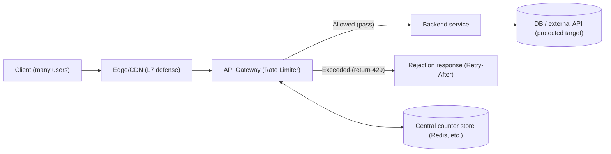
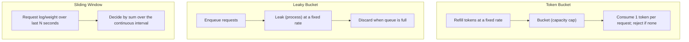

# Rate Limiting and Traffic Control Algorithms

## 1. Overview

### A. Definition

> **Rate Limiting** is a traffic control technique that ensures system stability and fairness by controlling the number of requests a particular client, API, or resource can perform within a given time window against a predefined quota, and by delaying, rejecting, or buffering the excess.

Rate limiting is a flow-control policy that decides "how fast and how much" traffic to allow.
Unlike congestion control at the network layer, which regulates end-to-end transmission speed, rate limiting operates mainly at the application/API layer, identifying individual callers and governing the frequency of their requests, so its concern is different.
That is, the target is not packets but logical requests (HTTP requests, RPC calls, messages), and the identification criterion is a business-meaningful subject such as IP, API key, user account, or tenant.

Rate limiting is often used interchangeably with "throttling," but they differ in nuance.
Broadly, rate limiting is the policy that judges whether the quota has been exceeded, while throttling is the execution method for how to handle requests (reject, delay, queue) once an overage is confirmed.
Therefore, a well-designed system separates "quota definition (Rate Limiting)" from "behavior on overage (Throttling)," and returning the HTTP `429 Too Many Requests` status with a `Retry-After` header as the overage response has become the de facto standard.

### B. Emergence and Necessity

Modern services have evolved to expose interfaces externally, such as public APIs, open banking, MyData, and generative-AI APIs.
The moment an interface opens, a service simultaneously faces well-intentioned high-volume calls and malicious abuse.
For example, if a poorly implemented client falls into a retry loop and calls thousands of times per second, or a credential-stuffing attack hammers a login API tens of thousands of times per second, service degradation occurs that affects even legitimate users.
Rate limiting is the minimal line of defense that erects a bulkhead in such situations so that "one excessive user cannot monopolize all resources."

The second necessity lies in the finiteness of cost and resources.
Even if autoscaling in a cloud environment absorbs the load, scaling comes with latency and cost.
In particular, backends with high per-call cost—such as generative-AI inference, payment, or settlement—cannot be scaled indefinitely, so an upper bound must be placed at the request-ingress stage to protect downstream.
Here, rate limiting becomes a core means of implementing "Load Shedding" together with circuit breakers and bulkheads.

The third necessity is fairness and monetization.
SaaS/API businesses differentiate service tiers by assigning different call quotas per plan, such as Free, Pro, and Enterprise.
For instance, a commercial LLM API limits both requests per minute (RPM) and tokens per minute (TPM) by pricing tier, showing that rate limiting has become an axis of billing, SLA, and product design, going beyond mere defense.

### C. Application Goals

The application goals are: first, availability protection (defending the backend against surges, DDoS, and retry storms); second, fair resource distribution (isolation among tenants and users); third, cost control (an upper bound on downstream call volume); fourth, monetization and SLA fulfillment (tiered quotas); and fifth, providing a first-line signal for abuse and anomaly detection.
These five goals can conflict with one another, so the algorithm choice and distributed implementation discussed later will vary depending on which goal is prioritized.

## 2. Overall Architecture and Placement

The accuracy, performance, and operational complexity of a rate limiter vary depending on where in the request path it is placed.
The conceptual diagram below shows at which points along the request path from client to backend rate limiting intervenes.

The most common placement is the **API gateway / reverse proxy** layer.
Since this point is the gateway through which all requests must pass, it is well suited for applying quotas after identifying the caller right after authentication.
The gateway filters requests before branching to multiple backends, so it has the advantage of protecting the entire downstream at once.
On the other hand, it has a limitation in that it is hard to finely reflect each backend's individual resource characteristics (e.g., a particular heavy endpoint), so a design that hierarchically combines the gateway's global quota with local quotas inside the service is often used in practice.

The second placement is the **application middleware** layer.
Since quotas can be applied per endpoint or feature within the service code, precise control tailored to domain characteristics is possible—such as "payment requests: 5 per minute, queries: 300 per minute."
However, when service instances scale out to many, a distributed problem arises: how to aggregate each instance's local counter.

The third placement is the **edge/CDN** layer.
Blocking high-volume traffic early at the CDN/WAF level based on IP, region, and bot signals saves cost before it reaches the origin and constitutes Defense in Depth.
Accuracy is low, but it serves as the cheapest and fastest first line of defense.

## 3. Rate Limiting Algorithms

Algorithms are distinguished by "how time and counts are measured," and each has different trade-offs in accuracy, burst tolerance, memory, and implementation difficulty.
The detailed architecture diagram below contrasts the operating principles of four representative algorithms.

### A. Token Bucket

In the token bucket, tokens are filled into the bucket at a fixed refill rate, each request consumes one token when processed, and a request is rejected if there are no tokens.
The bucket has a maximum capacity, so tokens do not accumulate beyond it.
The key virtue of this structure is **burst tolerance (allowing momentary spikes)**.
If requests are normally few and tokens have accumulated up to capacity, a sudden flood of requests can be processed all at once.
For example, a bucket with capacity 100 and a refill rate of 10 per second maintains about 10 per second on average, but can absorb up to 100 requests instantaneously using the 100 tokens accumulated during idle time.
It is therefore well suited to interactive APIs where perceived responsiveness matters (search, autocomplete), and in fact many API gateways and cloud APIs adopt it as their default algorithm.
The downside is that both parameters—capacity and rate—must be tuned together, and if bursts are allowed too generously, downstream can take a momentary load.

### B. Leaky Bucket

The leaky bucket puts requests into a queue (bucket) and **only draws them out for processing (leaks) at a fixed rate**, discarding subsequent requests when the queue is full.
If the token bucket's idea is to "accrue allowance in advance," the leaky bucket's idea is to "fix the output rate to be smooth."
As a result, output traffic is smoothly shaped (traffic shaping), which is advantageous when the downstream requires a constant processing rate (e.g., an external payment network that accepts only a fixed number per second, or a message-broker consumer).
Conversely, because it cannot absorb bursts, even legitimate requests that flood in after an idle period may experience queue delay or be discarded, making it less suitable for interactive services.
In implementation, the leaky bucket is effectively realized as a fixed-capacity FIFO queue + a constant-rate consumer, with the trade-off that response time increases as delay accumulates.

### C. Fixed Window Counter

The fixed window is the simplest method: it keeps a counter for each time window with fixed boundaries, such as "second 0 to second 59 of each minute," and resets to 0 when the window changes.
Memory needs only a single counter, so it is extremely lightweight and easy to implement.
However, it has a fatal weakness called **boundary burst**.
When the quota is 100 per minute, if a user sends 100 requests at 12:00:59 and another 100 at 12:01:00, 200 requests pass within just over a second.
That is, at the window boundary, up to double the quota can momentarily be allowed, making it unsuitable for sensitive endpoints such as payment or authentication that require a strict cap.

### D. Sliding Window

The sliding window continuously evaluates "the last N seconds relative to the current time" to solve the fixed window's boundary problem.
The precise form, the **sliding window log**, stores each request's timestamp and, when judging, counts the number of logs within the last N seconds.
It is accurate but consumes a lot of memory because a timestamp must be kept for every request.
The **sliding window counter**, a compromise widely used in practice, approximates by taking a weighted average of the current window's and the immediately preceding window's counters.
For example, if 30% of the current window has elapsed, it estimates as `previous_window_count × 0.7 + current_window_count`, maintaining only two counters in memory while greatly mitigating boundary bursts.
It has a good balance of accuracy and resources, so CDNs and API gateways handling large-scale traffic favor it.

The table below compares the characteristics of the four algorithms.
The table is to aid summary; the basis for selection is in the trade-off explanations in the prose above.

| Algorithm | Burst tolerance | Accuracy | Memory | Representative use |
|---|---|---|---|---|
| Token bucket | High (accrued) | Medium | Low | Interactive APIs, gateway default |
| Leaky bucket | Low (smoothing) | Medium | Medium | Traffic shaping, constant-rate consumption |
| Fixed window | Excessive at boundary | Low | Very low | Simple, low-risk limiting |
| Sliding window | Low | High | Medium | Precise limiting, large-scale APIs |

## 4. Implementation in a Distributed Environment

When service instances scale out to dozens, a fundamental problem arises: "the quota is global, but the counters are distributed."
If each instance uses only a local counter, the quota is inflated by the number of instances; conversely, querying a central store on every request increases latency and load.
Therefore, distributed rate limiting is a compromise design between accuracy and performance.

The most common implementation places the counter in a **central store (Redis)**.
Using Redis's atomic commands (`INCR`, `EXPIRE`) or a Lua script to handle "increment and expiry at once" eliminates contention, and multiple instances share the same key (e.g., `rate:user:1234:minute`) to enforce the global quota.
It is accurate, but the store can become a single point of failure, so a policy must decide whether to block requests (fail-closed) or let them pass (fail-open) when the store fails.
Services where availability is paramount often choose fail-open, while paths with high abuse risk such as authentication and payment are set to fail-closed.

When performance matters, **local approximation + periodic synchronization** is used.
Each instance judges quickly locally and reports and adjusts usage to the center in the background, accepting slight overages in exchange for low latency.
It is suitable when a precise global cap is not needed and approximate protection is sufficient.

A practical point to note here is transparently informing the client of the rate-limit state.
Exposing the remaining quota via the `X-RateLimit-Limit`, `X-RateLimit-Remaining`, and `X-RateLimit-Reset` headers, and returning `429` with `Retry-After` on overage, lets the client cooperate with exponential backoff, preventing retry storms.

## 5. Deep Dive — Standardization Trends and Practical Application Cases

For a long time, rate limiting had inconsistent header names and response formats across vendors, resulting in poor client interoperability.
To improve this, the IETF has been working to standardize a specification (the `RateLimit`/`RateLimit-Policy` family) that exposes rate-limit information via standard headers; the detailed fields are being revised, so it is advisable to check the latest draft when implementing.
The intent of standardization is to have different services report remaining quota and reset time in the same format, so that SDKs and gateways perform backoff consistently.

As practical cases, first, there is tiered billing on public API platforms.
Cloud/SaaS providers assign per-second or per-minute call quotas by plan, and on overage they return 429 or offer flexibility via additional charges (burst credits).
Second, generative-AI APIs apply a dual limit of request-count quota (RPM) and token-count quota (TPM).
Since the actual compute cost varies greatly with prompt length even for the same number of requests, this is a case showing that it is reasonable to place the quota on the actual unit of resource consumption (tokens).
Third, authentication endpoints such as login, OTP, and password reset apply tight per-IP and per-account sliding-window limits to slow down credential stuffing and brute-force attacks, which is a point where rate limiting directly meets security control.

As a future direction, the shift from static quotas to **adaptive rate limiting** draws attention.
This method observes load signals such as the backend's real-time latency, error rate, and queue length to dynamically adjust the quota, combining with circuit breakers, load shedding, and autoscaling so the system finds its own stable point.
It can improve resource utilization more than a fixed flat quota, but if the control loop is unstable, oscillation can occur, so observability and careful tuning are prerequisites.

## 6. Considerations and Implications

- **Precision of the quota target and key design**: An IP basis lumps many users behind NAT/proxies into one group, causing false positives, while a user/API-key basis is only possible after authentication. Therefore, a multidimensional key design is needed—use IP/device fingerprint for the unauthenticated segment and account/tenant keys for the authenticated segment, and set different quotas by endpoint sensitivity (query vs. payment).
- **Aligning algorithm/placement trade-offs**: The token bucket suits interactive traffic that needs burst tolerance, the leaky bucket suits downstream needing constant-rate processing, and the sliding window suits sensitive APIs needing a strict cap. Global protection should be at the gateway and precise control inside the service, combined hierarchically.
- **Explicit failure policy (fail-open vs. fail-closed)**: Decide in advance what to prioritize when the counter store fails. Set availability-first services to fail-open and paths with high abuse/cost risk to fail-closed, but in both cases also prepare alarms and a fallback (local approximate limiting).
- **Linking observability and abuse detection**: Metricizing the 429 rate, users near their quota, and consumption distribution per key can be used for capacity planning and anomaly detection. Rate-limit logs become meaningful input for SIEM and anomaly detection, functioning as a signal source for security and operations beyond mere defense.
- **Combining with resilience patterns**: Rate limiting is not complete on its own. It is only when designed together with circuit breakers (blocking failure propagation), bulkheads (resource isolation), retry/exponential backoff (cooperative retries), and load shedding (preferentially discarding low-priority requests) that a system becomes resilient to surges and failures.

## References

- IETF, "RateLimit header fields for HTTP" (draft), https://datatracker.ietf.org/doc/draft-ietf-httpapi-ratelimit-headers/
- MDN Web Docs, "429 Too Many Requests", https://developer.mozilla.org/en-US/docs/Web/HTTP/Status/429
- Cloudflare, "What is rate limiting?", https://www.cloudflare.com/learning/bots/what-is-rate-limiting/

---
> **In one line**: Rate limiting is a traffic control technique that controls the number of requests within a time window against a quota; by selecting among the token bucket, leaky bucket, and fixed/sliding window algorithms to fit the situation and implementing it in a distributed manner via a gateway and central store, it secures availability, fairness, cost, and security all at once.
