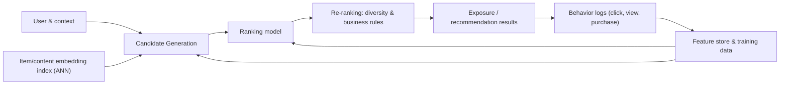
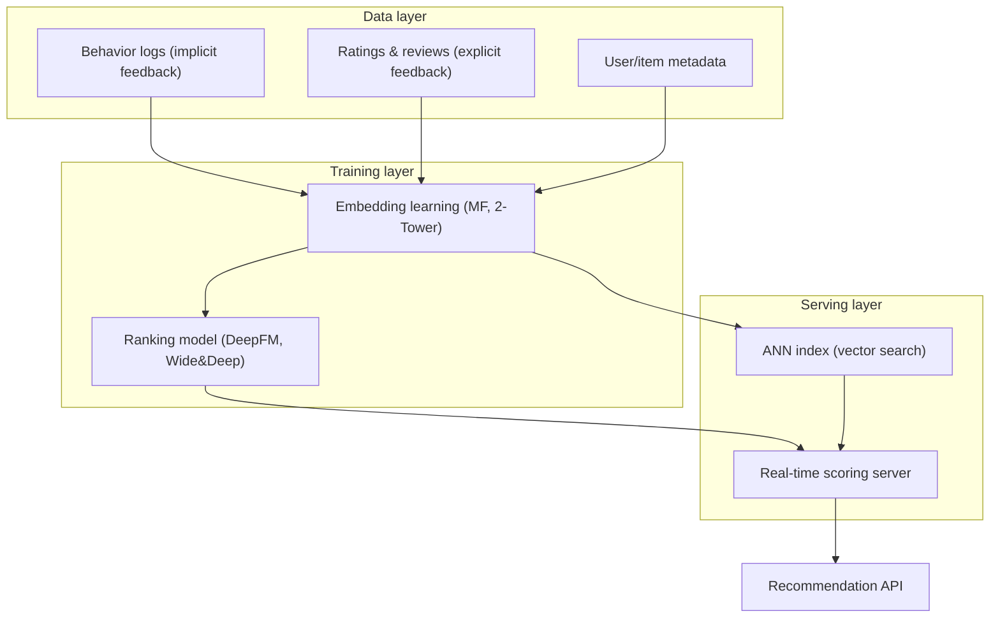

# Recommendation System

## 1. Overview

> **Definition**: A recommendation system is an information-filtering system that learns from data about users, items, and context to predict and rank, among items a particular user has not yet encountered, those the user is likely to prefer, and presents them.

As information exploded, the cost for a user to explore every option one by one reached an unmanageable level. Facing tens of millions of products, hundreds of millions of videos, and endlessly updated posts, search alone cannot fill latent demand where the user "does not yet know what they want." A recommendation system solves this **Information Overload** problem by narrowing down candidates on the user's behalf, and today it has become a core revenue engine in commerce, media, advertising, and finance.

The reason recommendation is commercially important lies in the skewed structure of consumption. Offline stores handle only a few popular products due to shelf-space constraints, but online, storage and distribution costs are low, so the sum of the many products with low sales (the Long Tail) forms substantial revenue. Recommendation systems discover this long tail through personalization, boosting both diversity and revenue. In fact, Netflix has stated that a substantial portion of viewing originates from recommendations, and analyses that a large share of Amazon's revenue is associated with recommendation-based exposure are repeatedly cited.

Recommendation's character becomes clearer when contrasted with search. Search is a **Pull** method in which the user explicitly expresses intent through a query, whereas recommendation is a **Push** method that estimates intent from context and history and presents items first, even without an explicit request. Therefore, recommendation also targets latent demand where the user "does not yet know what they want," and since there is no query, the user's past behavior and context (time, device, location) effectively play the role of the query.

From a professional-engineer perspective, a recommendation system is not a simple machine-learning model but an information pipeline and service architecture in which **data collection (logs)–candidate generation–ranking–exposure–feedback** cycles. It is not enough merely to have high accuracy; response latency (tens of ms), cold start for new users and items, social side effects such as filter bubbles and fairness, and privacy protection must all be designed together, requiring comprehensive judgment.

## 2. The Overall Structure and Pipeline of a Recommendation System

Understanding a recommendation system as a single algorithm makes practical design difficult. Modern large-scale recommendation is composed as a **Multi-stage pipeline** to trade off accuracy and latency. Running a sophisticated model directly on the millions to hundreds of millions of total items would be unaffordable in latency and cost, so cheap models greatly reduce the candidates first, and then progressively more sophisticated models narrow them down.

The **Candidate Generation** stage quickly narrows the entire catalog down to hundreds to thousands of candidates. Collaborative filtering and embedding-based Approximate Nearest Neighbor (ANN) search are used, where recall and speed matter more than accuracy. The **Ranking** stage precisely predicts per-user click and conversion probabilities for these candidates and ranks them, mainly using deep-learning-based CTR prediction models. The **Re-ranking** stage applies diversity, freshness, deduplication, and business rules (excluding out-of-stock items, inserting ads, fair exposure) to the top-ranked group.

The point where this pipeline forms a closed loop is the **feedback loop**. User behavior toward exposed results (click, dwell, purchase, churn) accumulates again as logs and becomes the ground-truth signal for the next round of training. This cycle strengthens personalization, but it produces **Exposure Bias**, in which feedback accumulates only for items the system has already exposed, which can intensify filter bubbles and popularity skew, so a design that deliberately mixes in exploration is needed.

Below is an organized architecture of the recommendation pipeline from a data/model perspective.

From an operational perspective, the time axis of training and serving is also a design target. The heavy training of embedding and ranking models is refreshed in batches (daily/hourly), but immediate signals such as a product just viewed, a search query, or a cart must be reflected as real-time features for recommendations to respond sensitively to context. For this reason, a lambda/kappa-style data flow that uses batch and streaming together, and an online feature store, become core components of the recommendation infrastructure.

The most important distinction in the data layer is between **Explicit Feedback** and **Implicit Feedback**. Explicit signals directly expressed by the user, such as star ratings and reviews, are accurate but sparse, while implicit signals such as clicks, watch time, and adding to cart are abundant but noisy, and the "negative (dis-preference)" signal is not clear. In practice, the implicit feedback that is overwhelmingly larger in volume is mainly leveraged, but weighting and sampling are designed carefully so that non-exposure is not immediately treated as dis-preference.

## 3. Types of Recommendation Approaches

### A. Content-based Filtering

Content-based filtering recommends items similar in **attributes (features)** to those a user preferred in the past. For example, if a user enjoyed "sci-fi, Christopher Nolan, over 2 hours" films, it recommends other films close to the same feature vector. It vectorizes items with TF-IDF or embeddings and ranks by cosine similarity with the user profile vector.

The strength of this approach is that it works even without other users' data. Therefore, even when a new item arrives, it can immediately become a recommendation candidate as long as it has attributes, so it is strong against **item cold start**. It is also easy to explain "why it was recommended" in terms of attributes, giving high explainability.

The limitations are clear. It is hard to move beyond the range of attributes the user has consumed, causing **Over-specialization** that narrows recommendations, and a lack of serendipity. Also, performance depends heavily on the quality of attribute extraction, so in domains where attribute tagging is difficult, such as images and video, separate representation learning is needed. The phenomenon in news recommendation where only articles of a particular political leaning are continuously exposed is a representative side effect.

One point to note is that content-based methods do not solve "user cold start." A new item becomes a recommendation candidate as long as it has attributes, but a new user has no history from which to know their preferred attributes, so no profile can be built. Therefore, a phased design must run in parallel: collect initial tastes via an onboarding survey or start with popularity/trend-based default recommendations, then switch to a personal profile as interactions accumulate.

### B. Collaborative Filtering

Collaborative filtering uses not the attributes of items but the patterns in the **user–item interaction matrix (ratings/clicks)** itself. It is based on the collective-intelligence assumption that "I will like what people with tastes similar to mine liked," and its greatest strength is the generality of not needing to know domain attributes.

Memory-based methods are further divided into **User-based** and **Item-based**. The user-based approach finds neighboring users similar to me and recommends items they rated highly, while the item-based approach recommends items consumed together with items I liked. The reason Amazon adopted item-based filtering in large-scale services is that item counts vary less than user counts, making it easy to precompute the similarity matrix and giving good scalability.

Cosine similarity, Pearson correlation, and the Jaccard coefficient are used for similarity computation, and which measure is chosen determines the result. For data with per-user tendencies to rate generously or harshly (rating bias), such as ratings, Pearson correlation that corrects for the user's mean is advantageous, while for binary interactions such as clicks and purchases, Jaccard and cosine are suitable. As such, the key design point of memory-based methods is that the nature of the data and the assumptions of the measure must match for neighbors to actually be "similar in taste."

The representative model-based method is **Matrix Factorization (MF)**. It approximates the sparse user–item matrix R (m×n) as the product of a user latent-factor matrix P (m×k) and an item latent-factor matrix Q (n×k) to predict the values of unobserved cells. The predicted rating is computed as the dot product of the two latent vectors, r̂ = pᵤ · qᵢ, and k (the number of latent factors) is usually tens to hundreds of dimensions. When MF-family techniques became key to winning the Netflix Prize during 2006–2009, this approach established itself as an industry standard.

MF training minimizes the sum of squared prediction errors over observed interactions, while also including a **regularization (L2)** term that penalizes the size of the latent vectors to prevent overfitting. For optimization, Stochastic Gradient Descent (SGD), which backpropagates the error little by little, and Alternating Least Squares (ALS), which updates in closed form by alternately fixing P and Q, are used; ALS is easy to parallelize and thus suitable for large-scale implicit-feedback data in distributed environments. Adding a bias term that absorbs the per-user and per-item rating tendencies and a term reflecting temporal change improves prediction quality, because it separates out systematic deviations not explained by the latent factors alone.

However, collaborative filtering carries the problems of **cold start**, where it cannot handle new users/items with no interaction history, skew toward popular items, and extreme sparsity. It is common for actual interaction matrices to have less than 1% of cells filled, so it must always be taken into account in design that the more severe the sparsity, the more sharply the reliability of neighbor/latent-factor estimation drops.

### C. Hybrid and Deep-Learning-Based

Since content-based and collaborative filtering complement each other's weaknesses, most real services are composed as a **hybrid** combining the two. Combination methods include a weighted type that takes a weighted sum of the two models' scores, a switching type that swaps models by situation, and a feature-combination type that uses one model's output as another model's input. For example, a switching strategy that starts new users with content-based/popularity-based recommendations and increases the collaborative-filtering weight as interactions accumulate is effective at mitigating cold start.

The fundamental reason deep learning surpassed collaborative filtering lies in expressive power. Matrix factorization explains interactions only through the linear dot product of user and item latent vectors, but real preferences form when several features combine nonlinearly, such as "20s + weekend + mobile + a particular genre." Neural networks can learn such high-order feature interactions, unstructured content like text and images, and even behavioral sequences within a single representation, simultaneously boosting accuracy and cold-start handling.

Recently, deep learning has become mainstream. The **Two-Tower model** learns a user tower and an item tower each as embeddings and computes relevance by their dot product; by placing item embeddings into an ANN index in advance, it can handle large-scale candidate generation in tens of ms. At the ranking stage, CTR prediction models such as Wide&Deep and DeepFM, which jointly learn low- and high-order feature interactions, are widely used. **Sequential Recommendation (e.g., SASRec, BERT4Rec)**, which views user behavior as a sequence and predicts the next consumption with a Transformer, and **Graph Neural Network (GNN) recommendation**, which models user–item relationships as a graph, are also active. Furthermore, generative recommendation—using LLMs to reflect the meaning of product descriptions and reviews, or to generate recommendation rationales in natural language—is emerging as a new trend.

The following table organizes the core differences of the three approaches together with the fundamental reasons their strengths and weaknesses arise, rather than as a simple list.

| Category | Basis data | Cold start | Strength (reason) | Weakness (reason) |
|------|------------|------------|-----------|-----------|
| Content-based | Item attributes + personal history | Strong for items | Immediate recommendation of new items, easy to explain (attribute-based) | Over-specialization, lack of discovery (confined to history range) |
| Collaborative filtering | User–item interactions | Weak for new users/items | Domain-agnostic, serendipity (collective patterns) | Sparsity, cold start, popularity skew (history-dependent) |
| Hybrid/deep learning | Interactions + attributes + sequence | Relatively strong | Maximizes accuracy, scalability, personalization | Increased complexity, cost, difficulty of interpretation |

## 4. Evaluation and Comparison — Beyond Accuracy

Recommendation-system evaluation is conducted along two axes. **Offline evaluation** splits past logs into training/validation and computes metrics. It uses RMSE and MAE for rating prediction, and Precision@K, Recall@K, MAP, and NDCG (a metric that weights the ranking position) for ranking quality. For example, if 2 of the top-5 recommendations were actually clicked, Precision@5 is 0.4. However, high offline metrics do not guarantee that actual revenue or satisfaction rises, so **online A/B testing** must verify business metrics such as click-through rate (CTR), conversion rate (CVR), dwell time, and revisits. It is not rare for a model that excelled offline to underperform online, because exposure bias and the feedback loop mean past logs do not represent the future exposure distribution.

In particular, in services that have only implicit feedback, the very definition of the ground truth (dis-preference) is ambiguous, which makes evaluation difficult. Whether to regard an item that was exposed but not clicked as "dis-preferred" or merely "not yet seen" greatly changes training and evaluation. So in practice, ranking-based metrics (NDCG, MAP) are used together with counterfactual evaluation using exposure logs or online experiments to correct the illusions of offline metrics.

The core insight of recommendation evaluation is that pursuing accuracy alone can actually worsen the service. Recommending only products a user will obviously buy anyway may look good on metrics but provides no new value to the user. So **Diversity, Novelty, Serendipity, and Coverage** are managed together. The case where YouTube faced controversy over bias toward sensational and extreme content due to watch-time-centric optimization shows how single-metric optimization can lead to social side effects. Since then, the industry has moved toward reflecting satisfaction surveys, diversity constraints, and healthiness signals in the objective function for "responsible recommendation."

## 5. Deep Dive — Recent Trends and Practical Application

Recommendation technology is rapidly evolving in three directions. First, **generative and conversational recommendation**. LLMs understand the meaning of product reviews and descriptions and the user's natural-language requests ("a good-value laptop with a quiet feel") to generate candidates and explain recommendation rationales in sentences. This is advantageous for mitigating cold start and improving explainability, but hallucination (recommending nonexistent products) and latency/cost issues must be controlled.

Second, **privacy-preserving recommendation**. As personal interaction data becomes highly sensitive, on-device recommendation that combines **Federated Learning**—which learns on the device without gathering raw logs centrally—and **Differential Privacy**, which provides statistical protection, is spreading. GDPR, personal-information protection laws, profiling regulation, and the trend of phasing out third-party cookies accelerate this.

Third, **bias/fairness mitigation and causal recommendation**. To correct exposure bias, unbiased learning based on propensity scores (IPS, Inverse Propensity Scoring), re-ranking to reduce popularity skew, and constrained optimization to guarantee exposure fairness among sellers and creators are being researched and applied. As a practical case, Spotify's "Discover Weekly" is cited as a representative success story that combines collaborative filtering, audio-content analysis, and natural language processing (playlist and review text) into a hybrid to generate a personalized playlist each week, boosting both discovery and dwell. Korea's Naver, Kakao, and Coupang also operate commerce and content recommendation by combining deep-learning ranking and a real-time feature store on top of a multi-stage pipeline.

Recommendation is also spreading in Korea's public and industrial fields. Areas where personalization greatly increases user benefit are increasing—personalized service guidance on e-government and public portals, book recommendation in libraries, learning-path recommendation on education platforms, and content recommendation in healthcare. However, in the public domain, prevention of bias/discrimination, accountability, and minimal personal-data collection are required more strictly than in the private sector, so an objective-function design that prioritizes fairness, transparency, and safety over maximizing accuracy is needed.

As likely exam directions, the following may be repeatedly addressed: ▲ comparison of collaborative filtering and content-based approaches and hybrid design ▲ solutions to cold start ▲ the principles of matrix factorization and its evolution to deep-learning recommendation ▲ social issues of recommendation such as filter bubbles and fairness and responses to them. When composing an answer, setting the trade-off of "accuracy–diversity–fairness–privacy" as the axis and describing it from a multi-stage-pipeline perspective raises the completeness of an advanced answer.

## 6. Considerations and Implications

- **Dualizing the cold-start strategy**: For new users, start with popularity/trend/onboarding-survey/content-based approaches; for new items, run metadata embeddings and exploration via small-volume exposure in parallel. A hybrid design that gradually shifts the collaborative-filtering/deep-learning weight at the point where interactions accumulate is the practical standard.

- **Balancing exploration and exploitation**: Exposing (exploiting) only items a user will surely prefer intensifies filter bubbles and popularity skew and depletes data diversity. A certain proportion of exploration must be mixed in via multi-armed bandits, ε-greedy, Thompson Sampling, etc., to secure long-term satisfaction and data healthiness.

- **Trade-off of performance, cost, and latency**: Real-time recommendation requires responses within tens of ms, so rather than applying a sophisticated model to everything, computation is distributed across the multi-stage of candidate generation–ranking–re-ranking. Latency and infrastructure cost are managed together via precomputed embeddings, ANN indexes, feature stores, and caches.

- **Fairness, transparency, and regulatory response**: Because recommendation affects public opinion, consumption, and opportunity distribution, exposure-bias correction, fair exposure for creators/sellers, explanation of recommendation rationale (explainability), and the right to refuse profiling are needed. The recommendation-transparency requirements of personal-information protection laws, GDPR, and the EU Digital Services Act (DSA) must be reflected from the design stage.

- **Integration with related technologies**: Recommendation is closely connected with vector databases (ANN), feature stores, MLOps/LLMOps, real-time streaming (CDC, Kafka), and data governance. Model-drift monitoring and an online A/B experiment framework must be in place to continuously maintain quality.

## References

- Netflix TechBlog, "Netflix Recommendations: Beyond the 5 stars" — https://netflixtechblog.com/netflix-recommendations-beyond-the-5-stars-part-1-55838468f429
- Google Developers, "Recommendation Systems (ML Crash Course)" — https://developers.google.com/machine-learning/recommendation
- Covington et al., "Deep Neural Networks for YouTube Recommendations" (RecSys 2016) — https://research.google/pubs/pub45530/
- Wikipedia, "Recommender system" — https://en.wikipedia.org/wiki/Recommender_system

---

> **In one line**: A recommendation system is an information-filtering system that predicts and ranks items a user is likely to prefer amid information overload; it combines content-based, collaborative filtering, and hybrid (deep learning) approaches into a multi-stage pipeline of candidate generation–ranking–re-ranking, and must be designed for not only accuracy but also diversity, fairness, privacy, and latency.
