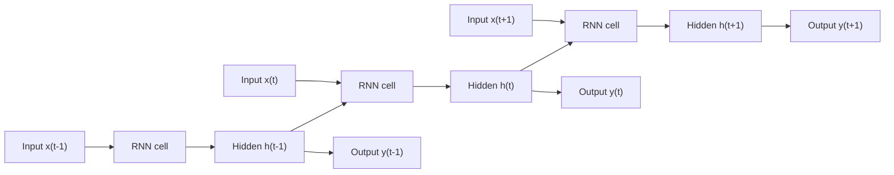
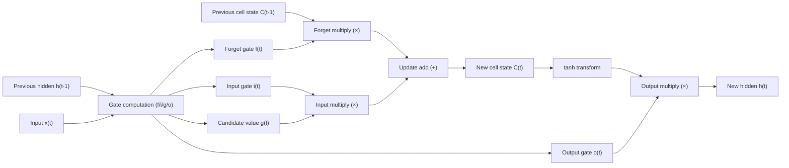

# Recurrent Neural Networks (RNN) and LSTM/GRU

## 1. Overview

### A. Definition

> A **Recurrent Neural Network (RNN)** is a neural network designed to process variable-length sequential data by placing a **Recurrent Connection** that passes the Hidden State to the next time step along the time axis. That is, it is a structure that makes the current output depend not only on the current input but also on **an accumulated summary (context) of past inputs**.

A fully connected neural network (FFNN) or a convolutional neural network (CNN) treats each input as an independent, fixed-size vector. However, for data where **the order itself defines the meaning**—such as language, speech, stock prices, and sensor logs—"what has come so far" determines the next value. To fill the blank in the sentence "I ate ___," the context of the preceding words is needed, and to judge an abnormality in an ECG waveform, the rhythm of the last few seconds is needed. The core insight of the RNN is that "**instead of viewing the sequence all at once, it reads one time step at a time, compressing and continually updating what it has seen so far into a memory called the hidden state**." This hidden state serves as the network's short-term (working) memory.

### B. Emergence and Necessity

When FFNN/CNN are applied to sequential data, two fundamental limitations emerge. The first is **the difficulty of handling variable length**. A sentence may be 3 words or 300 words, but a fully connected layer accepts only fixed-size input. Forcibly padding to the maximum length wastes computation, and truncating loses information. The second is **the absence of parameter sharing and order information**. If inputs are simply concatenated, the same word processed at a different position is handled with entirely different weights, failing to learn the essence of time series that "a pattern is the same wherever it appears."

The RNN solves these two problems at once by **reusing the same set of weights at every time step**. Since it repeatedly applies the same cell as many times as there are time steps, it can process a sequence of arbitrary length with one parameter set regardless of length, and it generalizes patterns over time independently of position. Thanks to these characteristics, the RNN family became the de facto standard for machine translation, speech recognition, and handwriting recognition in the early-to-mid 2010s, and formed the mainstream of sequential modeling until the emergence of today's Transformer. Even in the Transformer era, it still holds significant practical value in domains that must **maintain state sequentially**, such as on-device speech recognition, real-time streaming processing, and low-latency embedded inference.

| Category | FFNN/CNN | Recurrent Neural Network (RNN) |
|---|---|---|
| Input | Fixed size, independent | Variable-length sequence, dependency across time steps |
| Memory | None (stateless) | Maintains past context via hidden state |
| Parameters | Separate per layer | Shared across time steps (repeated when unrolled) |
| Representative task | Image classification, regression | Translation, speech recognition, time-series forecasting |
| Representative limitation | Cannot represent order | Long-term dependency, vanishing gradient |

## 2. Overall Structure and Operating Principle

The RNN is easy to understand when a single cell is "unfolded" along the time axis. The figure below shows both the recurrent structure in which the hidden state $h_t$ is computed from the previous time step's $h_{t-1}$ and the current input $x_t$ and passed to the next time step, and its unfolding along the time axis.

The reason $\tanh$ is used as the activation function instead of the sigmoid also stems from this structure. $\tanh$ has an output in $[-1, 1]$ that is symmetric about 0, which slows the saturation caused by the hidden-state values skewing to one side, and its gradient is larger than the sigmoid's, so the learning signal propagates relatively well. Even so, the repeated-multiplication structure itself induces vanishing, so it is not a fundamental solution.

The forward pass of a vanilla RNN is defined by the following recurrence. The hidden state is updated as $h_t = \tanh(W_{xh} x_t + W_{hh} h_{t-1} + b_h)$, and the output is produced as $y_t = W_{hy} h_t + b_y$. The key point here is that the weights $W_{xh}, W_{hh}, W_{hy}$ are **shared across all time steps**. The hidden state $h_t$ is a nonlinear summary of the inputs observed up to time step $t$, and as this summary flows recursively into the next cell, context accumulates.

Learning is done via **Backpropagation Through Time (BPTT)**. When the sequence is unrolled along the time axis, it becomes isomorphic to a very deep feedforward network, so the gradient of the loss is propagated backward through time from the last time step to the first, accumulating the gradient of the shared weights as the contribution of each time step. For long sequences, the unrolling depth becomes large, making computation and memory burdensome, so in practice **Truncated BPTT**, which cuts backpropagation off at fixed lengths, is used.

### A. The Vanishing/Exploding Gradient Problem

The fatal weakness of a basic RNN is **failure to learn Long-Term Dependencies**. In BPTT, each time the gradient goes back through the time axis, the recurrent weight $W_{hh}$ and the derivative of the activation function are repeatedly multiplied. If the spectral radius of this product is less than 1, the gradient converges exponentially to 0 (**Vanishing Gradient**), so information from the distant past is not reflected in learning; if it is greater than 1, it diverges exponentially (**Exploding Gradient**), making learning unstable.

The practical implication is clear. To fill the blank (French) in "He grew up in France … (dozens of words) … so he speaks fluent ___," one must remember information from dozens of time steps earlier, but a basic RNN effectively forgets the preceding context roughly beyond 10 time steps. Exploding gradients are relatively easily mitigated with Gradient Clipping, but vanishing gradients can only be solved by changing the structure itself, and this was the direct motivation for the emergence of LSTM and GRU.

### B. Sequence Input/Output Types

RNNs are used in various forms depending on the correspondence between input and output sequences. **Many-to-One** is used for sentiment analysis, which reads an entire sentence and outputs a single sentiment (positive/negative); **One-to-Many** for image captioning, which generates a descriptive sentence from a single image; and **synchronized Many-to-Many (same length)** for named-entity recognition, which attaches a part of speech to each word. In particular, the **Encoder-Decoder (Seq2Seq)** structure, which first reads the entire input to compress it into a context vector and then generates the output sequence, became the basis of machine translation, and with the addition of Attention here, it became the bridge that developed into the Transformer.

This categorization of types provides a framework for writing answers that first defines "**how many-to-how-many the problem's input/output is**" and then discusses the loss function and decoding method suited to it. For example, many-to-one classification connects only the last time step's hidden state to a classifier and trains with cross-entropy, whereas Seq2Seq generation trains by conditioning each time step's softmax output on the previous output (teacher forcing) and decodes at inference time via Beam Search. Understanding that the learning/inference pipeline differs by task type even for the same RNN cell is the starting point of practical design.

### C. Deep RNNs and Bidirectional RNNs

The **Stacked RNN**, which stacks hidden layers vertically to increase expressive power, forms hierarchical representations so that lower layers learn low-level (phoneme, character) features and upper layers learn high-level (word, syntax) abstractions. However, as layers deepen, learning difficulty and computation increase, so residual connections and layer normalization are used together. Meanwhile, the **Bidirectional RNN** places two RNNs, forward and backward, in parallel to utilize past and future context simultaneously at each time step. In offline tasks where the entire sentence is already given, such as named-entity recognition and part-of-speech tagging, it greatly improves accuracy, but there is a trade-off in that it structurally conflicts with real-time streaming processing because it requires future input.

## 3. LSTM and GRU — Gating Mechanisms

### A. LSTM (Long Short-Term Memory)

To solve the vanishing gradient, LSTM introduces **a separate information highway called the Cell State $C_t$** and **three gates** that selectively erase, add, and emit information on top of it. A gate is a valve that determines the pass-through ratio of each element using the sigmoid (0–1). The figure below shows the data flow inside one LSTM cell.

Looking at the operating principle in order: First, the **Forget Gate $f_t = \sigma(W_f[h_{t-1}, x_t] + b_f)$** decides what to discard from the previous cell state. For example, when the subject's gender in a sentence changes to a new subject, it forgets the previous gender information. Second, the **Input Gate $i_t$** combines with the **candidate value $\tilde{C}_t$** made by tanh to decide the information to newly remember, and the cell state is updated as $C_t = f_t \odot C_{t-1} + i_t \odot \tilde{C}_t$. Third, the **Output Gate $o_t$** selects the part of the updated cell state to emit at this time step, forming the hidden state as $h_t = o_t \odot \tanh(C_t)$.

LSTM has several variants, such as the peephole connection that lets the gate computation directly reference the cell state, and a coupled variant that combines the forget and input gates into one, but in practice the standard 3-gate structure has the best balance of stability and performance and is used as the default.

The decisive reason LSTM can learn long-term dependencies is that the cell-state update equation is **centered on addition ($+$) rather than multiplication**. When the gradient flows along the cell state, if the forget gate is close to 1, the gradient propagates with almost no attenuation, so the learning signal reaches information from hundreds of time steps earlier. This "Constant Error Carousel" structure fundamentally mitigates the vanishing gradient. In fact, Google reported that by applying an 8-layer LSTM encoder/decoder to GNMT (Google Neural Machine Translation) in 2016, it reduced translation errors by about 60% compared with the previous statistical (PBMT) approach.

### B. GRU (Gated Recurrent Unit)

GRU is a lightweight variant of LSTM proposed by Professor Kyunghyun Cho et al. in 2014; it **unifies the cell state and hidden state into one** and reduces the gates to two: the **Reset Gate $r_t$** and the **Update Gate $z_t$**. The update gate combines the roles of LSTM's forget + input gates into one, regulating "how much of the previous state to keep and how much to replace with the new candidate" at once via $h_t = (1-z_t)\odot h_{t-1} + z_t \odot \tilde{h}_t$. The reset gate decides how much of the past to ignore when computing the candidate state.

As an example, in a layer with a hidden dimension of 512, LSTM learns weights for 4 gates' worth while GRU learns only 3 gates' worth, so per-layer parameters are reduced roughly at a 4:3 ratio. This difference directly affects the memory/power budget when stacking many layers or deploying to mobile/embedded devices.

Having one fewer gate and no cell state, GRU has **about 25% fewer parameters, trains faster, and is more favorable against overfitting when data is scarce**. On the other hand, its expressive power is theoretically somewhat more limited than LSTM's, so LSTM tends to be marginally ahead on very long, complex dependencies. In practice, "**use LSTM if data and compute are ample, GRU if lightweight and fast training is needed**" is tried first, but since the performance difference between the two models can reverse depending on the task, the standard is to select by actually measuring on a validation set.

| Category | Vanilla RNN | LSTM | GRU |
|---|---|---|---|
| Number of gates | None | 3 (forget, input, output) | 2 (reset, update) |
| State | Hidden $h_t$ | Cell $C_t$ + hidden $h_t$ | Unified hidden $h_t$ |
| Long-term dependency | Weak (vanishing) | Strong | Strong |
| Parameters/computation | Minimum | Maximum | Medium (fewer than LSTM) |
| Suitable situation | Short sequences | Long, complex dependencies | Data/resource constraints, fast training |

## 4. Comparison and Application Cases

The practical position of the RNN family becomes clear in contrast with the Transformer. The Transformer compares all token pairs within a sequence at once in parallel via Self-Attention, so it overwhelms the RNN in training parallelism on GPUs and in capturing very-long-term dependencies. For this reason, large language models (LLMs), machine translation, and document understanding have effectively been reorganized around the Transformer. However, the Transformer's attention requires $O(n^2)$ computation and memory with respect to sequence length $n$, whereas the RNN, with an $O(1)$ state update per time step, is **linear in length ($O(n)$)** and has a constant-size state, giving it a structural advantage in streaming, low-latency, and low-power environments.

Gauging the complexity difference in numbers makes the selection criterion clear. For a sequence length $n=4{,}000$ (e.g., a long log), attention requires roughly $n^2 = 16$ million pairwise comparisons, but the RNN suffices with $n=4{,}000$ sequential state updates. Conversely, the RNN's sequential nature makes GPU parallelization difficult due to inter-time-step dependency, paying the price of slow training. In other words, there is an opposing set of advantages—"the RNN is favorable in total computation, the Transformer is favorable in parallel-processing speed"—so a hybrid design that separates batch training (Transformer) from real-time sequential inference (RNN) becomes a realistic compromise.

Looking at concrete industrial application cases makes the implications clear. First, in **real-time speech recognition**, decoding must be done immediately frame-by-frame before the utterance ends, so LSTM/GRU that maintain state and process sequentially are still used for on-device streaming STT, more so than attention, which must gather the entire sequence. Second, in **predictive maintenance of industrial equipment**, the time series of vibration and temperature sensors is learned with LSTM to detect early deviations (anomalies) from normal patterns, where the gating structure is effective because it must remember periodic rhythms over thousands of time steps. Third, in **financial time-series forecasting**, the flow of stock prices and trading volume over the past several months is summarized with GRU to predict short-term direction, and with fewer parameters it reduces overfitting even on relatively small datasets. Recently, **state-space model (SSM) families (e.g., Mamba)** that inherit this linear-complexity advantage while also enabling parallel training are drawing attention as alternatives to the Transformer, creating a trend of "the resurgence of recurrent structures."

## 5. Deep Dive — Recent Trends and Likely Exam Directions

The latest trends surrounding RNNs can be summarized in three strands. First, **the absorption of attention**. Seq2Seq+Attention (Bahdanau, 2014) resolved the fixed-context-vector bottleneck of the encoder and boosted translation performance, and the result of this attention completely replacing the recurrent structure is the Transformer (2017). That is, the RNN remains important as the starting point of the narrative for understanding "why attention was needed," and in a professional-engineer answer, connecting the developmental context of "RNN's limitations → attention → Transformer" can demonstrate depth.

Second, **the resurgence of efficient long-sequence models**. As the Transformer's $O(n^2)$ cost became a bottleneck for very long documents and very long time series, selective state-space models such as S4 and Mamba and "linear-attention-style recurrent" architectures such as RWKV and xLSTM are being reilluminated, combining the RNN's linear-complexity and constant-memory advantages with the possibility of parallel training. Third, **edge/embedded deployment**. In the TinyML trend, LSTM/GRU are, after quantization and pruning, embedded in always-on voice wake-word detection on MCU-class devices and heart-rate anomaly detection in wearables.

On the applied-technique side, **CTC (Connectionist Temporal Classification)** loss is widely used together with RNNs for speech recognition and handwriting recognition, where the alignment of input and output is unclear. CTC uses a blank token and a repeat-merging rule to learn frame-label alignment without explicit annotation, elegantly solving the problem of differing utterance and transcription lengths. Pointing out in an answer that the RNN delivers practical performance when combined with task-specific loss/decoding techniques, rather than on its own, can demonstrate application skill.

As likely exam directions, the following are often addressed: ① explain the cause of the vanishing gradient together with BPTT equations and discuss the principle by which the LSTM cell state mitigates it (additive update, CEC); ② compare the gating structures of LSTM and GRU and present selection criteria from a practical perspective; ③ compare the computational complexity, parallelism, and application domains of RNNs and Transformers. In an answer, a high-scoring strategy is to always describe quantitatively, accompanied by **equations, gate diagrams, and complexity comparisons**.

## 6. Considerations and Implications

- **Architecture selection strategy**: Judge based on the task's sequence length, latency requirements, and data scale. If very-long-term dependency, large-scale data, and parallel training are the key concerns, consider the Transformer; for real-time streaming, low latency, and low power, LSTM/GRU; and if resources and data are severely constrained, prioritize lightweight GRU. The principle is to decide by actual measurement on a validation set rather than assuming a definitive superiority.
- **Learning-stabilization trade-offs**: Suppress exploding gradients with gradient clipping, and mitigate vanishing with gating structures, residual connections, and appropriate initialization. Bidirectional RNNs increase contextual accuracy but require the entire sequence, so they conflict with real-time processing, and must be chosen to match online/offline requirements.
- **Lightweighting and deployment outlook**: For edge inference, compress the model with quantization (INT8), pruning, and knowledge distillation, but verify the impact that reduced precision of the gate's sigmoid computation has on long-term-memory performance. With the spread of TinyML and on-device AI, the low-power advantage of recurrent models is being reassessed.
- **Related technologies and governance**: The RNN family is used in combination with attention, Transformers, state-space models (Mamba), and CNNs (hybrid CRNN), and when time-series forecasting results are used for decision-making, explainability (XAI) and data-quality/drift monitoring must be in place to make it a trustworthy service. In particular, in domains where forecasting failure directly affects safety or finance, uncertainty quantification and human-in-the-loop verification must be pursued in parallel.
- **Data/preprocessing perspective**: The performance of sequential models is sensitive to preprocessing quality such as sequence-length distribution, normalization, and missing-value handling. Overly long sequences vary in training stability depending on the window size of truncated BPTT and the padding strategy, and if the scale deviation between time steps is large, certain gates saturate early. Therefore, standardizing normalization, resampling, and masking in the data pipeline is a prerequisite for reproducibility and performance stability.

## References

- Hochreiter & Schmidhuber, "Long Short-Term Memory", Neural Computation, 1997. https://www.bioinf.jku.at/publications/older/2604.pdf
- Cho et al., "Learning Phrase Representations using RNN Encoder-Decoder (GRU)", 2014. https://arxiv.org/abs/1406.1078
- Vaswani et al., "Attention Is All You Need", 2017. https://arxiv.org/abs/1706.03762
- Gu & Dao, "Mamba: Linear-Time Sequence Modeling with Selective State Spaces", 2023. https://arxiv.org/abs/2312.00752

---

> **In one line**: An RNN is a neural network that recurrently passes past context through a hidden state to process variable-length sequences; LSTM/GRU, which overcame the vanishing-gradient limitation with gates (additive update of the cell state), enable learning of long-term dependencies, and amid the complexity/latency trade-offs with Transformers and state-space models, they remain valid in streaming and edge domains.
