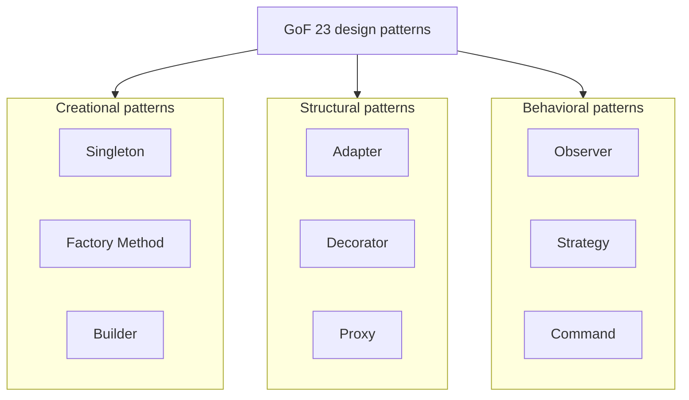
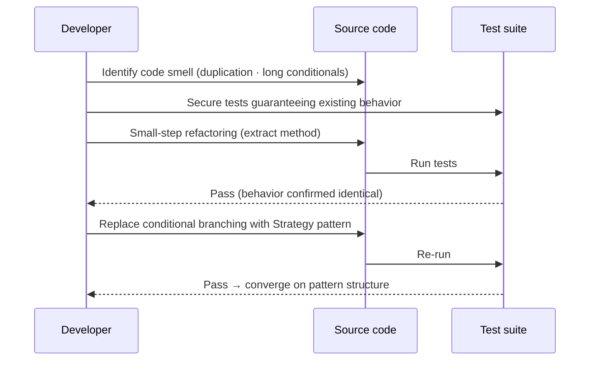

# Refactoring and Design Patterns

## 1. Overview

### A. Definition
> **Refactoring** is the activity of **improving the internal structure of software while preserving its external behavior (functionality)** so that it becomes easier to understand and modify, and a **Design Pattern** is a **proven, reusable solution structure (design template)** for a frequently recurring design problem.

The key to understanding the relationship between the two techniques is that '**refactoring is the process, and design patterns are the target**'. When code becomes messy over time and hard to understand and modify (i.e., when code smells accumulate), refactoring cleans up its internals, and design patterns provide the direction for "what structure to improve toward". Martin Fowler, in his book *Refactoring* (1999; 2nd edition 2018), defined refactoring as "changing the internal structure of software to make it easier to understand and cheaper to modify without changing its observable behavior"; the constraint "without changing behavior" is the decisive criterion separating refactoring from ordinary code modification (adding features, fixing bugs).

As one refactors, code naturally converges toward proven pattern structures, and conversely, the act of applying a pattern is itself refactoring. Indeed, the latter part of Fowler's book includes the perspective of "Refactoring Toward Patterns", and Joshua Kerievsky's *Refactoring to Patterns* (2004) is the representative work that systematized this approach. What they have in common is that both raise software quality (maintainability, flexibility, reusability); the difference is that refactoring is an '**action (improvement activity)**' whereas a design pattern is an '**artifact (solution structure)**'.

### B. Background and Need
Software is constantly modified due to changing requirements. As Lehman's laws of software evolution point out, software in use is continually under pressure to change, and if left unattended its structure decays (software entropy increases), causing maintenance costs to grow exponentially. Every time a new feature is added, tangled dependencies break unexpected places, and eventually the code becomes "code you're afraid to touch (legacy)".

Refactoring and design patterns are the two axes for preventing this decay. Refactoring is a preventive, continuous activity that gradually tidies decayed code to keep the cost of change low, and design patterns are a vocabulary for designing structures that are resilient to change from the outset or for providing the destination of refactoring. Especially in Agile/DevOps environments where releases repeat in short cycles, refactoring—which keeps code health up at all times—has become an essential practice in combination with Continuous Integration (CI).

## 2. Principles and Procedure of Refactoring

### A. Prerequisite for Safe Refactoring — Tests
Since the overarching premise of refactoring is not changing functionality, the crux is how to guarantee that "functionality remains the same". This guarantee mechanism is **automated testing**. Without tests, there is no way to verify that behavior is identical after changing the structure, so refactoring becomes potential bug injection. Hence Fowler emphasizes "have solid tests before refactoring", and this principle is embedded directly in the Red-Green-**Refactor** cycle of TDD (Test-Driven Development).

The procedure is to repeat '**modify code in small units → verify with tests that functionality is unchanged**'. Making large changes at once makes it hard to trace the cause of failures and increases risk, so changes are broken into **atomic steps**, such as a single method extraction or a single rename, running tests at each step. If something fails, one can immediately revert to the previous step, ensuring safety. In this respect, refactoring is most effective when combined with version control (configuration management).

### B. Signals That Trigger Refactoring — Code Smells
The symptoms that indicate when refactoring is needed are **code smells**. These are code that "smells like it needs fixing": not bugs per se, but structural problems that make maintenance difficult. Representative examples include **Duplicated Code**, **Long Method**, **Large Class**, **Long Parameter List**, **Shotgun Surgery (having to change many places together to fix one thing)**, and **Feature Envy (excessively referencing another class's data)**.

Recognizing a smell does not mean fixing everything immediately. The practical rule offered by Fowler is the "**Rule of Three**": tolerate duplication up to twice, but clean it up when it appears a third time—a restrained approach. This is pragmatism that guards against excessive upfront abstraction, meaning refactoring should be focused on parts that actually change frequently, rather than touching code unconditionally just because a smell exists.

### C. Major Refactoring Techniques
The most frequent technique is **Extract Method/Function**, which pulls a long method or duplicated logic out into a separate method with a meaningful name. For example, if duplicated tax calculation logic across several screens (a code smell) is consolidated into a single `calculateTax()`, only one place needs changing when the tax rate changes. Other techniques include **Rename** to reveal intent, **Extract Class** to split a bloated class into units of responsibility, and **conditional simplification (Decompose Conditional, Replace Conditional with Polymorphism)** to replace complex branching with polymorphism.

The table below summarizes representative techniques, but what matters in practice is the judgment of "which technique to match to which smell". The table is for reference; in reality, the key is internalizing the flow of smell → technique → test verification.

| Item | Description |
|---|---|
| **Purpose** | Preserve external behavior, improve internal structure (readability · maintainability · flexibility) |
| **Procedure** | Secure tests → small (atomic) improvement → test verification → repeat |
| **Key techniques** | Extract method, rename, extract class, simplify conditionals, remove temporary variables |
| **Code smells** | Duplicated code, long method, large class, long parameter list, shotgun surgery/feature envy |
| **Prerequisite tools** | Automated tests, configuration management (VCS), IDE automated refactoring features |

## 3. Classification and Principles of Design Patterns (GoF)

The representative design patterns are the 23 compiled by the GoF (Gang of Four; Gamma, Helm, Johnson, Vlissides) in their 1994 book *Design Patterns*, divided by purpose into creational, structural, and behavioral patterns. This classification is based on "what the pattern deals with", and each category addresses a different design concern.

**Creational patterns** encapsulate how objects are created and composed, so that changes in creation logic do not ripple into the code that uses them. For example, **Singleton** guarantees only one instance (configuration manager, logging, etc.), and **Factory Method** delegates the choice of which concrete class to create to subclasses, removing direct dependency on `new`. In practice, a system where payment methods (card, easy pay, bank transfer) are frequently added isolates the creation part with a factory, minimizing modification of existing code when a new method is added.

**Structural patterns** compose classes and objects into larger structures while securing flexibility. **Adapter** bridges incompatible interfaces to allow reuse of legacy or external libraries, and **Decorator** dynamically adds functionality by wrapping objects instead of using inheritance. The Java standard library's `BufferedReader(new FileReader(...))` is the classic decorator.

**Behavioral patterns** deal with the distribution of responsibilities and interaction (algorithms, communication) among objects. **Observer** notifies subscribers of state changes (events, updates in MVC) to reduce coupling, and **Strategy** encapsulates interchangeable algorithms, replacing conditional branching with polymorphism. In particular, the Strategy pattern is the destination of the "replace conditional with polymorphism" refactoring mentioned earlier, clearly showing the point where refactoring and patterns meet.

| Type | Purpose | Representative examples |
|---|---|---|
| **Creational patterns** | Encapsulate object creation · composition | Singleton, Factory Method, Abstract Factory, Builder, Prototype |
| **Structural patterns** | Build structures by composing objects · classes | Adapter, Decorator, Proxy, Composite, Facade |
| **Behavioral patterns** | Responsibilities · interaction · algorithms among objects | Observer, Strategy, Command, State, Template Method |

## 4. Relationship Between Refactoring and Design Patterns — Comparison and Case

The two concepts are not opposed but complementary. The diagram below shows the flow that starts from a code smell, goes through refactoring, and converges on a pattern structure.

The key differences are '**nature**' and '**timing**'. Refactoring is an after-the-fact, continuous improvement **activity** targeting existing code, while a design pattern is a static **solution structure** for a design problem. The practical implications are as follows. Planting patterns in advance by over-predicting the future at the initial design stage (speculative generality) usually leads to over-engineering, so it is safer to start simple and, when change actually occurs and smells surface, introduce the needed pattern through refactoring at that time. In other words, patterns are closer to "something you arrive at through refactoring" than "something you put in upfront".

**Concrete case:** Suppose an order system calculates shipping fees with a long conditional like `if (region == "remote-island") ... else if (weight > 20) ...`, and as promotion and overseas shipping rules keep growing, the conditional exceeds 40 lines (long method + repeated conditional smell). The developer first secures tests that verify the calculation results, then separates each rule into an implementation of a `ShippingPolicy` interface (Strategy pattern). As a result, adding a new shipping rule requires only adding a class without touching the existing conditional, satisfying the OCP (Open-Closed Principle). This entire process is refactoring, and its destination is the Strategy pattern.

| Category | Refactoring | Design Pattern |
|---|---|---|
| **Nature** | Action (improvement activity, verb) | Artifact (solution structure, noun) |
| **Target** | Internal structure of existing code | Recurring design problems |
| **Timing** | After-the-fact · continuous | Constantly referenced as design vocabulary |
| **Common ground** | Improve quality such as maintainability · flexibility · reusability | (Same) |
| **Relationship** | Improves with patterns as the destination | Reached · implemented through refactoring |

## 5. Advanced — Latest Trends and Practical Application

Although refactoring and patterns are mature as concepts, the way they are practiced is evolving with changes in tools and development environments. First, **IDE automated refactoring** has become standard: IntelliJ IDEA, Eclipse, Visual Studio, and others perform rename, extract method, and change signature safely (with automatic reference updates). The risk of mistakes in manual refactoring has greatly decreased, and refactoring has become not a special event but a micro-activity performed continuously during coding.

Second, **integration with static analysis and quality gates**. Tools such as SonarQube automatically measure code smells, duplication, and complexity (Cyclomatic Complexity), and are integrated as quality gates in the CI pipeline to block merges when criteria are not met. As a result, the judgment of "when to refactor" is now based on data (smell metrics).

Third, the emergence of **generative AI coding assistants (AI code review · refactoring suggestions)**. Recent code assistants suggest refactoring candidates and pattern applications at the function level; however, since AI suggestions cannot automatically guarantee "external behavior invariance", regression tests remain essential as a safety net. In other words, AI speeds up refactoring but does not replace the principle of "test-based verification" itself.

Fourth, the concept is expanding to **architecture-level refactoring**. The **Strangler Fig** pattern, used when incrementally decomposing a monolith into microservices, is a representative strategy for safely performing large-scale refactoring: rather than replacing the existing system all at once, the new structure gradually wraps around and replaces the old one feature by feature. This extends the refactoring principle of "small steps with repeated verification" to the system scale.

## 6. Considerations and Implications (Professional Engineer's Perspective)

1. **Refactoring without tests is risky (quality safety net first).** Automated tests must be a prerequisite to guarantee functional invariance, and safe continuous improvement is possible when combined with TDD's Red-Green-Refactor. For code without tests, such as legacy code, the standard approach is to pin down current behavior with Michael Feathers' Characterization Tests before starting refactoring.

2. **Pattern abuse is over-engineering (principle of restraint).** Forcing patterns where there is no problem only adds indirection layers, actually increasing complexity. Following the "Rule of Three", introduce only the necessary patterns with restraint when smells actually recur, and guard against speculative generality (YAGNI violations).

3. **Culture of continuous improvement and process internalization.** Establish refactoring not as a big task requiring separate approval but as an everyday development habit (Boy Scout Rule: "leave it cleaner than you found it"), and integrate static analysis and quality gates into CI to manage Technical Debt at all times.

4. **Prioritization from a cost/risk perspective (trade-offs).** Since not every smell can be fixed, focus refactoring on hotspots with high change frequency and high defect risk, and perform large-scale structural improvements incrementally and reversibly, like the Strangler pattern, to control release risk.

5. **Linkage with governance and metrics.** Manage the effects of refactoring (reduced complexity, defect rate, lead-time improvement) with metrics to justify it to management, and incorporate technical debt repayment into the regular backlog to make it sustainable.

## References
- Martin Fowler, "Refactoring", https://refactoring.com/
- Refactoring Guru — Design Patterns & Refactoring, https://refactoring.guru/
- Martin Fowler, "StranglerFigApplication", https://martinfowler.com/bliki/StranglerFigApplication.html

---

> **In one line**: Refactoring is *a continuous activity of improving internal structure while preserving functionality*, and design patterns are *proven design solution structures*; quality should be raised by cleaning up code smells through test-based, small-step refactoring with patterns as the destination, while guarding against pattern abuse (over-engineering) through the principle of restraint.
