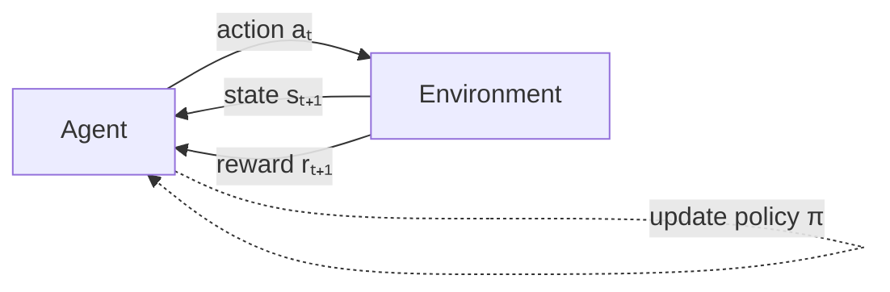
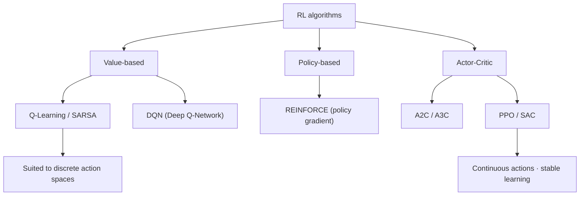

# Reinforcement Learning

## 1. Overview

> **Reinforcement Learning (RL)** is a machine learning paradigm in which an Agent interacts with an Environment and, through Trial and Error, learns on its own the Optimal Policy that maximizes Cumulative Reward.

Whereas Supervised Learning requires "correct labels" and Unsupervised Learning stops at finding "structures and patterns", many real-world problems are Sequential Decision Making problems in which **the correct answer at each moment is unknown, but the goodness or badness of the final outcome (reward) can be judged**. In Go there is no correct answer for each individual move, but the win or loss is clear; in autonomous driving there is no correct steering angle at each moment, but whether an accident occurs can be evaluated. Reinforcement learning emerged precisely to handle such problems, i.e., problems where "the current choice affects future outcomes".

The need for reinforcement learning stems from three main backgrounds. First, **avoiding labeling costs**. Supervised learning demands vast amounts of labeled data, whereas reinforcement learning can learn solely from reward signals returned by the environment, reducing the data-building burden. Second, **coping with dynamic, sequential environments**. In problems such as robot control, games, recommendation, and trading, where state changes over time and earlier actions alter later situations, long-term strategy rather than one-shot prediction is required. Third, **the possibility of superhuman performance**. Unlike supervised learning, which is capped by the ceiling of human experience, RL can explore solutions surpassing humans through Self-play and similar methods (AlphaGo, AlphaZero). Recently it has extended even to aligning large language models (LLMs) with human preferences (RLHF), rapidly increasing its practical importance.

## 2. Components and Interaction Structure of Reinforcement Learning

Reinforcement learning is formalized as an **agent-environment interaction loop**. The agent observes the current State and selects an Action, and the environment returns the next state and a Reward for that action. As this cycle repeats, the agent accumulates knowledge of "which action in which state is beneficial in the long run".

The key concepts are explained in prose as follows. **State** is a summary of the environment's situation needed for decision-making, and RL assumes the **Markov Property**, i.e., that the future depends only on the current state rather than the entire past. **Action** is a choice available to the agent, and **Reward** is a scalar signal indicating the immediate goodness or badness of an action. What matters here is maximizing not the immediate reward but the **Return (Gₜ = Σ γᵏ rₜ₊ₖ)**, the discounted sum of future rewards, and the **discount factor (γ, 0≤γ≤1)** controls how much weight future rewards carry in present value.

The agent's brain is the **Policy (π)**, a function mapping states to actions. The measure of how good a policy is is the **Value Function**, divided into the state value V(s), representing a state's long-term value, and the action value Q(s,a), representing the value of a state-action pair. These are linked by the **Bellman Equation**, the recursive relationship "current value = immediate reward + discounted value of the next state", which is the mathematical foundation for most RL algorithms. Depending on whether the environment's dynamics are modeled, methods are divided into **Model-based**, which learns and uses a model, and **Model-free**, which learns from experience alone.

| Component | Symbol | Meaning | Example (autonomous driving) |
|---|---|---|---|
| State | s | Summary of environment situation | Lanes · surrounding vehicles · speed |
| Action | a | Available operations | Accelerate · brake · steer |
| Reward | r | Immediate evaluation signal | Lane keeping +1, collision −100 |
| Policy | π(a\|s) | State → action mapping | Driving strategy |
| Value function | V(s), Q(s,a) | Long-term expected return | Situation-specific safety assessment |
| Discount factor | γ | Importance of future rewards | 0.99 |

## 3. Classification of Learning Methods and Representative Algorithms

RL algorithms are divided, according to what they learn, into **Value-based**, **Policy-based**, and **Actor-Critic**, which combines the two. Understanding this classification is understanding the map of reinforcement learning.

**Value-based methods** first learn the optimal value function Q(s,a) and then indirectly derive a policy by selecting the action with maximum value in each state. Representatively, **Q-learning** is an **Off-policy** technique that updates assuming the optimal action regardless of the action actually taken, while **SARSA** is an **On-policy** technique that updates with the next action actually taken. Approximating the Q-function with a deep neural network yields DeepMind's 2015 **DQN**, which mitigated learning instability with Experience Replay and a Target Network and achieved human-level performance on Atari games, opening the era of Deep RL. However, value-based methods are effective when the action space is discrete and are difficult to apply to continuous actions (e.g., robot joint torques).

**Policy-based methods** parameterize the policy π directly, bypassing the value function, and perform Gradient Ascent in the direction that increases expected return. They naturally handle continuous action spaces and stochastic policies, but suffer from unstable learning due to high variance in gradient estimates. **Actor-Critic** combines the strengths of both, jointly learning an actor (policy) that decides actions and a critic (value function) that evaluates them, thereby reducing variance. **PPO (Proximal Policy Optimization)**, the most widely used in practice today, limits (clips) the size of policy updates to balance stability and performance, and was adopted in ChatGPT's RLHF.

| Category | Value-based | Policy-based | Actor-Critic |
|---|---|---|---|
| Learning target | Value function Q | Policy π | Policy + value |
| Action space | Discrete | Discrete · continuous | Discrete · continuous |
| Stability | Moderate | Low (high variance) | High |
| Representative | Q-Learning, DQN | REINFORCE | A2C, PPO, SAC |

## 4. The Exploration-Exploitation Dilemma, and Comparison with Supervised Learning

The fundamental challenge running through reinforcement learning is the **Exploration-Exploitation Dilemma**. The agent must balance the desire to **exploit** known good actions to obtain immediate reward against the need to **explore** whether better actions exist. Too little exploration leads to a Local Optimum, while too much makes learning inefficient. To regulate this, **ε-greedy**, which takes a random action with probability ε; **UCB**, which favors actions with high uncertainty; and **Boltzmann exploration**, based on stochastic sampling, are used. For example, in online ad recommendation, setting ε=0.1 shows proven high-click-rate ads 90% of the time and new ads 10% of the time, improving long-term revenue.

The reason reinforcement learning is fundamentally different from other learning paradigms lies in **the nature of feedback**. Supervised learning receives an immediate, direct correct answer for every sample, but RL rewards are **Delayed**, **Evaluative**, and **Correlated** sequentially. In particular, the **Credit Assignment Problem**—determining "which past action contributed to the current reward"—is the core difficulty, and the Bellman equation and discount factor are the mechanisms for handling it.

| Axis of comparison | Supervised learning | Unsupervised learning | Reinforcement learning |
|---|---|---|---|
| Learning signal | Correct labels | None (structure discovery) | Reward (delayed · evaluative) |
| Goal | Minimize prediction error | Patterns · clustering | Maximize cumulative reward |
| Data | Fixed dataset | Fixed dataset | Generated through interaction |
| Representative problems | Classification · regression | Clustering | Sequential decision making |

Because of these differences, reinforcement learning has the practical weakness of high **Sample Inefficiency**. Millions to hundreds of millions of interactions may be needed to obtain a good policy, so in environments where trial-and-error is costly, such as real robots, **Sim-to-Real** techniques—training in a simulator and transferring to reality—are combined with approaches that reduce the Reality Gap through Domain Randomization.

## 5. Advanced: Latest Trends and Practical Application Cases

**RLHF and LLM alignment**: The most impactful recent application of RL is **RLHF (Reinforcement Learning from Human Feedback)**. A Reward Model is trained on human preference comparison data, and it is used as the reward signal to fine-tune the LLM with PPO, improving helpfulness and safety. However, because building the reward model and PPO training are complex, active research is under way on simplified alternatives such as **DPO (Direct Preference Optimization)**, **RLAIF** using rule-based rewards, and reinforcement learning that boosts reasoning ability with verifiable rewards (based on grading correct answers in math and coding).

**Industrial application cases**: Google DeepMind reported reducing cooling energy by about 40% by controlling data center cooling with reinforcement learning; in logistics and manufacturing it is applied to inventory replenishment and process scheduling optimization, and in finance to portfolio rebalancing and order execution. In autonomous driving and robot manipulation it is used for grasping and locomotion control, and in semiconductor/chip design, cases of floorplanning optimization have been published. Recommendation systems are evolving toward learning sustainable user value by using long-term dwell time and return visits as rewards, rather than immediate metrics like clicks.

**Issues of responsible use**: Because RL is designed to "maximize reward", poorly designed rewards lead to **Reward Hacking**, where unintended shortcuts are learned. Typical side effects include maximizing only the score in a game while ignoring the goal, or increasing dwell time with sensational content in recommendations. Therefore, reward function design is a core engineering and ethical challenge that determines RL's success or failure, and **Safe RL**, which explicitly specifies constraints, is emerging.

## 6. Considerations and Implications

From a professional engineer's perspective, adopting and using reinforcement learning requires comprehensive consideration of the following.

- **Judging problem fit must come first.** RL is strong in environments with sequential decision-making, delayed rewards, and possible interaction, but supervised learning is more efficient for one-shot prediction or problems rich in labeled data. Beware the "RL is a panacea" approach, and first examine whether the problem's structure is naturally expressed as a Markov Decision Process (MDP).

- **Reward design and securing a simulator determine success or failure.** The reward function must accurately reflect the organization's real objectives (long-term value, safety, regulatory compliance), and designing constraints and penalties to prevent reward hacking is essential. Also, for domains with high real-world trial-and-error costs, a high-quality simulator, a Sim-to-Real strategy, and the adoption of offline RL (using log data) should be planned together.

- **The trade-off between sample efficiency and operating cost must be managed.** Deep RL requires large-scale compute and data, so it must be linked with an MLOps framework for GPU infrastructure, training pipelines, and reproducibility. The choice between model-free (general-purpose, high cost) and model-based (sample-efficient, risk of model error) should be made according to domain characteristics.

- **Safety, explainability, and governance must be internalized.** Failure modes of learned policies (distribution shift, safety violations) should be verified in advance, and Safe RL, Human-in-the-loop, and rollback mechanisms should be in place. In particular, high-risk domains such as autonomous driving, healthcare, and finance must design governance to align with AI trustworthiness and regulatory requirements (AI Basic Act, responsible AI).

- **Outlook**: Through RLHF, reinforcement learning has established itself as a core technology for aligning and strengthening reasoning in generative AI, and its scope is expanding through offline RL, model-based RL, and Multi-Agent Reinforcement Learning (MARL). In the era of autonomous agents (Agentic AI), its strategic importance as the foundation of "autonomous decision-making toward long-term goals" will grow even further.

## References
- Sutton & Barto, *Reinforcement Learning: An Introduction*, 2nd ed. — http://incompleteideas.net/book/the-book-2nd.html
- OpenAI, *Spinning Up in Deep RL* — https://spinningup.openai.com/

---

> **In one line**: Reinforcement learning is a paradigm in which an agent learns, through trial and error with the environment, the optimal policy that maximizes the accumulation of delayed, evaluative rewards; it revolves around the value, policy, and actor-critic families and the exploration-exploitation balance, and is emerging through RLHF as a core technology for generative AI alignment.
