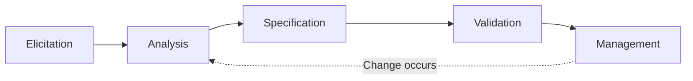

# Software Requirements Engineering

## 1. Overview

### A. Definition
> A software engineering activity that, through a systematic process of **eliciting, analyzing, specifying, validating, and managing** stakeholder needs, **defines the requirements the target system must meet accurately, completely, and consistently, and controls them through change**.

### B. Background and Need
The biggest cause of software project failure is not coding mistakes but "**building the wrong thing right**", i.e., requirement errors. The later a requirement defect is found, the more its correction cost grows exponentially. The **1:10:100 rule** expresses this: a defect that costs 1 to fix at the requirements stage costs 10 at design and 100 in operation. Moreover, ambiguous requirements cause the scope to keep changing during development (**scope creep**), causing rework to explode. To prevent such losses, requirements engineering treats requirements not as ad-hoc conversations but through an **engineering process**, securing agreement and traceability among stakeholders.

## 2. Requirements Engineering Process

Requirements engineering consists of five stages from elicitation to management that are sequential yet **iterative**, returning to analysis when changes occur. Each stage refines the output of the previous one, ultimately converging on a trustworthy requirements specification.

- **Elicitation**: Identifies stakeholders and draws out their needs and expectations. Since users often do not clearly know what they want themselves, the key is to uncover latent needs through observation and prototyping, not just interviews and workshops.
- **Analysis**: **Resolves conflicts, duplication, and ambiguity** in the collected requirements and weighs feasibility and priority. Requirements are modeled with use cases, DFD, and UML and prioritized with MoSCoW.
- **Specification**: Documents the agreed requirements as an **SRS (Software Requirements Specification)**. Use case specifications and formal specifications are used in parallel to reduce the ambiguity of natural language.
- **Validation**: Confirms through reviews, inspections, and prototypes that the specification accurately, completely, and consistently captures the stakeholders' actual needs.
- **Management**: Fixes confirmed requirements as a **baseline** and controls subsequent changes through configuration management, RTM, and the Change Control Board (CCB).

| Stage | Activity | Representative techniques |
|---|---|---|
| Elicitation | Identify stakeholders · collect requirements | Interviews, workshops, observation, prototyping |
| Analysis | Resolve conflicts · duplication, prioritize | Use cases, DFD/UML, MoSCoW |
| Specification | Document SRS | Natural-language · formal specification, use case specification |
| Validation | Confirm accuracy · completeness · consistency | Reviews · inspections, prototypes |
| Management | Manage changes · history · traceability | Configuration management, RTM, CCB |

## 3. Types of Requirements

Requirements are divided into types because each type differs in verification method and design impact. Non-functional requirements in particular are easy to miss yet fundamentally shape the architecture. For example, a performance requirement such as "10,000 concurrent users, response within 2 seconds" changes the initial architecture choice.

| Category | Description | Example |
|---|---|---|
| Functional requirements | Functions · services the system performs | Login, order processing |
| Non-functional requirements | Quality attributes such as performance · security · availability | 2-second response, 99.9% availability |
| Constraints | Legal · standard · platform · budget constraints | Compliance with the Personal Information Protection Act |

## 4. Software Requirements Specification (SRS) and Quality Characteristics

An SRS consists of purpose and scope, functional/non-functional requirements, interfaces, and constraints, and must satisfy quality characteristics that answer "**what is a good requirement**". These characteristics matter because violating even one leads to differences in interpretation and rework during development. For example, the requirement "the screen must be fast" cannot be verified, so it should be written verifiably, as in "**the main screen loads within 2 seconds**".

| Characteristic | Meaning |
|---|---|
| Completeness | Includes all necessary requirements without omission |
| Consistency | No conflicts among requirements |
| Unambiguity | Not ambiguous; admits a single interpretation |
| Verifiability | Can be confirmed by testing (quantitative criteria) |
| Traceability | Links higher-level requirements ~ design ~ tests |

## 5. Considerations and Implications
- **Securing traceability**: Linking requirements, design, code, and tests with an RTM enables immediate **impact analysis** when requirements change and ensures tests without omissions. This is the core tool of quality assurance.
- **Requirements management in Agile**: Agile does not finalize the SRS all at once but refines it incrementally in each iterative sprint through **User Stories and the Product Backlog**. Requirement volatility is accepted as natural rather than as a defect, but it is controlled through backlog prioritization.
- **Foundation for success**: Ultimately, active stakeholder participation and agreement (sign-off) and **requirements baseline management** are the foundation of project success.

---

> **In one line**: Requirements engineering is an activity that systematizes stakeholder needs in an engineering manner through the *elicitation → analysis → specification → validation → management* process, and prevents requirement defects and project failure (1:10:100) with a complete, consistent, unambiguous, verifiable, and traceable SRS together with baselines and an RTM.
