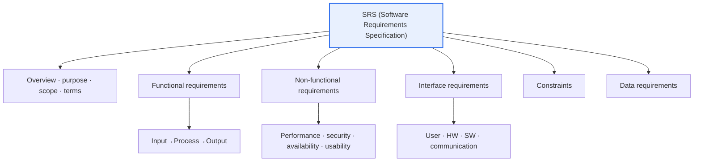
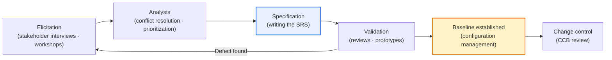

# Items Described in a Software Requirements Specification (SRS)

## 1. Overview

### A. Definition
> A **Software Requirements Specification (SRS)** is a deliverable that **documents what the system must do (functional) and what constraints and quality it must satisfy (non-functional) in a clear, complete, and verifiable form**. It is the basis for agreement among stakeholders such as the client, developers, and testers, and the baseline for design, implementation, and verification; the representative standards are IEEE Std 830-1998 and ISO/IEC/IEEE 29148 (2011, revised 2018), which replaced it.

The fundamental reason the SRS is treated as important in software engineering is the long-standing empirical observation that '**unclear, incomplete, and frequently changing requirements are among the biggest causes of project failure**'. If what the system must do is not clearly fixed in a document, the client, planners, developers, and testers interpret the same sentence differently, and this interpretation gap snowballs as development progresses until it bursts into large-scale rework during integration and acceptance testing. The SRS is precisely the device that seals this interpretation gap early.

In particular, the power of the SRS lies in **turning ambiguous natural language into measurable statements**. Sentences like "the screen must be fast" or "it must be easy to use" conjure a different picture for each person, but quantified as "query response time within 2 seconds at the 95th percentile under normal load", no one can interpret it differently, and whether it is met can be judged by testing after completion. In other words, the SRS is not merely a document but has the character of a **verifiable contract** on which subsequent design, development, acceptance, and settlement stand.

### B. Background and Need
Behind the SRS becoming an established formal deliverable is the economics of defects: 'the later a defect is discovered, the more its correction cost grows exponentially'. Since the classic observation presented by Boehm, it has been common knowledge in software engineering that fixing in operation a defect that could have been caught at the requirements stage costs tens to hundreds of times more. Clearly fixing requirements early is, in the end, the cheapest means of securing quality.

Another need is **setting the boundaries of responsibility and scope**. In SI and public-sector SW projects, most disputes between the client and the contractor stem from scope disputes such as "wasn't this included in the original requirements?". If the SRS fixes functions, non-functional requirements, and constraints without omission, subsequent requirement changes are identified as 'new requirements outside scope' and become subject to the Change Control procedure and cost estimation. If the specification is weak, this boundary blurs, and endless requirement growth (scope creep) erodes the project.

## 2. Structure and Items of the SRS

An SRS must cover the various aspects of the system completely without bias toward a particular viewpoint. The structure diagram below organizes the representative items recommended by the IEEE 830/29148 family into six axes: overview, functional, non-functional, interface, constraints, and data.

The **overview, purpose, and scope** item is the introduction of the SRS; it defines why the system is needed, what problem it aims to solve, and what is and is not in scope (scope and out-of-scope), and clearly specifies the terms and abbreviations used throughout the document. If this part is weak, no matter how elaborate the subsequent detailed requirements are, there is no common understanding of 'what the system is for', and the direction goes astray. For example, for a bank's loan review system, boundaries such as the target product lines, the credit bureaus to integrate with, and the limit range for automatic approval must be pinned down in the overview.

**Functional Requirements** describe the concrete behaviors the system must provide in the form 'input → process → output'. They must be described in observable behavioral units, such as "When the user requests an account transfer (input), the system verifies balance, limit, and suspicious transaction status (process), then returns the success/failure result and transaction record (output)." Functional requirements are usually expressed as use cases, function lists, or agile user stories, and each function is given a unique identifier (FR-001, etc.) to secure traceability.

**Non-Functional Requirements (quality attributes)** specify 'how well' the system must operate. Performance (response time, throughput, TPS), availability (e.g., 99.9% per year, i.e., annual downtime within about 8.76 hours), security, usability, scalability, and maintainability belong here. Non-functional requirements affect the entire system rather than a particular screen and effectively determine the architecture, so fixing them quantitatively early is especially important. They must be pinned down with numbers, not "it must be fast" but "query response within 2 seconds with 10,000 concurrent users, throughput of 500 TPS or more".

**Interface, constraint, and data requirements** specify the environment in which the system will sit. Interface requirements define touchpoints with the user interface (UI), hardware, other software (external system APIs), and communication protocols. Constraints are external conditions such as laws to be complied with (e.g., the Personal Information Protection Act, the Electronic Financial Supervisory Regulations), industry standards, technology stack, budget, and schedule. Data requirements specify the structure, items, integrity rules, and retention period of the data to be handled. These three items are often neglected, but in practice integration delays and regulatory violation risks arise right at this point.

| Item | Description | Representative identifier · example |
|---|---|---|
| **Overview · purpose · scope** | System purpose, target, scope/out-of-scope, term definitions | Business background, target business scope |
| **Functional requirements** | Functions · behaviors to provide (input · process · output) | FR-001 Account transfer processing |
| **Non-functional requirements** | Quality such as performance · security · availability · usability | NFR-P-01 Response within 2 seconds |
| **Interface requirements** | User · HW · SW · communication interfaces | Credit bureau REST API integration |
| **Constraints** | Legal · standard · technical · budget · schedule constraints | Compliance with Personal Information Protection Act |
| **Data requirements** | Data structure · items · integrity · retention rules | Retain transaction logs for 5 years |

## 3. Quality Attributes of Good Requirements

There are quality criteria not only for the SRS document as a whole but for each individual requirement within it. ISO/IEC/IEEE 29148 presents characteristics for both individual requirements and requirement sets; here, five that are frequently emphasized in practice are explained in prose.

First, **Completeness** means that all necessary requirements are included without omission and that exceptions and boundary conditions are specified within each requirement. If only the normal flow is written and error handling is omitted, developers interpret that part arbitrarily or do not implement it at all. Second, **Unambiguity** means that a sentence must be interpretable in only one way. Expressions such as "and/or", "appropriately", and "if necessary" leave room for interpretation and are excluded.

Third, **Consistency** means there must be no mutual contradictions among requirements. Stating "process all transactions in real time" in one place and "settle via nightly batch" elsewhere is a conflict, and such contradictions usually arise when there are multiple stakeholders. Fourth, **Verifiability** means whether a requirement is met must be objectively judgeable through test, inspection, analysis, or demonstration. Fifth, **Traceability** means each requirement must be bidirectionally linked to its source (stakeholder needs, higher-level requirements) and to downstream deliverables (design, code, test cases), so that the ripple effects of change can be traced.

Among these, the key to reducing disputes in practice is **verifiability**. An unmeasurable requirement such as "it must be easy to use" makes the client and contractor argue endlessly after completion over "is this easy?". By contrast, writing "a new user must be able to complete a transfer within 5 minutes without training, with 90% or more of subjects succeeding in usability testing" makes the judgment objective.

| Attribute | Description | Violation example → improved example |
|---|---|---|
| **Completeness** | Includes all necessary requirements · exception conditions | Error handling omitted → specify 3 retries on failure |
| **Unambiguity** | Interpreted in only one way | "must be fast" → "response within 2 seconds" |
| **Consistency** | No mutual contradiction among requirements | Remove real-time vs batch conflict |
| **Verifiability** | Fulfillment can be confirmed by test · inspection | "must be easy" → "complete within 5 minutes, 90% success rate" |
| **Traceability** | Bidirectionally linked to source · design · code · tests | Requirement–test mapping via RTM |

## 4. The Requirements Engineering Process and the Place of the SRS

The SRS is not a document written all at once at some moment, but the output of an iterative process called **Requirements Engineering**. The diagram below shows the flow from Elicitation → Analysis → Specification → Validation, with the approved SRS placed under configuration management and subject to change control thereafter.

In the **elicitation** stage, the stakeholders' real needs are dug out through interviews, workshops, observation, and analysis of existing documents. The key here is distinguishing between the 'solution' the stakeholder states and the 'real problem' hidden behind it. In the **analysis** stage, conflicts among elicited requirements are resolved, feasibility is weighed, and priorities are assigned according to business value and risk (e.g., MoSCoW — Must/Should/Could/Won't).

Only in the **specification** stage is the SRS written as a formal document, and in the **validation** stage stakeholder reviews, inspections, and prototypes are used to confirm both "did we specify the right thing (Validation)" and "did we write the specification well according to the rules (Verification)". The SRS approved after passing validation is registered in configuration management as a **baseline**, and all subsequent changes must go through review by the Change Control Board (CCB). Without this feedback structure, the SRS starts becoming stale the moment it is written.

## 5. Case — Failures Caused by Ambiguous Requirements and the Effect of Quantification

The value of the SRS becomes clearest when contrasted with failure cases. A typical failure repeatedly observed in large public and financial SI projects is finalizing qualitative sentences as requirements, such as "citizens must be able to use it conveniently" or "it must operate stably". Such requirements make the client and contractor argue endlessly at project close over "is it convenient enough?" and "is this stable enough?", leading to delays in audit and acceptance and additional costs. The root of the problem is not development capability but that **the judgment criteria are not in the specification**.

Quantifying these changes the situation. If "must be convenient" is changed to "a new user completes the three core tasks within 3 minutes without separate training, with 90% or more of usability test subjects succeeding", and "must be stable" to "availability of 99.9% per year (annual downtime within about 8.76 hours), recovery time objective (RTO) of 30 minutes and recovery point objective (RPO) of 5 minutes", fulfillment can be judged objectively by testing after completion. Simply converting the same sentence into quantitative metrics eliminates the room for dispute.

Another case repeated in practice is **discovering non-functional requirements late**. If a performance requirement such as "must withstand 10,000 concurrent users" surfaces only after development has progressed considerably, an architecture already built as a single server with tight coupling must be redesigned into a scalable structure, and rework costs explode. This case shows that because non-functional requirements such as performance, availability, and security effectively determine the architecture, fixing them as quantitative targets at the SRS stage is decisively important.

## 6. Advanced — Changes in Standards and Lightweight Specification in Agile Environments

Traditionally, the skeleton of the SRS was provided by IEEE Std 830-1998, but this standard was integrated and replaced in 2011 by **ISO/IEC/IEEE 29148** ("Requirements engineering"), with a revised edition released in 2018. 29148 is more comprehensive than 830 in that it covers not only the SRS but also the Stakeholder Requirements Specification (StRS) and the System Requirements Specification (SyRS), and elaborately defines the characteristics that individual requirements and requirement sets must have (necessity, unambiguity, completeness, consistency, verifiability, traceability, etc.). In a professional engineer's exam answer, mentioning "the 29148 framework that succeeded and replaced 830", rather than just writing "830 is the representative standard", demonstrates up-to-date knowledge.

Meanwhile, with the spread of Agile and DevOps, there is a clear trend of **heavy document-centric SRSs being replaced by lightweight specifications**. Instead of a detailed SRS, requirements are expressed through **user stories ("As a ~, I want ~, so that ~")** and **Acceptance Criteria** in the product backlog, and further through **BDD (Given-When-Then)**, an executable specification. Representatively, Cucumber/Gherkin syntax turns a requirement directly into an automated test, as in "Given a balance of 100,000 won, When 50,000 won is transferred, Then the balance is 50,000 won".

Notably, only the form has changed from documents to stories and scenarios, while **the essence of requirements—verifiability and traceability—remains the same**. Acceptance criteria are verifiability, and the link between backlog items and tests/commits is traceability. In large regulated industries (finance, healthcare, aviation), the mainstream practice is a hybrid in which a formal SRS is still maintained for audits and certification, while the internal development flow is synchronized in real time with agile artifacts and tools (Jira, Confluence, ALM). For example, medical device SW must retain a requirements–design–verification traceability matrix as regulatory evidence to satisfy IEC 62304.

## 7. Considerations and Implications

From a professional engineer's perspective, the SRS should be approached not as a simple document-writing technique but as a **management strategy for controlling project risk early**. The following four points are key.

1. **Make verifiability and traceability the top design principles.** Since unmeasurable requirements are seeds of dispute, quantify all non-functional requirements and bidirectionally link requirements–design–code–tests with a **Requirements Traceability Matrix (RTM)**. The RTM is a management tool that immediately identifies the scope of impact when changes occur, preventing regression defects.

2. **Lighten in Agile, but keep the essence.** Even when replacing a detailed SRS with user stories, acceptance criteria, and BDD, verifiability and traceability are secured automatically through tools (Jira, Xray, Cucumber). The goal is not to eliminate documents but to create specifications that do not go stale and are executable.

3. **Establish a change control system on the premise that requirements will change.** Since a perfect initial specification is impossible, place the baseline under configuration management and reflect changes only in a controlled manner through CCB review, impact analysis, and re-approval. Uncontrolled change (scope creep) is the chief culprit behind schedule and cost overruns.

4. **Recognize that non-functional requirements determine architecture and fix them early.** Performance, availability, and security targets cannot be retrofitted after design, so quantitative targets (TPS, response time, availability, RTO/RPO) must be pinned down at the SRS stage to provide the baseline for architectural decisions and trade-offs (e.g., strong consistency vs high availability).

## References
- ISO/IEC/IEEE 29148:2018, Systems and software engineering — Life cycle processes — Requirements engineering. https://www.iso.org/standard/72089.html
- IEEE Std 830-1998, Recommended Practice for Software Requirements Specifications. https://standards.ieee.org/ieee/830/1222/
- ISO/IEC/IEEE 29148 overview (Wikipedia). https://en.wikipedia.org/wiki/ISO/IEC/IEEE_29148

---

> **In one line**: An SRS documents *overview, functional, non-functional, interface, constraint, and data* requirements and must be complete, unambiguous, consistent, verifiable, and traceable; under the ISO/IEC/IEEE 29148 framework that succeeded IEEE 830, it quantifies ambiguous requirements and traces them with an RTM to control, early on, requirement errors—the greatest cause of project failure.
