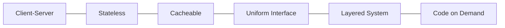

# REST API (Representational State Transfer API)

## 1. Overview

### A. Definition
> An API following an **architectural style** that, based on HTTP, **identifies Resources by URIs**, **expresses actions with HTTP methods**, and exchanges resource state as Representations such as JSON or XML. It was presented by Roy Fielding in his 2000 doctoral dissertation.

What should be emphasized about REST is that it is not a specific technology or specification but **an architectural style (a set of constraints)**. That is, it is not "use this protocol" but a collection of principles stating "if you observe these constraints, the system becomes scalable and loosely coupled like the Web". Since it generalizes the structure of the Web itself—which succeeded at massive scale—to API design, understanding REST requires seeing what scalability and independence each of these constraints is meant to achieve.

### B. Background and Need
SOAP, the early web services standard, had heavy and strict XML envelopes and WS-* specifications, which were burdensome for lightweight clients such as browsers and mobile devices and for fast, open integration. As the web, mobile, and MSA spread, what was needed was "**a lightweight, standard interface that anyone can easily connect to with just HTTP**". REST uses HTTP's already-proven methods, status codes, and caching as-is, so there is little burden of learning a separate specification, and clients and servers can evolve independently, making it the de facto standard for open APIs and the platform economy.

## 2. The Six Architectural Constraints of REST

Each constraint aims at a particular quality, and understanding this reveals "why it is designed that way".

**A. Client-Server** — Separates the concerns of the UI (client) and data storage (server), so that each can evolve independently as long as the interface matches, without knowing each other's internals.

**B. Stateless** — The server does not remember session state from previous requests; **each request contains all the information needed to process it**. Since the server holds no state, a request can be processed by whichever server it reaches, making **horizontal scaling (load balancing)** easy. This is the key reason REST can handle massive traffic.

**C. Cacheable** — Responses explicitly state whether they are cacheable, so that intermediate and client caches respond when the same request is repeated. This is the foundation of web scalability, reducing server load and latency.

**D. Uniform Interface** — The core constraint that makes REST REST: resources are identified by URIs, resources are manipulated through representations, messages are self-descriptive, and state transitions occur via hyperlinks (HATEOAS). Because the interface is consistent, clients are not tied to a particular server implementation.

**E. Layered System** — The client does not need to know whether it communicates directly with the final server or through intermediate proxies, gateways, or load balancers. Layers can be inserted freely to transparently add security, caching, and scaling functions.

**F. Code on Demand (optional)** — The only optional constraint, allowing the server to send executable code (e.g., scripts) to extend client functionality.

| Principle | Description | Quality gained |
|---|---|---|
| Client-Server | Separation of UI/data concerns | Independent evolution |
| Stateless | Self-contained requests, no stored state | Horizontal scalability |
| Cacheable | Explicit cacheability | Performance · load reduction |
| Uniform Interface | Consistent interface · HATEOAS | Reduced coupling |
| Layered System | Layered structure allowed | Transparent extension · security |
| Code on Demand (optional) | Transfer of executable code | Client extension |

## 3. Components and Methods

The three elements of REST are **resource, verb, and representation**. The resource is "what" (identified by URI), the verb is "how" (HTTP method), and the representation is "in what format" (JSON, etc.). An important principle here is **idempotency**. A method is idempotent if sending the same request multiple times yields the same resulting state, and this determines whether it is safe when retransmission occurs due to network failures. GET, PUT, and DELETE are idempotent, so retries have no side effects, but POST creates a new resource on every call and is not idempotent, so retry design requires care. For example, if payment creation is done via POST, there is a risk of duplicate payments, requiring a supplement such as a separate idempotency key.

| Element | Description |
|---|---|
| Resource | Identified by URI (e.g., `/users/1`) |
| Verb | GET · POST · PUT/PATCH · DELETE |
| Representation | Resource state as JSON · XML, etc. |

| Method | Meaning | Idempotent | Retry safety |
|---|---|---|---|
| GET | Retrieve | O | Safe |
| POST | Create | X | Duplication risk (supplement with idempotency key) |
| PUT | Full update | O | Safe |
| PATCH | Partial update | X | Caution |
| DELETE | Delete | O | Safe |

## 4. Maturity Model (Richardson Maturity Model)

This model views REST not as a binary of "compliant or not" but as **how RESTful it is, step by step**. Level 0 is remote invocation (RPC-like) that uses HTTP merely as a transport tunnel; Level 1 separates resources by URI; Level 2 uses methods and status codes according to their meaning, which is where most practice falls. Level 3 is **HATEOAS**, which includes links for possible next actions in responses, so the client follows links given by the server rather than hardcoding URIs, further reducing coupling. What Fielding called "true REST" is this level, but because implementation and consumption costs are high, Level 2 is mainstream in reality.

| Level | Description |
|---|---|
| Level 0 | HTTP tunneling (single URI, RPC-like) |
| Level 1 | Resource separation (URI) |
| Level 2 | Use of HTTP methods · status codes (mainstream in practice) |
| Level 3 | HATEOAS (hypermedia) — true REST |

## 5. Design Considerations and Implications
- **URIs are nouns, actions are methods**: Do not put verbs in URIs like `/getUser`; separating resource and action as in `GET /users/1` maintains the uniform interface.
- **Status codes · versioning · security**: Report results accurately with 2xx/4xx/5xx, manage versions via URI or headers, and protect authentication and transport with OAuth2, JWT, and HTTPS. Improve usability with paging, filtering, and OpenAPI documentation.
- **Complementary technologies**: GraphQL is advantageous when clients need to flexibly request only the fields they need, and gRPC for ultra-low-latency internal communication. REST, as the standard for open, general-purpose integration, is used together with these by dividing roles.

---

> **In one line**: A REST API is a stateless, uniform-interface architectural style that *identifies resources by URIs and expresses actions with HTTP methods*; its six constraints each target horizontal scalability, independent evolution, or performance, and its design principles are explained through idempotency and the maturity model (HATEOAS).
