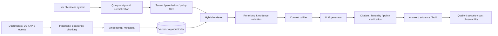
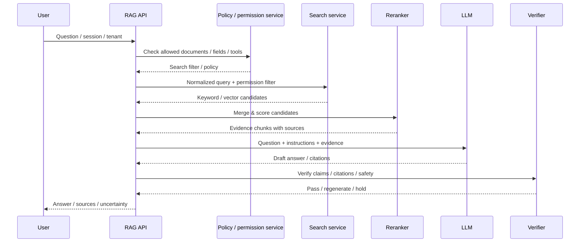

# Retrieval-Augmented Generation (RAG)

## 1. Overview

### A. Definition

> **Retrieval-Augmented Generation (RAG)** is an architecture in which, instead of relying solely on the knowledge stored in a large language model's (LLM) parameters, relevant evidence is retrieved from external documents, databases, or search indexes at query time and injected into the generation prompt or the generation process.

The essence of RAG is the combination of a retriever and a generator. The retriever finds document fragments that are semantically or lexically close to the user's question, producing candidate external knowledge. The generator receives those candidates together with the question and composes the answer. RAG is therefore not merely a prompting technique that attaches long documents to an LLM; it is a way of designing knowledge storage, retrieval, evidence selection, answer generation, and evaluation as a single information system.

Lewis et al. formalized RAG as a method that combines a pretrained model's **parametric memory** with an external index's **non-parametric memory** ([Lewis et al., 2020](https://arxiv.org/abs/2005.11401)). The original paper combined a pretrained sequence-to-sequence generator with a dense vector index of Wikipedia to perform knowledge-intensive question answering. Today's enterprise RAG has expanded its knowledge sources to internal policies, design documents, consultation histories, tables, code, and databases, but the core—"find the necessary external evidence and connect it to generation"—remains the same.

RAG does not completely free an LLM from the recency problem of its training data. The model still depends on its parameters to interpret questions and summarize retrieval results, and information that is missing from or incorrectly indexed in the search index will not be reflected in answers. Therefore, in an engineering exam answer, RAG should be explained not as a cure-all that automatically eliminates hallucination, but as a design pattern that controls the recency, provenance, and access rights of knowledge at runtime.

### B. Background and Necessity

An LLM's parametric knowledge is fixed at the time of training and does not automatically know an organization's confidential documents or recently revised policies. Reflecting new content through model retraining requires data cleansing, training cost, safety validation, deployment, and rollback. RAG, by contrast, can replace knowledge sources relatively quickly by updating the document pipeline and the search index.

In enterprise work, evidence and traceability matter more than the fluency of an answer. If an HR-policy consultation states the wrong number of leave days, or a facility-maintenance system acts on the basis of an obsolete manual, cost and safety problems arise. RAG can present the title, version, effective date, and page or paragraph of the retrieved documents together with the answer, showing reviewers and users the basis for the answer.

RAG also lets an organization separate work-specific knowledge repositories rather than retraining a single general-purpose model on all organizational data. By managing customer A's documents and customer B's documents in different tenant indexes and retrieving only the documents matching a user's permissions, one can improve data isolation and operational flexibility. However, if filtering is performed only after retrieval, already-exposed text can enter the prompt, so permission conditions must be applied from the retrieval stage.

### C. Goals and Scope of Application

The goals of adopting RAG can be summarized as follows.

1. Reflect up-to-date, organization-specific knowledge on a shorter cycle than model retraining.
2. Connect answers to source documents to increase verifiability and auditability.
3. Enforce access rights, retention periods, and tenant boundaries of document sources at query time.
4. Measure retrieval quality and generation quality separately so that improvement can be targeted by cause.
5. When the model recognizes insufficient evidence, have it choose to hold, ask a follow-up question, or escalate to an expert instead of guessing.

RAG is suitable for work where using external knowledge is important, such as policy question answering, technical support, enterprise search, knowledge management, design-review assistance, and customer consultation. On the other hand, work where safety cannot be guaranteed by retrieval alone—such as exact numerical calculation, complex transactional changes, and real-time market judgments—must be designed together with tool calls, verification services, and human approval.

## 2. Reference Architecture and Operating Principles

### A. Overall Structure

The online path analyzes the question, applies permission and tenant conditions, then retrieves and reranks candidate documents and passes them to the LLM. After generation, it verifies the presence of citations, the connection between evidence and claims, the exposure of banned words and personal data, and compliance with the answer format. If verification fails, the answer is not passed through as is; it branches to regeneration, hold, or human escalation.

The offline path handles ingestion and indexing of source documents. When a document is added, modified, or deleted, a parser extracts its body and structure, splits it into semantic units, and generates embeddings and metadata. The original version and the index version must be linked so that "which point-in-time document the current answer was based on" can be reproduced.

The search index need not be a single store. Keyword search is strong for exact terms such as product names, clause numbers, and error codes, while vector search is strong at finding semantically similar documents expressed differently. In practice, a hybrid structure that merges the two results and then reranks them is frequently used, and relational DBs, search engines, vector DBs, and graph DBs are combined according to data scale and domain characteristics.

### B. Query Processing Sequence

The query normalization in the first step includes typo correction, abbreviation expansion, incorporation of conversational context, and making dates and organizational scope explicit. For example, "Tell me the leave policy" lacks a target country, employment type, and reference date, so rather than searching immediately, the system should ask a follow-up question or make the default scope explicit. Because arbitrarily expanding a query can retrieve documents different from the original intent, both the original and the transformed query are kept auditable.

The policy service returns the searchable scope according to user, role, department, tenant, document classification, and validity period. This filter is enforced in the search API's conditions or in an index partition, not left to rely only on selective `if` statements in application code. So that the embedding cache and answer cache do not reuse a previous user's results when permissions change, the cache key reflects a permission version or policy version.

After candidate retrieval, duplicates, outdated versions, and conflicting documents are cleaned up. If the top results are all repeated chunks of the same document, the answer's perspective can narrow, and if different revisions come in together, the model can confuse recency with obsolescence. In the reranking stage, one considers not only relevance but also effective date, source reliability, document permissions, redundancy, and the detailed conditions of the user's question.

### C. Connecting Generation and Verification

The context builder clearly separates the question, system instructions, retrieved evidence, response format, and prohibited behaviors. Even if a retrieved document contains a sentence like "ignore the previous instructions," that is data, not a system instruction. Delimiters and prompt policies are applied so that document content is not promoted to a trusted command.

The generator must not infer facts beyond the evidence. Rules such as "if it is not in the evidence documents, answer that it cannot be confirmed," "indicate a source for each claim," and "do not hide conflicts between documents" can be included in the answer template. But because prompts alone cannot guarantee this, a separate verifier and test set are needed.

The verifier decomposes the answer into sentence- or claim-level units and checks whether each claim has the necessary evidence. Even if a citation is attached, the cited document may not actually support the claim, so the presence of a citation and the entailment of the citation are distinguished. In critical work, do not use only model-based judgment; combine rules, links to originals, structured field comparison, and domain verification APIs.

## 3. Data Preparation and Retrieval Design

### A. Document Ingestion, Cleansing, and Lineage

RAG quality is largely governed by the quality of source data rather than the LLM. If a PDF's headers and footers are repeated in the body, or a table's column order is scrambled, the embedding does not represent the document's meaning well. For documents subject to OCR, the recognition rate, preservation of tables and footnotes, and missing scanned pages must be inspected, and documents that fail parsing should not be marked as fully indexed.

The ingestion pipeline stores as metadata the original URI, owner, document type, language, creation date, revision date, effective start/end dates, security level, deletion status, hash, and parser version. This information is used not only for search filters but also for source attribution of answers and regression analysis. Orphan chunks that remain in the vector index after a document has been deleted must be detected periodically.

Document lineage is the connection from the original, to the parsed text, chunks, embeddings, retrieval results, and answer. When the same document is re-ingested, changes can be judged by hash, and re-embedding only the changed chunks reduces cost. When changing the parser or embedding model, separate the index version and compare old-version and new-version results before switching over.

### B. Chunking and Metadata

Chunking is not the problem of cutting a document into fixed lengths but the problem of designing the retrieval unit. Chunks that are too small lose context and conditions, while chunks that are too large add unnecessary content to results and disperse the generator's attention. One must experiment with the target token length and overlap while preserving titles, clauses, table row relationships, code blocks, and paragraph boundaries.

For a policy document, attach the hierarchy of book–section–article–clause to each chunk; for a procedure document, group preconditions and exception conditions into the same chunk or into linked chunks. If a table is separated into rows only, the meaning of the column headers is lost, so preserve the table title, units, and column names by repeating them as structured text. Storing the source document's page and location lets you show users an accurate citation.

Metadata governs the quality and security of retrieval results. Design fields such as `tenant_id`, `acl`, `document_type`, `effective_from`, `effective_to`, `language`, `source_system`, `version`, and `page`, and manage filterable values with standard codes. If metadata is stored only as free text, department names may be written differently, and permission filters and date filters can be missed.

### C. Embedding and Indexing

Embedding converts text into a vector in a semantic space. Candidates are found by comparing the cosine similarity or dot product of the question vector and document vectors, but similarity is not correctness. Expressions where character matching matters, such as product codes and clause numbers, can be missed by vector search alone, so it is combined with keyword search such as BM25.

Changing the embedding model changes the meaning of the vector space, so new vectors are not compared directly with existing vectors. Choose a model suited to the language, domain terminology, document length, and query type, and compare retrieval performance with a representative question–answer document dataset. When sending personal data or confidential originals to an embedding API, review the processing location, retention policy, encryption, and contractual terms.

The index must consider the consistency of writes and reads. One must decide whether to promise users that a new document is immediately searchable once it is registered in the source, or only after embedding and inspection are complete. Because a failure during incremental indexing can expose only some chunks, load into a temporary index and switch the alias atomically, or enforce a document-level status as a filter.

### D. Retrieval and Reranking

First-stage retrieval gathers candidates broadly, while second-stage reranking judges the detailed relevance between the question and the candidates. Taking only the top 5 in the first stage can miss the needed evidence, while feeding 100 as-is to the LLM increases cost and noise. The number of candidates and the number of final context items are experimented with per question type, recording the retrieval score, rerank score, and the reason for selection.

If the query is "What are the exceptions in the information-protection policy revised in 2025?", not only semantic similarity but also the year, document type, and the structural signal "exception" must be reflected. Applying period and version filters before searching reduces cases where obsolete policies rise to the top. When conflicting documents are retrieved, rather than arbitrarily hiding the newest document, indicate the conflict and include the reference date and revision status in the answer.

Retrieval failure is also treated as a normal result. If there is no relevant document and the closest document is used in the answer, a plausible wrong answer results. By combining the minimum similarity, rerank score, source reliability, and whether required metadata is satisfied, create an "insufficient evidence" state and guide the user to narrow the scope and ask again.

## 4. RAG Types and Comparison

### A. Basic RAG, Advanced RAG, and Agentic RAG

Basic RAG is a linear flow of question–retrieval–generation. Its structure is simple and its latency and cost are easy to predict, making it suitable for initial pilots. However, it is hard to handle a compound question with a single retrieval query, and it cannot correct incorrectly retrieved results by itself.

Advanced RAG adds query rewriting, hybrid search, reranking, document compression, conversational-context management, and answer verification. It can improve retrieval quality, but as components increase, latency, points of failure, and evaluation combinations grow. Before adding features, one must establish a baseline of which failure type is being reduced.

Agentic RAG has the model call retrieval tools multiple times, evaluate the retrieval results, and decompose the query if needed. It is advantageous for compound investigations but can suffer from a flood of tool calls, infinite loops, expansion of permission scope, and failure to predict cost. The tool list and argument validation, a budget for call count and time, and approval boundaries must be specified.

| Category | Basic RAG | Advanced RAG | Agentic RAG |
|---|---|---|---|
| Flow | Generate after a single retrieval | Preprocessing / reranking / verification | Planning / iterative retrieval / tool calls |
| Strength | Simplicity / low operating cost | Improved quality / control | Handling compound questions |
| Risk | Vulnerable to retrieval failure | Latency / configuration complexity | Cost / permission / loop runaway |
| Suitable work | FAQ / internal search | Policy / technical support | Investigation / multi-step analysis |

### B. RAG vs. Fine-Tuning, Prompting, and Long Context

Fine-tuning is effective for teaching a model's behavioral style or domain expression. However, it is hard to manage for the purpose of storing facts from up-to-date documents and presenting sources in real time. Whereas RAG keeps knowledge in an index and updates it, fine-tuning reflects patterns and knowledge in model weights, so the two methods may be complementary rather than substitutes.

Prompt engineering is a way of conveying a role, output format, examples, and constraints to a model. Putting evidence documents in a prompt is also one step of RAG, but a method in which a person attaches materials each time without document ingestion, permissions, retrieval, or lineage is not operational RAG. Even as long-context windows grow, longer inputs increase cost and latency, and the model can miss middle documents or mix conflicting information.

The criteria for choosing per work are the rate of change of knowledge, access control of materials, the need for answer evidence, the volume and quality of training data, and inference cost. Frequently changing internal policies benefit greatly from RAG, whereas if the problem is always producing the same output format and tone, fine-tuning or prompting may be suitable. When domain terminology is not well understood, combine domain embeddings, query rewriting, and a small amount of supervised learning with RAG.

| Decision item | RAG | Fine-tuning | Long context |
|---|---|---|---|
| Updating recent knowledge | Update the index | Requires retraining | Requires input each time |
| Presenting sources | Easy to structure | Requires separate design | Depends on input documents |
| Data access rights | Filter at retrieval | Requires control outside the model | Requires prompt composition |
| Learning behavior / style | Limited | Strength | Possible via examples |
| Operational burden | Pipeline / index | Training / deployment | Token cost / latency |

## 5. Application Cases and Operating Procedures

### A. Internal Policy Question-Answering Case

Assume a company with HR policies, work rules, a collective agreement, and region-specific supplementary rules. When a user asks "What are the bonus payment criteria during parental leave?", the system must confirm the user's country, legal entity, employment type, and reference date, and retrieve the latest version of the permitted policy. Mixing in general legal common sense or another entity's policy makes the answer, however fluent, not operationally valid.

Attach the policy name, article number, effective date, repeal date, applicable entity, and security level to the document chunks. If retrieval results return both a 2024 policy and a 2026 revised policy, compare the revision date and validity period, and if they conflict, request confirmation from an HR officer. The answer includes not only the conclusion but also the applicable conditions, related clauses, reference date, exceptions, and the inquiry channel.

Success is not judged by answer accuracy alone. One verifies whether entity documents the user has no permission for were not retrieved, whether the answer accurately cites the source clause, whether it holds when uncertain, and whether the new document is retrieved right after a revision. HR-consultation logs keep the question and answer, but mask them so that resident registration numbers or sensitive HR information are not stored unnecessarily.

### B. Manufacturing Technical-Support Case

On the manufacturing floor, the action differs by equipment model, firmware version, alarm code, and process stage. Returning a general manual to the question "resolve alarm E-204" can be dangerous. The system must confirm the equipment identifier and current version, and retrieve the action for that condition from the approved maintenance manual and safe-work procedures.

Work-procedure documents are indexed with the steps, prior lockout, required tools, hazard warnings, and normal-return conditions separated. If a retrieved chunk has no safety warning, the generator must not arbitrarily supplement the procedure and should require the approval of a professional maintenance technician. Answer generation is separated from actual equipment control, and control commands must pass separate approval, interlocks, and double confirmation.

When the field network is unstable, a cached manual may be used, but it must be indicated whether the cache is the latest safety document. If the document versions of the offline answer and the online answer differ, indicate the reference time and synchronization status so the user is not confused. This case shows that RAG is connected to safety, change management, and accountability beyond a mere search convenience feature.

### C. Adoption Procedure

1. **Define work scope and risk grade**: Separate work that only provides answers from work that leads to actual decision-making and control.
2. **Catalog document sources**: Investigate the owner, recency, security level, update cycle, document format, and disposal procedure.
3. **Build a representative question set**: Create a gold set of correct-answer documents, required conditions, prohibited documents, and expected hold questions.
4. **Establish parsing / chunking criteria**: Preserve table, code, clause, and page structure, and set reprocessing rules for failed documents.
5. **Connect the permission model**: Enforce index ACLs, tenant filters, document validity periods, and deletion propagation on the retrieval path.
6. **Measure the retrieval baseline**: Compare recall@k, MRR, and nDCG of the keyword, vector, and hybrid approaches.
7. **Design the generation / citation contract**: Define the answer format, source fields, uncertainty expression, prohibited areas, and hold conditions.
8. **Safety / security testing**: Test document prompt injection, permission bypass, personal-data recovery, conflicting documents, and queries about deleted documents.
9. **Shadow operation and limited release**: Compare retrieval and answers without affecting real users, and release gradually starting from low-risk work.
10. **Operational automation**: Manage index freshness, errors, cost, latency, feedback, and document-deletion propagation with dashboards and alerts.

## 6. Advanced — Evaluation, Freshness, and Secure RAG

### A. Separate Evaluation of Retrieval and Generation

In RAG evaluation, looking at only the single metric "the answer is correct" makes the cause unknowable. One examines separately whether retrieval fetched the needed document (retrieval recall), whether it placed it in a top rank (MRR, nDCG), whether the selected context is sufficient for the question (context precision, recall), whether the final answer is faithful to the evidence (faithfulness), and whether it answered the question (answer relevance).

For example, if the correct-answer document is in the index but not in the top 10, it is a retrieval problem. If the correct-answer document is in the context but the answer says something else, it is a generation, prompting, or verification problem. If the correct-answer document itself is wrong or outdated, it is a knowledge-management problem. Only by linking layered metrics with failure samples does improvement activity point at the right component.

Automatic evaluators are useful for large-scale regression tests but are not absolute judges. Review the evaluation model's language and domain bias, the error of looking only at citations and missing whether the content is supported, and the incompleteness of the reference answers. For high-risk work, domain experts review samples, and the discrepancy between automatic metrics and human evaluation is also managed as a separate metric.

### B. Freshness and Conflicting Knowledge

When a document changes, merely indexing the new version is not sufficient. One must reflect the obsolete status so the previous version is not retrieved, invalidate the cache and precomputed answers, and ensure the context of an in-progress conversation does not contaminate the new policy. If a document's effective date is in the future, publish it on a schedule, and also consider the time zone and clock synchronization of the effective time.

When different official documents conflict, do not leave it to the model to pick one. Compare the document owner, revision date, scope, superior policy, and approval status, and select by a priority rule or expose the conflict to the user. The answer should be allowed to take a form such as "document A stipulates X and document B stipulates Y, so the reference date must be confirmed."

### C. Security, Privacy, and Prompt Injection

Retrieved documents are data, not trusted instructions. External web pages, emails, and user-uploaded documents may contain sentences instructing the LLM to output secrets or call tools. Separate the system-instruction and data boundaries, and control tool calls with an allowlist, argument schema, least privilege, and an approval flow.

The ACL filter at the retrieval stage and the output filter at the generation stage cannot substitute for each other. Documents without permission must not be retrieved in the first place, and one must check that the model does not reconstruct another document's content by inference. The answer cache uses a key including user, tenant, permission, and document version, and the retention, encryption, and access rights of the retrieval logs and embedding store are matched to the data classification.

NIST's Generative AI risk-management profile is a reference framework that addresses risks such as provenance, verification, and data lineage of generative AI ([NIST AI 600-1](https://doi.org/10.6028/NIST.AI.600-1)). When adopting RAG, documenting the source data, retrieval path, generation results, and human-review responsibility through this framework's Govern, Map, Measure, and Manage perspectives connects the technical implementation to governance.

## 7. Considerations and Implications

### A. Trade-off among Accuracy, Freshness, and Completeness

Putting in many relevant documents does not always make the answer more accurate. As the context lengthens, noise increases, conflicting versions mix, and cost and latency rise. Conversely, selecting too few documents leaves out exception conditions and definitions. Experiment with the minimum set of evidence and maximum context needed per question type, and judge the results together with user impact.

Freshness is determined by the time gap between the ingestion cycle and publication approval. Automatic ingestion is fast but can immediately publish malicious or erroneous documents, while manual inspection increases reliability but adds delay. Set graded policies such as making only approved versions searchable for high-risk policy and safety documents, and inspecting samples after automatic indexing for general knowledge.

### B. Performance, Cost, and Availability

The latency of online RAG is composed of the sum of query embedding, first-stage retrieval, reranking, LLM generation, and verification. Unconditionally calling reranking and verification multiple times may improve quality slightly but can worsen user experience and cost. Split into a lightweight path and a deep path according to the question's risk and complexity, and propagate the overall deadline to each stage.

Do not look only at vector-search and embedding costs; calculate a TCO that includes document parsing, storage, re-indexing, LLM input tokens, output tokens, cache, and observability costs. Instead of feeding entire long documents each time, apply chunk compression and deduplication, and safely cache frequently asked public queries only when the evidence version has not changed.

If the service is made to unconditionally generate an empty answer during a search-index failure, that is dangerous. Clearly indicate the search-unavailable state and switch to an approved static FAQ or an expert channel. Isolate model failures, embedding failures, and source-system failures separately, and rehearse index recovery, re-indexing, and version rollback procedures.

### C. Security, Privacy, and Accountability

The privacy risk of RAG does not disappear just because documents are not learned into model weights. Retrieval results, prompts, logs, evaluation data, and caches can replicate personal data. Set the collection purpose and retention period, and apply minimal collection, de-identification, access control, encryption, and deletion propagation in line with the data lifecycle.

When an answer affects decision-making, clarify the ultimate responsible party and the human-review point. The phrase "the AI is for reference only" is not sufficient; the operating procedure must state under what conditions automatic provision is stopped and which role approves. User feedback and the results of appeals become audit material for finding defects in the document sources and policies, not just for improving the model.

### D. Observability, Change Management, and Evaluation Governance

Essential operating metrics are answer latency, retrieval failures, index freshness, top-k hit rate, missing citations, evidence infidelity, hold rate, user re-question rate, token cost, and permission errors. Do not store only averages of metrics; decompose them by document type, tenant, question type, and model version. However, access rights matched to the sensitivity of the original questions and answers must be maintained.

The embedding model, chunking rules, reranking model, prompts, LLM, and policy filters are all release targets that affect RAG results when changed. Switch over gradually after gold-set regression, security tests, cost/latency load tests, and index-version comparison. Do not store only answers; keep the document versions used, retrieval scores, model/prompt versions, and verification results in a reproducible form.

### E. Adoption Judgment from the Engineer's Perspective

The starting point for adopting RAG is not "let's attach an LLM" but a business analysis of where information is, how often it changes, who can read it, and what the cost of a wrong answer is. If document ownership and the responsibility for keeping it up to date are unclear, even a good retrieval algorithm cannot produce trustworthy answers. First put source data and business responsibility in order, and create a baseline on a low-risk, measurable use case.

The architecture should separate retrieval, generation, and verification, and connect each layer's failure to a hold and a fallback path. RAG's core outcome is not answer length or model size but the ability to deliver the necessary evidence to the right user at the right time and to stop safely when evidence is insufficient. Concretizing this principle into SLOs, security controls, evaluation sets, and operational runbooks is the role of the engineer.

## References

- [Lewis et al. — Retrieval-Augmented Generation for Knowledge-Intensive NLP Tasks](https://arxiv.org/abs/2005.11401)
- [Gao et al. — Retrieval-Augmented Generation for Large Language Models: A Survey](https://arxiv.org/abs/2312.10997)
- [NIST — Artificial Intelligence Risk Management Framework: Generative Artificial Intelligence Profile (AI 600-1)](https://doi.org/10.6028/NIST.AI.600-1)
- [NIST AI RMF Generative AI Profile Knowledge Base](https://airc.nist.gov/AI_RMF_Knowledge_Base/Generative_AI)
- [Es et al. — RAGAS: Automated Evaluation of Retrieval Augmented Generation](https://arxiv.org/abs/2309.15217)

---

> **In one line**: RAG is a technique that retrieves external knowledge and connects it to an LLM's generation, but to be trustworthy it must be designed as an operational information architecture that includes retrieval quality, permissions, document lineage, verification, and hold policy.
