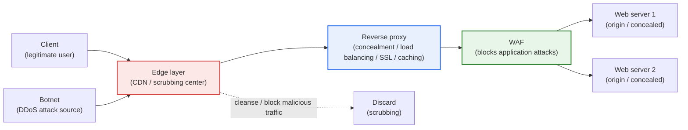
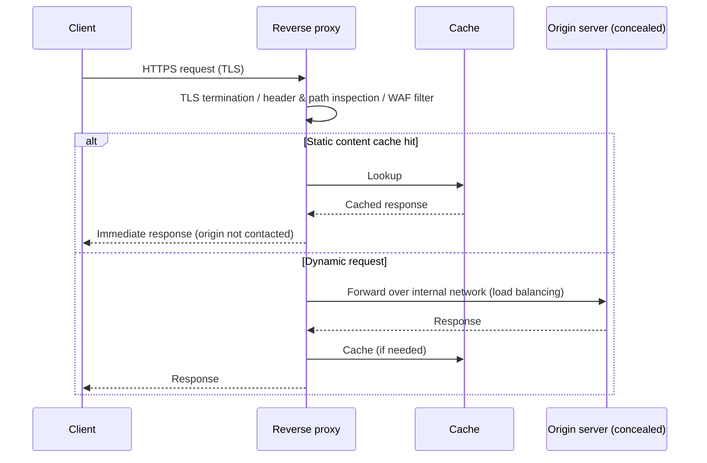
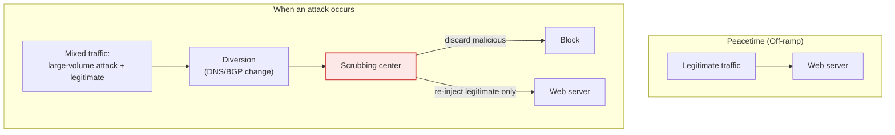

# Web Server Security — Reverse Proxy and DDoS Cyber Shelter

## 1. Overview

### A. Definition
> A **reverse proxy** is a server-side proxy positioned between the client and the actual web server (the origin server) that receives, inspects, and relays all requests on its behalf and returns responses, while a **DDoS cyber shelter (scrubbing center)** is a traffic-cleansing service that, when a large-scale distributed denial-of-service attack occurs, diverts the victim organization's traffic to a scrubbing center, filters out malicious traffic, and forwards only legitimate traffic to the origin server.

The fundamental idea of web server security is to "**not expose the server directly, but to erect a buffering and cleansing layer in front of it.**" When a web server is directly connected to the internet with a public IP, its ports, banners, path structure, and vulnerabilities become the attack surface as-is, and even a slight surge in traffic exhausts resources and halts service. The reverse proxy resolves this problem structurally. The client knows only the proxy's address and cannot know the actual server's location, count, or internal structure (concealment); the proxy receives the request, performs authentication, filtering, caching, and load balancing, and then forwards it downstream, so the origin server is protected in a trusted internal network.

DDoS is a threat of a different nature. If the reverse proxy handles the "quality" at the application layer, DDoS paralyzes the service by the "quantity" of traffic. When tens of thousands to hundreds of thousands of zombie PCs and IoT botnets pour out traffic from hundreds of Gbps to Tbps per second, any reverse proxy or firewall is neutralized because bandwidth itself is saturated. In that case, front-end defense by an individual organization alone cannot cope, so traffic is diverted to a large-scale scrubbing center operated by a telecom carrier, the government (e.g., the Korea Internet & Security Agency (KISA)'s "DDoS Cyber Shelter"), or a cloud provider to be absorbed and cleansed on its behalf. In short, the reverse proxy and the cyber shelter are not mutually exclusive technologies but **complementary layers** that handle **attack-surface reduction (in peacetime)** and **high-volume absorption and cleansing (in an emergency)**.

### B. Background and Necessity
The web is an organization's face and its most exposed asset. Not only application attacks such as OWASP threats, SQLi, and XSS, but also layer-specific DDoS—volumetric (bandwidth exhaustion), protocol (TCP SYN Flood), and application (HTTP GET/POST Flood)—are constant threats. In particular, the Mirai botnet case (2016, which paralyzed the DNS provider Dyn with up to about 1.2 Tbps), the subsequent scaling-up of IoT-based attacks, and novel application DDoS such as HTTP/2 Rapid Reset (CVE-2023-44487, hundreds of millions of requests per second in 2023) exposed the limits of "single front-end defense." Accordingly, **defense in depth**—layering ① a reverse proxy that conceals and relays the server, ② a WAF that filters out web attacks, and ③ a cyber shelter/CDN that absorbs high volumes—has become the standard operating practice.

## 2. Overview of the Entire Defense Structure

First we survey how the entire web-server security layer is interlocked with a structural diagram, then examine the detailed elements from a process perspective.

The core of this structure is the **multi-staging of gateways**. Traffic passes through a narrower, more refined channel as it moves from outside to inside. The edge layer (CDN / scrubbing center) first absorbs and discards large-volume volumetric attacks, the reverse proxy conceals the server and distributes load, and the WAF blocks malicious requests at the application layer, only after which traffic finally reaches the origin server. Each layer specializes in the threat it can block best, so that even if one is breached, the next layer continues the defense.

## 3. Reverse Proxy

### A. Operating Principle
The reverse proxy is the exact opposite of a forward proxy that acts on behalf of a client, in that it "acts on behalf of the server." From the outside, the proxy looks like the web server, and the actual origin server hides behind the proxy. Representative implementations are Nginx, HAProxy, Envoy, and Apache (mod_proxy); in the cloud, AWS ALB, GCP Cloud Load Balancing, and others serve the same role. When a request arrives, the proxy terminates (decrypts) TLS, inspects the headers, path, and method, then responds immediately for static content from cache and routes only dynamic requests to the backend server.

### B. Server Concealment and Attack-Surface Reduction
The most essential security effect provided by a reverse proxy is the **concealment of the origin server**. The client knows only the proxy's IP and cannot know the origin server's actual address, count, OS, or middleware version. It becomes hard for an attacker to identify the target, and the difficulty of scanning and direct vulnerability attacks rises greatly. In practice, the origin server is placed in a private IP range and the firewall allows only requests from the proxy (a whitelist), fundamentally blocking bypass access itself. Removing the server banner, error pages, and response headers (Server, X-Powered-By) at the proxy also reduces information disclosure.

### C. Load Balancing, Performance, and SSL Termination
The reverse proxy distributes requests to multiple origin servers (round robin, least connections, IP hash) to prevent overload of a single server, and if one server dies, it detects this via health checks and automatically isolates it. This raises both availability and defensive capability at once. Also, when the proxy takes exclusive charge of TLS termination (SSL offloading), the origin server is relieved of the computational burden of encryption/decryption, and certificate management is concentrated in one place. Processing static-content caching and gzip/Brotli compression at the front end can reduce origin-server traffic by tens of percent, which in itself acts as a buffer against mild load-based attacks.

### D. Security Filtering (WAF Integration)
The reverse proxy combines with a WAF (Web Application Firewall) to filter out application attacks such as SQL injection, XSS, and path traversal using signatures and rules (e.g., the OWASP ModSecurity Core Rule Set). Rate limiting, geo-blocking (GeoIP), and bot detection are also performed at the proxy layer, taking charge of first-line mitigation of application-layer DDoS (HTTP Flood).

| Function | Content | Security effect |
|---|---|---|
| **Server concealment** | Hides the actual server IP, structure, and version | Attack surface / reconnaissance difficulty ↑ |
| **Load balancing** | Distributes to multiple servers / isolates via health check | Availability / buffering capacity ↑ |
| **SSL termination** | Front-end encryption/decryption / certificate concentration | Computational burden ↓ / unified management |
| **Caching & compression** | Static-content cache / gzip/Brotli | Origin-server load ↓ by tens of % |
| **Security filtering** | WAF rules / rate limit / GeoIP / bot detection | Mitigates application attacks / L7 DDoS |

## 4. DDoS Cyber Shelter

### A. Layer-Specific Types of DDoS
DDoS differs in nature and defense method by the attack layer. **Volumetric attacks** (UDP/ICMP Flood, DNS/NTP amplification) exhaust bandwidth itself and reach hundreds of Gbps to Tbps per second. **Protocol attacks** (SYN Flood, ACK Flood) exhaust the connection-state table of servers and firewalls. **Application attacks** (HTTP GET/POST Flood, Slowloris, HTTP/2 Rapid Reset) disguise themselves as legitimate requests with little bandwidth and exhaust server resources, making them the hardest to detect. A cyber shelter is especially strong at the **high-volume absorption of volumetric and protocol attacks** that an individual organization cannot cope with.

### B. Traffic Diversion and Cleansing Principle
A cyber shelter operates in three stages. ① **Diversion**: When an attack is detected, traffic is drawn into the scrubbing center by a DNS change (changing the domain's A record to the shelter's IP) or a BGP routing change (advertising the route of the target IP range to the shelter). ② **Scrubbing**: The scrubbing center identifies and discards botnet traffic using signatures, behavioral analysis, reputation, and challenges (e.g., JS/CAPTCHA), leaving only legitimate traffic. ③ **Re-injection**: Only the cleansed legitimate traffic is sent back to the origin server via a GRE tunnel, a dedicated line, or the like.

### C. Domestic Cyber Shelters and Operating Framework
In Korea, KISA provides a "DDoS Cyber Shelter" free of charge to small and medium-sized enterprises and others, linking domains in advance in peacetime and diverting traffic to the shelter for cleansing when an attack occurs. Telecom carriers (KT, SK Broadband, etc.) and cloud/CDN providers (Cloudflare, AWS Shield, Akamai Prolexic, etc.) also operate commercial scrubbing services. The key is **advance preparation**. If you scramble to integrate after the attack has begun, the service is already paralyzed, so DNS/BGP integration, whitelists, and a legitimate-traffic threshold (baseline) must be set up in advance in peacetime, and drills must be conducted, to enable rapid switchover.

| Component | Content | Key point |
|---|---|---|
| **Traffic diversion** | Draw into the scrubbing center via DNS/BGP | Rapid switchover (minimize RTO) |
| **Traffic cleansing** | Signature / behavior / reputation / challenge filters | Minimize false positives (blocking legitimate traffic) |
| **Legitimate re-injection** | Re-inject via GRE tunnel / dedicated line | Minimize latency for legitimate users |
| **Advance integration** | Set peacetime baseline / whitelist | Maintain drills / integration at all times |

## 5. Advanced — Cloud/CDN Integrated Defense and Recent Trends

Recently, the center of gravity of defense is shifting from on-premises equipment to the **cloud/CDN edge**. Providers such as Cloudflare, Akamai, AWS (CloudFront + Shield Advanced), and Fastly provide reverse proxy, WAF, DDoS scrubbing, and CDN caching as **a single integrated service** at large-scale edge PoPs (Points of Presence) distributed worldwide. Because traffic is absorbed and cleansed at an edge close to the user, large-volume volumetric attacks are distributed and processed before reaching near the origin server. Providers advertise scrubbing capacity on the scale of tens of Tbps, and in fact, cases have been reported in the 2023–2024 HTTP/2 Rapid Reset (CVE-2023-44487) family of attacks in which hundreds of millions of requests per second were blocked at the edge (specific figures are based on providers' published materials and may vary over time).

At the same time, application-layer defense is becoming more sophisticated. Anomalous-traffic detection based on AI/machine learning, bot management that distinguishes legitimate bots (search engines) from malicious bots, and combination with **Zero Trust/SASE** strengthen the principle of "allowing origin-server access only from a trusted edge." Furthermore, to prevent incidents in which the origin server's IP is exposed through past DNS history or misconfiguration and the edge is bypassed, "origin cloaking"—forcing the origin server's firewall to allow only CDN/proxy ranges—has become a best-practice operation.

## 6. Considerations and Implications (Engineer's Perspective)

1. **Combination of defense in depth and layer-specific role division**: Single-point defense will inevitably be breached. Combine the edge (volumetric absorption), reverse proxy (concealment / load balancing), WAF (application attacks), and cyber shelter (high-volume cleansing) in layers, and design so that each layer handles a specialized threat without overlap. This is a problem of both defense depth and bottleneck/cost optimization.

2. **Peacetime preparation and rapid switchover (minimizing RTO)**: For a cyber shelter or scrubbing, the speed of switching to diversion after an attack occurs directly governs the scale of damage. In peacetime, prepare a shortened DNS TTL, BGP integration, a legitimate-traffic baseline/threshold, and whitelists, and conduct regular drills. Reducing human-intervention delay through automation (orchestration) of detection–diversion–cleansing is the key.

3. **Trade-off between false positives and user experience**: Raising the cleansing intensity catches even legitimate users in challenges and blocks, causing churn. Conversely, being lenient lets the attack leak through. A balanced design is needed that tunes rules to the application's characteristics (login and payment traffic patterns) and minimizes the user friction of CAPTCHA and JS challenges.

4. **Managing edge-bypass (origin exposure) risk**: No matter how well it is wrapped by a CDN/proxy, if the origin server's IP is exposed, an attacker can skip the edge and strike directly. Force the origin server's firewall to allow only CDN/proxy ranges, and regularly inspect IP-leak paths through past DNS history, subdomains, and mail servers.

5. **Balance of cost, performance, and sovereignty**: Integrated cloud defense is powerful but accompanies traffic cost, lock-in, and data-sovereignty issues. An architecture strategy suited to the service's nature is required—for example, choosing a domestic scrubbing-center/reverse-proxy combination for areas where cross-border data transfer is sensitive, such as public and financial sectors, and choosing CDN edge defense for global services.

## References
- KISA Boho Nara, DDoS Cyber Shelter service guide: https://www.boho.or.kr/
- Cloudflare Learning Center, "What is a reverse proxy?": https://www.cloudflare.com/learning/cdn/glossary/reverse-proxy/
- Cloudflare, HTTP/2 Rapid Reset (CVE-2023-44487) analysis: https://blog.cloudflare.com/technical-breakdown-http2-rapid-reset-ddos-attack/
- OWASP ModSecurity Core Rule Set (CRS): https://coreruleset.org/
- AWS, "AWS Best Practices for DDoS Resiliency": https://docs.aws.amazon.com/whitepapers/latest/aws-best-practices-ddos-resiliency/

---

> **In one line**: Web server security *conceals and protects the origin server with a reverse proxy (load balancing, SSL termination, caching, WAF filtering)*, and for large-volume DDoS *diverts and cleanses traffic with a cyber shelter / scrubbing center (DNS/BGP switchover → discard botnet → re-inject legitimate)*, achieving stable service through defense in depth combined with edge, CDN, and Zero Trust that reduces the attack surface in peacetime and absorbs high volumes in an emergency.
