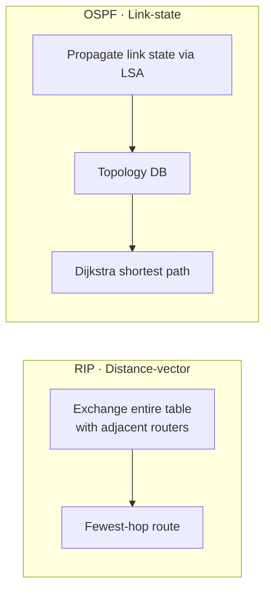

# RIP vs OSPF (Routing Protocol Comparison)

## 1. Overview

### A. Definition
> **RIP** (Routing Information Protocol) is a representative IGP (Interior Gateway Protocol) of the **distance-vector** type that chooses routes based on the hop count to the destination, while **OSPF** (Open Shortest Path First) is a representative IGP of the **link-state** type that grasps the entire topology and computes the shortest path.

The two protocols solve the same purpose (route determination within an autonomous system) with diametrically opposite information models. RIP is "**rumor-based**," in which a router trusts only the distance information told by its neighbors to decide routes, while OSPF is "**map-based**," in which all routers share the entire map and each computes on its own. This fundamental difference creates all the gaps in convergence speed, scalability, and resource usage.

### B. Background and Necessity
In early small-scale networks, RIP, which is simple to configure, was sufficient. However, RIP suffered from serious routing loops and delays in large-scale networks due to its **scale limit**—reachability only up to 15 hops (16 = infinity)—and its **convergence delay**, in which the entire table is exchanged on a 30-second cycle, making fault propagation slow. In particular, the **count-to-infinity** problem was chronic: when a single link went down, incorrect information that "one can detour via a neighbor" fed back to each other, and the hop count gradually increased. To overcome this and provide large-scale, scalable routing, the link-state OSPF emerged.

## 2. Operating Method

RIP periodically exchanges the entire routing table with neighbors and, for each destination, chooses the route with the fewest hops (Bellman-Ford). Because this method has a router depend only on neighbor information without knowing the overall structure, incorrect information spreads easily. In contrast, OSPF has each router propagate its own link state to the whole network as an **LSA (Link State Advertisement)**, so that all routers construct an identical **topology DB (map)** and then each computes its own shortest path with the **Dijkstra (SPF) algorithm**.

The difference in metrics is also fundamental. Because RIP looks only at the **hop count**, it can make the irrational choice of preferring a 10 Mbps 2-hop path over a 1 Gbps 3-hop path, whereas OSPF, using a **bandwidth-based Cost**, chooses the route with genuinely better performance.

## 3. Comparison Table

All the differences in the table below ultimately derive from "does it know only its neighbors, or does it know the whole?" OSPF, which knows the entire topology, floods only the change (LSA) immediately upon a fault to converge quickly and optimizes routes by actual bandwidth, but its computation and memory burden is correspondingly large.

| Category | RIP | OSPF | Cause of the difference |
|---|---|---|---|
| **Algorithm** | Distance-vector (Bellman-Ford) | Link-state (Dijkstra/SPF) | Difference in information model |
| **Metric** | Hop count | Bandwidth-based Cost | Route optimality |
| **Maximum scale** | 15 hops (16 = infinity) | Practically unlimited (Area) | Loop-suppression method |
| **Convergence speed** | Slow (periodic exchange) | Fast (immediate LSA on change) | Update method |
| **Update** | Entire table every 30 seconds | Event-based incremental on change | Bandwidth efficiency |
| **Applicable scale** | Small | Medium/large | Scalability |
| **Loop prevention** | Split Horizon / Hold-down | Area hierarchy | Structural approach |

## 4. Loop-Prevention and Stabilization Techniques

RIP patches loop prevention with **several auxiliary techniques** due to its inherent weakness of not knowing the overall structure. These are **Split Horizon**, which does not advertise a learned route back in the direction it was learned; **Route Poisoning**, which advertises a broken route as infinity to quickly invalidate it; **Hold-down**, which suspends updates for a certain time right after a change; and **Triggered Update**, which notifies immediately upon a change. In contrast, because OSPF shares the entire map from the start, loops rarely occur, and at large scale it divides the LSA propagation scope with an **Area hierarchy** and elects a **DR/BDR** on multi-access segments to suppress an explosion of LSA exchange.

| Protocol | Techniques |
|---|---|
| **RIP** | Split Horizon, Route Poisoning, Hold-down, Triggered Update |
| **OSPF** | Area hierarchy (Backbone Area 0), minimize LSAs via DR/BDR |

## 5. Considerations and Implications
From the engineer's perspective, the selection criteria are clear. In a network with few routers and a simple structure, RIP, which is easy to configure and maintain, is still valid, but if scalability, fast convergence, and route optimization are needed, OSPF is the answer. For example, in a campus or mid-sized enterprise network, the standard practice is to secure scalability and stability with OSPF's **Area division**, while designing so that all Areas connect around **Backbone Area 0**. However, because routing **between different organizations (AS)**—beyond the interior of a single autonomous system—is handled not by an IGP but by the path-vector **BGP (EGP)**, real large-scale ISP backbones operate by combining interior OSPF with inter-AS BGP. In other words, RIP, OSPF, and BGP should be understood not as substitutes but as **mutually complementary relationships with different layers of application**.

---

> **In one line**: RIP is a *hop-count-based distance-vector that depends on neighbor information—simple but limited to 15 hops with slow convergence*, while OSPF provides *fast convergence, bandwidth optimization, and scalability (Area) via full-topology sharing + Dijkstra*, making it suitable for large-scale networks, and inter-AS routing is combined with BGP.
