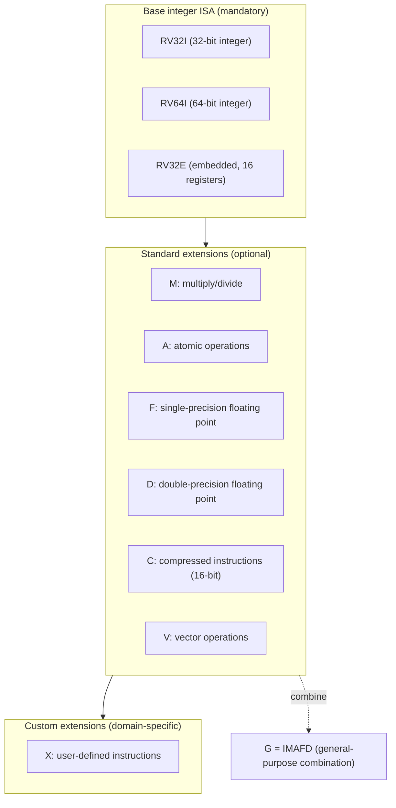
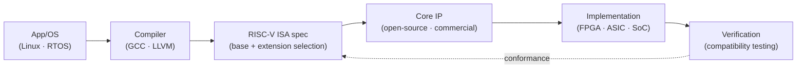

# RISC-V (Open Instruction Set Architecture)

## 1. Overview

### A. Definition
> **RISC-V** (pronounced "risk-five") is an **open (royalty-free) instruction set architecture (ISA)** that started at UC Berkeley and is managed by RISC-V International—a standardized ISA based on the reduced instruction set (RISC) that lets anyone design, manufacture, and sell processors without a license fee.

An ISA is the contract where software and hardware meet. It defines the types of machine-language instructions generated by the compiler, the registers, addressing modes, and exception-handling conventions; only if this contract is stable can compilers, operating systems, and applications be stacked on top of it. The problem is that until now this "contract" has been the **proprietary asset of a specific company**, like x86 (Intel/AMD) or Arm. For another company to make a compatible chip, it had to pay a huge license fee or access was impossible altogether. RISC-V made this contract itself an **open standard (to draw an analogy with open source, the 'specification' is open)**, converting the ISA from the property of a specific vendor into a shared asset of the community.

### B. Background and Necessity
Three currents lie behind RISC-V's rise to prominence. First, the **burden of license fees and lock-in**. Using an Arm core requires architecture and core licenses and royalties, and design freedom is also constrained. For startups, academia, and developers of domain-specific chips, this barrier to entry was very high. Second, the **rise of domain-specific architecture (DSA)**. As the slowing of Moore's law brought general-purpose CPU performance improvement to its limits, custom accelerators tailored to workloads such as AI, networking, and storage became necessary, and RISC-V, which can **freely add custom instructions** to its base instructions, fits this need precisely. Third, **technological sovereignty and supply-chain stability**. Amid US–China technological tension and the reshaping of semiconductor supply chains, an open ISA not dependent on a specific country or company has emerged as a strategic alternative at the national and corporate levels. As these needs converged, RISC-V is being rapidly adopted from embedded to data centers and automotive.

## 2. Design Philosophy and Architecture Structure

RISC-V's core design philosophy is to place **optional extensions** modularly on top of a **small, stable base instruction set (Base)**. This is the idea of "picking and packing only what you need," letting a single ISA family cover everything from ultra-small IoT controllers to server-class processors.

The base ISA is divided into **RV32I / RV64I** (32-bit and 64-bit, respectively), which hold only integer operations, and **RV32E** for ultra-small use, which reduces the number of registers. This base set is very small at about 40 instructions and, **once finalized, is frozen forever**, guaranteeing backward compatibility. **Standard extensions** are appended to this with letters. These are multiply/divide (M), atomic operations (A), floating point (F/D), 16-bit compressed instructions (C), and so on, and the commonly used combination IMAFD is bundled and denoted **G (General)**. For example, `RV64GC` means a processor that supports "64-bit + general-purpose + compressed."

Especially important is the **custom extension (X extension)**. Using the instruction-encoding space reserved by the standard, a designer can add their own instructions—for example, an AI inference chip can define a matrix-multiply instruction, and a crypto accelerator an AES-round instruction, directly, greatly improving performance and power efficiency. This extensibility is the key differentiator that makes RISC-V not a mere "free Arm substitute" but a **platform for domain-specific computing**.

### A. Privileged Architecture and Execution Modes
For an operating system or hypervisor to run, the ISA must define a privilege hierarchy. RISC-V defines this separately as a **privileged architecture specification**.

| Mode | Abbreviation | Purpose |
|---|---|---|
| **Machine** | M | Highest privilege, firmware/bootloader, mandatory in all implementations |
| **Supervisor** | S | OS kernel (Linux, etc.), virtual-memory management |
| **User** | U | Application programs |
| **Hypervisor** | HS | Virtualization extension (H), running guest OSes |

The simplest microcontroller need only have **M mode**, an application processor running Linux uses the three modes M, S, and U, and a server needing virtualization adds the H extension on top. This structure of selectively implementing only the needed privilege layers carries RISC-V's extensibility philosophy through even into the privileged domain. At boot, M-mode firmware (OpenSBI, etc.) initializes the hardware and hands control to a higher bootloader (U-Boot) and kernel through the **SBI (Supervisor Binary Interface)** convention, securing OS portability.

## 3. Ecosystem and Development Flow

An ISA alone does not make a product. A real ecosystem forms only when compilers, operating systems, verification tools, and IP cores are provided together. RISC-V already supports GCC/LLVM compilers, the Linux kernel, and RTOSes such as FreeRTOS/Zephyr, and commercial and open-source core IP is widely distributed.

Developers choose a **base + necessary extension combination** to fit the target workload, select a matching core IP or design their own, verify it on an FPGA, and mass-produce it as an ASIC/SoC. Because software fragmentation arises if different extension combinations proliferate, RISC-V International standardizes **profiles (e.g., RVA23)** and **platform specifications** that bundle commonly used extensions, guaranteeing interoperability so that "any Linux distribution runs on any RISC-V chip." Representative open-source cores include Berkeley's Rocket and BOOM and the low-power Ibex, and on the commercial side, SiFive, Andes, and others supply IP.

## 4. Comparison with Other ISAs and Application Cases

To understand RISC-V's position, it is accurate to view the difference from x86 and Arm **not as a difference in technical characteristics but as a difference in business model**. x86 is a CISC family virtually monopolized by Intel and AMD; it holds powerful software assets in the PC and server markets but is closed. Arm is a RISC family that dominated mobile and built a broad ecosystem through a licensing business, but royalties and design constraints still apply. RISC-V is fundamentally different in that the **ISA itself is free and open**, which is why it is adopted even at the cost of inferior maturity (software and toolchain).

| Category | x86 | Arm | RISC-V |
|---|---|---|---|
| Family | CISC | RISC | RISC |
| License | Closed (virtual monopoly) | Paid license / royalties | **Open / free** |
| Extension / custom | Not possible | Limited | **Free (X extension)** |
| Main market | PC / server | Mobile / embedded | Embedded → spreading to all areas |
| Ecosystem maturity | Very high | High | Growing |

Actual adoption spread first in low-power embedded. For example, large semiconductor companies replaced the **management microcontrollers and storage controllers** inside their SoCs with RISC-V to cut royalties, and Western Digital announced that it would apply its own RISC-V cores en masse to its storage products. In the AI-accelerator field, RISC-V control cores with custom vector/matrix instructions are used, and adoption is increasing in reliability-critical areas such as automotive and space and in state-led processor development projects. However, in markets where **vast existing software compatibility** is decisive, such as desktops and general-purpose servers, the wall of x86 and Arm is still high, so entry is proceeding in stages.

## 5. Advanced: Recent Trends and Standardization Issues

RISC-V's recent focus is on **organizing standard profiles** to rise from an "embedded niche" to "application-processor and data-center class." The RVA22 and RVA23 profiles for application processors have been finalized, bundling as mandatory the extensions required by higher software such as Linux and Android (vector V, virtualization H, bit-manipulation B, etc.) to suppress fragmentation. Also, the **vector extension (V)** is a key that governs performance in data-parallel workloads (AI inference, media), and it adopts a vector-length-agnostic design so that the same binary runs on hardware of various vector widths.

At the same time, challenges arising from openness come to the fore. The risk of **fragmentation** is the flip side of the advantage of freely combining extensions; if it is not controlled by profile and platform standards, the problem of "it's the same RISC-V, but the software doesn't run" arises. Geopolitically, the concern that an open ISA could become a channel for circumventing export controls coexists with the expectation that it is a neutral foundation not dependent on any particular camp. On the security side, because custom extensions can introduce unverified hardware vulnerabilities, the standardization of **trusted execution environments (TEE) and physical-attack countermeasures** is underway.

## 6. Considerations and Implications

From the engineer's perspective, the following should be judged comprehensively when adopting RISC-V and establishing a strategy.

- **Application strategy (phased adoption)**: Rather than a wholesale switch, a realistic phased roadmap is to introduce it first in areas with **little software-compatibility burden**, such as auxiliary cores and controllers inside an SoC, to cut royalties and accumulate capability, then expand to application processors and accelerators.
- **Trade-off (freedom vs. maturity)**: The freedom of extension and customization is powerful, but the maturity of the toolchain, verification, and software ecosystem still falls short of x86 and Arm. Decisions must be made by quantitatively comparing development/verification cost against the royalties saved and the differentiation value secured.
- **Fragmentation management**: Overusing one's own custom extensions sharply increases software-maintenance cost. Governance is needed that makes **conformance to standard profiles** a principle and limits customization to hotspots where performance is decisive.
- **Technological-sovereignty and supply-chain perspective**: An open ISA is a strategic means of reducing dependence on a specific vendor, but because actual chip manufacturing still depends on foundries, EDA, and IP, one must soberly recognize that opening the ISA alone does not achieve full self-reliance.
- **Outlook**: On the large current of a slowing Moore's law and the spread of domain-specific computing, RISC-V's adoption is expected to accelerate around embedded, AI acceleration, and automotive, and as profile standardization advances, expansion into application-processor and server areas is also expected to begin in earnest.

## References
- RISC-V International, "RISC-V Specifications", https://riscv.org/technical/specifications/
- RISC-V International, "RVA23 Profile", https://riscv.org/announcements/2024/10/risc-v-rva23-profile-is-now-ratified/

---
> **In one line**: RISC-V is an open, free instruction set that places standard and custom extensions modularly on top of a small, fixed base integer ISA, enabling escape from license dependence and domain-specific computing, and is a strategic architecture spreading from embedded to AI and servers.
