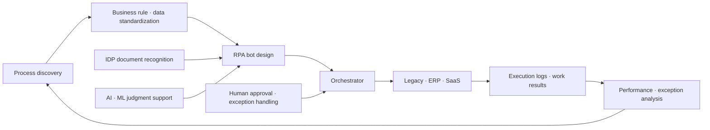
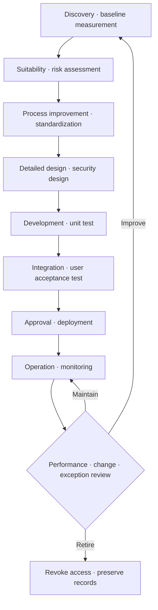

# RPA (Robotic Process Automation) and Intelligent Process Automation (IPA)

## 1. Overview

### A. Definition

> RPA (Robotic Process Automation) is an automation approach in which software robots (bots) execute, according to defined rules, repetitive work that people used to perform by moving across the screens, files, and APIs of multiple business systems.

> IPA (Intelligent Process Automation) is a business automation framework that, centered on RPA, combines process mining, IDP (Intelligent Document Processing), artificial intelligence/machine learning, natural language processing, and orchestration to connect recognition, judgment, execution, and learning.

The core of RPA is not the technology of imitating people itself, but making business rules explicit as executable procedures and making their execution repeatable and auditable.
Therefore, if it is understood only as a simple macro that clicks screen coordinates, maintenance becomes drastically harder when the target work changes.
Robots should be deployed only after first defining the work's inputs, rules, exceptions, approvals, results, and accountable parties.

RPA bots generally work through the application's user interface, files, email, databases, or APIs.
If an API is reliably provided, direct integration is more robust than screen automation, but where there is no API or it is hard to change—as with old legacy systems—screen automation becomes a realistic complementary means.
However, screen automation is vulnerable to layout and identifier changes, so the long-term goal should be to move to standard APIs and event-based integration.

### B. Background and Need

Work in enterprises and public institutions is distributed across different systems such as ERP, groupware, electronic approval, customer management, and tax/procurement systems.
Staff repeatedly enter the same customer number and amount into multiple screens, download attachments and rename them, and pass items that do not conform to rules back to people.
Such work makes people spend time waiting, copying, and verifying rather than on high-value judgment, and it accumulates input errors and omissions.

RPA can be an intermediate strategy for legacy modernization in that it automates part of the workflow without immediately replacing existing systems.
However, automation also carries the risk of repeating a bad process faster.
If unnecessary approvals, duplicate entry, and ambiguous responsibility from manual work remain as they are, only the number of bots increases while overall processing quality does not improve.
Therefore, RPA must be designed together with the prerequisite tasks of process improvement, data standardization, and system integration.

### C. Goals and Expected Effects

First, reduce repetitive input to lower processing time and operating costs.
Second, apply the same rules consistently to reduce omissions and simple input errors.
Third, log every execution, exception, and approval to improve auditability and traceability.
Fourth, free employees from copy-and-reconcile work so they can focus on customer service and exception judgment.
Fifth, build an operating system that discovers automation candidates with data and continuously measures results.

Effects should not be evaluated merely by the number of items a bot processes.
The real baseline must measure human time, waiting time, rework rate, error rate, exception rate, customer impact, and control costs together.
For example, in work processing 10,000 items per month, if 4 minutes per item are saved but a new 1 minute of exception review arises, the net time saved is not 4 minutes.
The entire value chain before and after automation must be compared so that investment decisions are not distorted.

## 2. Core Concepts and Scope

### A. Components of RPA

RPA is not complete with development tools alone.
It requires an analysis domain that discovers and designs work, a development domain that builds bot packages, a control domain that distributes execution, and a governance domain that manages secrets and permissions.

| Component | Main role | Management points from a professional engineer's perspective |
|---|---|---|
| Bot development tool | Implements task sequence · conditions · exceptions as workflows | Reusable components, configuration management, code review |
| Execution robot | Performs work in attended or unattended mode | Isolation, capacity, concurrency, failure recovery |
| Orchestrator | Centrally manages deployment · schedules · queues · status · permissions | Single point of failure, audit logs, segregation of duties |
| Credential vault | Secure storage and injection of accounts · tokens · certificates | No hardcoding, rotation, least privilege |
| Process · work queue | Manages per-item input, priority, retries, manual handoff | Duplicate processing prevention, idempotency, SLA |
| Monitoring | Observes success · failure · delay · exceptions and resources | Alert criteria, root cause analysis, KPI linkage |

Bot development tools express business rules as readable flows, but being visual does not by itself guarantee quality.
Condition priorities, data formats, timeouts, retry counts, and owners of exceptions must be specified so that operators can reproduce the intent.
Because execution robots exercise user privileges on their behalf, patching, backup, and access control must be applied to them just as to ordinary servers.

The orchestrator is the central control room.
Here, scheduled robot execution and version deployment, work queue distribution, and execution results and audit records are managed.
Centralization improves control and visibility, but because an orchestrator failure can block the execution of many bots, redundancy and recovery procedures must be designed.

### B. Conceptual Diagram of RPA and IPA

In the structure above, process discovery is the stage of deciding what to automate, and bot design is the stage of turning the discovered work into controllable execution units.
Execution results must flow back into discovery and analysis for automation to become an improvement cycle rather than one-off development.
IDP extracts structured values from PDFs, images, and emails, and AI/ML supports classification or prediction.
However, if a model's probabilistic output is used directly for final processing, errors propagate, so confidence thresholds and human review paths are needed.

### C. Distinguishing RPA, IPA, BPM, and API Integration

RPA is closer to tactical automation that replaces human interaction with software on top of existing applications.
BPM is an operating framework that manages business rules, organization, approvals, and state as a process model, and RPA can be an execution means that performs some of its tasks.
API integration exchanges data through contracts provided by systems, so it is less sensitive to screen changes and more maintainable in the long term.
IPA can be described as a higher-level concept that combines these automation means with document understanding and AI judgment support.

| Category | RPA | BPM/workflow | API · service integration | IPA |
|---|---|---|---|---|
| Main target | Repetitive tasks | Entire process and approvals | Data · functions between systems | Work mixing recognition · judgment · execution |
| Decision method | Explicit rules | Modeled rules · state | Service contracts | Rules + AI support + human judgment |
| Strengths | Fast adoption, legacy support | Standardization of responsibility and flow | Robustness · performance · reusability | Handles unstructured input and complex work |
| Main limitations | Screen changes · growing exceptions | Build scope and change cost | Requires prior API development | Explainability · bias · verification burden |

The differences arise not from superiority but from the boundaries of the problem.
If multiple systems must be connected via screens and business rules are stable, RPA is a fast solution.
Conversely, if high-volume, high-frequency transactions are operated long-term and the systems can be controlled, API integration is more suitable.
To change approvals and responsibilities across the entire work, it is safer to place BPM at the center and deploy RPA as a peripheral adapter.

## 3. Selecting Automation Targets and the Lifecycle

### A. Candidate Discovery and Prioritization

Automation candidates are not decided by business-unit interviews alone but by analyzing process logs, volume, work hours, and error/rejection records together.
Process mining shows the actual order of events and variant paths, revealing the difference between the documented standard procedure and the actual procedure.
Task mining can observe individuals' screen operations, but policies on purpose, retention, and access must first be established to reduce privacy concerns and misperceptions of surveillance.

Good initial candidates have high volume, clear rules, stable input formats, and few exceptions.
Conversely, for work where human negotiation, creative judgment, or interpretation of organizational policy is central, decision support should be considered before full automation.
If work is concentrated only at month-end and source data is inaccurate, data quality and workload leveling come before bot development.

Priority is decided by scoring expected benefit, implementation difficulty, change risk, regulatory sensitivity, and reusability.
For example, weights of benefit 40%, technical ease 25%, controllability 20%, and strategic fit 15% can be applied and evaluated on a 5-point scale.
Since weights change according to organizational goals, they should be used not as an absolute formula but as an agreed-upon decision record.

### B. Automation Lifecycle

In the discovery stage, the current volume and success/failure/exception baselines are recorded.
In the design stage, exception flows should be drawn before normal flows.
The design covers what to do if an input file is missing or duplicated, how far to retry if a system is slow or authentication expires, and when a human intervenes.

In development and testing, do not use only normal data; reproduce boundary values, encoding errors, insufficient permissions, duplicate events, and partial success.
Before production deployment, the business owner and security/audit personnel must confirm the results and control evidence.
During operation, manage not only simple success rates but also the dwell time of the exception queue and the manual fallback rate, and perform impact analysis when source system changes are detected.

### C. Operating Model and Responsibilities

Enterprise operations commonly use a federated model of a central CoE (Center of Excellence) with business units and IT.
The CoE manages platform standards, reusable assets, security criteria, development methodology, and training.
Business units own the purpose and exception rules of processes, and IT handles infrastructure, integration, deployment, and incident response.
Audit and security organizations set approval and log retention criteria according to risk level.

If the RACI is not clear, business staff and platform operators shift blame to each other when a bot fails.
The process owner is responsible for the business accuracy of results, and the bot owner is responsible for automation logic and change history.
The platform operator is responsible for the execution environment and capacity, and the security officer verifies accounts, permissions, secrets, and audit controls.

## 4. Technical Architecture and Implementation Principles

### A. Execution Modes

Attended RPA runs as an assistant at the point when a user starts or approves a task.
A typical example is having it handle lookup, copying, and verification when a call-center agent enters customer information into multiple screens, with the human judging exceptions in real time.
This mode is easy to control but is affected by the user's session and terminal state and has limits on throughput scaling.

In Unattended RPA, a central scheduler assigns bots to virtual machines or containerized execution environments.
It is suitable for targets with stable business rules and little need for immediate human intervention, such as large batches, overnight reconciliation, and periodic report generation.
On the other hand, because highly privileged bot accounts automatically operate multiple systems, isolation of secrets, networks, and execution images is essential.

### B. Data and Exception Handling

Each item in the work queue must have a unique business key, input time, priority, current status, retry count, and result code.
Without a unique key, the same transaction may be processed twice upon network retransmission or scheduler re-execution.
Therefore, processing steps should be made idempotent where possible, and state before and after writing to external systems should be stored.

Exceptions are divided into system exceptions and business exceptions.
Disconnections, timeouts, and file locks can be recovered with a set number of exponential backoff retries, but amount mismatches and unmet eligibility requirements are not resolved by repetition, so they are sent to a human review queue.
Retrying all exceptions amplifies failures and blocks the work queue, so error classification and isolation criteria are needed.

Logs should record the flow of input, decision, and output, but should not retain sensitive information such as resident registration numbers, account numbers, or health information as-is.
A log correlation ID is used to trace the processing flow of a single item, and masked, hashed, or tokenized values are used instead of originals.
Retention periods and viewing permissions are also restricted according to business purpose and legal requirements.

### C. Security Controls

A bot, though not a person, is a non-human identity that accesses organizational assets.
Each bot is given a unique account, shared accounts are avoided, and only the necessary applications and functions are allowed with least privilege.
Credentials are not stored in code, configuration files, or logs, but injected at runtime from a dedicated vault, and must be revocable immediately upon departure, role change, or incident.

Development, test, and production environments are separated, and unauthorized copying of production data is prohibited.
Bot packages are assigned approved versions and hashes, and deployers are separated from developers to apply dual control over changes.
Execution images and dependency libraries are checked for patch status, and bots that process external files have restrictions against malicious files, macros, and zip bombs.

IPA involving AI introduces separate risks.
Document classification or extraction results may be wrong, and changes to prompts, models, or training data can change results.
Record model version, input source, confidence, and whether human approval was given, and establish a human-in-the-loop (HITL) policy under which low-confidence results are not automatically finalized.

## 5. Comparison and Application Cases

### A. Comparison of Screen Automation and API Automation

Screen automation has the advantage of quickly connecting legacy systems.
For example, when an external supplier's old client has no API, a bot operating the screen can improve the work without waiting for system replacement.
However, it can fail when button positions or pop-up text change, incurring change management and regression testing costs.

API automation uses contracted fields and error codes, so it excels at high-volume processing, retries, and observability.
Instead, it requires upfront investment in API development, approval, and versioning, and is hard to apply in the short term without authority to change internal systems.
Therefore, a phased strategy is reasonable: relieve bottlenecks with RPA in the short term, and transition to API integration in the long term based on usage and failure data.

### B. Case 1: Purchase Invoice Reconciliation

Assume that hypothetical manufacturer Company A receives 12,000 invoices per month, and staff read amounts from PDFs and reconcile them against the ERP and purchase contracts.
Previously, each item took an average of 5 minutes, requiring 1,000 hours in total, and about 8% of items had amount mismatches or omissions.
These figures are not actual corporate statistics but assumptions to explain automation feasibility assessment.

IPA is designed to collect email attachments, extract supplier, contract number, and amount with IDP, and then have RPA look up ERP and contract data.
If confidence is 98% or higher and the amount is within the contract tolerance, reconciliation is automatic; other items are sent to the staff queue with the original and supporting fields.
Storing the file hash and business key before processing prevents duplicate processing of the same document.

Assuming 80% are auto-finalized at 1 minute per item and the remaining 20% require human review at 6 minutes per item, total time is 12,000×0.8×1 min + 12,000×0.2×6 min = 2,400 minutes.
Compared with the baseline of 60,000 minutes, pure processing time decreases by 57,600 minutes, but IDP licensing, operations, and exception review costs must be deducted to obtain the net benefit.
Performance metrics consist not only of time savings but also of reconciliation accuracy, average dwell time in the exception queue, duplicate prevention rate, and completeness of audit evidence.

### C. Case 2: Public Complaint Intake Support

Assume that hypothetical public institution B routes 2,000 complaint emails per day to departments by topic.
A classification model suggests candidate departments using the subject, body, and attachment type, and RPA registers the receipt number and metadata in the complaint management system.
If sensitive information is included or classification confidence is below the threshold, automatic routing stops and staff confirmation is required.

The key in this case is not maximizing the automatic processing rate.
Because routing to the wrong department can affect statutory processing deadlines and citizens' exercise of rights, explainable classification grounds and a path to object and correct must be guaranteed.
After model updates, reproduction tests are run with past samples, and it is checked whether per-department misclassification rates are skewed toward particular types.

RPA handles intake screen entry and notification sending, AI generates classification candidates, and humans approve exceptions that affect rights and responsibilities.
Separating roles in this way allows both the speed of automation and administrative accountability to be managed.

## 6. Advanced: Governance and Future Direction of Enterprise Automation

The U.S. GSA's RPA security procedure treats bots like ordinary users accessing the network and target applications, and distinguishes between attended and unattended execution environments.
It also indicates that bots using AI/ML require separate approval and security control review.
This offers the practical implication that bots should be viewed not as simple macros but as privileged operating entities subject to lifecycle controls.

GSA/Digital.gov RPA materials emphasize clear planning, collaboration, process improvement, balanced governance, and fit-for-purpose technology selection in program adoption.
Therefore, an automation CoE should not merely provide tool training but should standardize candidate discovery, risk rating, exception design, and performance verification.

The evolution of RPA is moving not toward an extension of simple screen manipulation but toward process intelligence.
Process mining discovers actual flows, IDP structures unstructured documents, AI supports classification and prediction, and RPA or APIs execute the results.
If the boundary between models and rules is not made clear in this process, accountability and verification methods become ambiguous.

Going forward, a hybrid structure is desirable in which event-based integration and APIs become the main execution path, while RPA focuses on legacy touchpoints and human assistance.
Recording API conversion potential, data standardization level, and system change impact from the time automation candidates are created can prevent temporary automation from hardening into structural technical debt.

## 7. Considerations and Implications

### A. Process Redesign First

Before replicating the current procedure as-is in a bot, remove unnecessary approvals and duplicate entry.
Automation logic becomes stable only with an improved standard process and exception definitions.

### B. Security and Privacy Protection

Bot accounts are managed on the principles of least privilege, unique identification, and periodic revocation.
Sensitive information is limited in processing purpose and retention period, and masked in logs, screenshots, and training data.

### C. Reliability and Recovery

Design idempotency, retries, compensation processing, and manual fallback assuming timeouts, duplicates, and partial success.
RTO/RPO, queue preservation, and reprocessing order in the event of orchestrator and execution environment failures must be tested.

### D. Control of AI Integration

Measure model confidence and error types, and require human approval for decisions with legal or financial impact.
Record versions of models, prompts, datasets, and rules so that it can be explained why results changed.

### E. Operational Performance and Economics

Do not target the automation rate alone; consider net processing time, exception rate, rework rate, quality, user satisfaction, and control costs together.
Define pilot exit criteria and retirement criteria in advance so that bots without results are not maintained indefinitely.

### F. Standardization and Technical Debt

Standardize reusable connectors, naming conventions, error codes, log schemas, test data, and deployment pipelines.
Manage candidates and deadlines for transitioning screen-dependent bots to APIs, events, and business services to secure the long-term health of the automation portfolio.

### G. Change Management and Human-Centered Design

Bot adoption is not only headcount reduction but a redesign of roles and a change in control responsibilities.
Sustainable results come only when business units participate in design, verification, and exception handling, and an operating culture that does not hide automation failures is established.

## References

- U.S. General Services Administration, *IT Security Procedural Guide: Robotic Process Automation (RPA)*: https://www.gsa.gov/system/files/Robotic-Process-Automation-%28RPA%29-Security-%5BCIO-IT-Security-19-97-Rev-3%5D-02-14-2023.pdf
- Digital.gov / GSA, *Guide to robotic process automation*: https://digitalgovernmenthub.org/library/guide-to-robotic-process-automation/
- IEEE, *IEEE Std 2755-2017 Guide for Terms and Concepts in Intelligent Process Automation*: https://standards.ieee.org/standard/2755-2017.html
- ACT-IAC, *RPA Product Survey Report*: https://www.actiac.org/system/files/RPA%20Product%20Survey%20Report_1.pdf

---

> **In one line**: RPA is a robot that executes repetitive work, and IPA is a business innovation framework that connects process discovery, document understanding, AI judgment, human approval, and automated execution together with governance.
