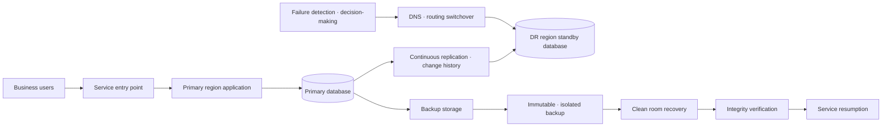
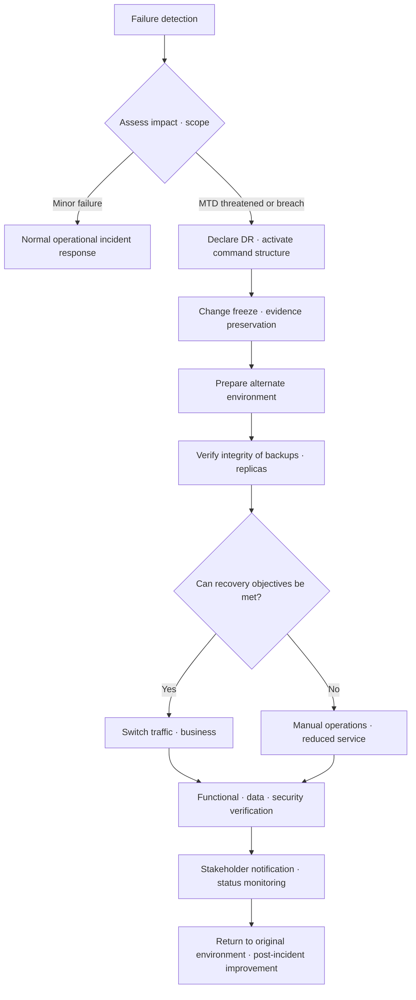

# Disaster Recovery Strategy Based on RPO · RTO · MTTR

## 1. Overview

> Disaster Recovery (DR) is a managerial and technical framework for restoring core business functions and services within predefined time and data-loss limits when information systems are interrupted or data is damaged by natural disasters, failures, cyberattacks, human error, and the like.

Modern enterprise work is performed with applications, databases, networks, authentication, external APIs, and the cloud control plane all interconnected.
Therefore, simply turning a single server back on does not normalize business functions such as ordering, payment, inventory, and customer support.
The scope of recovery includes data freshness, dependent services, operating staff, and even procedures and decision-making authority.

A disaster does not mean only physical events such as earthquakes or fires.
Storage malfunctions, faulty deployments, administrator mistakes, ransomware, region outages, certificate expiration, and massive traffic spikes can also be disasters from a business perspective.
In particular, ransomware can encrypt production data and online backups simultaneously, so simple replication alone cannot guarantee safe recovery.

The purpose of disaster recovery is not "to ensure failures never occur".
Its purpose is to presuppose failures and repeat prevention, detection, response, recovery, and learning so that business continues within acceptable service interruption and data loss.
High Availability (HA) is closer to the ability to keep providing service during a failure, while DR is closer to the ability to resume business in an alternate environment after a severe failure.
The two frameworks are complementary but should not be treated as the same concept.

In a professional engineer's exam answer, one should first present the logic of converting business requirements into recovery objectives rather than listing backup types.
A persuasive sequence is to identify core business functions and dependencies through Business Impact Analysis (BIA), set MTD, RTO, and RPO, and then select a recovery method suited to cost and complexity.
Finally, recovery drills and metric verification must confirm that the plan actually works.

### A. Background and Need

First, the business losses from digital service interruptions have grown.
If online ordering stops for an hour, it is not only sales opportunities that shrink; payment reprocessing, customer compensation, inventory inconsistencies, and reputational damage follow in a chain.
In finance, healthcare, and public services, service interruptions can escalate into matters of safety and legal obligation.

Second, data is harder to recover than systems.
Verifying the consistency of recent transactions, removing duplicate transactions, and reconciling state with external institutions can take longer than preparing a new server.
Therefore, recovery objectives must specify not only server uptime but also to which point in time data will be restored.

Third, the cloud does not automatically complete DR for you.
Even when deployed across multiple availability zones, incorrect permissions, application bugs, and logical deletions can propagate simultaneously.
Even when replicated to another region, replication lag, DNS switchover, key management, external dependencies, and operator privileges must be designed separately.

## 2. Business Objectives and Key Metrics

Disaster recovery design must not begin with the technical team arbitrarily setting numbers.
The impact and tolerance limits of a prolonged outage must be agreed upon with business owners, and the results translated into service levels and recovery procedures.
Even within the same organization, payment authorization and the internal bulletin board have different tolerable downtimes, so lumping per-business objectives into a single value leads to over- or under-investment.

### A. BIA and Business Prioritization

BIA is the activity of analyzing, over time, the financial, legal, customer, and operational impact of an interrupted business process.
The analyst investigates business functions, responsible departments, input/output data, interdependent systems, minimum operating levels, feasibility of manual workarounds, and maximum tolerable downtime.
What is important here is setting priorities based on business flows, not on a list of systems.

For example, a shopping mall's product recommendations can be absent temporarily while ordering itself remains possible, but without payment authorization and the order ledger, sales processing and delivery cannot proceed.
Therefore, the recommendation service and the order ledger can have different recovery tiers.
BIA results classify business functions into tiers such as Tier 0, 1, and 2, and link each tier to the necessary recovery procedures, staff, and budget.

BIA records both quantitative and qualitative impacts.
Quantitative items can include revenue per minute, number of unprocessed transactions, SLA penalties, and recovery costs.
Qualitative items are impacts difficult to express in money alone, such as safety risks, personal data exposure, regulatory violations, and loss of trust.
Excluding qualitative impacts because they are hard to quantify distorts the priorities of core public and financial services.

### B. Relationship Among MTD · RTO · RPO · MTTR

MTD (Maximum Tolerable Downtime) is the maximum interruption time the business can endure.
Beyond MTD, it is judged that even viable alternate operations become impossible or losses grow irreversibly.
RTO (Recovery Time Objective) is the target time from the occurrence of a failure to restoring the agreed level of service, and generally RTO must be shorter than MTD.

RPO (Recovery Point Objective) is the tolerable data loss, indicating how far back in time from the failure the recovery point may be.
An RPO of 15 minutes means that, in the worst case, data committed in the most recent 15 minutes may be lost.
RPO is not the same as the simple backup interval, and must be measured including backup completion, transfer, verification, and restorable state.

MTTR (Mean Time To Repair/Recover) is an operational metric indicating the average time to recover from actual failures.
If RTO is the target, MTTR is the performance observed across repeated failures; if MTTR is consistently longer than RTO, it means design, automation, and training are not meeting the target.
MTBF (Mean Time Between Failures) is the average time between failures, used to interpret not only recovery but also preventive investment and reliability trends.

| Metric | Question | Meaning in design · operation |
|---|---|---|
| MTD | How long at most can the business stop? | Business survival limit and top-level constraint |
| RTO | Within how long, and to what level, will service be restored? | Alternate environment · staff · procedures · automation capacity |
| RPO | Up to what point must data be preserved? | Backup · replication frequency and consistency design |
| MTTR | How long does actual recovery take on average? | Operational maturity and improvement trend |
| MTBF | What is the average interval between failures? | Judging prevention · quality · reliability investment |

RTO and RPO are independent axes.
Even if servers come up quickly, RPO may not be met if the data is a day old; and even with a recent backup, RTO may not be met if the restore procedure takes hours.
For example, a payment ledger may require an RPO within minutes and an RTO within tens of minutes, whereas an analytical data mart may tolerate an RPO of hours and an RTO of a day.

### C. Tiering Recovery Objectives

Applying zero downtime and zero data loss to every system is not realistic.
The stricter the objectives, the more costs increase for redundant equipment, dedicated networks, synchronous replication, standby staff, and regular drills.
Therefore, service tiers are created by jointly evaluating business criticality, data change volume, legal requirements, and recovery cost.

| Example tier | Business characteristics | Example RTO | Example RPO | Suitable approach |
|---|---|---:|---:|---|
| Tier 0 | Life safety · payment · core control | Within minutes | Seconds ~ minutes | Always-on standby, multiplexing, automatic failover |
| Tier 1 | Core customer business | Tens of minutes ~ hours | Minutes ~ tens of minutes | Warm standby, continuous replication, automation |
| Tier 2 | Internal · analytical work | Hours ~ one day | Hours ~ one day | Periodic backup, manual recovery |
| Tier 3 | Records · reference work | Several days | One day or more | Long-term archival backup, procedure-centric |

The numbers in the tier table vary by organization and are not presented as absolute standards.
What matters is recording the rationale and verification method for each objective together.
If "RTO 1 hour" is set, it must be tested whether alternate resources are actually ready within 1 hour, whether DNS and authentication allow that time, and whether staff can execute it even during shift changes.

## 3. Disaster Recovery Architecture and Data Protection

DR architecture is selected according to the failure scope and recovery objectives.
Single-server failure, availability zone failure, region failure, account takeover, and logical data corruption require different responses.
Do not try to solve every scenario with one replication technology; combine protection layers by failure domain.

Replication between the primary and DR regions reduces data loss but can also replicate logical errors.
For example, if an operator executes an erroneous DELETE, asynchronous replication may propagate that deletion as a normal change.
Therefore, separately from replication, point-in-time recoverable backups, delayed deletion, change history, and immutable retention must be provided.

Immutable backup is a method that locks backup data so it cannot be modified or deleted for a certain retention period.
In ransomware response, it is important to separate production accounts from backup deletion privileges and to isolate backup storage with separate accounts, networks, and credentials.
The key is not the fact that backups exist, but whether an attacker cannot delete or encrypt backups with production privileges alone.

### A. Difference Between Backup and Replication

Backup preserves data at a specific point in time on separate media, enabling a return to a past state.
Replication delivers changes to another system, maintaining a standby copy close to the latest state.
Replication reduces RPO and speeds up switchover, but it can also propagate corrupted changes and so cannot replace backup.

Full backup makes recovery simple but requires much storage space and time.
Incremental backup stores only changes since the last backup, so it is efficient, but recovery requires reading the base full backup and multiple incremental sets in order.
Differential backup accumulates changes since the last full backup, so it uses more storage than incremental but can shorten the recovery chain.

| Method | Strengths | Weaknesses | Suitable control |
|---|---|---|---|
| Full backup | Simple and independent recovery procedure | Time · storage burden | Periodic baseline, long-term retention |
| Incremental backup | High transfer efficiency due to small change volume | More recovery chain links and failure points | Frequent backups, large-scale data |
| Differential backup | Relatively few sets needed for recovery | Backup size grows over time | Balanced operation |
| Snapshot | Fast point-in-time recovery and operational convenience | Vulnerable to same-storage failure · logical errors | Short-term recovery, auxiliary means |
| Continuous replication | Low RPO and fast switchover | Corruption propagation and complexity | Core services, standby environment |

In practice, full backup, incremental backup, replication, and offline or logically isolated storage are used together.
Retention periods should be divided into short-term copies for operational recovery, medium-term copies for incident investigation, and long-term copies for legal and audit purposes.
Backups containing personal data and encryption keys are subject to access control, encryption, and destruction policies equal to or stronger than the originals.

### B. Types of DR Sites

A cold site prepares only a minimal foundation such as power, space, and basic networking, and configures equipment and data upon failure.
It is low-cost, but procurement, installation, and verification take a long time, so it suits business functions that can accept a long RTO.
A warm site prepares some servers, networks, and data in advance to reduce recovery time, and a hot site constantly maintains an environment nearly identical to production, aiming for rapid switchover.

A hot site is not always best.
An always-on standby environment is costly and may share the same configuration errors or vulnerabilities as the primary environment.
In addition, data consistency, version differences, licenses, key management, and patch levels across both environments must be continuously managed.
The site type should be chosen within a range that does not exceed what each business function's RTO and RPO actually require.

## 4. Recovery Process and Operating Framework

Recovery is not a collection of technical commands but a standard procedure that includes decision-making.
If entry and exit conditions and approvers for each stage from detection to return to normal operation are not defined, multiple teams make different judgments and recovery is delayed.
The recovery plan must include, along with the staff contact list, system dependencies, credential procedures, data verification criteria, and customer notification templates.

### A. Detection and Declaration

Monitoring should not look only at whether servers are alive but should observe user-perspective error rates, latency, transaction success rates, and data lag.
Even if servers are healthy, if payment authorization or message publishing fails, the business is already interrupted.
Detection signals are delivered to on-call staff, who must classify impact and failure scope within a set time.

Declaring DR is a problem if too late and also if too early.
A late declaration consumes the MTD, while an erroneous declaration causes unnecessary data switchover and customer confusion.
Therefore, declaration conditions such as "core transaction success rate below threshold for a certain time", "estimated primary region recovery time exceeds RTO", and "ransomware indicators confirmed" are agreed upon in advance.

### B. Switchover and Recovery Verification

Turning on an alternate environment and recovering the business are different things.
Even if the database starts, incorrect transactions occur if the schema version, permissions, sequences, external integrations, or batch reference date do not match.
Before switchover, the recovered copy's checksum, record count, last known-good point, and sample transactions of core business must be verified.

Traffic switchover considers DNS, global load balancers, service discovery, and API gateway policies together.
Lowering the DNS TTL alone does not immediately move already-established sessions, and residual time in caches and mobile networks also exists.
After switchover, not only new requests but also duplicate payments, message reprocessing, out-of-order events, and external system callbacks must be checked.

After recovery, returning to normal operation (failback) is also handled as a separate plan.
If new transactions that occurred in the DR environment are not reverse-replicated to the original environment, data differences reconciled, and a window for switching back defined, the DR state becomes prolonged.
Rehearse both failover and failback, and measure the time taken at each stage to update the RTO calculation.

## 5. Comparison of Recovery Strategies and Application Cases

The choice of recovery method is a function of cost and recovery objectives.
Manual backup restoration is low-cost but depends on human judgment and working time, whereas always-on redundancy is fast but has high operating costs and configuration complexity.
When comparing architectures, include not only infrastructure costs but also the costs of data switchover errors, training, licenses, networking, and specialized staff.

| Strategy | Concept | Strengths | Main risks · costs |
|---|---|---|---|
| Backup and restore | Build a new environment from backups after failure | Cost-efficient, point-in-time recovery | Long RTO, dependent on recovery procedures |
| Pilot light | Minimal standby of core components only | Compromise between low cost and fast scaling | Requires startup · scaling automation |
| Warm standby | Operate a scaled-down alternate environment | Recovery in tens of minutes ~ hours | Capacity · version synchronization |
| Hot standby | Constantly maintain a nearly identical environment | Short RTO · low RPO | High cost, replication · switchover complexity |
| Active-active | Multiple environments serve simultaneously | Minimal interruption, capacity utilization | Distributed consistency · routing difficulty |

### A. E-commerce Case

An e-commerce company need not recover ordering, payment, inventory, delivery, and recommendations at the same tier.
The order ledger requires short RPO and RTO, so multi-availability-zone deployment, continuous replication, idempotency keys, and payment-provider re-query procedures take priority.
Recommendation models and analytics dashboards are separated so that even if recovered from past backups, they do not affect order processing.

When a region failure occurs, new orders are first throttled or queued, and request identifiers are verified so that payment authorization results are not processed twice.
If the inventory in the recovered copy is not current, business rules are needed to reserve inventory conservatively and notify customers of delays or partial cancellations.
This case shows that technical switchover and business policy must be designed together.

### B. Financial and Public Service Cases

In financial services, data integrity, audit trails, and regulatory reporting are important, so recovery completion cannot be declared on the simple criterion that "the service is open".
The order and verification responsibilities for transaction ledgers, authentication, message exchange, key management, and external institution integrations must be made clear.
Public services have different priorities by function, such as resident services, civil complaints, and welfare, so a phased service resumption including urgent complaints and alternate channels is designed.

In such environments, the recovery plan includes the approver of recovered data and the storage location for audit logs.
When a security breach is suspected, rather than immediately using the latest replica for convenience, the clean point in time and the scope of malicious activity must be confirmed.
For legal reporting and personal data protection, a framework in which the incident response team, legal, public relations, and business departments make decisions together is needed.

## 6. Advanced: Cloud · Cyber Recovery and Automation

The key to cloud DR is moving from replicating resources to "recoverable code and verifiable procedures".
Declaring networks, compute, permissions, and monitoring with IaC allows alternate environments to be created repeatedly, but if the IaC repository itself is compromised, malicious configurations are regenerated as well.
Therefore, code repository protection, approved changes, secret separation, image integrity, and pre-execution policy validation must be operated together.

Multi-region can isolate failure scope broadly, but data sovereignty, latency, cost, and differences in service features must be reviewed.
Synchronous replication can reduce RPO but is constrained by distance and network latency, while asynchronous replication reduces cost and latency at the expense of leaving the possibility of data loss.
Since cross-region replication alone cannot address logical deletion and ransomware, immutable backups in a separate account and clean room recovery are provided.

Clean room recovery is an approach that reconstructs services in an uncompromised isolated environment while verifying the operating system, tools, and data.
It can be designed so that recovery images are regularly scanned, recovery account privileges are normally locked, and they are used only temporarily during approved times.
This method may be slower than traditional availability-oriented DR, but it reduces the possibility that attackers remain and re-establishes a trustworthy baseline.

Automation contributes to shortening RTO, but unconditional automatic failover can amplify false positives and data corruption.
It is safer to leave human approval points for high-impact switchovers and to start automating low-risk steps such as preparing alternate resources, collecting backup inventories, and generating verification reports.
Automated tasks must be designed to be idempotent and must provide ways to restart, abort, and hand over manually upon failure.

## 7. Recovery Drills · Audit · Metrics Operation

A recovery plan must be evaluated by execution capability, not as a document.
Tabletop exercises check decision-making and communication structures, simulations verify actual switchover within a limited scope, and full recovery drills confirm business impact through to restoration.
Drill difficulty is matched to business criticality and risk, and where customer impact is a concern, one starts with an isolated environment or partial traffic.

During drills, planned RTO/RPO is compared with actual measurements.
For example, if backups ran on a 15-minute cycle but only data from 2 hours ago was recovered because the last backup failed verification, the actual RPO must be recorded, not the documented RPO.
Waiting time per recovery stage, number of manual tasks, error retries, and feasibility of staff handover are also measured.

Post-incident reviews look for systemic causes rather than blaming individuals.
They check whether the contact list is outdated, whether recovery privileges have expired, whether backups succeeded but had no restore verification, and whether the support hours in external provider contracts match the RTO.
Improvement items are assigned an owner, deadline, and completion evidence, and re-verified in the next drill.

| Operational metric | Measurement method | Improvement signal |
|---|---|---|
| Actual RTO | Measure from declaration to agreed service recovery | Eliminate causes of exceeding target |
| Actual RPO | Confirm the last known-good data point of the recovered copy | Reduce replication lag · backup gaps |
| Restore success rate | Periodic restore verification per backup set | Fix causes of failed backups |
| Drill completion rate | Execution rate of planned scenarios and steps | Reinforce unexecuted steps |
| Switchover error rate | Number of errors · duplicates · reprocessing after switchover | Strengthen idempotency · verification |
| Plan currency | Whether system · staff · dependency changes are reflected | Link change management with DR |

## 8. Considerations and Implications

### A. Business-Centric Objective Setting

Do not uniformly apply RPO and RTO as standard values of the infrastructure team; create a structure in which business owners approve losses.
Management can make investment decisions only when the increased costs and reduced risks of stricter objectives are presented together.
A professional engineer must link the service catalog, BIA, SLA, and budget to document the rationale for objectives.

### B. Separation of Replication and Backup

Replication is a means for fast switchover, while backup is a means for dealing with past states and logical errors.
Do not claim DR is complete with only one of the two; keep at least one backup copy separate from the production failure domain and independently verify its restorability.
Considering ransomware, deletion prevention, key separation, administrator separation, and offline or logical isolation become essential controls.

### C. Dependency and Supply Chain Management

Even if applications are recovered, business does not resume unless DNS, authentication, certificates, external payment, message brokers, observability, and support vendors are ready.
Maintain a service dependency list and recovery order, and reflect external providers' RTO, RPO, and support contacts in contracts and drills.
The failure scope of cloud providers and the customer's areas of responsibility must be confirmed per service.

### D. Security and Privacy Protection

Backups are another copy of sensitive information, so apply encryption, access control, key lifecycle management, and access auditing.
Include destruction and privilege revocation in the procedure so that temporary files and test accounts do not remain after recovery.
During a security incident, evidence preservation and service resumption may conflict, so ensure approval by the security officer and audit logs.

### E. Controllability of Automation

Automated switchover and restoration reduce time, but if executed under wrong conditions they can spread failures.
Design pre-execution approval, step-by-step verification, kill switches, rollback, manual handover, and execution logs, and minimize privileges.
Even when using IaC and pipelines, recovery results must be confirmed through business samples and data integrity.

### F. Continuous Change Management

When systems, data, organizations, regulations, or contracts change, the DR plan must change too.
Include recovery tier and recovery test plans in the launch approval of new services, and re-measure RTO/RPO after significant architectural changes.
Sustainable operation from a professional engineer's perspective means not ending regular drills as mere events but linking them to error budgets, reliability investment, and audit improvement backlogs.

## References

- NIST, "Contingency Planning Guide for Federal Information Systems (SP 800-34 Rev. 1)": https://nvlpubs.nist.gov/nistpubs/Legacy/SP/nistspecialpublication800-34r1.pdf
- AWS Well-Architected Framework, "Disaster recovery": https://docs.aws.amazon.com/wellarchitected/latest/reliability-pillar/disaster-recovery-dr.html
- Microsoft Azure Well-Architected Framework, "Disaster recovery": https://learn.microsoft.com/en-us/azure/well-architected/reliability/disaster-recovery
- Google Cloud Architecture Framework, "Disaster recovery planning guide": https://cloud.google.com/architecture/dr-scenarios-planning-guide

---

> **In one line**: Disaster recovery is not about adopting backup products but a strategy that designs RPO and RTO to fit business limits determined through BIA, and binds replication, immutable backups, alternate environments, and recovery drills into a verifiable operating framework to actually bring the business back.
