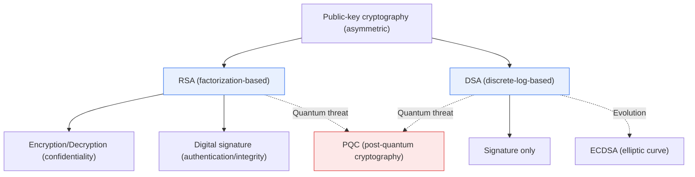
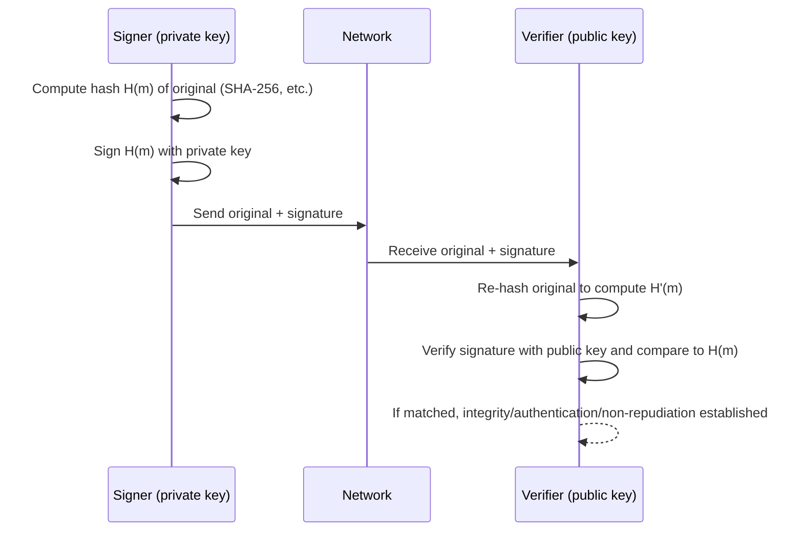

# Comparison of RSA and DSA

## 1. Overview

### A. Definition
> **RSA** (Rivest–Shamir–Adleman) is a public-key cryptographic algorithm based on **the computational difficulty of factoring large numbers**, and is a general-purpose algorithm capable of performing **both encryption (confidentiality) and digital signatures (authentication, integrity, non-repudiation)**.
>
> **DSA** (Digital Signature Algorithm) is a **signature-only** algorithm adopted as a U.S. federal standard (DSS, Digital Signature Standard), based on the hardness of the **Discrete Logarithm Problem** over a finite field.

The fundamental reason for comparing the two algorithms is that, while both belong to the same category of "asymmetric cryptography using a public/private key pair," **the mathematical hard problems they rely on and their design purposes differ**. Public-key cryptography exploits the property that the public key and private key are mathematically paired, so that what is transformed with one can be reversed only with the other. The character of an algorithm depends on which "one-way function" this property is built upon. RSA built this principle on **the difficulty of integer factorization**, and DSA on **the difficulty of the discrete logarithm**.

### B. Background and Necessity
Published in 1977, RSA was effectively the first practical public-key cryptosystem, and thanks to its versatility of "supporting both encryption and signatures," it became the standard of the Internet trust infrastructure, including SSL/TLS, S/MIME, code signing, and accredited certificates. However, along with patent and performance controversies, RSA raised the concern that "a signature standard would be difficult for the government to control," so the U.S. NIST proposed **DSA** in 1991 as a signature-only standard and finalized it in 1994 as FIPS 186 (DSS). In other words, DSA was designed from the outset **as a national standard for the single purpose of digital signatures**, and encryption functionality was intentionally excluded.

This difference in background directly affects practical choices. RSA suits general-purpose systems that seek to "solve both confidentiality and integrity with a single algorithm," while DSA suited areas where "only signatures are needed, but standards compliance and signature-generation speed matter." However, as discussed below, DSA today has been effectively replaced by elliptic-curve-based **ECDSA** and **EdDSA**, and the latest U.S. standard (FIPS 186-5, 2023) has deprecated DSA for new signature generation.

### C. Mathematical Foundations of the Two Algorithms
| Algorithm | Underlying Hard Problem | Basis of Security |
|---|---|---|
| **RSA** | Integer Factorization of a large composite n | Even knowing n=p·q, it is hard to factor into p,q |
| **DSA** | Discrete logarithm (DLP) in the multiplicative group of a finite field | Hard to find x from y=gˣ mod p |

Both hard problems provide one-wayness: "forward computation is easy but the reverse is exponentially hard." Factorization relies on the property that multiplication is easy but factoring is hard, and the discrete logarithm on the property that exponentiation is easy but recovering the exponent is hard.

## 2. Overall Structural Comparison of RSA and DSA

The conceptual diagram below shows the overall picture in which the two algorithms start from the same root of "asymmetric cryptography" but, built on different hard problems, come to have different functional scopes.

RSA branches from a single algorithm into two paths (encryption and signatures), whereas DSA converges on the single function of signing, and both algorithms ultimately face the threat of quantum computers and pressure to transition to PQC.

### A. How RSA Works
The core of RSA lies in **key generation**. Two large primes p and q are chosen to form the modulus n=p·q, and Euler's totient φ(n)=(p−1)(q−1) is computed. After choosing a public exponent e coprime to φ(n), the private exponent d satisfying e·d≡1 (mod φ(n)) is derived. The resulting public key is (n, e) and the private key is (n, d). The essence of security here is that even if an attacker knows n, unless n can be factored into p·q, φ(n) cannot be computed, and therefore d cannot be derived.

Encryption is performed on plaintext m as c=mᵉ mod n, and decryption recovers m=cᵈ mod n. Digital signatures use this relationship in reverse: the message hash H(m) is signed with the private key as S=H(m)ᵈ mod n, and the recipient computes Sᵉ mod n with the public key and verifies that it matches H(m). In other words, thanks to the symmetric structure that "what is locked with the private key can only be opened with the public key," a single algorithm handles both confidentiality and authentication. In practice, raw RSA is never used as is for security; **padding (OAEP for encryption, PSS for signatures)** must always be applied.

### B. How DSA Works
DSA's signature generation procedure is fundamentally different from RSA's. First, as system parameters, a large prime p, a prime q dividing p−1, and a generator g of order q are defined. The private key x is chosen at random, and the public key is defined as y=gˣ mod p. When signing, **a new ephemeral random k is drawn for every signature**, r=(gᵏ mod p) mod q and s=k⁻¹(H(m)+x·r) mod q are computed, and the signature value (r, s) is transmitted. The verifier computes w=s⁻¹ mod q, u₁=H(m)·w mod q, u₂=r·w mod q, and checks whether v=((g^{u₁}·y^{u₂}) mod p) mod q equals r.

A practical pitfall that must be emphasized here is **the management of the ephemeral random k**. If k is reused or generated predictably, the private key x can be recovered directly from the simultaneous equations of two signatures. A representative case is the 2010 leak of Sony's PlayStation 3 code-signing key through this very vulnerability, and the same risk applies equally to elliptic-curve signatures (ECDSA). For this reason, **RFC 6979 (Deterministic DSA/ECDSA)**, which deterministically derives k from the message and private key, is recommended today.

### C. Common Processing Procedure for Digital Signatures
Whether RSA or DSA, digital signatures follow the common procedure of "signing the hash of the original, not the entire original." The sequence below shows the flow from signature generation to verification.

By signing the hash in this way, (1) documents of arbitrary length are compressed to a fixed length to reduce signing computation, (2) if even one bit of the original changes, the hash changes, so forgery is detected immediately, and (3) since only the private-key holder can sign, the signer is authenticated and non-repudiation is provided.

## 3. Detailed Comparison and Practical Implications

The differences between the two algorithms must be understood not as a simple list of features but as **"why such speed and usage profiles arise."** RSA exponentiates with a small public exponent (e.g., e=65537) during verification, so verification is very fast, whereas the private exponent d is large, making signature generation slow. DSA, conversely, generates signatures quickly but requires two exponentiations for verification, making it relatively slow. Since digital signatures are typically "signed once and verified many times" (e.g., a single certificate verified by countless clients), the widespread use of RSA, with its fast verification, in TLS server certificates is a natural consequence of this speed profile.

| Category | RSA | DSA |
|---|---|---|
| **Underlying problem** | Integer factorization | Discrete logarithm (DLP) |
| **Functional scope** | Encryption + digital signature | Signature only |
| **Key generation** | Slow (search for two large primes) | Fast |
| **Signature generation** | Relatively slow | Fast |
| **Signature verification** | Fast (small e) | Relatively slow |
| **Signature length** | Same as key length (2048 bits, etc.) | Short (2·q, e.g., 512 bits) |
| **Randomness dependency** | No randomness needed for signing (RSA-PSS uses salt) | Secure k mandatory for every signature |
| **Standardization** | De facto industry standard (PKCS#1) | U.S. government standard (FIPS 186) |

The relationship between key length and security is also central to practical judgment. According to NIST SP 800-57, the **112-bit security level** corresponds to RSA 2048 bits and the **128-bit security level** to RSA 3072 bits. By contrast, elliptic curves (ECDSA) achieve the same 128-bit security with only a **256-bit key**. That is, as security increases, RSA's key, signature, and computational costs rise sharply (3072→7680→15360 bits), while elliptic-curve keys grow gradually. This scalability gap is the decisive reason that accelerated the transition to ECDSA and EdDSA in resource-constrained environments such as mobile and IoT.

Summarizing the differences with **three concrete cases**: First, web server TLS certificates have an overwhelmingly high verification frequency, so RSA-2048/3072 or ECDSA-P256, with fast verification, are used as standards. Second, blockchains such as Bitcoin and Ethereum value signature size and verification performance, so they use ECDSA (secp256k1) rather than DSA. Third, long-term digital signatures on government and public documents, where standards compliance matters, used DSA in the past but are now migrating to RSA-PSS or ECDSA.

## 4. Advanced — Latest Standards Trends and the Post-Quantum Transition

The choice of digital signature algorithms has recently been significantly reshaped by two standards changes, which must be addressed from a Professional Engineer's perspective.

First, in **FIPS 186-5 (revised in 2023)**, the U.S. NIST **deprecated** pure DSA **for new signature generation** and consolidated the approved signature algorithms into RSA, ECDSA, and EdDSA (Ed25519/Ed448). In other words, DSA is now allowed only in a limited way for "verifying legacy signatures," and the standard recommendation is not to use it in new systems. This means DSA should be treated as a study topic but excluded from new adoption in practice.

Second, **the quantum computing threat and the PQC transition**. Shor's algorithm can solve both factorization and discrete logarithms in polynomial time given a sufficiently large quantum computer, so **RSA, DSA, and ECDSA are all, in principle, rendered ineffective**. In response, NIST finalized the first standard post-quantum cryptography in August 2024: for signatures, the lattice-based **ML-DSA (FIPS 204, CRYSTALS-Dilithium)** and the hash-based **SLH-DSA (FIPS 205, SPHINCS+)** were selected, and for key exchange, **ML-KEM (FIPS 203, Kyber)**. In particular, because of the "Harvest Now, Decrypt Later" attack model, it is recommended that signatures and confidential data requiring long-term retention begin a preemptive transition via a **hybrid approach (using existing + PQC together)**.

## 5. Considerations and Implications (Professional Engineer's Perspective)

1. **Purpose-based selection strategy**: If both confidentiality and signatures are needed, choose RSA (with OAEP and PSS padding mandatory); if only signatures are needed and performance and signature size matter, choose ECDSA/EdDSA. Avoid new adoption of pure DSA and limit it to legacy compatibility purposes.

2. **Trade-offs in implementation security**: The security of DSA and ECDSA depends critically on the quality of the ephemeral random k, so a validated CSPRNG or RFC 6979 deterministic signatures must be used. RSA has low randomness dependency but can be vulnerable to padding oracle attacks, so implementation validation (FIPS 140-3 modules) is important.

3. **Key length and lifetime management (Crypto-agility)**: Following NIST recommendations, when targeting beyond 2030, secure RSA at 3072 bits or more, but considering scaling costs, design new systems on elliptic curves and adopt a **crypto-agility** architecture that allows algorithms to be replaced easily.

4. **Establishing a post-quantum transition roadmap**: Since RSA, DSA, and ECDSA are all vulnerable to Shor's algorithm, a phased PQC migration plan must be prepared now: asset inventory (identifying which cryptography is used where) → prioritization (long-term retained data first) → hybrid adoption → full transition.

5. **Integration with related technologies**: Digital signatures are effective only when combined with PKI (certificate trust chain), timestamping (TSA), long-term validation (LTV), etc., so operational and renewal policies for the entire trust infrastructure must be designed together, not just the algorithm itself.

## References
- NIST, FIPS 186-5 Digital Signature Standard (2023): https://csrc.nist.gov/pubs/fips/186-5/final
- NIST, SP 800-57 Part 1 Rev.5 Key Management: https://csrc.nist.gov/pubs/sp/800/57/pt1/r5/final
- NIST, Post-Quantum Cryptography Standards (FIPS 203/204/205, 2024): https://csrc.nist.gov/news/2024/postquantum-cryptography-fips-approved
- IETF, RFC 6979 Deterministic DSA/ECDSA: https://datatracker.ietf.org/doc/html/rfc6979

---

> **In one line**: RSA is *a general-purpose, factorization-based algorithm capable of both encryption and signatures*, while DSA is *discrete-log-based and signature-only*, differing in signing/verification speed and scope of use; DSA has been deprecated for new signature generation in FIPS 186-5 and replaced by ECDSA and EdDSA, and since both algorithms are vulnerable to Shor's algorithm, a transition to post-quantum cryptography (PQC) such as ML-DSA is required.
