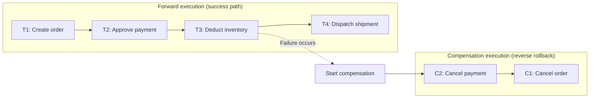
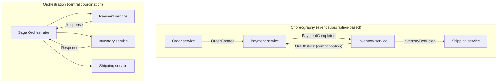

# Saga Pattern and Distributed Transactions

## 1. Overview

### A. Definition

> The **Saga Pattern** is a distributed transaction processing approach that executes a single business transaction spanning multiple services as a chain of local transactions in each service, and, if a failure occurs midway, cancels the already-successful steps in reverse order through **Compensating Transactions** to maintain consistency across the entire system.

The saga is a concept proposed in 1987 by Hector Garcia-Molina to mitigate the lock-holding problem of long-lived transactions, and today it is being re-examined as a representative pattern for ensuring data consistency across service boundaries in microservice architecture (MSA). The key point of a saga is that it replaces the **atomicity (All-or-Nothing)** guaranteed by traditional transactions not with database locks but with **application-level compensation logic**.

### B. Background and Necessity

In a monolithic system, a single database owns all tables, so updating orders, payments, and inventory could be bound into a single transaction, processed atomically with a single `COMMIT`, and reverted with `ROLLBACK` on failure. However, MSA follows the **DB per Service** principle in which each service independently owns its database, so the single transaction boundary is split across multiple services and multiple physical DBs. In this case, to process one business operation (e.g., travel booking = flight + hotel + rental car) **atomically** as success or failure, cooperation among services is required.

The past standard solution, **Two-Phase Commit (2PC)**, is a strong-consistency technique in which a Coordinator instructs all participants to prepare and commit, but it holds resource locks until the commit completes, significantly degrading availability and scalability. In particular, if there are many participants or slow-responding services are mixed in, the whole system waits, and if the coordinator fails, it falls into a **blocking** state. This is a choice that sacrifices availability (A) under the CAP theorem and does not fit the needs of large-scale Internet services.

The saga solves this problem from a different perspective. Instead of binding everything into one locked section, each step is processed as a **short local transaction that commits immediately**, and failures are corrected after the fact through compensation. As a result, lock-holding time is short, increasing throughput and availability, but in exchange **Eventual Consistency** must be accepted, creating a new design challenge in which intermediate states may be exposed externally. In other words, the saga is the product of a trade-off that "gains availability and autonomy instead of strong consistency."

## 2. Basic Principles and Overall Structure of the Saga

A saga consists of pairs of **forward transactions (T1, T2, … Tn)** that make up the normal flow and **compensating transactions (C1, C2, … Cn-1)** that reverse each forward transaction. If all steps succeed normally, T1→Tn are executed sequentially; if step k fails, the already-successful T1…Tk-1 are reverse-compensated in the order Ck-1…C1.

In the figure above, if inventory deduction (T3) fails, the system compensates the previously successful payment approval and order creation in the order of **payment cancellation (C2)** and **order cancellation (C1)**, respectively. The important point here is that compensation is not a physical `ROLLBACK` but a **semantic undo**. For example, an already-approved payment cannot be reverted, so it is offset by a new forward transaction called a "refund." Therefore, compensating transactions must be designed as business logic that neutralizes only the effect while leaving a trace of the original transaction.

A concept that frequently appears in compensation design is the **irreversible step (pivot transaction)**. For example, steps with high cancellation fees or that are physically hard to reverse, such as airline ticket issuance, are placed in the latter part of the saga, i.e., after all preceding steps have succeeded, to minimize compensation costs. In this way, in saga design, the order of steps itself becomes a means of risk management.

## 3. Execution Styles — Choreography vs Orchestration

Depending on who coordinates the saga's step transitions, there are two implementation styles. This choice directly affects coupling, visibility, and complexity, making it the most important decision in saga design.

In the **Choreography** style, without a central coordinator, each service publishes events and other services subscribe to those events to perform their next steps on their own. When the order service publishes an `OrderCreated` event, the payment service receives it, processes the payment, and publishes `PaymentCompleted`, which the inventory service in turn subscribes to, and so the flow continues. With no direct dependencies between services, coupling is low and autonomy is high, but because the overall flow is scattered across an event chain, it is **hard to grasp at a glance and carries risks of cyclic dependencies or event storms**.

In the **Orchestration** style, a central coordinator called the **saga orchestrator** holds a state machine, sends commands to each service, receives responses, and decides the next step. Because the flow is gathered in one place, visibility, debugging, and monitoring are easy, and it is well suited to managing complex branching and compensation logic; however, the orchestrator can become a single point of failure and a point of logic concentration, so its own high-availability design is necessary. In practice, a hybrid strategy is common: simple flows use choreography, while flows with many participating services and complex compensation rules use orchestration.

| Category | Choreography | Orchestration |
|------|-------------|----------------|
| Coordinator | None (event publish/subscribe) | Central orchestrator |
| Coupling | Low (loose) | Concentrated in orchestrator |
| Flow visibility | Low (distributed) | High (centralized) |
| Suitable situation | 2–4 participating services, simple flow | Many services, complex compensation/branching |
| Risk | Cyclic dependencies, hard to trace | Single point of failure, logic bloat |

## 4. Key Technical Elements in Implementation

For a saga to actually operate reliably, several supporting mechanisms must be in place. First, **Idempotency**. Because the same message may arrive multiple times due to network retries, each step and compensation must produce the same result even if executed multiple times. Typically, transaction IDs or message IDs are stored to filter out duplicate processing.

Second, **atomic event publishing**. If the local DB update and event publishing span separate systems (the DB and the message broker), a dual-write problem arises in which the DB is committed but event publishing fails. To prevent this, the **Transactional Outbox** pattern is used together: the event is recorded in an outbox table in the DB within the same transaction, and a separate relay reads and publishes it. This binds "state change and event publishing" atomically into the same local transaction.

Third, **state tracking and timeouts**. In the orchestrator style, the progress state of each saga instance must be persisted so that, after a failure and restart, it can continue or compensate. For steps that do not respond, rules are needed for timeouts, retries, and ultimately switching to compensation or manual intervention (e.g., dead letters, operator alerts).

## 5. Comparison with Other Approaches — Why Saga

Comparing the saga with 2PC and simple event-based approaches clarifies the context of the choice. 2PC guarantees strong consistency immediately but has low scalability due to locking and blocking, becoming a bottleneck in MSA environments with many participants and high latency. By contrast, a saga commits each step immediately and does not hold locks for long, so throughput and availability are high, but since correction happens after the fact, there exists **a time window during which inconsistency is observable midway**.

| Item | 2PC | Saga |
|------|-----|------|
| Consistency | Strong consistency (immediate) | Eventual consistency |
| Lock holding | Long, until commit | Only during local steps |
| Availability/scalability | Low (blocking) | High |
| Rollback method | DB ROLLBACK | Compensating transaction (semantic undo) |
| Isolation | Guaranteed | Not guaranteed (separate measures needed) |

The most practically challenging issue here is **the lack of isolation**. While a saga is in progress, other transactions can read intermediate states not yet confirmed (similar to a dirty read), which can cause anomalies such as another user viewing a seat whose reservation is about to be canceled. To mitigate this, countermeasures such as a **semantic lock** using a state field like "pending/confirmed," reread-before-commit, and commutative updates are designed together.

As a concrete case, order processing in large e-commerce is divided among different teams and DBs for orders, payments, inventory, points, and shipping; if thousands of orders per second were bound together with 2PC, payment gateway response delays would paralyze the entire system. In fact, such platforms process each step asynchronously using a combination of saga + outbox + message broker (e.g., Kafka), and on payment failure, reconcile consistency with automatic refund and order cancellation compensation. As a result, normal throughput increases significantly, while intermediate states such as "Confirming payment" are made explicit to users through UX, naturally absorbing eventual consistency.

## 6. Considerations and Implications

From a Professional Engineer's perspective, adopting sagas should be treated not as a simple pattern choice but as **an architectural decision about the consistency model**.

- **Criteria for applicability**: Core settlement where strong consistency is legally or financially essential should be consolidated into local transactions within a single service, and sagas should be applied selectively only to long-running flows that cross service boundaries. Turning everything into sagas instead causes complexity to explode, so it must be **decided together with service boundary design (DDD's Bounded Context)**.
- **Compensability-first design**: Irreversible steps (ticket issuance, shipment release, external settlement) are placed in the latter part of the saga, and business rules such as cancellation fees and refund policies are reflected in compensation logic. Since compensation itself can fail, paths for retry, dead letters, and operator intervention must be prepared.
- **Observability and operations**: Since the flow is scattered across multiple services, without distributed tracing, a saga state dashboard, and detection/alerting of incomplete sagas, identifying the root cause of failures is very difficult. The orchestration style is advantageous in this respect, and a correlation ID connects the entire path.
- **Accepting trade-offs and UX design**: Sagas sacrifice isolation and immediate consistency in exchange for availability, autonomy, and scalability. Therefore, corrective design at the user-experience level—exposing "in progress" states, duplicate prevention (idempotency), and final result notification—must be paired with the technical design.
- **Outlook**: With the maturation of workflow engines that manage state-based orchestration as code (e.g., Temporal, Camunda, and similar) and event streaming platforms, sagas are evolving toward being **standardized through workflow/orchestration frameworks** rather than hand-implemented. When combined with CQRS and event sourcing, the saga's progress history itself can be leveraged as an audit asset.

---

> **In one line**: The saga pattern is a technique that implements the atomicity of distributed transactions at the application level through a chain of per-service local transactions and compensating transactions on failure; it is an eventual-consistency strategy that gains availability and scalability instead of 2PC's strong consistency, and its success depends on the choice between choreography and orchestration and on the design of idempotency, the outbox, and compensation.
