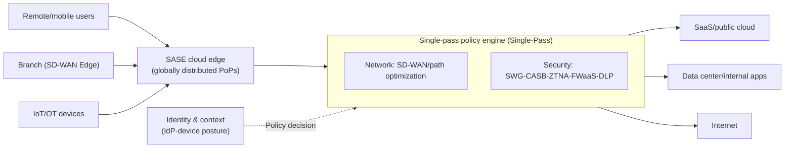
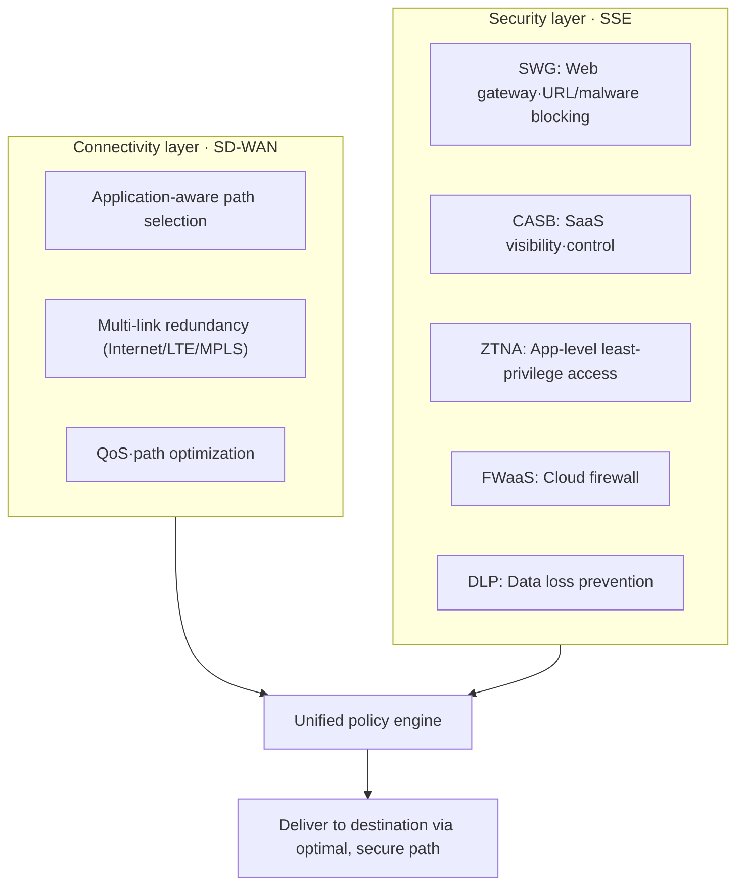

# SASE (Secure Access Service Edge)

## 1. Overview

> **SASE** is an architecture that integrates SD-WAN, a wide area network (WAN) connectivity function, with network security functions such as SWG, CASB, ZTNA, and FWaaS into a single cloud-native service, delivered on an identity basis from globally distributed edges (PoPs, Points of Presence). It is commonly regarded as a concept first presented by Gartner in its 2019 report "The Future of Network Security Is in the Cloud."

The fundamental background for the emergence of SASE lies in **the shift of the center of gravity of enterprise IT resources from the data center to the cloud**. In the past, users, workloads, and data were mostly inside the headquarters data center, so a "hub-and-spoke" model was reasonable: traffic from branches and remote users was gathered to headquarters over MPLS leased lines (backhaul) and passed once through the perimeter firewall. However, as business applications moved to SaaS (Microsoft 365, Salesforce, etc.) and public clouds, a "trombone effect" emerged in which traffic that could simply go out to the Internet was needlessly detoured to headquarters and then sent back out to the cloud. This increases latency, raises circuit costs, and degrades the user experience.

On top of this, with **the normalization of remote and work-from-home arrangements, the explosion of mobile and IoT devices, and the distribution of cloud workloads**, the very "perimeter to be protected" has disappeared. Users connect from anywhere, and data is everywhere. In such an environment, traditional perimeter security (appliance-centric, concentrated at headquarters) reveals limitations in scalability, agility, and security alike. SASE aims to solve this problem with the idea of "**delivering networking and security not as separate appliance stacks, but as a single converged service at the cloud edge close to users and devices**." That is, it moves the security inspection point from the "headquarters perimeter" to "the nearest PoP to which the user connects," and decides whether to allow access based not on IP or location but on **verified identity and context (device posture, time, behavior)**.

## 2. SASE Conceptual Structure and Key Characteristics

SASE can broadly be understood as **the network (connectivity) layer and the security (SSE) layer** converged at the cloud edge. The conceptual diagram below shows how users, branches, and clouds are connected and protected via distributed PoPs.

The characteristics of the SASE architecture can be summarized along four axes. First, it is **Identity-driven**. The criterion for access decisions is not network location but identity and context: "who is accessing, with what device, in what state." This is the core mechanism for realizing the zero trust principle ("never trust, always verify"), enforcing least-privilege access at the application level through ZTNA.

Second, it is **Cloud-native**. Security and network functions are implemented not as physical appliances but as multi-tenant cloud services, enabling elastic scaling, automatic updates, and consumption-based billing. Since new threat signatures and policies are propagated instantly to all PoPs, security gaps caused by patch delays are reduced.

Third, it has a **Distributed edge**. With dozens to hundreds of PoPs worldwide, traffic is inspected and forwarded at locations physically close to users. This eliminates backhaul and reduces latency. For example, when a remote user in Seoul accesses a SaaS in a U.S. region, the traffic does not pass through the headquarters data center; security inspection is completed at a nearby PoP and then the traffic goes out on the optimal path, significantly improving round-trip latency.

Fourth, it uses **Single-pass inspection**. Rather than repeatedly performing multiple security functions (decryption, SWG, DLP, anti-malware, etc.) on separate appliances, traffic is decrypted and parsed once and all policies are applied in parallel. The key design goal is to reduce the latency and management complexity that accumulate when appliances are chained in series.

## 3. Components — Network (SD-WAN) and Security (SSE)

Half of SASE is **SD-WAN**, which handles connectivity, and the other half is **SSE (Security Service Edge)**, a bundle of security functions that Gartner separately named in 2021. The detailed architecture diagram below shows the relationship between the main security functions that make up SSE and the network functions.

**SD-WAN (Software-Defined WAN)** recognizes the type and importance of applications, dynamically selects the optimal path among multiple links (leased lines, Internet, LTE/5G), automatically fails over in case of outages, and guarantees QoS for real-time traffic (video conferencing, etc.). In SASE, SD-WAN serves as the "on-ramp" that securely connects branches and devices to the nearest PoP.

**SWG (Secure Web Gateway)** relays users' web traffic, blocks malicious URLs, phishing, and malware, and enforces web usage policies. **CASB (Cloud Access Security Broker)** provides visibility into the SaaS applications an organization uses, detects shadow IT (unauthorized cloud use), and controls data sharing and permissions. **ZTNA (Zero Trust Network Access)**, unlike VPN, allows least-privilege access only to "specific applications" rather than the entire network, and only for sessions that pass identity and device posture verification, reducing the attack surface (lateral movement). **FWaaS (Firewall as a Service)** delivers firewall functionality as a cloud service, and **DLP (Data Loss Prevention)** blocks external leakage of sensitive information (personal data, confidential documents) through content inspection.

These components are security functions that existed individually as well, but the value of SASE lies in **converging them into a single policy framework, a single console, and a single data path**. For example, the act of "a finance team employee uploading an accounting file to an external SaaS from an unmanaged personal device" can be blocked with a single policy decision, with CASB identifying the SaaS, ZTNA checking device posture, and DLP inspecting the content. In a traditional stack with separated functions, each appliance's policy had to be aligned separately.

## 4. Comparison with Traditional Perimeter Security and VPN

SASE's differentiation becomes clear when compared with existing approaches. The table below summarizes the key axes, and "why" each difference arises is described afterward.

| Category | Traditional perimeter security (hub-and-spoke + VPN) | SASE |
|------|------------------------------|------|
| Inspection point | Headquarters data center perimeter | Cloud PoP close to the user |
| Access trust | Network location (internal = trusted) | Identity/context-based (zero trust) |
| Access scope | Entire network (VPN) | Application level (ZTNA) |
| Implementation form | Physical appliance stack | Cloud service |
| Scalability | Appliance expansion·capacity limits | Elastic scaling |
| Management | Separate console per appliance | Single policy·unified console |

The most fundamental difference is the **trust model**. VPN-based remote access connects broadly to internal network segments once authentication is passed, so if an account is compromised or an infected device connects, an attacker can move laterally freely inside. By contrast, SASE's ZTNA verifies identity and device posture for every session and connects only to the needed apps, so even if one is breached, the damage is confined to that app. Removing the implicit premise that "inside is trusted" is the core of its security effect.

The second difference is the **performance and cost structure**. Reducing latency by eliminating backhaul is not a mere convenience but is directly tied to the productivity of cloud- and SaaS-centric work. Cases have been reported of global manufacturers that transitioned from a structure backhauling many overseas branches to headquarters over MPLS to SASE, reducing circuit costs and latency; compared with MPLS, the Internet + SD-WAN combination has a lower cost per bandwidth, leaving substantial room for total cost of ownership (TCO) savings. However, the specific savings rate varies greatly depending on a company's circuit configuration and traffic characteristics, so caution is needed in generalizing.

The third difference is **operational complexity**. Operating firewalls, proxies, VPNs, and DLP on appliances from different vendors increases policy inconsistency, visibility gaps, and management burden. SASE integrates these into a single policy model, improving consistency and operational efficiency. Conversely, this can lead to **single-vendor lock-in** risk, which must be considered as a trade-off during adoption.

## 5. Advanced — The Rise of SSE, Adoption Approaches, and Latest Trends

In 2021, Gartner separated out only the security half of SASE and named it **SSE (Security Service Edge)**. This is because many enterprises already operate networking (SD-WAN) and security with different vendors, making it difficult to consolidate SASE into a single vendor all at once. Realistically, the widely used approach is to **first move security functions (SWG, CASB, ZTNA) to the cloud as SSE** and then gradually converge with SD-WAN. For this reason, it is safer to design SASE adoption not as a "big-bang transition" but as a phased roadmap in the order of **remote access modernization (VPN→ZTNA) → web/SaaS security (SWG, CASB) → network integration (SD-WAN)**.

In terms of vendor composition, **single-vendor SASE**, in which one vendor provides both networking and security, coexists with **dual/multi-vendor SASE**, which combines a best-of-breed SD-WAN vendor with an SSE vendor. The former's strength is integration and simplicity; the latter's is best-of-breed product selection in each area and reduced lock-in. Recently, a trend has been observed of AI-based threat detection and policy automation, as well as generative AI usage control (preventing leakage of internal data to external LLMs), being combined into SSE. However, detailed features and maturity vary significantly by vendor, so during adoption it is important to verify PoP coverage (including whether domestic regions exist), decryption performance, and SLAs through actual measurements.

## 6. Considerations and Implications

From a Professional Engineer's perspective, SASE adoption should be approached not as a simple product replacement but as **an architectural transformation in which network, security, and organization change together**. The following should be considered comprehensively.

- **Phased transition strategy**: Full replacement is high-risk. Start with areas where the effect is clear and the risk is low, such as remote access modernization replacing VPN with ZTNA, operate in parallel with existing perimeter security, and converge gradually. Clarify the transition design so that no policy gaps arise during migration.
- **Performance–security trade-off**: SSL/TLS decryption inspection, central to SASE, increases security visibility but induces latency and load. Since PoP decryption performance and domestic/overseas PoP locations determine actual latency, these must be measured in a POC (proof of concept). For domestic access quality, confirm whether domestic PoPs and regions exist.
- **Data sovereignty and regulatory compliance**: Traffic and logs may transit or be stored at overseas PoPs, which can conflict with domestic regulations such as the Personal Information Protection Act and the Electronic Financial Supervisory Regulations. Clarify data processing locations, log retention, and the shared responsibility model through SLAs and contracts, and for finance and the public sector, review domestic certification requirements such as CSAP as well.
- **Vendor lock-in and resilience**: Single-vendor SASE simplifies operations but carries lock-in and single point of failure (SPOF) risks. Prepare bypass paths for PoP outages, multi-vendor/redundancy strategies, and an exit plan in advance.
- **Governance and organizational alignment**: The "single policy" advantage of SASE is realized only when the policies and responsibilities of the previously separated network and security teams are integrated. The organizational change of redesigning unified policy ownership and operational processes is as important as the technology adoption.
- **Alignment with related technologies**: SASE is closely related to zero trust (ZTNA), SDN, cloud security (SECaaS), and SD-WAN. The ultimate goal is to integrate logs and response with already-deployed SIEM, SOAR, and EDR to ensure consistency across the entire detection-and-response system.

Looking ahead, in environments where hybrid work and multi-cloud have become the norm, SASE/SSE is likely to establish itself not as an "option" but as **the default security and network operating model for the perimeterless era**. Professional Engineers should be able to treat it not as a sum of individual security products, but as an integrated architecture designed, validated, and governed to fit an enterprise's business, regulatory, and cost context, on the principles of identity-centricity and cloud-nativeness.

## References

- Gartner, "The Future of Network Security Is in the Cloud" (2019) — introduced the SASE concept
- Gartner, definition related to "Security Service Edge (SSE)" (2021)

---

> **In one line**: SASE is an architecture that converges SD-WAN (connectivity) with SWG, CASB, ZTNA, and FWaaS (security = SSE) at the cloud edge in an *identity-centric, single-pass* manner, improving performance by eliminating backhaul and protecting perimeterless environments with zero trust, while decryption performance, data sovereignty, and vendor lock-in must be managed through a phased transition strategy.
