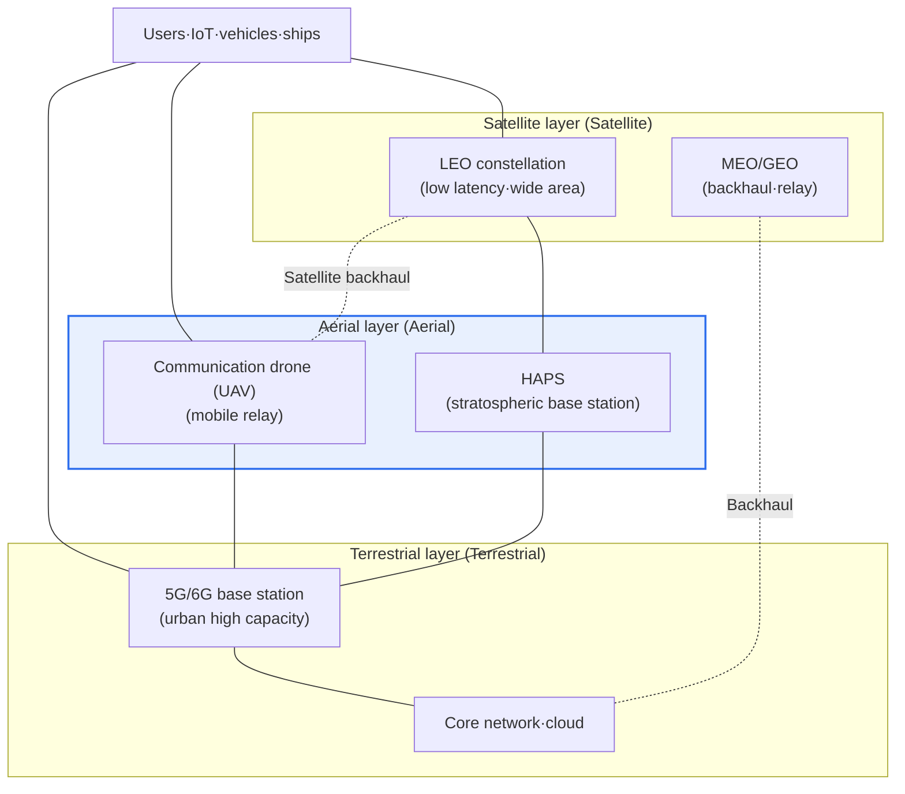
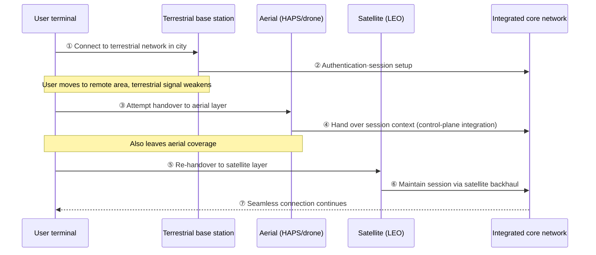

# SATIN (Satellite-Aerial-Terrestrial Integrated Network)

## 1. Overview

### A. Definition
> **SATIN (Satellite-Aerial-Terrestrial Integrated Network)** is a 6G-oriented three-dimensional (3D) integrated wireless network that unifies the **Satellite, Aerial (drones, stratospheric base stations), and Terrestrial** layers into a single control and data plane, providing seamless communication anywhere on Earth.

The core idea of SATIN is that "**since terrestrial networks alone cannot cover the entire planet, let us bring the sky and space into the communications infrastructure as well**." Current mobile communications are served by densely deploying terrestrial base stations (gNBs), so seas, mountains, deserts, remote areas, and disaster zones—where base stations cannot be built or are not economically viable—structurally become communication dead zones. This is the root cause of why a considerable portion of the Earth's surface, along with oceans and airspace, remains unconnected. SATIN solves this limitation by expanding not horizontally (in area) but vertically (in altitude).

Specifically, low Earth orbit (LEO) satellite constellations continuously cover the entire globe to lay the floor of coverage, drones and stratospheric base stations (HAPS) flexibly reinforce specific areas from the air, and terrestrial networks handle ultra-high-capacity traffic in cities. The three layers operate not as substitutes but as complements. That is, users are connected to the most suitable layer according to their location, mobility, and required quality, and are handed over seamlessly even when moving between layers. This structure can be understood as organically fusing the **Non-Terrestrial Network (NTN)** concept being standardized by 3GPP with terrestrial networks, and it is discussed as the core blueprint for the "Global Seamless Coverage" that 6G aims for.

### B. Background and Necessity
Three trends overlap behind the rise of SATIN. First, **on the demand side, the requirement for hyper-connectivity and complete coverage**. Autonomous ships and aircraft, remote disaster response, and the global spread of the Internet of Things (IoT) demand connectivity not just "where people live" but "across the entire surface of the Earth." Filling this with terrestrial networks alone would collapse the economics.

Second, **on the supply side, technological maturity**. As reusable launch vehicles have sharply reduced satellite launch costs, LEO constellations of thousands of satellites (e.g., Starlink, OneWeb) have actually been deployed, largely overcoming the high-latency limitation of past geostationary (GEO) satellites with the low latency of LEO. HAPS (high-altitude platforms) that remain in the stratosphere for long periods and communication relay drone technology have also entered a mature stage.

Third, **progress in standardization**. 3GPP incorporated NTN into its formal specifications in Release 17 and has been deepening terrestrial–non-terrestrial integration in subsequent releases. As demand, technology, and standards have matured simultaneously, the SATIN concept of designing terrestrial, aerial, and satellite not as separate networks but as "one network" has risen to become a central theme of 6G research.

## 2. Network Structure and Roles by Layer

SATIN is stacked into three layers by altitude, and each layer has different physical characteristics (latency, mobility, capacity, coverage radius). A bird's-eye view of the overall structure is as follows.

### A. Satellite Layer — The Floor of Coverage
The reason for the satellite layer's existence is to cover the entire globe without exception. In particular, **LEO** constellations at altitudes of about 300–1,500 km have short radio round-trip distances, so their latency is dramatically lower than that of geostationary orbits, and many satellites orbit densely, taking over service to a given point on the ground as if in a relay. However, since each satellite crosses the horizon quickly, seamless inter-satellite handover and precise orbit and beam management are essential.

The practical implication of the satellite layer is that it guarantees "**connectivity of last resort**." Even when terrestrial infrastructure is entirely absent or destroyed, signals come down from the sky, making it a safety net for disaster, military, maritime, and aviation communications. On the other hand, because it covers wide areas with a small number of beams, its capacity per unit area falls far short of terrestrial networks, and terminal antenna and power requirements are high, so a design that attempts to handle urban traffic with the satellite layer alone is unrealistic. For this reason, a division of roles naturally emerges: satellites go "wide and shallow," terrestrial goes "narrow and deep."

### B. Aerial Layer — Flexible Regional Reinforcement
The aerial layer consists of **HAPS**, which stay aloft for long periods in the stratosphere (about 18–25 km), and **communication drones (UAVs)** launched when needed. Being much closer to the surface than satellites, they have shorter latency and better link quality with ground terminals, and a single unit covers a much wider radius than a terrestrial base station. Above all, the decisive differentiator is that they can be "moved and deployed temporarily."

This flexibility enables "**on-demand coverage**" targeting specific areas or times when traffic surges. For example, drone base stations can be launched to instantly reinforce capacity where demand temporarily explodes, such as large rallies and stadiums, island areas during peak tourist season, and disaster sites. If satellites are persistent and wide-area, the aerial layer is local and elastic. However, since HAPS and drones are constrained by flight endurance, power, and weather effects, it is reasonable to design them not as permanent infrastructure but as a "mobile reserve" that complements the terrestrial and satellite layers.

### C. Terrestrial Layer — The Heart of High Capacity
The terrestrial layer consists of existing 5G/6G base stations, the core network, and the cloud, and handles ultra-high-capacity, ultra-low-latency services in densely populated areas. Thanks to fiber-optic backhaul and dense base station deployment, throughput per unit area is overwhelmingly high, and it is the home of low-latency applications such as MEC (Mobile Edge Computing).

In SATIN, the role of the terrestrial layer goes beyond being merely "one layer." Typically, the core network, authentication, and policy control are centered on the ground, so traffic originating in the satellite and aerial layers is ultimately authenticated, routed, and billed via the terrestrial core. That is, the terrestrial layer serves both as the heart of capacity and as **the brain of integrated control**. Therefore, the challenge of SATIN design comes down to "how to seamlessly integrate satellite and aerial traffic with the terrestrial core," which leads to the core technical discussion in Section 3.

Comparing the characteristics of each layer at a glance gives the following. This table summarizes why each layer is complementary in terms of the trade-offs among "latency, capacity, and mobility."

| Layer | Typical altitude/composition | Coverage | Latency | Capacity per unit area | Character |
|---|---|---|---|---|---|
| **Satellite (LEO)** | 300~1,500km, constellation | Global | Low (LEO) | Low | Persistent·wide-area |
| **Aerial (HAPS/drone)** | Stratosphere~a few km | Wide-area·local | Very low | Medium | Elastic·mobile |
| **Terrestrial (gNB)** | Surface base station | Local·urban | Very low | High | Persistent·high-capacity |

## 3. Core Operating Principles and Integration Technologies

For SATIN to become "one network" rather than "three networks," interworking must be seamless enough that users do not notice when they move across layers. Expressed as a procedure, the process is as follows.

### A. Seamless Handover Between Heterogeneous Layers
The most fundamental technical challenge is maintaining sessions when moving between layers with vastly different characteristics. Terrestrial↔aerial↔satellite links differ in latency, Doppler shift, signal strength, and movement patterns. In particular, LEO satellites themselves move at several km per second, creating a "moving infrastructure" problem in which the serving satellite keeps changing even if the terminal is stationary.

Solving this requires intelligent mobility management that predicts the positions and channel states of layers and satellites in advance and prepares handovers proactively. By having the integrated core store and hand over session context (authentication, bearers, policies) independently of the layer, the logical session remains unbroken even as the physical layer changes. This "control-plane integration" is the key that determines the success or failure of SATIN.

### B. Integrated Resource and Spectrum Management
Since the three layers must share limited radio resources and spectrum, interference avoidance and dynamic resource allocation are important. When satellite and terrestrial systems use or share adjacent bands, mutual interference must be coordinated, and which layer serves which area must be allocated in real time according to traffic demand. AI-based prediction and optimization are discussed here as a promising means—for example, pre-arranging aerial and satellite resources for areas where disasters are expected.

### C. Intelligent Layer Selection and SDN/NFV
Since the optimal layer differs by user and changes over time, a policy engine is needed to decide which layer to attach to. Routing must be context-aware, sending latency-sensitive applications to nearby terrestrial or aerial layers and areas without coverage to the satellite layer. **SDN/NFV**, which flexibly reconfigures the entire network in software, and **network slicing**, which logically separates services with different requirements per layer, are discussed together as foundational technologies that realize such integrated control.

## 4. Applications and Cases

The value of SATIN is most clearly revealed in "situations where terrestrial networks do not reach or have been disabled." Each application shows how the layer characteristics seen above mesh with real-world problems.

| Domain | Key layer | Application |
|---|---|---|
| **Disaster response** | Satellite·aerial | Immediately restore emergency communications via satellites and drones when terrestrial networks are destroyed |
| **UAV/unmanned vehicles** | Aerial·satellite | Use drones as mobile base stations/relays; control links for UAVs and autonomous driving |
| **Remote areas·maritime·aviation** | Satellite | Provide persistent communications to islands, deserts, deep sea, and aircraft (bridging the digital divide) |
| **IoT·sensor networks** | Satellite | Collect data from low-power sensors worldwide (environment·logistics tracking) |

First, SATIN particularly shines in **disaster response**. When earthquakes or floods destroy terrestrial base stations, communications are normally paralyzed; by launching communication drones over the disaster area and connecting to the outside via satellite backhaul, a temporary communications network can be set up within hours. Indeed, cases have been reported in which satellite Internet terminals and communication drones were deployed for emergency communication restoration after major natural disasters, a miniature version of the multi-layer resilience that SATIN aims for.

Second, **control of unmanned vehicles**. Since control links for autonomous drones, ships, and vehicles must not be lost even in coverage gaps, the satellite and aerial layers fill the gaps in terrestrial coverage to guarantee continuous control. At the same time, a dual role is possible in which the drone itself is repurposed as a mobile relay to extend coverage.

Third, **bridging the digital divide and IoT**. By providing broadband and low-power IoT connectivity via satellite to islands, mountainous areas, and the deep sea—where low population density makes terrestrial base stations uneconomical—it reduces communication-deprived areas and enables planet-scale sensing such as environmental monitoring and logistics tracking.

## 5. Advanced — 6G/NTN Standardization Trends and Domestic Response

SATIN is closer to a "direction" in which multiple standards and research streams toward 6G converge than to a single finished specification. Since this is an area where facts are updated rapidly, it is safer to understand detailed figures and schedules in general terms.

On the standardization side, since 3GPP formally incorporated NTN in Release 17, it has continued to expand terrestrial–non-terrestrial integration, LEO satellite mobility, IoT-NTN, and more in subsequent releases. The International Telecommunication Union (ITU), in its 6G (IMT-2030) vision, presents "ubiquitous connectivity" as one of the key usage scenarios, which effectively presupposes satellite–aerial–terrestrial integration. In other words, SATIN-style thinking is already reflected in the blueprint of 6G standards.

On the industry side, the trend of the boundary between satellite operators and mobile network operators breaking down is prominent. "Direct-to-cell" services, in which LEO constellation operators and carriers partner so that ordinary smartphones communicate directly with satellites, have entered the early stage of commercialization, showing that SATIN is moving beyond a laboratory concept into the market. In Korea as well, R&D related to 6G and LEO satellite communications, along with spectrum and standards responses, is being pursued at the national level, so from a Professional Engineer's perspective it should be approached as a convergence issue in which standards, spectrum, and industrial policy are intertwined.

## 6. Considerations and Implications (Professional Engineer's Perspective)

1. **Interworking between heterogeneous layers is the biggest technical challenge.** Satellite, aerial, and terrestrial layers fundamentally differ in latency, mobility, and capacity, so integrated management technology that binds them into a single control plane and seamlessly handles inter-layer handover and session handoff determines the success of SATIN. AI-based mobility and resource prediction must be combined with this for it to be effective.

2. **Spectrum, standards, and regulatory coordination are prerequisites for commercialization.** Without parallel progress in sharing and interference coordination of satellite and terrestrial spectrum, international allocation of orbits and frequencies, and the maturation of 3GPP NTN standards, services are impossible even if the technology exists. In particular, given the cross-border nature of satellites, international cooperation and regulatory consistency are far more important than for terrestrial networks.

3. **Redesign from a security and resilience perspective is needed.** As layers increase and wireless links extend into the sky and space, the attack surface widens. End-to-end encryption, mutual authentication, and anomaly detection are required to prepare for new threats such as signal jamming and spoofing, eavesdropping on satellite links, and bypassing inter-layer authentication. Conversely, multi-layer redundancy has the advantage of increasing resilience, so balancing the design of security and resilience together is important.

4. **Trade-offs among economics, power, and sustainability must be considered.** Satellite launch and operation, HAPS and drone flight, and terrestrial network expansion each carry different cost, power, and environmental burdens. How much of each layer to deploy must be decided on the basis of cost-benefit analysis of coverage goals and traffic demand, and sustainability issues such as space debris and spectrum congestion from LEO constellations must also be addressed at the policy level.

## References
- 3GPP, "Non-Terrestrial Networks (NTN)" — https://www.3gpp.org/technologies/ntn-overview
- ITU-R, IMT-2030 (6G) Framework — https://www.itu.int/en/ITU-R/study-groups/rsg5/rwp5d/imt-2030/Pages/default.aspx

---

> **In one line**: SATIN is a 3D wireless network that integrates *satellite (wide-area), aerial (drones·HAPS, elastic), and terrestrial (high-capacity)* into a single control plane, realizing disaster communication restoration, UAV control, and remote-area services and serving as the foundation for 6G's global complete coverage (NTN), with heterogeneous layer interworking, spectrum, security, and economics as its key challenges.
