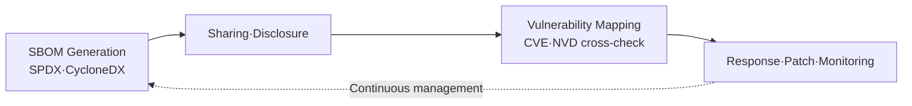

# SBOM (Software Bill of Materials)

## 1. Overview

### A. Definition
> A specification that **inventories all components, libraries, and dependencies that make up a piece of software, along with their versions and license information**. Borrowing the concept from manufacturing's Bill of Materials (BOM), it is a core artifact of software supply chain (SSC) security.

The fundamental intent of an SBOM lies in the principle that "**you cannot manage what you cannot see**." In modern applications, more than half of the code is not written directly but filled with external open source, yet often there is not even a list of what is inside. An SBOM makes this "ingredient label of software" explicit, elevating vulnerability and license risks into something that can be managed.

### B. Background and Necessity of Emergence
As open-source dependencies exploded, a single app came to depend directly or indirectly on hundreds to thousands of components, and incidents in which a single flaw within them spread across the entire supply chain occurred one after another. The contamination of a build system in **SolarWinds** and the critical flaw **Log4Shell (Log4j)** in a widely used logging library are representative examples. During the Log4Shell incident, many organizations were slow to respond because they "could not even determine whether their systems used Log4j"—had they had an SBOM, they could have identified the scope of impact immediately. Against this backdrop, SBOM submission was mandated for software procured by the public sector after the U.S. Executive Order (**EO 14028**), and it spread from there.

## 2. SBOM Components and Standard Formats

For an SBOM to be effective, it must be interpretable automatically by tools rather than humans, so it is important to write it in a machine-readable **standard format**. Only when formats are standardized can SBOMs be exchanged and automatically cross-checked between different organizations and tools.

| Category | Content |
|---|---|
| **Components** | Component name/version, supplier, dependency relationships, license, hash (integrity verification) |
| **Standard Formats** | **SPDX** (Linux Foundation, ISO standard), **CycloneDX** (OWASP, security-focused), SWID |

SPDX has strengths in licensing and compliance and has been adopted as an international standard (ISO/IEC 5962), while CycloneDX focuses on vulnerability and supply chain security use. The reason hashes are included is to verify whether a specified component is identical to what is actually distributed (i.e., whether it has been tampered with).

## 3. Management Target: Open-Source Vulnerabilities

The risks that an SBOM seeks to make visible fall broadly into four categories, and among them **transitive dependencies** are the most troublesome. Because it is a multi-tier structure in which a library I brought in directly calls yet another library, the truly problematic component lies hidden deep where it is not visible.

| Vulnerability | Content |
|---|---|
| **Known Vulnerabilities (CVE)** | Disclosed flaws such as Log4j lurking in transitive dependencies |
| **Dependency Risk** | Difficulty grasping what is used due to multi-tier transitive dependencies |
| **License Violation** | Legal risk when copyleft licenses such as GPL are not complied with |
| **Maintenance Discontinuation/Malicious** | EOL (end-of-life) packages, malicious injection (typosquatting) |

The reason license violation is as important as security is that if a copyleft license such as GPL is included unknowingly, it directly leads to **legal and business risks**, such as an obligation to disclose one's own source code.

## 4. SBOM-Based Management Approaches

An SBOM is not a document that you create once and be done with; it must be a **continuous process that cycles through generation → mapping → response → regeneration**. Because new CVEs are disclosed daily, a component that was safe until yesterday can become vulnerable today.

| Stage | Approach |
|---|---|
| **Generation** | Automatically generate the SBOM at CI/CD build time (ensuring accuracy and currency) |
| **Analysis (SCA)** | Scan components, vulnerabilities, and licenses with SCA tools |
| **Mapping** | Identify vulnerable components by cross-checking against CVE/NVD databases |
| **Response·Monitoring** | Patch/upgrade, continuously monitor newly disclosed CVEs |

The key is to **automatically integrate SBOM generation into the build pipeline** rather than doing it by hand. Because a manually written specification quickly diverges from the actual code and becomes untrustworthy, the SBOM must be extracted from the actual artifact with every build.

## 5. Considerations and Implications
An SBOM is the foundation of supply chain transparency, but a list of vulnerabilities alone tends to overstate the actual risk. Even if a component has a CVE, it **may not be dangerous if that code path is not actually executed**. That is why, from a professional engineer's perspective, the key is to set response priorities by combining it with **VEX (Vulnerability Exploitability eXchange)**, which tells you "whether this vulnerability is actually exploitable in our product." On the operational side, SBOM, SCA, and VEX must be **automatically integrated into the DevSecOps pipeline** to make generation, analysis, and response routine, and in line with the trend of expanding SW supply chain security guidelines and mandates domestically as well, there is a need to proactively build an organization-wide SBOM management framework.

---

> **In one line**: An SBOM inventories software components using SPDX·CycloneDX to *make open-source vulnerability and license risks visible*, and serves as the foundation for managing supply chain security through a continuous process of *automatic generation at build time → SCA scanning → CVE mapping → VEX prioritization → monitoring*.
