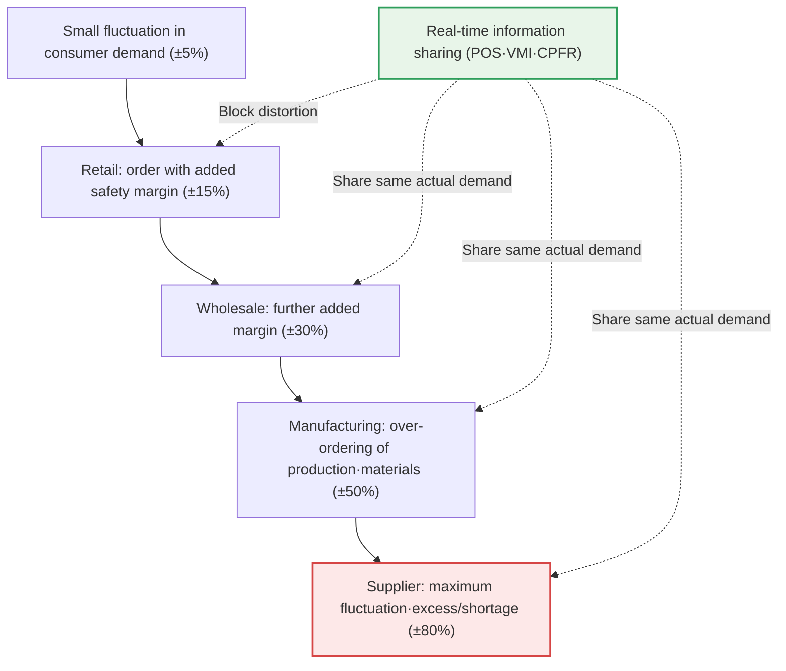

# Supply Chain Management (SCM)

## 1. Overview

### A. Concept and Background of Rising Importance
> **SCM** is a management technique that **integrates, manages, and optimizes the entire flow of the supply chain (materials, information, and funds)** from raw material procurement through production, distribution, and the end consumer, thereby lowering costs and raising customer value.

Behind SCM's rise in importance lies the reality that "**supply chain risk directly determines a company's survival.**" In the past, SCM was understood as an efficiency tool for reducing inventory to save costs, but recently its standing has shifted to a survival capability that keeps supply from being cut off in a crisis. Having witnessed how disruption at one point in the supply chain—such as the global logistics upheaval caused by COVID-19 or the automotive semiconductor shortage since 2021—pushed entire industries such as automobiles and electronics into production cuts and shutdowns, inventory and supply chain management became a national and corporate crisis-response capability beyond mere cost reduction.

Because a supply chain consists of multiple companies linked like a chain, it has a structural vulnerability in which a delay or shortage at one point is amplified and propagated across the whole, producing the **bullwhip effect**. Even when final consumer demand changes only slightly, as you move upstream from retail → wholesale → manufacturing → supplier, each stage inflates orders for safety, and the fluctuation snowballs. The name derives from how shaking the handle of a whip only slightly makes the tip swing wildly. As a result, upstream companies repeatedly bear excess and shortage inventory, incurring enormous costs.

SCM shares and integrates information across the entire supply chain to reduce this bullwhip effect, and by accurately forecasting demand and maintaining appropriate inventory, it optimizes both cost and crisis response together. The key insight is that it pursues "**global optimization of the entire supply chain rather than local optimization of individual companies.**" If each company tries only to minimize its own inventory, the overall bullwhip effect actually grows; only when participants share and collaborate on demand and inventory information do overall costs come down.

### B. Background and Necessity of Emergence
The fundamental cause behind the emergence of the SCM concept is the deepening of global division of labor. In an era where a single smartphone is made from parts supplied by hundreds of partners across dozens of countries, supply chains have become long, complex, and fragile. Uncertainties such as natural disasters, wars, epidemics, and trade disputes can occur at any point in the supply chain, and their shock is instantly propagated worldwide. In such an environment, without integrated management that visualizes and optimizes the entire supply chain in real time, a single company's efficiency alone can no longer maintain competitiveness. In other words, SCM is a product of the shift in mindset that "competition is no longer between companies but between supply chains."

Rising customer expectations have also increased the necessity of SCM. As "same-day/next-day delivery" became the standard with the spread of e-commerce, companies must simultaneously satisfy the conflicting demands of minimizing inventory while responding quickly. This dilemma cannot be solved by the efforts of an individual logistics department alone; it can only be resolved through supply chain-level integrated optimization that stitches together procurement, production, distribution, and sales.

## 2. Composition of SCM and the Flow of Materials, Information, and Funds

The objects that SCM manages fall broadly into three flows: materials (products) flowing downstream, demand and information flowing upstream, and funds flowing in the opposite direction. The overall structure diagram below shows how these flows circulate along the supply chain.

**The downstream flow of materials** is the physical flow in which raw materials are processed into parts, semi-finished goods, and finished products and move toward the consumer. The goal of this flow is to deliver the needed goods to the needed time and place at minimum cost (the ideal of JIT, Just-In-Time), and shortening lead time and optimizing logistics are the core challenges. Inventory is both a buffer for this flow and a source of cost, so how much inventory to hold becomes the central decision of SCM.

**The upstream flow of information** is the flow in which the consumer's actual demand and sales data travel back up from retail to manufacturing and suppliers. If this flow is severed and each stage judges only by the "orders" of the stage directly below it, it reacts to distorted order signals rather than actual consumer demand, causing the bullwhip effect to explode. Therefore, the decisive battleground of SCM lies in how well this information flow is shared in real time and without distortion. Sharing POS (point-of-sale) data directly with suppliers is a representative solution.

**The flow of funds** is the flow in which the consumer's payment reverses back through retail → manufacturing → supplier; recently it has expanded into supply chain finance (SCF), becoming a means to ease partners' funding burdens and increase the stability of the entire supply chain. The perspective of viewing all three flows in an integrated way is the essence that distinguishes SCM from individual logistics or procurement management.

## 3. Causes of the Bullwhip Effect and Mitigation Techniques

Because the bullwhip effect is the core problem SCM seeks to solve, its causes and countermeasures deserve a separate, in-depth look. The bullwhip effect generally arises from four causes. First is **demand forecast updating**, because each stage revises future demand upward and adds a safety margin every time it receives an order. Second is **batching**, where ordering in large quantities at once to save ordering and transportation costs clumps and distorts the demand signal. Third is **price fluctuation (promotions)**, where demand swings as bulk buying during discounts and subsequent buying halts repeat. Fourth is **over-ordering under shortage (rationing)**, the psychology of inflating orders beyond the actual need when supply seems likely to be short.

The detailed process diagram below shows the mechanism of the bullwhip effect, in which a small fluctuation in final demand is amplified as it moves upstream, and how information sharing breaks this loop.

Here the fluctuation range at each stage (±5 → ±80%) is a conceptual example; the actual values differ by industry and item, but the directional tendency that "it amplifies as you go upstream" is commonly observed in numerous empirical studies. What these causes have in common is that "each stage reacts to the distorted orders of the stage directly below it rather than to actual consumer demand." Therefore, the key to mitigation is to use information sharing so that all stages see the same actual demand. As a representative technique, **VMI (Vendor-Managed Inventory)** has the supplier directly view the retailer's inventory and sales data and decide the replenishment quantity, eliminating intermediate distortion. **CPFR (Collaborative Planning, Forecasting, and Replenishment)** has participating companies jointly establish and share a single demand forecast to align forecasts. In fact, the classic example demonstrating the effect of VMI/CPFR is the case in which P&G and Walmart shared POS data in real time across the diaper supply chain to reduce the bullwhip effect.

## 4. Demand Forecasting and Inventory Calculation

Demand forecasting is the starting point of SCM, and the forecast must be accurate to maintain appropriate inventory. Forecasting generally proceeds through the stages of ① setting objectives → ② determining the target and period → ③ collecting data → ④ selecting a forecasting technique → ⑤ executing the forecast → ⑥ validation → ⑦ application. Measuring forecast error at each stage (MAPE, etc.) and continuously correcting it is the core of practice—a cyclical process of repeated improvement by comparing with actuals rather than a one-time forecast.

Forecasting techniques are divided as follows depending on the presence and nature of data. When there is no past data, as with a new product, choose a qualitative technique; when there is a stable past trend, choose time series; when there are clear influencing factors, choose causal; and when there is large-volume, multivariate data, choose an AI-based one. Combining several techniques (ensemble) rather than using only one raises accuracy in practice.

| Forecasting Technique | Representative Method | Application Situation |
|---|---|---|
| **Qualitative** | Delphi·expert opinion | New products·when data is scarce |
| **Time Series** | Moving average·exponential smoothing·ARIMA | When past trends·seasonality are clear |
| **Causal** | Regression analysis | When influencing factors such as price·promotion are clear |
| **AI-Based** | Machine learning·deep learning demand forecasting | Large-volume·unstructured·multivariate data |

Inventory is a buffer that prepares for the uncertainty of demand and supply. **Safety stock** is reserve inventory that prepares for fluctuations in demand and lead time, roughly calculated as `safety factor (Z) × standard deviation of demand × √lead time`. Here the safety factor corresponds to the target service level; for example, at a 95% service level that tolerates stockouts up to 5%, Z is about 1.65. If the service level is raised to 99%, Z grows to about 2.33, sharply increasing safety stock and cost, so the target level must be set by weighing stockout losses against inventory holding costs.

**Appropriate inventory** is determined at the balance point between the stockout-prevention benefit gained by holding more inventory (reduced shortage cost) and the resulting increase in inventory holding costs (capital cost, storage cost, obsolescence). The Economic Order Quantity (EOQ) model is a classic example that formulates this balance. The key is that reducing inventory unconditionally is not the answer; the loss that stockouts inflict on sales and trust must also be factored in.

Because not all items can be managed identically, in practice the importance is differentiated through **ABC inventory classification**. According to the Pareto principle, the top roughly 20% of all items (Grade A) generally account for about 80% of sales and inventory value; Grade A is subject to strict real-time management, frequent checks, and precise forecasting, while Grade C (numerous, low-value) uses ample safety stock and simple replenishment rules to save management costs. This differentiated strategy of "concentrating management capacity on the vital few" is the standard practice for making the entire supply chain efficient with limited resources.

## 5. Push·Pull Strategies and the SCOR Reference Model

When actually designing SCM, you must decide the operational strategy of "on what basis will production/replenishment be triggered," which is divided broadly into Push and Pull. The **Push** approach fills production and inventory in advance based on demand forecasts and pushes them downstream; it gains economies of scale and stable utilization, but if the forecast is wrong, excess/shortage inventory and the bullwhip effect grow. It is common in manufacturing with clear seasonality and long lead times (home appliances, apparel).

The **Pull** approach triggers production and replenishment with the signal after actual demand occurs; Toyota's JIT and Kanban are representative. It minimizes inventory and suppresses the bullwhip effect, but its buffer against sudden demand changes is thin, making it vulnerable to supply shocks. Real-world companies use a **Push-Pull hybrid** that combines the two. For example, Dell secured standard parts in advance based on forecasts (Push) while performing final assembly after customer orders (Pull), capturing both low inventory and responsiveness. Deciding at which point to switch from Push to Pull (the decoupling point) is the core judgment of SCM design.

| Category | Push (forecast-based) | Pull (demand-based) |
|---|---|---|
| Trigger basis | Demand forecast | Actual order·consumption |
| Inventory level | High (proactive stockpiling) | Low (just-in-time replenishment) |
| Strength | Economies of scale·utilization | Bullwhip suppression·inventory reduction |
| Weakness | Excess·obsolescence risk | Vulnerable to sudden demand changes |

The closer the decoupling point is placed to downstream (the consumer), the more inventory increases but the faster the response speed; the more it moves upstream, the less inventory but the longer the lead time. Therefore this point must be determined considering both the product's demand variability and the waiting time customers can tolerate—it is not a single right answer but a matter of strategic choice per item.

Meanwhile, to diagnose and improve SCM maturity, a common reference model is needed, and a representative one is the **SCOR (Supply Chain Operations Reference)** model. SCOR divides supply chain processes into the standard categories of Plan, Source, Make, Deliver, Return, and the Enable that runs through them all, and defines performance indicators for each process (cost, response time, flexibility, asset efficiency, etc.). Through this, companies can diagnose their own supply chain in a standard language, compare with industry benchmarks, and set improvement priorities. Recently, extended versions reflecting circular economy and sustainability factors are being discussed, so the reference model itself is also evolving to meet the demands of the times.

## 6. Deep Dive — Digital SCM and Supply Chain Resilience

Recently SCM is undergoing a dual transition, from "efficiency-centered" to "resilience-centered," and from "manual/experience-based" to "digital/data-based." First, **Digital SCM** tracks logistics and inventory in real time with IoT sensors, precisely forecasts demand with big data and AI, and virtually replicates the supply chain with a **Digital Twin** to simulate in advance "what would happen if a particular port were blockaded." Through this, proactive response—preparing alternative routes and alternative suppliers before a crisis actually strikes—becomes possible.

Second, **supply chain resilience** is the biggest topic since COVID and war. The extreme efficiency of the past (single lowest-cost supplier, zero-inventory JIT) was low-cost in normal times but led directly to supply disruption in a crisis. In response, companies are redesigning the "**balance between efficiency and resilience**" through supplier diversification (multi-sourcing), geographic dispersion (nearshoring, friend-shoring), expanded safety stock of strategic parts, and reshoring. For strategic materials such as semiconductors and batteries, national-level supply chain security (e.g., the U.S. CHIPS Act, critical mineral supply chain cooperation) has become a variable that governs corporate SCM strategy.

The necessity of this transition is repeatedly confirmed in cases of major supply chain shocks. The incident in March 2021, when an ultra-large container ship blocked the Suez Canal for about six days and delayed a substantial portion of world trade, showed that a single physical bottleneck can paralyze the global supply chain. After such events, companies re-examined their reliance on single routes and single suppliers, and moved toward securing alternative routes by pre-checking "bottleneck scenarios" with a digital twin. Resilience has become no longer an option but an essential capability.

Third, the **sustainable supply chain (ESG)** is also a new demand. With mechanisms such as the Carbon Border Adjustment Mechanism (CBAM), carbon emissions, human rights, and labor across all stages of the supply chain must be tracked and managed, which expands the scope of SCM management from cost and time to environmental and social responsibility. From a professional engineer's perspective, today's SCM is evolving beyond logistics optimization into a strategic management challenge entangling data, AI, geopolitics, and ESG, and going forward, decision automation is expected to advance further with generative AI-based demand simulation and the Autonomous Supply Chain.

## 7. Considerations and Implications (Professional Engineer's Perspective)

1. **Mitigating the bullwhip effect through information sharing is the top priority.** Sharing real-time demand and inventory information among supply chain participants via POS integration, VMI, and CPFR raises forecast accuracy and simultaneously reduces both excess and shortage inventory. Collaboration frameworks must be designed from the perspective of global optimization of the entire supply chain rather than local optimization of individual companies.
2. **The balance between efficiency and resilience must be redesigned.** An extreme-efficiency supply chain that pursues only cost minimization is vulnerable in a crisis, so build an uninterruptible supply chain through supplier diversification, strategic inventory, and geographic dispersion—but apply it differentially on a risk basis so that excessive buffers do not erode costs.
3. **Digital transformation must raise visibility and forecasting power.** Visualize the supply chain in real time with IoT, big data, AI, and digital twins, precisely forecast demand, and simulate crises for proactive response. However, effectiveness is only achieved when data standards/integration and system integration among partners are in place as prerequisites.
4. **Supply chain security and ESG must be integrated as strategic variables.** Strategic materials such as semiconductors and batteries are governed by geopolitical risk and national policy (supply chain security), and carbon/human-rights regulations (CBAM, etc.) change the criteria for supplier selection. SCM must be expanded beyond a matter of cost and delivery to the perspective of sustainability and security.
5. **Operations must presuppose forecast error and uncertainty.** Since demand forecasts can inherently be wrong, service levels and safety stock must be set differentially according to item importance and lead time, and a cyclical system must be in place that constantly monitors forecast error (MAPE) and continuously corrects it.

---

> **In one line**: SCM is a technique that *integratively optimizes the flow of materials, information, and funds across the entire supply chain from procurement-production-distribution-consumption*; it mitigates the bullwhip effect through information sharing (VMI·CPFR), maintains appropriate inventory through demand forecasting and safety stock, and today is evolving into a strategic challenge encompassing digital SCM, resilience, supply chain security, and ESG.
