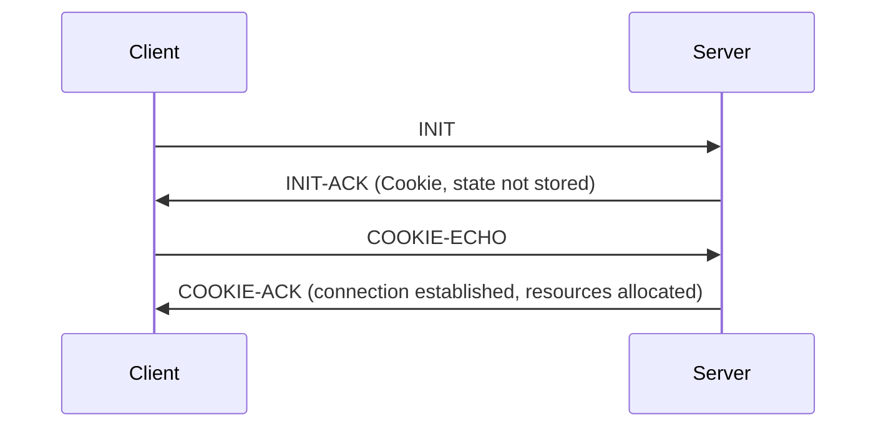

# SCTP (Stream Control Transmission Protocol)

## 1. Overview

### A. Definition
> A **transport-layer protocol (RFC 4960)** that supplements the limitations of both TCP and UDP, simultaneously providing **message orientation + reliability + multi-streaming + multi-homing**.

For a long time, the transport layer had only two pillars: **TCP**, which guarantees ordering and reliability but, being a byte stream, has no message boundaries and binds a single connection to one ordering sequence; and **UDP**, which is fast but unreliable. SCTP was designed as a third protocol that takes the strengths of both—combining "reliable transmission" with "message-unit processing"—and adds multi-streaming and multi-homing arising from network requirements.

### B. Background and Necessity of Emergence
SCTP originally started from the SIGTRAN work of moving telephone-network signaling (SS7) onto IP networks. Signaling traffic consists of individual signals that are **independent messages** and is sensitive to delay and loss, so high availability is essential; but carrying it over TCP hits two walls. One is **Head-of-Line (HoL) blocking**, where the loss of one earlier segment forces even unrelated later messages to wait; the other is **single-path vulnerability**, where the connection is bound to a single IP path so that if that path is severed, the entire session dies. SCTP fundamentally resolves these limitations by placing several independent ordering sequences (streams) within one connection to alleviate HoL, and by registering multiple IPs with a connection to immediately switch over on path failure.

## 2. Key Features

SCTP's identity emerges from the interlocking of four features. **Multi-streaming** places multiple streams that independently manage ordering within a single logical connection (association); the loss of one stream does not block another, alleviating HoL blocking. **Multi-homing** has one connection hold multiple IP addresses at both ends, raising availability by switching to a backup path when the primary path fails. **Message orientation** preserves the message boundaries the application sent as-is, eliminating the reassembly burden on the receiving side. In addition, it provides **reliability and per-stream ordering** based on acknowledgments and retransmission, and defends against resource-exhaustion attacks with a **cookie** during connection setup.

| Feature | Description | Problem Solved |
|---|---|---|
| **Multi-streaming** | Multiple independent streams within one connection | Alleviates HoL blocking |
| **Multi-homing** | Holds multiple IP paths, switches over on failure | Single-path availability |
| **Message orientation** | Preserves message boundaries (TCP is a byte stream) | Reassembly burden |
| **Reliability·ordering** | SACK acknowledgment·retransmission, per-stream ordering | Loss·reordering |
| **Security (cookie)** | 4-way handshake + cookie | SYN Flooding |

## 3. Protocol Structure and Operation

Whereas TCP allocates resources first with a 3-way handshake, SCTP introduces a **cookie mechanism into a 4-way handshake**, so the server does not store state until the connection is confirmed. When the server receives an INIT, it does not create connection state; it puts the necessary information into a signed cookie and returns it in INIT-ACK. Only after the client sends that cookie back with COOKIE-ECHO and its legitimacy is verified does the server allocate resources, so it is **structurally strong against SYN Flooding**, which floods only INITs with forged addresses.

The transmission unit is a **chunk**; after a common header, control chunks (INIT, etc.) and data chunks are bundled, several to a single packet. Data chunks carry a stream number and a Stream Sequence Number (SSN) to manage per-stream ordering.

| Element | Content |
|---|---|
| **Association** | Connection unit (including multi-stream·multi-homing) |
| **Chunk** | Common header + control/data chunk bundle |
| **4-way handshake** | INIT→INIT-ACK(cookie)→COOKIE-ECHO→COOKIE-ACK |
| **Congestion·flow control** | TCP-like (SACK-based, per-path management) |

## 4. Comparison with TCP·UDP

The differences among the three protocols ultimately come down to the trade-off of "what is guaranteed and what is given up." UDP discards all guarantees for maximum speed; TCP gains reliability but accepts byte streams, a single path, and HoL. SCTP maintains reliability while also gaining message boundaries, multi-streaming, and multi-homing, but as a result the protocol is complex and support from intermediate equipment is lacking.

| Category | TCP | UDP | SCTP |
|---|---|---|---|
| **Reliability** | O | X | O |
| **Message boundaries** | X | O | O |
| **Multi-streaming** | X | X | O |
| **Multi-homing** | X | X | O |

## 5. Considerations and Implications
From a professional engineer's perspective, SCTP is a representative case of "technical superiority does not guarantee adoption." In **domains where high availability and multiple paths are essential**—such as Diameter in the 4G/5G core, SS7 signaling (SIGTRAN), and the WebRTC data channel—it is used as a de facto standard, but on the general internet its spread has been slow. The biggest obstacle is **the lack of support in firewalls and NAT devices**; many middleboxes do not recognize the SCTP protocol number and block it. To work around this, encapsulating SCTP over UDP (e.g., SCTP over DTLS/UDP in WebRTC) has become the practical solution. Therefore, when adopting it, one must always verify **middlebox compatibility along the path** in advance along with the technical advantages, and if the aim is to alleviate HoL, it is advisable to comparatively review alternatives such as QUIC.

---

> **In one line**: SCTP is a transport protocol combining *reliability + message orientation + multi-streaming·multi-homing*; it blocks SYN Flooding with a cookie-based 4-way handshake and provides HoL blocking alleviation and multi-path availability, but the lack of NAT·firewall support constrains its adoption.
