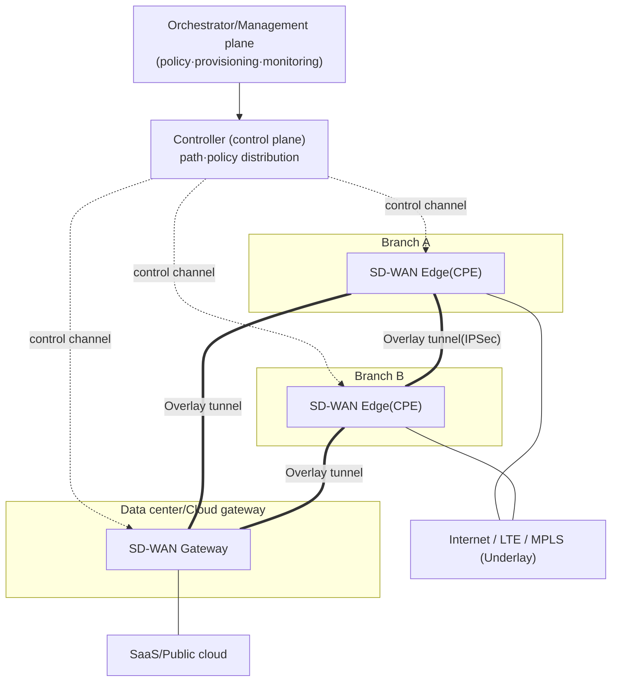
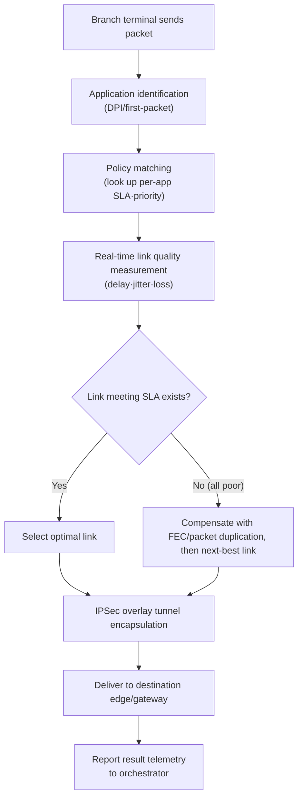

# SD-WAN (Software-Defined WAN)

## 1. Overview

> **SD-WAN** is a WAN architecture that applies SDN's (Software-Defined Networking's) philosophy of separating the control and data planes to the wide area network (WAN), bundling different circuits such as internet, LTE/5G, and MPLS into a single logical overlay and **centrally controlling traffic paths in software according to application-aware policies**. What distinguishes it from traditional router-based WAN is that it automatically selects the optimal path based on policy and real-time link quality, regardless of the type and quality of the physical circuit (underlay).

The fundamental background behind SD-WAN's emergence is that **the destination of enterprise traffic shifted from the headquarters data center to the cloud and SaaS**. In the past, most branch traffic headed toward applications in the headquarters data center, so a hub-and-spoke structure connecting branches to headquarters over expensive MPLS leased lines was reasonable. However, as work moved to SaaS such as Microsoft 365 and Salesforce and to the public cloud, the "trombone" phenomenon intensified, in which traffic that could go straight out to the internet is backhauled to headquarters and then sent back out to the cloud. This raises both latency and circuit cost simultaneously.

Added to this were **the high cost and long provisioning period of MPLS circuits (weeks to months), and the operational burden of managing each branch's router with individual CLI commands**, which increased the demand to "use cheap internet circuits as reliably as MPLS, but manage them centrally in software." SD-WAN treats circuits as commoditized bandwidth, lays an encrypted overlay tunnel on top of them, and solves this problem by **detouring around poor-quality links in real time and assigning good links to important applications**. As a result, it aims simultaneously for circuit cost savings, shorter branch activation times, and improved cloud access experience.

## 2. Conceptual Structure and Core Characteristics

Like SDN, SD-WAN separates functions into the **management, control, data, and orchestration planes**. The conceptual diagram below shows how a central controller/orchestrator governs the edge devices of many branches, and how a logical overlay is formed on top of the physical circuit (underlay).

The characteristics of SD-WAN architecture can be organized along four axes. First, **decoupling**. Path computation and policy decisions are handled by a logically centralized controller, while edge devices (CPE) focus on the data-plane role of forwarding packets according to that policy. Unlike the old way of entering individual configurations into each branch router, defining a policy in one place distributes it in bulk to hundreds of branches, simplifying operations. For example, in "zero-touch provisioning (ZTP)" for opening a new branch, once a field technician connects only the CPE's power and circuit, the device automatically registers with the orchestrator, downloads its policy, and can be in service within tens of minutes.

Second, **application awareness**. SD-WAN identifies which application traffic belongs to using DPI (deep packet inspection) and first-packet classification techniques, and assigns paths according to each application's SLA (allowances for delay, loss, and jitter). Jitter-sensitive traffic such as voice and video conferencing goes over good-quality links, while delay-insensitive traffic such as large backups goes over cheap links. Unlike traditional routing that decided paths using only the 5-tuple (source/destination IP, port, protocol), SD-WAN also uses the application semantics of "what does this session do" as a basis for judgment. For this reason, policies are described in business language, such as "Microsoft 365 traffic gets SLA A, backup traffic gets SLA C" rather than "the 192.168.x.x range goes to link 1," and the policy need not be rewritten even when circuits change.

Third, **overlay/underlay separation**. Regardless of whether the physical circuit (underlay) is internet or MPLS, an encrypted logical tunnel (overlay) is formed on top of it, and paths are controlled at this overlay level. This reduces dependence on the circuit operator and circuit type, freely enabling multi-circuit, multi-operator configurations.

Fourth, **centralized visibility and policy consistency**. Every edge's link quality, application usage, and policy violations gather into the orchestrator dashboard, observing and controlling the entire enterprise WAN from a single screen. This greatly speeds up fault response compared with the traditional method of collecting per-device logs and analyzing them by hand. For example, if the internet circuit latency at a particular branch spikes, the administrator can identify the problem link on the dashboard and adjust policy to reroute immediately, without logging into individual routers.

In addition, **local breakout** is a representative function through which SD-WAN creates real value. It sends SaaS and internet traffic originating at a branch straight out to the internet from the branch circuit without backhauling it to headquarters, fundamentally eliminating the trombone phenomenon described earlier. However, since each branch then becomes an internet entry point, distributed security controls are also required, and this point leads into the SASE discussion.

## 3. Core Technology Elements and Traffic Processing Procedure

SD-WAN's value ultimately comes from the data-plane technology that decides in real time "**which packet to send over which link, meeting which quality criteria**." The main technology elements are as follows.

| Technology Element | Description | Practical Implication |
|---|---|---|
| Dynamic Path Selection (DPS) | Continuously measures per-link delay·jitter·loss to select the real-time optimal path | Non-disruptive rerouting when circuit quality degrades |
| Application identification | Classifies apps by DPI·first-packet·cloud signatures | Applies differentiated policy per app |
| FEC/packet duplication | Corrects loss via forward error correction·dual transmission of important packets | Secures voice quality on poor internet circuits |
| Overlay encryption | Guarantees confidentiality·integrity via IPSec tunnels between edges | Safely uses internet circuits as an MPLS replacement |
| Application SLA | Defines·enforces allowable delay·loss thresholds per app | Policy-based automatic link switching |

Dynamic Path Selection (DPS) is the heart of SD-WAN. Edge devices continuously send probes on each link using BFD (Bidirectional Forwarding Detection) and the like, measuring round-trip delay, jitter, and packet loss at intervals of a few to a few hundred milliseconds. When a link's loss rate exceeds the application SLA threshold (e.g., voice traffic loss exceeding 1%), it immediately fails over to another link without dropping the session. The user experiences only a brief quality dip instead of a dropped call, or does not even notice it.

Here, how the SLA thresholds are set determines operational quality. Setting a threshold too sensitively causes the path to flap even on minor fluctuations, becoming unstable, while setting it too insensitively leaves quality degradation unaddressed. Therefore the core of practice is to design, per application characteristics, the allowances for delay, jitter, and loss together with hysteresis (a return delay).

FEC (Forward Error Correction) and packet duplication are techniques that compensate in software for the inherent instability of internet circuits. On loss-prone segments, important real-time packets are sent simultaneously over two links (duplication) so that even if one is lost it arrives via the other path, or parity packets are appended (FEC) to recover some loss without retransmission. This is especially effective for real-time traffic where retransmission induces delay. However, since these techniques consume additional bandwidth (duplication up to 2x), the principle is to apply them selectively only to the few applications with strict SLAs rather than to all traffic. In other words, SD-WAN's quality compensation is the result of a policy judgment to "concentrate resources on what is important" rather than "improve everything unconditionally."

Overlay encryption is the prerequisite for safely using cheap internet circuits as a replacement for MPLS. It automatically sets up and renews IPSec tunnels (including key exchange) between edge devices to secure the confidentiality and integrity of enterprise traffic passing over the public internet. When hundreds of branches are connected to each other in a full mesh, the number of tunnels surges, so the controller reduces management burden with an on-demand method that dynamically creates only the needed tunnels.

The detailed process diagram below shows how a single packet originating at a branch is delivered to its destination through identification, policy matching, path selection, and tunneling.

What is notable in this flow is that the path decision is not static routing that looks only at the destination IP, but **combines the three factors of 'what application is this × what is the quality of each link right now × what does the policy require' at every moment**. This is the core that distinguishes SD-WAN from simple multi-circuit redundancy (load balancing).

Meanwhile, SD-WAN is divided broadly into three deployment types depending on where the edge/gateway is placed, chosen to match the organization's cloud maturity and traffic patterns.

- **On-premises**: Places physical CPE at branches and data centers and controls only the inter-branch overlay in software. Suitable for organizations with a low proportion of cloud access that want to leverage existing circuit assets, but the cloud on-ramp benefit is limited.
- **Cloud-enabled**: In addition to on-premises edges, directly integrates with the cloud gateways (on-ramps) of major IaaS/SaaS providers. The cloud access path is optimized, improving SaaS performance.
- **Cloud-delivered**: Provides the gateway function as a service from global PoPs operated by the vendor. Advantageous for remote-user, multi-site environments, and adding SSE immediately extends it into a SASE form.

The choice of deployment type is directly tied to designing the breakout point—"where will we exit to the internet/cloud"—and since this determines not only performance but also the location of security controls, it must be fixed early in the architecture.

## 4. Comparison — Traditional WAN (MPLS)·SD-WAN·SASE

To understand SD-WAN's position, one must view its relationship with traditional MPLS WAN and with the higher-level concept SASE together. The table below compares the three while also explaining the reasons the differences arise.

| Category | Traditional MPLS WAN | SD-WAN | SASE |
|---|---|---|---|
| Path control | Per-router static/routing protocol | Central policy·app-aware dynamic | Includes SD-WAN + security integration |
| Circuit | Mainly MPLS leased lines | Mix of internet·LTE·MPLS | Converges to cloud PoP |
| Cost/activation | Expensive·weeks to months | Cheap·tens of minutes (ZTP) | Subscription |
| Security | Separate devices (firewall, etc.) | Basic IPSec, security is add-on | Built-in security (ZTNA·SWG, etc.) |
| Cloud access | Headquarters backhaul (trombone) | Branch local breakout | PoP-based optimal path |

The fundamental difference between MPLS and SD-WAN lies in **whether quality is guaranteed by 'circuit contract' or by 'software control'**. MPLS has the operator guarantee the SLA by contract, but is expensive and low in flexibility. SD-WAN bundles several cheap circuits in software to secure quality statistically. Therefore, rather than SD-WAN completely replacing MPLS, in many cases the realistic solution is a **hybrid configuration that keeps core mission-critical traffic on MPLS while local breaking out general and cloud traffic to the internet**.

The relationship between SD-WAN and SASE is accurate when understood as an inclusion relationship. SASE is a higher-level architecture that fuses "SD-WAN (connectivity) + SSE (Security Service Edge)" at the cloud edge. If only SD-WAN is adopted, a gap arises as branches go directly to the internet and the security inspection points covered by the perimeter firewall disappear. Filling this gap with cloud security services is the idea of SASE, so **in practice, adopting SD-WAN often proceeds as the first step toward SASE**.

As a real-world application, financial and retail companies operating many branches place SD-WAN CPE at each branch, separating core traffic such as POS and payments onto MPLS/leased lines and employee web and SaaS traffic onto the internet, with reports of 30-50% circuit cost savings. Multinational manufacturers tie video-conferencing traffic (e.g., Microsoft Teams) to an application SLA and configure it to automatically switch links when jitter worsens, reducing complaints about meeting quality.

Public and logistics agencies with many offices nationwide are also representative beneficiaries. When an agency that managed hundreds of sites with individual router CLIs adopts SD-WAN, opening a new site shortens from weeks to tens of minutes (ZTP), and policy changes are distributed in bulk from the center, greatly reducing the repetitive work of operations staff. However, this benefit is realized only when policies and standards are elaborately designed in advance; one must also note that adopting the functions without design can, on the contrary, complicate operations due to policy conflicts and lack of visibility.

## 5. Deep Dive — Recent Trends and Architectural Evolution

Recently SD-WAN is evolving in the direction of **being absorbed from a standalone solution into the connectivity axis of SASE/SSE**. Gartner defined the fusion of networking and security as a market trend by presenting the SASE concept in 2019 and the SSE concept in 2021, and major vendors are reorganizing their SD-WAN products as part of SASE platforms. In other words, SD-WAN's original problem statement of "branch connectivity" is expanding into the broader frame of "securely connecting on an identity basis no matter where you connect from."

The technically notable recent trends are as follows.

- **AIOps-based autonomous operation (self-driving WAN)**: Analyzes link quality, application performance, and user experience data with machine learning to predict faults in advance and automatically optimize policy.
- **Cloud on-ramp advancement**: Directly connects to the backbones of major IaaS/SaaS providers with adjacent gateways to shorten the cloud access path.
- **DEM (Digital Experience Monitoring) integration**: Measures beyond network metrics to the app responsiveness actually felt by users, shifting the basis of operational judgment from "circuit quality" to "user experience."
- **Incorporation of 5G/satellite circuits into the underlay**: 5G private networks and low-earth-orbit satellites are incorporated as new backup/primary circuit options, broadening connectivity at sites where wired circuits are difficult.

What these trends have in common is that SD-WAN's center of gravity is shifting from a "technology for bundling circuits" to a "policy engine that guarantees applications and user experience."

From an exam perspective, the anticipated question directions are (1) the relationship and differences between SDN and SD-WAN, (2) SD-WAN's four planes and the overlay/underlay concept, (3) application-aware path selection and quality-compensation techniques such as FEC, (4) pros and cons versus MPLS and the hybrid transition strategy, and (5) linkage with SASE·ZTNA. When composing an answer, developing the narrative of "why it emerged (cloud transition·MPLS limitations) → how it works (plane separation·dynamic path) → what it links with (SASE·zero trust)" secures logical completeness.

## 6. Considerations and Implications

From a professional engineer's perspective, adopting SD-WAN is not a simple circuit replacement but a redesign of the overall WAN operating model, so the following must be considered together.

- **Proactive design for the security gap**: Local breakout, where branches go directly to the internet, improves performance but eliminates the perimeter security inspection point. From the early adoption stage, cloud security (SWG·ZTNA) or a SASE roadmap must be designed together so that performance and security do not conflict.

- **Hybrid transition strategy and trade-offs**: Rather than completely scrapping MPLS, a phased transition that leaves core mission-critical systems on leased lines while migrating general and cloud traffic to the internet lowers risk. The trade-off between cost savings (internet) and guaranteed SLA (MPLS) must be judged on the basis of application importance.

- **Vendor lock-in and operational capability**: Since the controller, orchestrator, and CPE are usually tied into a single vendor ecosystem, there is a risk of lock-in. Compliance with standards (e.g., the MEF SD-WAN service standard), multi-vendor/multi-cloud interoperability, and organizational capabilities suited to software-centric operation (networking + automation) must be secured together.

- **Visibility and SLA measurement framework**: Since SD-WAN's benefit comes from central observability, a framework that quantitatively measures application performance and user experience (DEM, Digital Experience Monitoring) must be built together to actually verify improvement effects and continuously improve policy.

- **Outlook and related technologies**: SD-WAN is expected to establish itself as the "connectivity layer of the distributed-application era" by combining with SASE, zero trust, edge computing, and 5G private networks. Autonomous operation combined with AIOps and advanced cloud on-ramps will become differentiation points.

## References
- Gartner, "The Future of Network Security Is in the Cloud" (2019) — https://www.gartner.com/en/documents/3956841
- MEF, "SD-WAN Service Attributes and Services (MEF 70.1)" — https://www.mef.net/resources/mef-70-1-sd-wan-service-attributes-and-services/
- Cisco, "What Is SD-WAN?" — https://www.cisco.com/c/en/us/solutions/enterprise-networks/sd-wan/what-is-sd-wan.html
- Fortinet, "What is SD-WAN?" — https://www.fortinet.com/resources/cyberglossary/sd-wan

---
> **In one line**: SD-WAN is a WAN architecture that applies SDN's plane-separation philosophy to the wide area network, bundling internet·LTE·MPLS circuits into an encrypted overlay and centrally controlling paths in software according to application-aware policies and real-time link quality to improve cost, agility, and cloud access experience; when fused with security, it extends into SASE.
