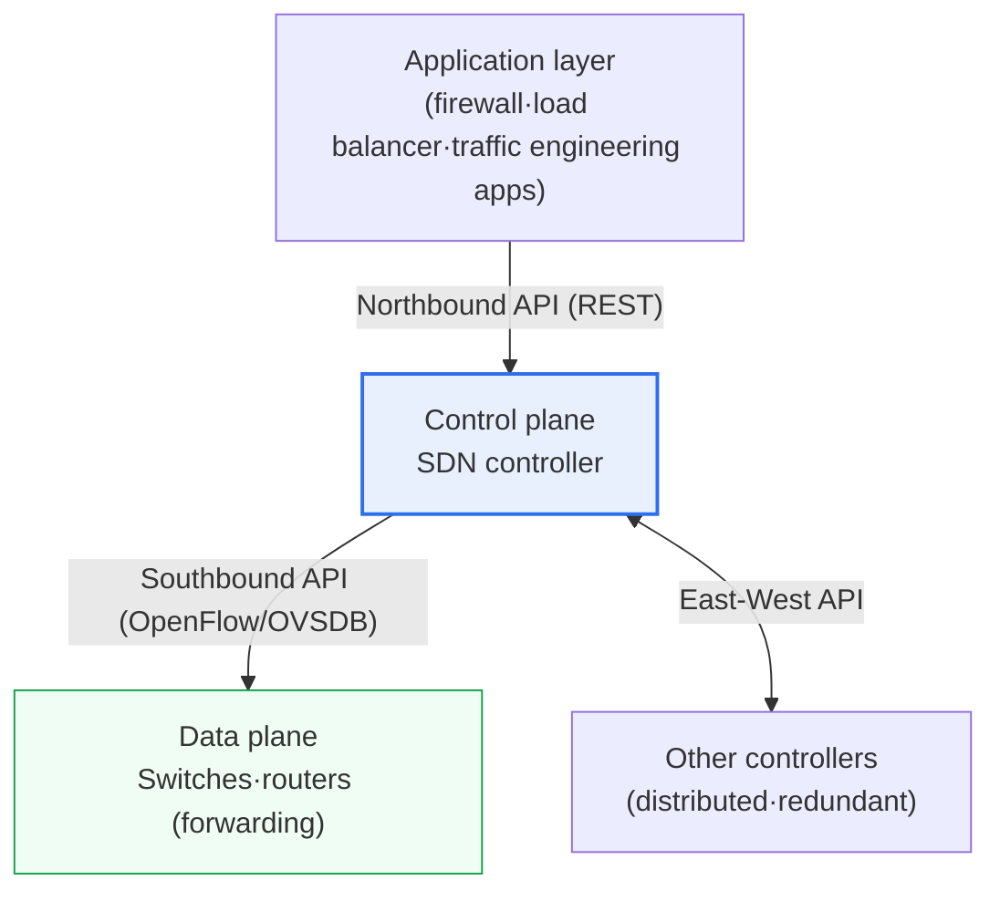
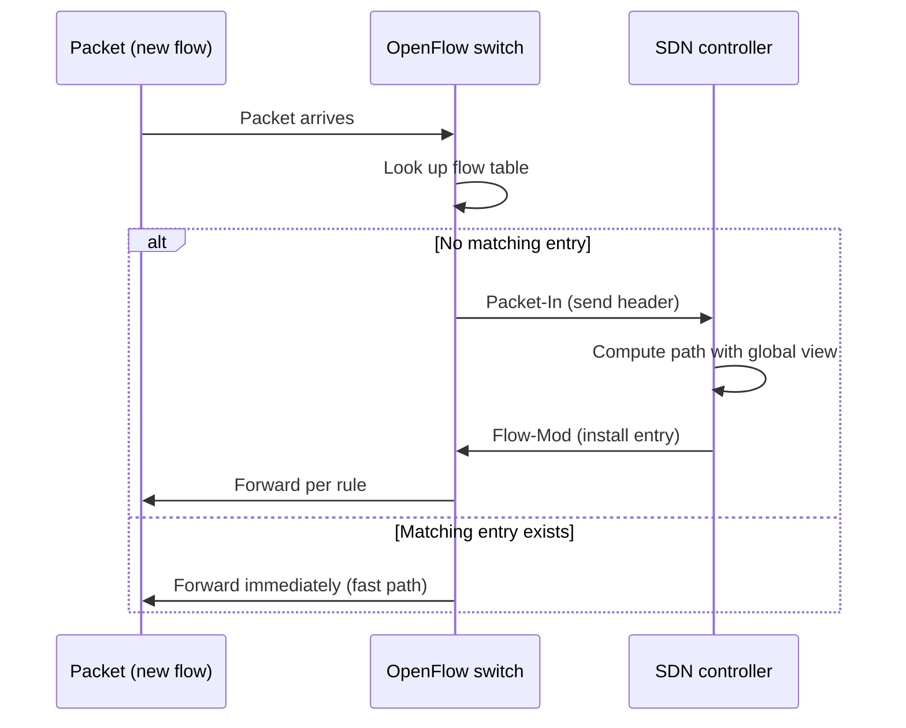

# Software Defined Networking (SDN)

## 1. Overview

### A. Definition
> **SDN (Software Defined Networking)** is an architecture that **physically and logically separates the control function (Control Plane) and the data forwarding function (Data Plane)** of network devices, so that centralized software (a controller) abstracts the entire network and controls it programmably. Its key point is that the controller directly defines the forwarding rules of underlying devices through open interfaces (such as OpenFlow).

The fundamental idea of SDN is "**control the network flexibly and centrally, like software**." To understand this, one must first address the limitations of traditional networks. Conventional routers and switches contain both "the brain that decides where to send packets (control plane)" and "the hands and feet that actually send packets out (data plane)" within a single device. As a result, changing a single routing or access control policy requires logging into tens to hundreds of devices one by one for individual configuration (CLI), and since command structures differ by vendor, integrated management is difficult. Even though the network is one giant system, from a management perspective it was treated as a collection of individual devices operating autonomously.

SDN fundamentally overturns this structure. It detaches the brain that decides "where to send" from each device and gathers it into a **central controller**, and the remaining devices become simple forwarding engines (data plane) that only forward packets as instructed by the controller. As a result, administrators can view the entire network at a glance in the central controller's software (global visibility), define policies as if programming, and apply changes immediately across the entire network in one batch. It also becomes possible to reroute traffic in real time to bypass congestion on specific paths and to control diverse devices in an integrated manner via standard interfaces without being locked into a specific vendor.

### B. Background and Necessity
The decisive background for the rise of SDN is **the spread of cloud and server virtualization**. As dozens of virtual machines (VMs) and containers run on a single physical server and are frequently created, moved, and destroyed through auto-scaling and live migration, the scale and frequency of configuration changes the network must handle have exploded. Manual per-device configuration of VLANs and routing by humans cannot keep up with this pace. Added to this was the demand of large data center operators (Google, Amazon, etc.) to finely optimize their own traffic, making a **programmable network** controlled by code essential. Amid this trend, SDN became established as an industry-standard concept through research at Stanford and Berkeley (the OpenFlow paper around 2008) and standardization by the ONF (Open Networking Foundation).

## 2. SDN Layered Architecture and Characteristics of the Control Plane

As shown in the figure below, SDN consists of three layers—**application layer – control plane – data plane**—connected by standard APIs. The upper interface is called northbound, and the lower one southbound.

The **control plane (controller)** is the brain of SDN. It understands the entire network topology, decides which path each flow should take, and pushes those rules down to the underlying devices. Representative open-source controllers include OpenDaylight and ONOS, and commercial ones include Cisco's APIC (ACI-based). The characteristics of the controller can be summarized in three points. **Centralized control** gathers previously scattered control intelligence in one place to guarantee policy consistency; **Global view** provides a real-time overview of the entire network state, enabling optimal path computation; and **Programmability** allows network behavior to be defined and automated through software APIs.

The **application layer** implements network services such as firewalls, load balancing, traffic engineering, and intrusion detection in software on top of the northbound API (mainly REST) exposed by the controller. Developers can write policy apps targeting the abstracted network view provided by the controller without knowing the details of physical devices. This is the "application-ization of the network."

The **data plane (devices)** is responsible only for forwarding, dropping, or modifying incoming packets according to the rules (flow entries) issued by the controller. Since they do not decide paths themselves, the hardware becomes simpler and faster, and intelligence is concentrated in the controller software.

| Layer | Role | Representative technologies·interfaces |
|---|---|---|
| **Application** | Network policies·services (firewall·LB·TE) | Northbound REST API |
| **Control plane (controller)** | Topology discovery, deciding·issuing forwarding rules | OpenDaylight, ONOS |
| **Data plane (devices)** | Forward packets per rules (forwarding) | OpenFlow switch, OVS |

## 3. The OpenFlow Protocol and Operating Procedure

**OpenFlow** is the representative standard southbound protocol between the SDN controller and switches (data plane). The controller pushes **Flow Entries** saying "handle packets with these characteristics in this way" into the switch's **Flow Table**, and the switch matches incoming packets against this table and performs the specified action. Each entry broadly consists of **match fields** (input port, MAC/IP addresses, port numbers, etc.), **actions** (forward to a specific port, drop, send to controller, modify header), and **counters/timeouts**.

The packet processing procedure is as follows. When a packet of a never-before-seen flow arrives at a switch, since there is no matching entry, the switch queries the controller about that packet (or its header) with a **Packet-In** message. The controller computes a path based on its global view and installs new entries in the flow tables of the relevant switches with **Flow-Mod** messages. Thereafter, packets of the same flow are forwarded immediately by the switch by consulting only its table without going through the controller, so only the first packet takes the control path and the rest flow through the high-speed data path.

The practical benefits of this structure are clear. Since policy changes are made in one place—the controller's software logic—and automatically deployed to the relevant switches, the work of configuring hundreds of devices individually is replaced by a single API call. A representative use is an orchestrator (e.g., OpenStack Neutron) instantly provisioning the network paths and security policies needed when a new VM spins up in a data center via the controller API.

| Element | Description |
|---|---|
| **Flow table** | Repository of packet processing rules (match-action) |
| **Flow entry** | Match conditions + actions (forward·drop·modify) + counters·timeouts |
| **Packet-In** | Query the controller about unmatched packets |
| **Flow-Mod** | Controller installs·modifies·deletes entries |

## 4. Comparison with Traditional Networks, and Differences from NFV

To accurately understand the value of SDN, one must see **what changes and why**. The reason control and forwarding are bound together in a single device in traditional networks is that each device autonomously runs protocols (OSPF, BGP, etc.) to learn paths on its own; this autonomy is robust but disadvantageous for global optimization and rapid batch policy changes. SDN gathers intelligence centrally to gain global optimization and automation, but in exchange takes on a new risk of dependence on a central controller. That is, the difference between the two is not simple superiority or inferiority but stems from **a trade-off in control philosophy: distributed autonomy versus centralization**.

| Category | Traditional network | SDN |
|---|---|---|
| Control·forwarding | Coupled within device | Separated (control = controller) |
| Policy change | Manual per-device configuration | Centrally programmed·batch deployed |
| Visibility | Per device | Network-wide global view |
| Vendor lock-in | High | Mitigated by standard APIs |
| Main risk | Management complexity·slow changes | Controller single point of failure |

Meanwhile, a concept often confused with SDN is **NFV (Network Function Virtualization)**. The two are complementary but solve different problems. SDN focuses on "separating control and forwarding to program the network centrally," while NFV focuses on **detaching network functions such as firewalls, routers, and load balancers from dedicated hardware (appliances) and implementing them as software (VNFs) on general-purpose servers**. Telcos combine the two technologies to build 5G core and edge infrastructure, flexibly connecting and controlling network functions virtualized by NFV through SDN. For example, network slicing is a representative case of partitioning a single physical infrastructure into purpose-specific logical networks on top of the combination of SDN and NFV.

This trade-off also appears in deployment methods. Depending on when the controller installs flow rules, deployment is divided into **Proactive** and **Reactive**. Proactive pre-installs rules for anticipated flows on switches in advance, so even the first packet does not pass through the controller, resulting in low latency and low controller load, but it consumes a lot of table capacity. Reactive installs rules when a flow first appears, as in the Packet-In approach seen earlier, conserving table space and being flexible, but increasing first-packet latency and controller load. Large data centers usually operate a hybrid, using proactive for predictable bulk traffic and reactive for exceptional flows.

## 5. Advanced — Practical Application and Latest Trends

SDN has already gone beyond a research concept to become the foundation of large-scale commercial infrastructure. The most widely known case is **Google's B4**, which is reported to have significantly raised link utilization by applying SDN to the WAN connecting its data centers worldwide (unlike traditional WANs, which leave generous spare link capacity in preparation for failures, it is known to have greatly increased utilization by packing traffic tightly through central control). Inside data centers, commercial solutions such as VMware NSX and Cisco ACI provide **network virtualization (overlay)** applying SDN principles, and in the open-source camp, Open vSwitch (OVS) is used as the de facto standard software switch.

Application is also active in the carrier domain. The 5G core network adopted the CUPS (Control and User Plane Separation) structure, which separates the control and user planes; this can be viewed as a case where SDN's philosophy of separating control and data planes has been reflected in a standard mobile communications architecture. Combined with network functions virtualized by NFV, network slicing is implemented, splitting a single physical infrastructure into purpose-specific logical networks such as ultra-low latency, high capacity, and massive IoT.

The direction of technological evolution is also clear. First, the evolution toward **Intent-Based Networking (IBN)**. Instead of administrators specifying paths and rules in detail, they simply declare an **intent** such as "Service A may communicate only with Service B and must guarantee latency within 10 ms," and the system automatically translates it into concrete configurations and continuously verifies and corrects them. Second, the deepening of **data plane programming**: with the emergence of the P4 language and programmable switches, it has become possible to code the packet processing pipeline itself, beyond the fixed match fields handled by OpenFlow. Third, in the WAN domain, **SD-WAN** has spread rapidly by applying SDN principles to enterprise branch connectivity, reducing dependence on MPLS leased lines and using Internet and LTE together on a policy basis.

At the same time, it should be noted in a balanced way that the early SDN vision centered on pure OpenFlow has been considerably revised in reality. Because it is difficult to replace existing routing protocols and device ecosystems all at once, and because the burden of controller performance and scalability is large, actual commercial deployments have tended to shift their center of gravity toward an **overlay approach (VXLAN-based network virtualization)** that leaves the physical network as is and places a logical network on top of it, or toward **network automation and programmability** leveraging standard APIs of existing devices (NETCONF/YANG, gNMI). In other words, it is more accurate to see that, rather than the original form of "complete separation of control and forwarding," SDN's essential value of "defining and automating the network with software" is being inherited and spread in various forms.

The common thread of these trends is "moving network operations from manual human intervention to declarative software automation," which aligns precisely with the IaC (Infrastructure as Code) and cloud-native operating philosophy of managing infrastructure as code. Ultimately, SDN should be understood not as a concept to be judged by the success or failure of a specific protocol, but as a shift in the very mindset of treating the network as a programmable resource.

## 6. Considerations and Implications

From a Professional Engineer's perspective, SDN should be understood not as an individual protocol but as **a paradigm shift in network operations**, and the following trade-offs should be designed together during adoption.

1. **Always eliminate the central controller's single point of failure (SPOF).** Since control intelligence is concentrated in one place, a controller failure leads directly to paralysis of network control. Therefore, controller clustering and redundancy, distributed controller configurations via East-West APIs, and fail-safe design that maintains forwarding with existing flows even when the controller is disconnected are essential.

2. **Secure the security and performance of the control channel.** If the controller–switch channel is compromised, the entire network is threatened, so the channel must be protected with TLS or similar, and flow installation policies (proactive vs reactive) and rate limiting must be designed so that massive Packet-In floods to the controller do not become a processing bottleneck or DoS.

3. **Adopt a gradual, hybrid transition strategy.** Since it is difficult to replace existing traditional devices all at once, a phased migration that starts with low-risk areas such as overlay (VXLAN)-based network virtualization or SD-WAN and coexists with legacy is realistic.

4. **Integrate with automation, orchestration, and related technologies.** The true value of SDN emerges not on its own but when combined with NFV, cloud orchestrators, IaC, and intent-based operations. Securing standard APIs (northbound REST), multi-vendor interoperability, and software/API capabilities of operations staff are prerequisites for successful adoption.

5. **Consider return on investment and operational maturity together.** SDN adoption entails initial costs of equipment replacement, controller deployment, and staff retraining, so it is reasonable to apply it first in areas where automation effects are clear, such as large data centers and multi-cloud environments with frequent network changes. Conversely, in small or closed networks where changes are rare and stability is the top priority, traditional methods may still be valid, so selective adoption tailored to the organization's operational maturity and traffic characteristics is required.

## References
- Open Networking Foundation, SDN definition and architecture. https://opennetworking.org/sdn-definition/
- OpenFlow Switch Specification (ONF). https://opennetworking.org/software-defined-standards/specifications/
- Software-defined networking (Wikipedia). https://en.wikipedia.org/wiki/Software-defined_networking

---

> **In one line**: SDN is an architecture that *separates the control plane and data plane* so that a central controller controls the network like software with global visibility and programmability; it issues rules to devices' flow tables via OpenFlow and serves as the foundation for network virtualization, NFV, and intent-based automation, but the controller single point of failure and control channel security are its key challenges.
