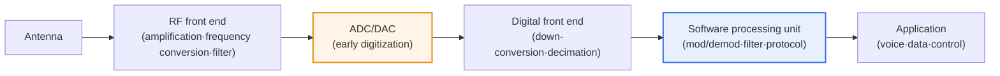
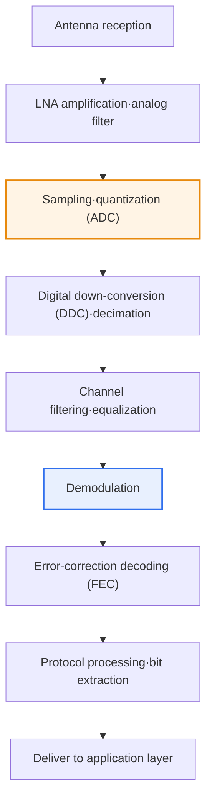

# SDR (Software Defined Radio)

## 1. Overview

### A. Definition

> **SDR (Software Defined Radio)** is a reconfigurable radio technology that **implements the signal processing functions of wireless communication (modulation/demodulation, filtering, frequency conversion, protocol processing, etc.) in software rather than in dedicated hardware circuits**, enabling a single radio device to support different communication schemes, frequencies, and bandwidths simply by changing software.

The core idea of SDR is "**do not fix radio functions in hardware; define them flexibly in software**." Traditional radio equipment built modulators/demodulators, mixers, filters, and so on into dedicated analog/digital circuits tailored to a specific communication standard (e.g., 2G GSM, FM radio). Because the standard was "baked into" the hardware, when a new generation (3G, 4G, 5G) or a different scheme appeared, the circuit itself—that is, the entire device—had to be replaced. This means high cost and a fundamental rigidity in that, once installed, it is hard to change.

SDR reverses this structure entirely. It **converts the analog signal received by the antenna to digital at the earliest possible stage (early digitization)**, and then performs all subsequent processing (down-conversion, filtering, demodulation, error correction, protocol interpretation) in software running on general-purpose processors (CPU/GPU), DSPs, and FPGAs. As a result, while leaving the hardware (RF front end, ADC/DAC) as is, **a completely different communication system can be operated simply by replacing the software or changing parameters**. Just as a computer can do word processing, gaming, and calculation by switching programs, a single radio platform can handle multiple standards.

Thanks to this flexibility, SDR has become the common foundational technology for **military tactical communications (JTRS)**, which must handle various standards simultaneously; **mobile communication base stations**, where standards evolve frequently; **satellite and amateur radio**, where the band varies by mission; and **Cognitive Radio**, which senses the surrounding radio environment and changes bands on its own. In summary, SDR can be described as a technology that "softwarizes" radio to simultaneously secure Reconfigurability, Scalability, and Interoperability.

### B. Background and Necessity

The background that called for SDR can be summarized in three points. First, **the proliferation of wireless standards and rapid generational turnover**. As standards change roughly every 10 years from 2G→3G→4G→5G and heterogeneous standards such as Wi-Fi, Bluetooth, LoRa, and satellite coexist, the approach of having dedicated hardware for each standard has become unsustainable in terms of cost, space, and operations. Second, **the scarcity of spectrum resources**. To reuse limited spectrum efficiently, bands and modulation schemes must be changeable dynamically according to the situation, which is impossible without software-based reconfiguration. Third, **advances in semiconductor and computing performance**. As the performance of high-speed ADCs/DACs and FPGAs, DSPs, and general-purpose processors reached a level capable of real-time digital processing of radio bandwidth, moving signal processing that was once possible only in hardware into software became realistic. These three trends combined to increase the need for flexible, reconfigurable radio technology that responds with software rather than hardware replacement.

## 2. Overall Architecture

An SDR system broadly consists of three layers: the **RF front end** close to the antenna, the **ADC/DAC** bridging the analog and digital worlds, and the **software processing unit** responsible for signal processing and protocols. The core design philosophy, as mentioned above, is to "place the ADC/DAC as close to the antenna as possible," minimizing the share of analog hardware and pulling as many functions requiring flexibility as possible into the digital/software domain.

The **RF front end** is the purely analog domain that performs low-noise amplification (LNA) of the weak signal coming in through the antenna, filters the target band with analog filters, and shifts the frequency with a mixer. Due to the laws of physics, this part is hard to fully softwarize, so it is the minimal hardware that remains analog even in SDR. However, using a wideband RF front end allows multiple bands to be covered with one piece of hardware, so flexibility begins here.

The **ADC/DAC** is the key component that determines the success of SDR. The ADC (receive) samples and quantizes the analog signal to convert it to digital, and the DAC (transmit) does the reverse. The closer the ADC is placed to the antenna (i.e., the higher the frequency at which it digitizes directly), the broader the range software can handle, but according to the Nyquist theorem the sampling rate (e.g., hundreds of MSPS to several GSPS) and effective number of bits (ENOB) must be high, so component cost and power consumption rise sharply. This gives rise to the design trade-off of "at how early a stage to digitize."

The **software processing unit** receives the digitized sample stream, performs down-conversion and decimation (digital front end), and then processes modulation/demodulation, channel equalization, error-correction encoding/decoding, and the protocol stack in software. Execution platforms are divided into general-purpose CPUs/GPUs with high flexibility, DSPs where real-time behavior matters, and FPGAs strong in high-bandwidth parallel processing; real systems mix these (e.g., high-speed preprocessing on FPGA, protocols on CPU) to balance performance and flexibility.

| Layer | Representative functions | Implementation characteristics |
|---|---|---|
| **RF front end** | Low-noise amplification·frequency conversion·analog filter | Analog (HW), flexibility via wideband design |
| **ADC/DAC** | Analog↔digital conversion (sampling·quantization) | HW, sampling rate·ENOB determine performance |
| **Digital front end** | Down-conversion (DDC)·decimation·shaping | Mainly FPGA |
| **Software processing unit** | Mod/demod·equalization·FEC·protocol stack | Mix of CPU/GPU·DSP·FPGA |

## 3. Receive Operating Procedure (Processing Pipeline)

Following step by step the process by which SDR receives a signal and restores it to data makes it clear where hardware ends and software begins. The procedure diagram below breaks down the receive (Rx) path; whereas the overall architecture diagram above showed "what it is composed of," this figure shows "in what order it is processed."

The first part (S1–S3) is the domain of analog and conversion hardware. The signal entering through the antenna is amplified by the LNA, band-limited by a wideband analog filter, and then converted into digital samples at the ADC. This point is the boundary line of SDR; all subsequent stages can be replaced by software. If one wishes to switch to a different communication standard, this first part can generally be left as is and only the software of the latter part replaced—this is where SDR's flexibility becomes concrete.

The middle part (S4–S6) is the core of software signal processing. Digital down-conversion (DDC) moves the band of interest to baseband, and decimation lowers the sample rate to reduce the burden of subsequent computation. Next, channel filtering and equalization compensate for the effects of multipath and noise, and then the demodulation stage converts symbols back to bits according to the actual modulation scheme (e.g., QPSK, 64-QAM, OFDM). Since only this demodulation algorithm needs to change depending on the standard, this is why a single SDR can restore both FM radio and LTE signals.

The latter part (S7–S9) handles reliability and upper-layer processing. Bit errors introduced while passing through the channel are corrected with FEC (e.g., turbo or LDPC codes), and the protocol stack interprets frames to extract actual user data and delivers it to the application layer. Since this entire process is software, another practical advantage is that operational functions such as log collection, performance monitoring, and remote updates are easy to integrate.

## 4. Characteristics, Applications, and Comparison with Similar Concepts

The characteristics of SDR can be summarized along three axes—flexibility, scalability, and cost efficiency—but it is important to understand "why" each characteristic arises. **Flexibility and reconfigurability** arise because the functions reside in software. Since multiple standards and frequencies can be supported by changing only software on the same hardware, one device performs multiple missions. **Scalability** comes from being able to respond to new standards with software upgrades (effectively remote deployment), extending device lifetime. **Cost efficiency** appears in the form of lower total lifecycle cost (TCO), since devices are not discarded at every generational change, even though the initial hardware unit price may be somewhat higher.

| Category | Description | Practical implication |
|---|---|---|
| **Flexibility·reconfiguration** | Support multiple standards·frequencies via SW changes | Multiple missions with one device, interoperability |
| **Scalability** | Respond to new standards via SW upgrades | Remote deployment, extended device life |
| **Cost efficiency** | Minimize HW replacement | Initial cost↑·total lifecycle cost↓ |
| **Main applications** | Military tactical comms, base stations, satellites, cognitive radio | Multi-standard coexistence·dynamic spectrum environments |

A representative application is **Cognitive Radio**. Cognitive radio is a technology that senses surrounding spectrum usage in real time (Spectrum Sensing), finds unused bands (White Space), and uses them opportunistically. Such dynamic reconfiguration of "sense, then immediately change band and modulation" is feasible only on SDR, where functions are implemented in software. That is, SDR is the execution foundation (Enabler) supporting cognitive radio.

The relationship with similar and related concepts also needs to be organized. If **SDR** is the "softwarization of radio functions" at the level of radio terminals/devices, **SDN (Software Defined Networking)** is the "separation of the control plane and data plane to softwarize control" at the network level, and **NFV (Network Function Virtualization)** virtualizes network functions such as firewalls and routers as software on general-purpose servers. The three technologies share the common philosophy of "gaining flexibility by moving functions from hardware to software," and they converge in **Open RAN**, where they combine so that the radio and network functions of base stations (RU/DU/CU) are softwarized and opened together. Where they differ is the layer they address: SDR focuses on physical (PHY) radio signals, SDN on network control, and NFV on network functions.

| Category | Target layer | Core idea |
|---|---|---|
| **SDR** | Physical (radio PHY) | Implement radio signal processing in SW |
| **SDN** | Network control | Separate control/data planes, softwarize control |
| **NFV** | Network functions | Virtualize dedicated appliance functions in SW |

## 5. Advanced — Latest Trends and Industrial Applications

SDR has recently been spreading as a substantive infrastructure technology in mobile communications, defense, and space, showing that SDR is not merely a laboratory concept but the foundation of commercial systems.

First, **Open RAN and vRAN (virtualized base stations)**. Traditional base stations had their functions tied to a specific vendor's dedicated hardware, but Open RAN separates the radio access network into RU (Radio Unit), DU (Distributed Unit), and CU (Centralized Unit) and opens the interfaces. In this case, much of the baseband signal processing of the DU/CU is implemented as software on general-purpose servers, which is essentially a combination of the SDR and NFV philosophies. The core motivation is to enable carriers to reduce dependence on specific vendors and mix equipment from various suppliers.

Second, **satellites and Non-Terrestrial Networks (NTN)**. In low Earth orbit (LEO) satellite communications, satellite hardware cannot be replaced after launch, so SDR payloads whose functions can be updated and reconfigured in software are particularly advantageous. In fact, many LEO satellite projects have adopted software-defined payloads and are moving toward reprogramming missions and bands in orbit. As 5G standards (3GPP Rel-17 onward) formally include NTN, efforts continue to integrate terrestrial and satellite networks into a single software-defined infrastructure.

Third, **defense and tactical communications**. Since the U.S. JTRS (Joint Tactical Radio System), an early large-scale SDR project, the military's demand to make multiple heterogeneous radio standards interoperable on a single terminal has been a powerful driver of SDR development. If a single radio supports allies' various communication schemes through software switching alone, interoperability and security response on the battlefield improve significantly.

Fourth, **the popularization of low-cost SDR**. SDR, once expensive equipment, has spread into research, education, and amateur domains through the proliferation of low- to mid-cost platforms such as RTL-SDR, HackRF, and USRP and open-source toolchains such as GNU Radio. This broadened the base of SDR technology while also bringing a double-edged aspect—the security threats discussed later (a lower entry barrier for signal tampering and jamming).

## 6. Considerations and Implications

1. **The trade-off between performance and flexibility must be decided early in design.** Software processing is flexible but has greater processing latency and power consumption than dedicated hardware (ASICs), and wideband real-time processing requires high-performance ADCs/DACs and FPGAs, raising costs. Therefore, "how many functions to push down into software" and "how close to the antenna to place the ADC" must be decided in a balanced way according to required performance, power budget, and cost, and a heterogeneous partitioning—placing latency-sensitive parts on FPGA/DSP and flexibility-critical parts on general-purpose processors—is realistic.

2. **Defense against security threats is essential.** Being able to change radio functions in software means they could also be abused for malicious software tampering, jamming, radio interference, and spoofing. In particular, the popularization of low-cost SDR has lowered the entry barrier for attacks. Therefore, integrity verification of SDR software (signing, secure boot), authentication and encryption of remote update channels, and anomalous signal detection must be designed together, and these are required more strictly for critical infrastructure such as defense and base stations.

3. **Securing standardization and interoperability is the key to adoption.** Since SDR's value lies in interoperating various standards, standard interfaces between software and hardware (e.g., SCA, Open RAN specifications) must be followed so that software and hardware from different suppliers can be combined. Proprietary implementations that ignore standards undermine SDR's intrinsic advantages of openness and scalability.

4. **It is evolving into reconfigurable infrastructure for 5G/6G and satellite communications.** SDR, combined with SDN, NFV, and Open RAN, becomes the physical-layer foundation of software-defined radio infrastructure spanning terrestrial and non-terrestrial networks (NTN). Ultra-wideband, intelligent spectrum sharing, and AI-based signal processing discussed for 6G are also likely to be implemented on SDR, which defines radio in software. From a Professional Engineer's perspective, SDR should be understood not as an individual device technology but as one axis of the larger trend of "Software Defined Infrastructure," with a view to designing architectures in conjunction with related technologies. [[sdn]]

## References

- 3GPP, overview of releases related to "Non-Terrestrial Networks (NTN)" — https://www.3gpp.org/technologies/ntn-overview
- O-RAN ALLIANCE, "O-RAN Specifications" — https://www.o-ran.org/specifications
- GNU Radio Project — https://www.gnuradio.org/about/

---

> **In one line**: SDR is a reconfigurable radio technology that *implements radio signal processing (mod/demod, filtering, protocols) in software so that a single device supports multiple standards and frequencies*; through early digitization and software processing it secures flexibility, scalability, and interoperability, and it serves as the physical-layer foundation of 5G/6G software-defined infrastructure, including cognitive radio, Open RAN, and satellite (NTN).
