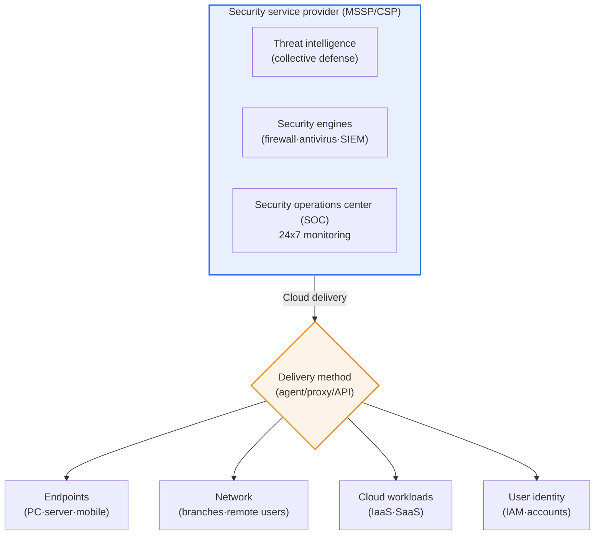
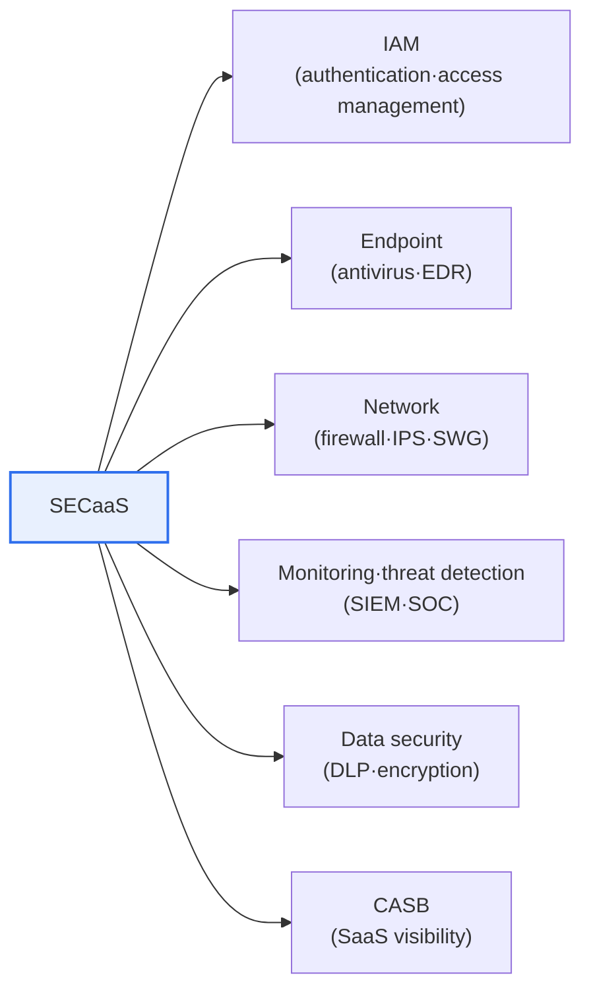

# SECaaS (Security as a Service)

## 1. Overview

### A. Definition
> **SECaaS (Security as a Service)** is a model in which **security functions such as firewalls, antivirus, authentication, threat detection, and monitoring are delivered and used in the form of cloud-based subscription services**; it is a type of cloud service that allows organizations to leverage the infrastructure and threat intelligence of specialized security providers (MSSPs, CSPs) on a pay-as-you-go basis, without directly owning and operating security equipment and personnel.

The fundamental reason SECaaS emerged lies in the structural imbalance that "**security is becoming increasingly difficult, but it is hard for every organization to build its own security capabilities**." Cyber threats are becoming ever more sophisticated and diverse—ransomware, supply chain attacks, API abuse—and responding to them requires the latest security solutions, 24-hour monitoring staff, and constantly updated threat information. However, building all three in-house is burdensome even for a few large enterprises. Small and medium-sized businesses cannot afford to purchase expensive next-generation firewalls (NGFWs) or SIEMs and operate a security operations center (SOC) around the clock, and even large enterprises face clear cost and expertise limits in internalizing every security domain.

SECaaS solves this problem by "**applying the cloud's as-a-Service concept to security**." Multiple customers share security infrastructure built and operated at scale by specialized security providers in a multi-tenant subscription form; customers pay as operating expenses (OpEx) for what they use without initial capital investment (CapEx), and receive professional security services that are always patched and updated. In particular, since threat information collected from many customers is aggregated and shared in one place, a "**collective defense**" effect arises in which the signature of a new threat detected at one customer is immediately reflected in the defenses of all customers. That is, SECaaS transforms security from "something to own" into "something to consume," and at the same time, since it delegates part of security control to an outside party, it also carries data sovereignty and responsibility boundary issues.

### B. Background and Characteristics
As the sophistication of threats, the chronic shortage of security professionals and budgets (the security workforce gap), and the spread of cloud and remote work—which scattered protected assets beyond the data center perimeter—converged, SECaaS, which delivers security as a subscription service, spread rapidly. The essential characteristics of SECaaS can be summarized as ① **cloud delivery** (provided via agents, proxies, API integration), ② **subscription and usage-based billing** (shift to OpEx), ③ **automatic updates** (signatures, rules, and engines always up to date), ④ **elastic scalability** (flexible response to increases in traffic and endpoints), and ⑤ **threat intelligence sharing** (multi-tenant collective defense). These characteristics are directly connected to the evolution toward SASE/SSE discussed later.

## 2. Overall Structure and Delivery Architecture

SECaaS consists of four axes: "**who (provider) – what (security functions) – how (cloud delivery) – to whom (customer assets)**." The overall structure diagram below shows how the suite of services offered by a security provider protects customers' various assets (endpoints, networks, cloud workloads, users) through the cloud.

Explaining the delivery architecture in prose, SECaaS connects to customer assets in three main ways. First, the **agent method** installs lightweight software on endpoints to perform antivirus, EDR, and DLP, and protection is maintained even when the device leaves the corporate network. Second, the **proxy/inline method** redirects traffic to the provider's cloud gateway to apply web filtering, firewall, and IPS; a representative example is inspecting remote workers' Internet access with a cloud SWG. Third, the **API integration method** attaches to the APIs of SaaS (e.g., Microsoft 365, Salesforce) to audit data leakage and sharing settings out-of-band; CASB's API mode falls into this category. These three methods are not mutually exclusive and are used together, and since latency, visibility, and user experience differ depending on which method is chosen, they must be designed according to traffic characteristics during adoption.

### A. Shared Responsibility Model
The most important thing in understanding SECaaS from an architectural perspective is the shared responsibility model, in which "**security responsibility is divided between the provider and the customer**." The provider is responsible for the availability of the security service itself, the currency of engines, and infrastructure security, while the customer is responsible for policy configuration, account management, data classification, and log review. The problem is that when this boundary is ambiguous, "**a management gap for which no one takes responsibility**" arises. For example, if a customer misconfigures a cloud firewall policy and leaves a port open, a breach occurs even though the service operated normally. Therefore, at the adoption stage, the responsibility boundary must be documented in RACI form, and whether the customer actually reviews and acts on the visibility provided by the provider's dashboard must be firmly established in operational processes.

## 3. Major Service Types

SECaaS branches into multiple services depending on the layer being protected. Below is an overview by type, and after the table, "why each type is advantageous when delivered from the cloud" is described.

| Type | Representative functions | Benefits when delivered from the cloud |
|---|---|---|
| **IAM** | SSO·MFA·privilege management | Consistently apply identity-based control across SaaS and remote access |
| **Endpoint security** | Cloud antivirus·EDR·XDR | Protection regardless of device location, immediate threat intel updates |
| **Network security** | Firewall·IPS·web filtering (SWG) | Perimeterless inspection extending to branches and home |
| **Threat management·monitoring** | SIEM·SOC·threat intelligence | Obtain 24x7 professional monitoring by subscription |
| **Data security** | DLP·encryption·email security | Extend policies to SaaS data leakage |
| **CASB** | SaaS usage visibility·control | Shadow IT detection, cloud app governance |

The core value of **IAM (Identity and Access Management)** delivered as SECaaS lies in the point that "in an environment where the perimeter has disappeared, identity becomes the new perimeter." In the on-premises era, connecting to the internal network itself was the basis of trust, but now that users access SaaS from cafés, homes, and abroad, "who is connecting" must be verified with every request. Cloud IAM unifies logins to multiple SaaS applications with SSO and defends against account takeover with MFA and adaptive (risk-based) authentication, which becomes the starting point of zero trust.

**Endpoint security** has become a flagship success story of SECaaS as it evolved into EDR/XDR. Simple signature-based antivirus misses new and variant malware, but cloud EDR aggregates and analyzes behavioral data from all customers' devices to detect anomalous behavior and immediately applies attack patterns found in one place to all. For example, if a ransomware behavior pattern in which a specific process encrypts a large number of files is detected at one customer, its indicators of compromise (IoCs) are propagated through the cloud as blocking rules to all other customers' devices. "Minimizing detection delay," impossible with self-built antivirus, is a structural strength of SECaaS.

**Threat management and monitoring (SIEM/SOC)** directly targets the staffing problem. Operating an in-house SOC 24 hours a day requires at least three shifts and multiple analysts, costing hundreds of millions of won per year in labor. Managed SECaaS (MSSP) replaces this burden with subscription fees and, through a pool of skilled analysts serving many customers and automation (SOAR), reduces false positives and shortens response times. However, when monitoring is outsourced, detection quality depends on whether the provider sufficiently understands "our organization's context (normal business patterns)," so tuning and escalation consultations must continue even after outsourcing.

**CASB (Cloud Access Security Broker)** and **data security (DLP)** target the new blind spots created by the spread of SaaS. "Shadow IT," in which employees use personal cloud storage and collaboration tools without company approval, is invisible to in-house network equipment. CASB attaches to SaaS APIs and proxies to gain visibility into which cloud apps are used, and performs blocking of risky apps, control of external sharing, and detection of anomalous downloads. When cloud DLP is combined with this, leakage of sensitive information (resident registration number and card number patterns) to the outside is blocked by policy. In such environments where data has left the internal perimeter, "data- and identity-centric control" rather than "perimeter defense" is needed, which becomes the practical driving force leading to convergence into SASE/SSE discussed later.

## 4. Comparison: SECaaS vs On-premise

The difference between the two approaches is more than simple "cost savings" and should be understood as a trade-off between control and speed of response.

| Perspective | On-premise | SECaaS (subscription) |
|---|---|---|
| **Cost structure** | CapEx (large upfront investment) | OpEx (usage-based) |
| **Adoption speed** | Months for equipment procurement·deployment | Activated within days to weeks |
| **Currency** | Manual patches·upgrades | Automatic·always up to date |
| **Expertise** | Must secure in-house staff | Leverage provider expertise |
| **Control** | Full internal control | Partially delegated externally (data sovereignty issues) |
| **Scalability** | Equipment expansion required | Elastic scaling |

The reason the difference arises from a cost perspective lies in "**converting fixed costs into variable costs**." On-premise requires buying equipment sized for peak traffic, so resources sit idle in normal times (overinvestment), whereas SECaaS is billed in proportion to actual usage, freeing capital for use elsewhere. For example, an e-commerce company with large seasonal traffic fluctuations can optimize costs by increasing defensive capacity only during promotional periods and reducing it in normal times. Conversely, on-premise has the edge in terms of control. Organizations such as finance and defense, where regulations restrict the transfer of data abroad or require the direct retention of original logs, often prioritize control over convenience and compromise with a hybrid (in-house for sensitive areas, SECaaS for general areas). Ultimately, the choice is determined at the balance point between "what is being protected" and "how quickly and professionally it must be protected."

### A. Application Cases
The effectiveness of SECaaS is revealed in concrete adoption patterns. First, **SMB subscriptions to cloud antivirus and EDR**. When an organization with zero to one dedicated security staff subscribes to cloud EDR at a monthly per-device fee, it gains ransomware behavior-based detection and remote isolation without in-house servers or signature management. The key benefit is gaining 24x7 threat response while significantly reducing initial investment compared with building in-house.

Second, **adoption of cloud SWG and ZTNA during the spread of remote work**. After COVID-19, many companies funneled home-based employees' Internet and internal app access through existing VPN gateways, experiencing bottlenecks and security blind spots. Switching to cloud SWG (web traffic inspection) and ZTNA (app-level least-privilege access) reduces latency by inspecting at a nearby cloud point of presence without detouring traffic through headquarters, while eliminating the risk of "lateral movement due to fully open VPN access."

Third, **moving DDoS defense to the cloud**. Since large-scale volumetric attacks are hard to absorb with in-house circuits and equipment, rerouting traffic to a cloud defense network and forwarding only legitimate traffic to the origin server has become the de facto standard. This is a case that well illustrates the essence of SECaaS: "securing defensive capacity through consumption rather than ownership." All three cases share the common logic of "replacing the limitations of in-house building (cost, staff, capacity) with the scale and expertise of the cloud."

## 5. Advanced: Evolution Toward SASE/SSE and Latest Trends

The trend that must be addressed when discussing SECaaS from a Professional Engineer's perspective is "**convergence from a list of individual security services to an integrated cloud security platform**." In 2019, Gartner presented the concept of **SASE (Secure Access Service Edge)**, predicting the convergence of networking (SD-WAN) and security services (SWG, CASB, ZTNA, FWaaS) into a single cloud-delivered platform. Then, in 2021, it defined **SSE (Security Service Edge)** by separating only the security functions from SASE; SSE is a security stack that securely protects access to the web, cloud, and private apps regardless of the location of users, devices, and applications, with **SWG (Secure Web Gateway), CASB, ZTNA, and FWaaS** as its core components.

This trend matters because if antivirus, firewalls, and CASB are adopted separately as in early SECaaS, policies become fragmented and logs dispersed, actually creating management blind spots. SASE/SSE bundles them into a single console and single policy engine to "apply the same policy centered on user identity, wherever the user connects from." For example, when a home-based employee accesses an internal app, instead of opening the entire internal network via VPN, ZTNA verifies identity and device posture only for that app and allows access (least privilege). This is a structural improvement that fundamentally blocks "lateral movement through VPN gateway vulnerabilities" attacks.

This integration trend also has a large practical effect of reducing the burden on operations teams. When individual services are adopted from multiple providers, consoles, accounts, policies, and log formats all differ, making correlation analysis difficult, and when an incident occurs, it takes time to reconstruct where the breach occurred. Bundling them with SASE/SSE allows user, device, app, and data flows to be seen at a glance in a single console with consistent policy application, so the fewer the management staff, the greater the benefit of an integrated platform. However, integration means dependence on a single provider, so it must be judged together with lock-in management, discussed in the considerations below.

In addition, SECaaS is evolving toward automating detection and response by combining with **XDR (Extended Detection and Response)** and **SOAR (automated response)**, and more recently with **AI/LLM-based threat analysis**. From a domestic perspective, to support the cloud transition of the public and financial sectors, there is a trend of preferentially adopting SECaaS that has obtained **CSAP (Cloud Security Assurance Program)** certification, which can be seen as an attempt to harmonize data sovereignty and regulatory compliance requirements with the benefits of SECaaS. In summary, the future of SECaaS is not "subscribing to individual services" but "**subscribing to an identity-centric integrated cloud security platform (SASE/SSE)**," with zero trust principles internalized as the design foundation.

## 6. Considerations and Implications (Professional Engineer's Perspective)

1. **Clarifying the shared responsibility model is a prerequisite.** As with the cloud, SECaaS divides security responsibility between provider and customer, so where the provider's responsibility ends and the customer's begins must be documented in RACI, and operational processes must be in place for the customer to actually review and act on alerts from the provider's dashboard, eliminating "management gaps."
2. **Reflect SLAs, data sovereignty, and regulatory compliance in contracts.** Since a security service outage means a security gap, availability SLAs (e.g., 99.9% or higher) and compensation and alternative means in the event of outages must be specified in contracts, and the storage location (domestic/overseas), access control, and retention period of logs and personal information must be finalized in line with regulations such as the Personal Information Protection Act and CSAP.
3. **Manage lock-in and ensure switchability.** If policies, rules, and logs become entrenched with a specific provider, this leads to weakened bargaining power and increased switching costs, so lock-in should be mitigated through standard log formats, data export clauses, and multi-vendor strategies, and measures for the customer to retain core controls (such as encryption key management) (BYOK/HYOK) should be considered.
4. **Establish an integration roadmap toward zero trust-based SASE/SSE.** Since sporadic adoption of individual services produces policy fragmentation, a roadmap should be established to gradually integrate SWG, CASB, and ZTNA with identity (IAM) as the central axis, shifting from "fully open VPN" to "ZTNA least-privilege access" to shrink the attack surface.
5. **Compensate for the side effects of outsourcing (detection quality, hollowing out of internal capabilities).** Outsourcing monitoring may weaken the reflection of the organization's unique normal business context, so regular detection rule tuning, drills, and escalation consultations should continue, and minimal internal security governance capability should be retained to enable oversight and verification of the provider.

## References
- Gartner, "Definition of Secure Access Service Edge (SASE)", https://www.gartner.com/en/information-technology/glossary/secure-access-service-edge-sase
- Palo Alto Networks, "What Is Security Service Edge (SSE)?", https://www.paloaltonetworks.com/cyberpedia/what-is-security-service-edge-sse
- Cloudflare Learning, "What is security service edge (SSE)?", https://www.cloudflare.com/learning/access-management/security-service-edge-sse/

---

> **In one line**: SECaaS is a model that *delivers security functions such as firewalls, antivirus, and monitoring as cloud subscription services*, allowing organizations to use up-to-date professional security and collective defense without initial investment, while shared responsibility, SLAs, data sovereignty, and lock-in must be managed; it is evolving from individual service subscriptions to zero trust-based integrated SASE/SSE platforms.
