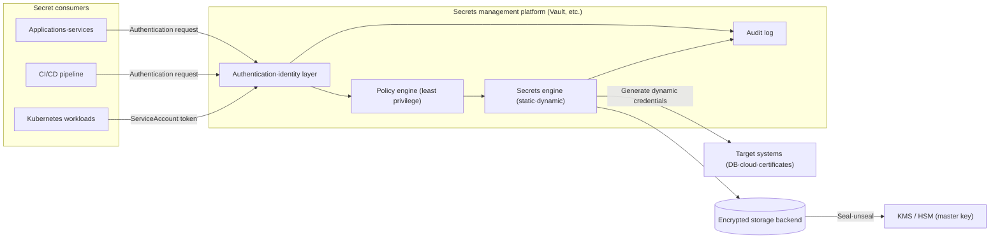
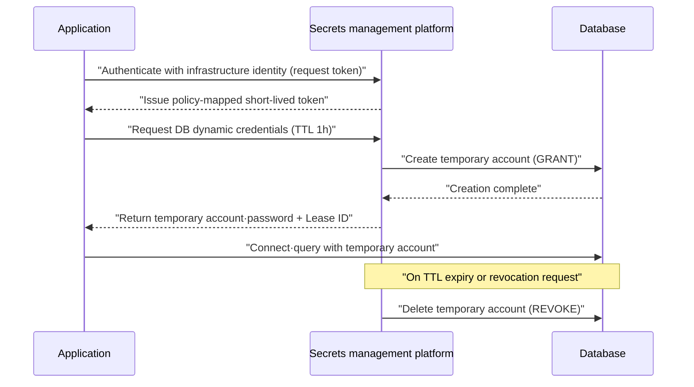

# Secrets Management

## 1. Overview

> Secrets Management is a system that separates the credentials used by applications, infrastructure, and pipelines (passwords, API keys, database connection information, certificates, encryption keys, tokens) from source code and configuration, and centrally stores, issues, rotates, and revokes them securely while controlling and auditing access.

Information systems must exchange some form of "secret" in order to trust one another. An application presents an account and password to connect to a database, a microservice uses an API key or token to call another service, and a CI/CD pipeline holds access keys to deploy to a cloud account. The problem is that these secrets easily get scattered across source code, configuration files, environment variables, container images, logs, and collaboration messengers. This uncontrolled spread is called secret sprawl, and it is a common root cause of leakage incidents.

In fact, GitGuardian's annual reports have consistently shown that millions of hardcoded secrets are newly exposed each year in public GitHub repositories alone, and reported that more than 10 million secrets were detected in public commits in 2023. If a single hardcoded cloud access key is leaked, an attacker can use it to take over the entire account or incur massive charges. Secrets management is an approach that seeks to mitigate these risks with the principle of "take secrets out of code, make them short-lived, and track access."

The reason secrets management means more than a simple "password vault" is that modern environments are not designed on the premise of static secrets. In Kubernetes, pods are created and destroyed within seconds, and thousands of serverless functions spin up simultaneously on demand. If all these workloads share the same long-lived credentials, when one is leaked the blast radius expands to the entire system. Therefore, secrets management takes the transition from "static, long-lived secrets" to "dynamic, short-lived secrets" as its core strategy.

### 1.1 Background and Necessity

First, the speed of development and deployment has outpaced the speed at which humans can manually manage secrets. In the past, it was enough for an operator to log into a server and put a password into a configuration file, but now infrastructure is created automatically with IaC and containers are deployed automatically. If the process of issuing, injecting, and rotating secrets itself is not automated, it becomes both a bottleneck and a blind spot in the deployment pipeline.

Second, regulations and standards explicitly require control, rotation, and auditing of credentials. PCI DSS requires access control and cryptographic key management in the cardholder data environment, and ISMS-P and the personal information safety measures require access privilege management and retention of access records. If an organization cannot even determine where its secrets are, it is impossible to implement these controls and submit audit evidence.

Third, the consequences of leakage are fatal. The 2019 Capital One incident was a case in which information on more than 100 million customers was leaked using credentials obtained through a misconfigured firewall, showing that once an attacker obtains valid credentials, they can disguise themselves as normal traffic and evade detection. This is why the lifetime of secrets must be short and access must be finely controlled.

Fourth, the "secret zero" problem remains inherent. For an application to retrieve a secret from the vault, it must first authenticate to the vault, and how to securely bootstrap that initial means of authentication (secret zero) is the key challenge. Solving this problem with infrastructure identity (cloud instance metadata, Kubernetes ServiceAccount tokens, etc.) is the design focus of modern secrets management.

### 1.2 Key Terms

| Term | Meaning | Professional Engineer's perspective |
|---|---|---|
| Static Secret | A secret registered by a person and kept for a long time | Rotation burden·long-term exposure if leaked |
| Dynamic Secret | Generated on the fly upon request and automatically revoked after TTL | Minimizes blast radius·lifetime |
| Rotation | Replacing secrets periodically or on events | Shortens validity period if leaked |
| Seal/Unseal | Procedure for splitting·restoring the vault master key | Key distribution·insider threat control |
| Secret Zero | The initial credential needed to authenticate to the vault | Root of bootstrap trust |
| KMS/HSM | Services·devices dedicated to key generation·storage·operations | Master key protection·compliance |
| Envelope encryption | Re-encrypting data keys with a master key | Performance for bulk data·key isolation |

A secret is not just a string; it must be managed together with a policy of "who, which workload, under what conditions, and for how long" it may be used. That is, secrets management is a combination not only of storage but also of identity, policy, and audit.

## 2. Secrets Management Architecture and Conceptual Diagrams

### 2.1 Overall Structure

A secrets management system consists of five main elements: a storage backend that securely holds secrets, a master key (KMS/HSM) that protects the stored data, an authentication/identity layer that verifies the requesting principal, a policy engine that determines which principal may access which secret, and an audit log that records all access. Applications do not store secrets directly; they obtain them from the vault at runtime and keep them only briefly in memory for use.

The key point of this structure is that secrets are encrypted with the master key "at rest," protected by TLS "in transit," and controlled with least privilege and short lifetimes "in use." Trust boundaries are separated so that even if the vault itself is compromised, stored data cannot be decrypted if the master key resides in a separate KMS/HSM.

The authentication layer uses the organization's IdP (e.g., OIDC, LDAP) for people (administrators) and infrastructure identity for workloads. For example, a Kubernetes pod presents its ServiceAccount JWT, and the vault asks the API server to validate it, confirms the identity, and then issues a token mapped to policy. This way, no long-lived secret needs to be embedded in application code or images — this is the practical solution to the secret zero problem.

The policy engine applies rules to the verified identity, such as "this principal may obtain only read-only dynamic accounts for the payment DB, with a maximum TTL of 1 hour." If access is allowed, the secrets engine returns the actual secret: a static engine returns the stored value as is, while a dynamic engine creates an account on the target system (DB, cloud) on the fly and issues short-lived credentials.

### 2.2 Dynamic Secret Issuance and Revocation Procedure

Dynamic secrets are the most powerful feature of secrets management. When an application needs a DB connection and requests it from the vault, the vault connects to the DB with administrator privileges, creates a temporary account, and returns that account information to the application. Once the specified TTL (e.g., 1 hour) passes, the vault automatically deletes this account from the DB. As a result, even if leaked, the time during which the credentials are valid is extremely short, sharply reducing the blast radius.

The concepts of lease and revocation are important in this procedure. Every issued dynamic secret is tracked as a lease, and when a compromise is suspected, an administrator can revoke a specific lease or all leases of a specific engine in bulk. In the days of static secrets, a massive effort was needed—"it looks like something leaked, so let's change the passwords on every system"—but in a dynamic secrets system, immediate blocking is possible with a single lease revocation.

In addition, the seal/unseal mechanism deals with protecting the master key itself. When the vault restarts, it starts in a "sealed" state without the master key needed to decrypt stored data, and it is unsealed only when a threshold (e.g., 3 of 5) of unseal key shares, split using Shamir's Secret Sharing, are gathered. This design prevents a single administrator from opening the vault alone, controlling both insider threats and key theft. In operations, this unsealing is sometimes delegated to KMS auto-unseal to ensure availability.

## 3. Types of Secrets and Management Patterns

### 3.1 Static Secrets and Dynamic Secrets

Static secrets are values registered by a person that persist until explicitly changed. They are unavoidably used when dynamic generation is impossible because we cannot control the issuing party, as with API keys for external SaaS. Static secrets must always be paired with a rotation policy, with a rotation period set to, for example, 90 days, and should support zero-downtime rotation (two generations of keys valid simultaneously) where possible.

Dynamic secrets, as explained above, are generated upon request and automatically expire via TTL. They are suited to targets such as DBs, clouds, and message brokers, where the vault can control accounts with administrator privileges. The practical advantage of dynamic secrets is that the separate task of "rotation" effectively disappears. Since all credentials are short-lived from the outset, rotation is absorbed into natural expiration and reissuance.

The choice between the two depends on the controllability of the target system and performance requirements. Creating a new DB account every time for a workload that opens thousands of connections per second puts load on the target DB, so in this case a compromise is needed, such as using a connection pool and setting a longer TTL for dynamic secrets or caching. That is, the trade-off between security (minimizing lifetime) and performance/availability must be designed.

| Category | Static secret | Dynamic secret |
|---|---|---|
| Creation time | Pre-registered | On the fly upon request |
| Lifetime | Long (rotation needed) | Short (automatic revocation by TTL) |
| Impact of leakage | Large (long-term exposure) | Small (short-term·immediate revocation) |
| Applicable targets | External SaaS keys·certificates | DB·cloud·broker accounts |
| Performance burden | Low | Generation cost·target load |

### 3.2 Managing Encryption Keys: KMS, HSM, and Envelope Encryption

Among secrets, encryption keys receive special treatment. Envelope encryption, in which the data key (DEK) that encrypts data is itself encrypted with a master key (KEK) and stored, is standard. Bulk data is encrypted with a fast symmetric key (DEK), and only that DEK is protected with the KMS's KEK, achieving both performance and key isolation without exposing the master key. For example, when storing several TB in cloud storage, using a separate DEK for each object and sealing it with the KEK means that even if a particular object's key is leaked, the rest remain safe.

An HSM (Hardware Security Module) is a device that never exports keys outside its hardware boundary and performs encryption and decryption operations only internally; certified to FIPS 140-2/140-3 levels, it is required in finance and the public sector. Placing the master key in an HSM means the plaintext key cannot be stolen even through software compromise. However, HSMs have cost and throughput constraints, so a layered design is common in which bulk operations are handled with DEKs and the HSM is used only for KEK operations.

Key management must consider the entire key lifecycle (generation, activation, rotation, deactivation, destruction) along with crypto agility. To prepare for a future in which algorithms themselves change, such as the transition to post-quantum cryptography (PQC), it is desirable to abstract key references (calls based on key IDs) so that applications are not tightly coupled to specific keys or algorithms.

### 3.3 Integration with Access Control and Auditing

Secrets management naturally aligns with zero trust principles. The approach of "every request proves its identity and receives only least privilege," rather than "trust because it is inside the network," is applied directly to secret issuance. Policies finely define principals, secret paths, and conditions (time, source, MFA), and all issued secrets are recorded in the audit log.

Audit logs must be able to reconstruct "who issued or viewed which secret and when," but must be hashed or masked so that secret plaintext or personal information does not remain in the logs themselves. This is an essential measure to prevent the paradox of logs becoming a new leakage point. Audit logs are linked to SIEM and used to detect anomalous patterns (a large number of secret lookups in a short time, access attempts by revoked identities).

## 4. Comparison with Similar Concepts and Cases

Secrets management is often confused with adjacent concepts. Configuration Management handles non-sensitive configuration values, whereas secrets management specializes in sensitive credentials and additionally provides encryption, rotation, and auditing. Cloud providers' managed secret stores (AWS Secrets Manager, Azure Key Vault, GCP Secret Manager) are convenient with low operational burden but are tied to a specific cloud, while independent platforms such as HashiCorp Vault span multi-cloud and on-premises and provide dynamic secrets and diverse engines at the cost of a heavier self-operation burden. Organizations choose or combine these depending on workload distribution and regulatory requirements (e.g., data sovereignty).

The default Kubernetes Secret object is a commonly misunderstood area. A default Secret is merely Base64-encoded in etcd, not encrypted, so unless etcd encryption at rest (EncryptionConfiguration) is separately enabled, it is practically close to plaintext. Therefore, in production environments, the recommended pattern is to integrate with an external secrets management platform (External Secrets Operator, CSI Driver), keeping the actual secrets in the vault and injecting them into pods only at runtime.

Concrete incident cases also offer lessons. In the 2022 Uber breach, the attacker reportedly discovered administrator credentials hardcoded internally and escalated privileges, reconfirming the importance of the principle "do not leave secrets in scripts or configuration." Conversely, organizations that have adopted dynamic secrets and short TTLs gain the defensive effect that even if a credential leak is detected, the credential has already expired and is difficult to exploit.

## 5. Advanced: Latest Trends and Standardization of Workload Identity

The recent direction of secrets management is toward "secretless authentication." Workloads hold no long-lived secrets at all and instead receive short-term tokens on demand using a verifiable identity granted by the infrastructure. The representative standard, SPIFFE/SPIRE, automatically issues short-lived certificates called SVIDs (SPIFFE Verifiable Identity Documents) to workloads, enabling mutual TLS authentication between services without sharing secrets. Service mesh sidecars leveraging this identity to automate mTLS follows the same logic.

For cross-cloud integration, OIDC-based workload identity federation is spreading. For example, when GitHub Actions deploys to the cloud, instead of storing long-lived access keys, configuring the cloud to trust the OIDC token issued for each run eliminates the secret that would need to be stored. This is an evolution that replaces secret zero not with a "stored secret" but with "an identity proven by the execution context."

In addition, secret scanning, which catches secret sprawl after the fact, is becoming standard in development pipelines. GitHub Push Protection, GitGuardian, TruffleHog, and others detect and block hardcoded secrets at the commit and PR stages, and once a leak is confirmed, link to automatic rotation and revocation. This is a case of applying DevSecOps's "shift left" principle to secrets management, forming a dual defense of prevention (vault) and detection (scanning).

## 6. Considerations and Implications

From a Professional Engineer's perspective, adopting secrets management requires comprehensive consideration of the following.

- **Availability and single point of failure management**: If the vault goes down, all secret issuance stops and the entire system can be paralyzed. It must be designed with multi-node HA configuration, auto-unseal, cross-region replication, and short caching so that the vault itself does not become a new SPOF. Balancing so that stronger security does not lead to reduced availability is the key trade-off.

- **Designing secret zero and the root of trust**: The bootstrap identity should be moved to the infrastructure (cloud instances, Kubernetes ServiceAccounts, OIDC) to eliminate stored initial secrets. What to use as the root of trust, and whether that root is unforgeable, must be decided early in the architecture.

- **Balancing lifetime minimization and performance**: The shorter the TTL of dynamic secrets, the safer, but the greater the account creation/deletion load and latency on the target system. TTL, lease, and connection pool strategies should be designed according to workload characteristics (connection frequency, persistence), and an immediate revocation path in case of compromise must be secured.

- **Regulatory compliance and audit evidence**: Audit logs should be designed to meet the access privilege management, access record retention, and key management requirements of PCI DSS, ISMS-P, and the personal information safety measures, while masking so that secret or personal information plaintext does not remain in logs. Regulatory response should be built into the initial design rather than added after the fact.

- **Gradual adoption and organizational change management**: It is difficult to remove existing hardcoded secrets all at once. A phased strategy is realistic: first identify secret usage in observation mode, convert high-risk secrets (production DBs, cloud root) to dynamic first, and reduce resistance by improving the developer experience (SDKs, sidecar injection).

- **Crypto agility and future readiness**: Abstracting keys and algorithms from applications (key ID references) allows them to be replaced without code changes during a PQC transition or upon discovery of algorithm vulnerabilities. This improves both maintainability and security from a long-term operational perspective.

## References

- HashiCorp, "Vault Documentation — Secrets Engines, Dynamic Secrets, Seal/Unseal": https://developer.hashicorp.com/vault/docs
- OWASP, "Secrets Management Cheat Sheet": https://cheatsheetseries.owasp.org/cheatsheets/Secrets_Management_Cheat_Sheet.html
- NIST SP 800-57, "Recommendation for Key Management": https://csrc.nist.gov/pubs/sp/800/57/pt1/r5/final
- SPIFFE/SPIRE Project Documentation: https://spiffe.io/docs/latest/spiffe-about/overview/
- GitGuardian, "State of Secrets Sprawl": https://www.gitguardian.com/state-of-secrets-sprawl-report

---

> **In one line**: Secrets management is a system that separates credentials from code and centrally stores, issues, rotates, and audits them securely; its key is converting static secrets into dynamic, short-lived secrets and infrastructure identity-based authentication to minimize the blast radius in case of leakage.
