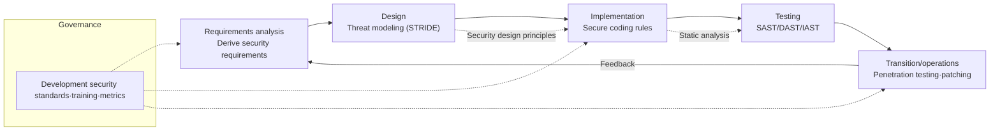
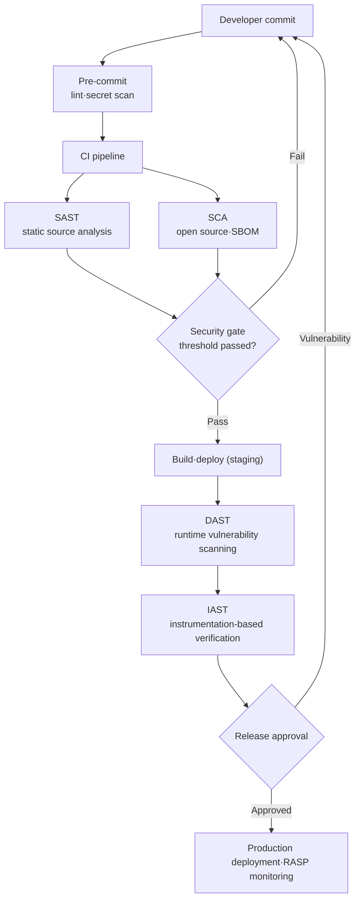

# Secure Coding and Software Development Security

## 1. Overview

> **Secure Coding** refers to a development methodology for writing safe source code by adhering to proven coding rules and development security standards, in order to proactively eliminate security vulnerabilities inherent in the design and implementation phases throughout the software development lifecycle (SDLC). In a broader sense, **Software Development Security** refers to a framework that integrates security activities into all phases—requirements, design, implementation, testing, and operations—including secure coding.

The background for the prominence of secure coding lies in the insight that "most security incidents stem not from defensive failures in the operations phase but from defects already planted in the development phase." Traditionally, security was handled in the operations phase centered on perimeter defense such as firewalls, IPS, and WAF, but as the application layer became the main target of attacks via the web, mobile, and cloud, network perimeter controls alone could no longer prevent application logic flaws such as SQL injection and cross-site scripting (XSS). In fact, attacks targeting the application layer account for a considerable share of all breach incidents, and OWASP points out that most root causes of web vulnerabilities lie in missing input validation, broken authentication, and insecure design.

This shift leads directly to the recognition that "security is not a feature to be added later, but must be designed and implemented as a quality attribute from the beginning." Treating security not as a separate deliverable but as a software quality characteristic alongside maintainability and reliability (Security in ISO/IEC 25010) is the philosophical starting point of secure coding.

Another background factor is **the asymmetry of defect-fixing costs**. According to research widely cited from the IBM System Sciences Institute and others, if the cost of finding and fixing a defect in the requirements/design phase is 1, it increases to about 6.5 times in the implementation phase, about 15 times in the testing phase, and about 60–100 times in the operations (post-release) phase. In other words, filtering out vulnerabilities at the coding stage is overwhelmingly advantageous economically, and this becomes the logical basis for **Shift-Left security**, which "pulls security to the left (early in development)."

The institutional background is also strong. In Korea, under the Enforcement Decree of the Electronic Government Act and the "Software Development Security Guide" of the Ministry of the Interior and Safety and KISA, applying development security (secure coding) is mandatory for public informatization projects above a certain size, and it is also handled as an audit inspection item. Internationally, CWE (Common Weakness Enumeration), the SANS/CWE Top 25, the OWASP Top 10, and the CVE system linked to MITRE's CWE have become the de facto standards for vulnerability classification. Therefore, secure coding should be understood not as a mere development practice but as an essential engineering activity required by law, institutions, and standards.

## 2. Software Development Security Lifecycle and Activity Framework

Understanding secure coding merely as a list of coding rules leads to failure. This is because vulnerabilities are sometimes born from a single line of code but are also structurally conceived in faulty requirements and insecure architectural decisions. Therefore, development security must be approached from the perspective of a **Secure SDLC (S-SDLC)**, which places security activities in every phase of the SDLC. Representative reference models include Microsoft's SDL (Security Development Lifecycle), OWASP SAMM, and BSIMM, which commonly share the principle that "one proceeds to the next phase only after passing security verification at each phase gate."

The conceptual diagram below shows the overall structure of key security activities mapped to each phase.

What is notable in this structure is that security activities are not disconnected by phase but feed back forward and backward. Vulnerability patterns found in the testing phase must be fed back into coding rules and design principles, and attack types detected during operations become input for threat modeling in the next release. Only with such a cyclical structure can the organization's development security capabilities accumulate and mature over time, enabling Continuous Improvement that cannot be achieved with one-off assessments.

In the **requirements analysis phase**, separate from functional requirements, **security requirements** such as confidentiality, integrity, availability, authentication, authorization, and auditing are explicitly derived. For example, non-functional requirements such as "personal information fields are encrypted when stored" and "administrator functions require re-authentication" must be quantitatively pinned down in the SRS to become verifiable criteria in later phases. If this phase is weak, no matter how well the coding is done, "what must be protected" is unclear and the baseline of defense wavers.

The core of the **design phase** is **Threat Modeling**. A data flow diagram (DFD) is drawn to identify Trust Boundaries, threats to each asset are derived from the STRIDE perspective (Spoofing, Tampering, Repudiation, Information Disclosure, Denial of Service, Elevation of Privilege), and mitigations for each threat are reflected in the design. At this point, **Saltzer & Schroeder's security design principles**, such as Least Privilege, Defense in Depth, Secure Defaults, and Fail-Safe Defaults, are applied to fundamentally block structural vulnerabilities.

The **implementation phase** is where secure coding in the narrow sense applies. Language- and framework-specific coding rules are followed, such as input validation, output encoding, parameterized queries (Prepared Statements), and use of secure session and cryptographic APIs. What is important here is not to leave the rules solely to individual developers' discipline, but to enforce them as secure defaults at the framework and library level. For example, if the development environment is designed so that "the secure path is the easiest path (Secure by Default)"—such as Spring Security's automatic CSRF token insertion, ORMs defaulting to bind variables, and template engines' automatic escaping—individual developers' mistakes do not immediately turn into vulnerabilities. This also aligns with the safety engineering principle of assuming human error and defending through structure. In the **testing phase**, residual vulnerabilities are detected with automated tools (SAST/DAST/IAST) and manual code review and penetration testing, and in the **operations phase**, continuous security is maintained through monitoring of vulnerability disclosures (CVE), emergency patching, and runtime protection (RASP). Running through all these activities is **development security governance**, consisting of standards, training, and metrics; developer training and management of metrics such as vulnerability density (defects per KLoC) must go hand in hand for activities to take root in the organization.

## 3. Secure Coding Vulnerability Types and the Assessment Process

Korea's "Software Development Security Guide" classifies vulnerabilities into **seven major types**. This classification is a practical framework that helps developers systematize their inspection perspectives during code review and assessment. Each type is not a simple list but is threaded together by the common principle of "at which point does untrusted data cross a trust boundary."

The thinking framework running through these seven types is linked to international vulnerability classification systems such as CWE and OWASP. The types in the domestic guide present the perspectives developers should check in code, CWE identifies individual weaknesses with unique numbers, and the OWASP Top 10 prioritizes the most dangerous risk categories on the web. Using the three systems together makes it possible to consistently align "what (CWE), why it matters (OWASP), and where (development security types) to check," facilitating traceability of assessment results and prioritization of remediation.

The most representative type, **input data validation and representation**, occurs when externally supplied values are combined into commands, queries, or paths without validation. SQL injection, XSS, command injection, and path manipulation all belong here, and the fundamental countermeasure is the principle that "untrusted input is treated only as data and separated from the execution context." The **security features** type involves incorrect implementation of authentication, authorization, encryption, and access control; hardcoded passwords and the use of weak cryptographic algorithms (e.g., MD5, DES) are typical. The **time and state** type stems from failures in concurrency control, such as race conditions and TOCTOU (Time-of-Check to Time-of-Use).

In addition, **error handling** (leaking internal structure through excessive error information exposure), **code errors** (null pointer dereference, missing resource release), **encapsulation** (debug code, plaintext exposure of sensitive information), and **API misuse** (calling vulnerable or deprecated functions) make up the remaining types. The table below summarizes the seven types, representative vulnerabilities, and countermeasures (the table is an auxiliary tool; the principles of each countermeasure are described in the body text and the cases in Chapter 4).

| Type | Representative vulnerabilities (CWE) | Root cause | Key countermeasures |
|---|---|---|---|
| Input data validation·representation | SQL Injection, XSS, path manipulation | Input and execution context not separated | Parameterized queries, output encoding, allowlist validation |
| Security features | Weak cryptography, improper authorization | Incorrect security API implementation | Standard cryptography (AES/SHA-256), server-side authorization |
| Time and state | Race Condition, TOCTOU | Concurrency control failure | Atomic operations, locks, re-validation |
| Error handling | Information exposure, unhandled exceptions | Excessive error information | Generalized error messages, server-side logging |
| Code errors | Null dereference, resource leaks | Lack of defensive coding | Null checks, try-with-resources |
| Encapsulation | Debug code, plaintext storage | Information hiding failure | Remove before deployment, encrypt sensitive information |
| API misuse | Use of vulnerable functions | Insecure APIs | Safe alternative APIs, prohibit deprecated functions |

Vulnerability assessment is effective only when operated not as a one-off audit separated from development but as a repeated process integrated into the CI/CD pipeline. The conceptual diagram below shows the detailed flow of the assessment pipeline from commit to deployment.

The design intent of this pipeline is to filter out vulnerabilities "as far left as possible, and as automatically as possible." Secret scanning right before commit blocks leakage of API keys and passwords, SAST and SCA in CI inspect source and dependencies, and the security gate blocks merges if the threshold (e.g., zero High-severity findings) is not met. This way, vulnerabilities are immediately fed back to developers before reaching production, avoiding the 60–100x after-the-fact fixing costs mentioned earlier.

However, automated gates require careful tuning of the balance between false positives and false negatives. If the threshold is set too strictly, false positives block normal deployments and create an incentive for development teams to bypass the gate; conversely, if set too loosely, real vulnerabilities pass through. Therefore, a gradual introduction is realistic: initially operate in warning mode while tuning false-positive rules (suppression, baseline setting), and then switch to blocking mode only for New Findings. This shows that secure coding is not a matter of installing tools but of continuous operation and tuning tailored to the organization.

## 4. Representative Vulnerability Cases and Countermeasures (Concrete Code and Figures)

**Case 1 — SQL Injection (CWE-89).** If input is concatenated as a string in login processing, such as `"SELECT * FROM users WHERE id='" + input + "'"`, an attacker can enter `' OR '1'='1` to bypass authentication or destroy data with `; DROP TABLE`. Since 2017, injection has long held 1st to 3rd place in the OWASP Top 10 and was the root cause of many major data breach incidents in Korea. The countermeasure is **parameterized queries (Prepared Statements)**: by separating query structure and data, as in `SELECT * FROM users WHERE id=?`, input is never interpreted as SQL syntax. Even when using an ORM, bind variables must always be used in dynamic query assembly, and allowlist validation should be applied in parallel when unavoidable.

**Case 2 — Cross-Site Scripting (XSS, CWE-79).** If `` is stored on a bulletin board (Stored XSS), viewers' session cookies are stolen. The core of the countermeasure is **context-specific Output Encoding**. In HTML body content, `<` must be encoded as `&lt;`, and different encodings must be applied for attribute values, JavaScript, and URL contexts; since input validation alone can be bypassed, encoding at output time is the principle. On top of this, defense in depth is formed by restricting inline script execution with CSP (Content Security Policy) headers and assigning `HttpOnly`, `Secure`, and `SameSite` attributes to cookies.

**Case 3 — Weak Cryptography and Password Storage (CWE-327/916).** Storing passwords with MD5 or plain SHA is vulnerable to rainbow tables and GPU brute force. In a modern GPU environment capable of billions of hash computations per second, an 8-character MD5 password can be recovered within minutes. The countermeasure is to apply a per-user Salt with **adaptive hash functions** (bcrypt, scrypt, Argon2) and to raise the cost factor in line with hardware advances. AES-256 for symmetric encryption and TLS 1.2 or higher for transport are taken as standards, and roll-your-own crypto is prohibited.

**Case 4 — Insecure Deserialization and SSRF (CWE-502/918).** In recent web applications, deserializing untrusted objects that lead to remote code execution (RCE), and SSRF (Server-Side Request Forgery), in which the server sends requests to internal resources using user-supplied URLs, are on the rise. In particular, SSRF has been exploited in cloud environments as a path to access metadata endpoints (e.g., 169.254.169.254) and steal temporary credentials, and was newly listed in the OWASP Top 10 2021. The countermeasures are defense in depth: allowlist restriction of deserialization target types, validation of domains and IP ranges of external request targets (blocking private ranges), and granting only least privilege to application accounts. These cases commonly converge on the principle of "separate the context of data crossing trust boundaries, and use proven standard mechanisms." Especially in cloud and MSA environments, as inter-service calls increase, trust boundaries themselves exist in large numbers and dynamically, so verification of the entire call relationship—not just the safety of a single line of code—is required.

## 5. Comparison of Assessment Techniques — SAST, DAST, IAST, SCA

Vulnerability assessment tools differ in inspection target and timing, so they must be combined complementarily. The expectation that any one of them can catch all vulnerabilities inevitably fails between false positives and false negatives. The reason for the differences among techniques lies in the difference in perspective: "does it look at the source code, at execution, or at internal instrumentation."

**SAST (static analysis)** finds vulnerabilities by analyzing data flow and control flow without executing source code or bytecode. It can be applied early in development (commit, build), fitting shift-left, and pinpoints causes at the code line level, but the practical implication is that it produces many false positives because it does not know the execution context. **DAST (dynamic analysis)** sends actual attack payloads to a running application and observes its responses, so it has few false positives and even catches runtime and configuration vulnerabilities, but it is hard to pinpoint source locations and it requires an execution environment, so it comes later. **IAST** embeds an agent in the application to instrument internal data flows during execution, balancing SAST's precision with DAST's accuracy. **SCA** inspects not in-house code but known vulnerabilities (CVEs) and licenses of open-source dependencies, and together with SBOM is responsible for supply chain security.

| Technique | Inspection target | Timing | Strengths | Limitations |
|---|---|---|---|---|
| SAST | Source·bytecode | Development·build | Early application, pinpoints lines | Many false positives, unaware of runtime context |
| DAST | Running application | Testing·staging | Few false positives, runtime vulnerabilities | Hard to pinpoint location, late timing |
| IAST | Instrumented execution | Testing (instrumented) | Balance of precision + accuracy | Performance overhead, language constraints |
| SCA | Open-source dependencies | All phases | Supply chain·CVE·licenses | Does not detect vulnerabilities in in-house code |

In practice, these are placed at different pipeline stages. For example, SAST and secret scanning run at commit, SCA at build, DAST and IAST in staging, and in production, RASP blocks runtime attacks. Recently, **ASPM (Application Security Posture Management)**, which integrates and prioritizes these results, has emerged, mitigating the "Alert Fatigue" problem by aligning sporadic alerts from each tool according to asset and risk criteria.

Meanwhile, the areas automated tools miss remain large. Authorization logic errors (e.g., IDOR allowing access to other users' resources, CWE-639), business logic flaws, and design-level trust boundary errors are easily judged as "normal code" by tools. Since such vulnerabilities can be found only by people who understand the intent of the application, manual code review, threat modeling, and penetration testing must always accompany automated assessment. In other words, it is desirable to design the assessment strategy as a dual structure: "scan broadly with automation, judge deeply with people."

## 6. Advanced — Latest Trends: Expansion to AI, Supply Chain, and DevSecOps

Secure coding is not a fixed rulebook but a field that constantly evolves with changes in the threat environment and development practices. As cloud-native, MSA, and AI development have become mainstream, the targets and methods of defense are being reorganized, and the recent landscape is changing rapidly in three major directions. First, **code security leveraging AI**. As it has been empirically reported that code automatically generated by LLM-based code assistants contains vulnerabilities, real-time SAST verification of generated code is being combined with AI-based automatic fixing (Auto-remediation). GitHub, Snyk, and others are evolving toward providing vulnerability detection and fix suggestions instantly within the IDE, an approach that helps "developers write secure code even if they are not security experts." However, AI-generated code can be plausible yet subtly vulnerable, so dual verification by human review and static analysis remains essential.

Second, **integration with software supply chain security**. After the SolarWinds incident, the integrity of not only in-house code but the entire build pipeline, dependencies, and artifacts became a key challenge. Secure coding is now linked with SBOM (component specifications), SLSA (build integrity levels), and signing (Sigstore), expanding its scope to guarantee even that "securely coded code was built and deployed without tampering." The U.S. Executive Order (EO 14028) and domestic discussions on SBOM adoption institutionally support this trend.

Along with this, **the combination of automatic remediation and SBOM** is also noteworthy. Dependency bots (Dependabot, Renovate) that automatically upgrade to safe versions when vulnerable open-source versions are detected are becoming commonplace, significantly shortening the exposure time of known vulnerabilities (N-day). In fact, many disclosed CVEs are left unapplied and exploited even though patches exist, so building an automated detect-fix-verify loop becomes the core of supply chain risk management.

Third, **cultural integration into DevSecOps**. This redefines secure coding not as gatekeeping by the security team but as a responsibility shared by development, operations, and security. To this end, Policy as Code (OPA), which manages security policies as code, and IaC scanning (targeting Terraform and Kubernetes manifests), which inspects infrastructure configuration vulnerabilities in code, are being incorporated into the scope of secure coding. In other words, as the definition of "code" expands from application source to infrastructure, policies, and pipelines, secure coding is expanding its reach accordingly.

## 7. Considerations and Implications

First, **balancing cost-effectiveness and risk-based application** is needed. Uniformly applying the highest level of assessment to all code slows development and, through alert fatigue, actually neutralizes security. A risk-based approach is realistic: differentiate assessment intensity and gate thresholds according to asset criticality and exposure, and concentrate resources on Internet-exposed systems and systems processing personal information. The trade-off is "speed versus safety," and this tension must be managed through automation and gate threshold tuning.

Second, **people and processes, not tools, are the essence**. The success of secure coding depends on developer capabilities and organizational culture. Regular development security training, internal standardization of secure coding guides, and management of metrics such as vulnerability density and mean time to remediate (MTTR) must go hand in hand for the effects of tool adoption to last. Since tools leave false negatives and false positives, human judgment such as manual code review and threat modeling remains the final line of defense.

Third, **pursuing shift-left and shift-right in parallel**. Prevention early in development (shift-left) is cost-advantageous, but configuration and integration vulnerabilities revealed only at runtime, as well as new CVEs, must be complemented by operations-phase defense (RASP, continuous monitoring, shift-right). "Bidirectional deployment" that secures security on both the development and operations sides is the condition for secure software.

Fourth, **compliance with institutions and standards and audit response**. Development security is mandatory for public informatization projects and is subject to audit inspection, so assessment plans, results, and remediation histories must be managed as deliverables from the project kickoff stage. Since the regulatory scope is expected to expand to AI-generated code and supply chain integrity in the future, internalizing SBOM, signing, and assessment automation into the pipeline in advance is advantageous for regulatory response and competitiveness.

Fifth, **an integrated perspective with related technologies** is required. Secure coding delivers its effect only when woven into a single defense system with threat modeling (design), SBOM/SLSA (supply chain), DevSecOps (process), and zero trust (runtime access control). The key implication from a Professional Engineer's perspective is to design it not as a sum of individual activities but as part of defense in depth running through the entire SDLC.

Sixth, **setting measurable goals and improving maturity** is key. The qualitative goal of "secure code" drifts if not managed, so the organization's current level should be diagnosed with maturity models such as OWASP SAMM and BSIMM, and improvement tracked with metrics such as vulnerability density, mean time to remediate (MTTR), and gate pass rate. From the perspective of expected exam questions as well, a format such as "Discuss measures to embed secure coding along four axes: organization, process, technology, and measurement" is likely, so an answer structure that goes beyond listing tools and rules to encompass governance and metrics is a requirement for a high score.

## References

- OWASP, "OWASP Top 10" — https://owasp.org/www-project-top-ten/
- MITRE, "CWE Top 25 Most Dangerous Software Weaknesses" — https://cwe.mitre.org/top25/
- KISA·Ministry of the Interior and Safety, "Software Development Security Guide" — https://www.kisa.or.kr/
- OWASP, "Software Assurance Maturity Model (SAMM)" — https://owaspsamm.org/
- SLSA, "Supply-chain Levels for Software Artifacts" — https://slsa.dev/

---

> **In one line**: Secure coding is a development security activity that integrates security into all SDLC phases to proactively eliminate vulnerabilities in the design and implementation phases; it completes defense in depth by internalizing coding rules such as input validation and output encoding, along with threat modeling and SAST/DAST/SCA assessment, into CI/CD, and by extending its reach to AI, the supply chain, and DevSecOps.
