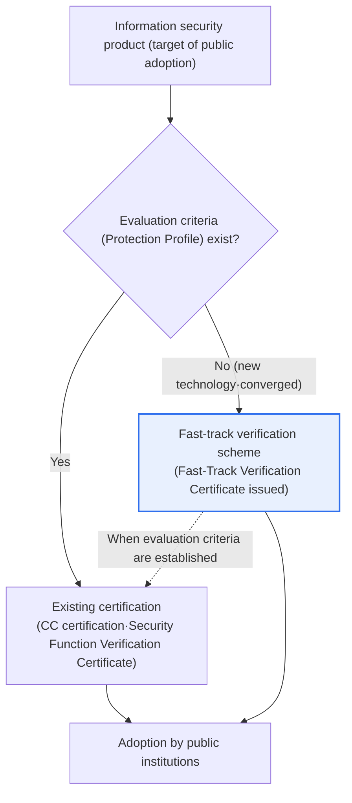
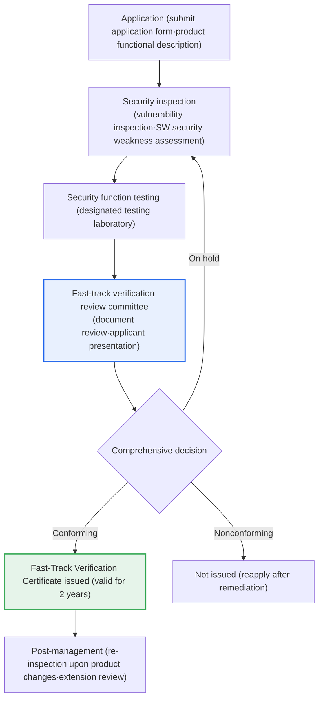

# Fast-Track Verification Scheme for Information Security Products

## 1. Overview

### A. Definition
> The **Fast-Track Verification Scheme for Information Security Products** is a scheme that, for **new-technology and converged information security products whose public-sector adoption had been delayed because the existing certification system had no evaluation criteria (such as Protection Profiles)**, verifies security through a separate expedited procedure (issuing a Fast-Track Verification Certificate upon a conformity decision), thereby opening the way for adoption by public institutions.

The fundamental reason this scheme became necessary lies in "**the time lag between the pace of technological advancement and the certification system**." For public institutions to adopt information security products, they must use products whose security has been verified under the Electronic Government Act, the National Information Security Basic Guidelines, and so on; however, the representative verification means—**CC (Common Criteria) certification** and the **Security Function Verification Certificate**—can only evaluate product types for which established evaluation criteria exist, i.e., national Protection Profiles (PPs) or national security requirements. Yet newly emerging types such as cloud security, zero trust, AI-based security, and converged products (e.g., security + network + data) fell into a blind spot where, **because the evaluation criteria themselves had not yet been established**, they could not enter the public market no matter how excellent they were.

The fast-track verification scheme fills exactly this gap. Even for innovative products without established criteria, it quickly verifies security based on security inspection and functional test results, enabling entry into the public market and promoting innovation in the domestic information security industry. In other words, it is accurate to understand it as a scheme that plays a **bridging role**, making products that "could not be adopted because there were no criteria" "adoptable through verification." However, a key premise of the scheme's design is that it does not replace formal certification but is a **temporary, complementary channel** until formal evaluation criteria are established.

### B. Background and Legal Basis
Behind the scheme lie the accumulated difficulties of new-technology security companies. Even as innovative products responding to new threats kept being released, the establishment of criteria to evaluate them lagged behind, blocking entry into public procurement and repeatedly stalling the growth of startups and small and medium-sized security companies. Accordingly, the Ministry of Science and ICT **implemented the fast-track verification scheme from November 2022**, based on the **"Notice on Evaluation and Certification of Information Protection Systems" (MSIT Notice No. 2022-61)** and detailed guidance from the Korea Internet & Security Agency (KISA) (October 2022). The system is structured so that KISA manages operations and designated testing laboratories (TTA, KTR, etc.) perform security testing.

## 2. Relationship with the Existing Certification System

For an information security product to be adopted by the public sector, its security must be recognized in some form. The structure diagram below shows how products branch into different verification paths depending on whether evaluation criteria exist.

In this structure, the two paths operate not competitively but **complementarily**. Products with evaluation criteria go through formal evaluation under existing certification (CC certification, Security Function Verification Certificate), while new-technology and converged products without criteria have their security verified through the fast-track scheme. Then, once formal evaluation criteria are established for a product type that received fast-track verification, it is desirable for the product to be absorbed into and transitioned to the regular certification system (the dotted line in the figure). In this way, a dual safety net is completed in which both "products with criteria" and "products without criteria yet" can be verified and adopted by the public sector.

The difference between existing certification and the fast-track scheme is not simply a matter of "fast versus slow" but stems from **a difference in the nature of verification**. CC certification formally and in depth evaluates whether a product conforms to a pre-agreed Protection Profile, so it takes a long time but has great verification depth. By contrast, fast-track verification is a method in which, in the absence of formal criteria, **a review committee makes a comprehensive decision based on security inspection (vulnerability inspection, source code security weakness assessment) and functional test results**, so it is relatively fast but focuses on "verifying a minimum level of security." Care must be taken, because without understanding this difference, fast-track verification may be mistaken as equivalent to formal certification.

| Category | Existing certification (CC·Security Function Verification Certificate) | Fast-track verification scheme |
|---|---|---|
| **Target** | Products with evaluation criteria (PP) | New-technology·converged products without criteria |
| **Method** | Formal evaluation (in-depth evaluation against Protection Profile) | Review based on security inspection·functional test results |
| **Duration** | Relatively long | Relatively fast (about 2 months until issuance) |
| **Output** | Certificate | Fast-Track Verification Certificate (valid for 2 years) |
| **Nature** | Standard verification | Support for rapid adoption of innovative products (temporary bridge) |

## 3. Application Requirements and Review Procedure

The fast-track verification scheme is not a "fast but unverified" channel but **a procedural scheme that goes through defined requirements and review stages**. The process diagram below shows the flow from application to issuance of the Fast-Track Verification Certificate and post-management.

### A. Application and Security Inspection
At the application stage, the company submits the product's functional description along with materials proving its security. The key element here is the **security inspection**, which broadly requires a **vulnerability inspection** for known vulnerabilities and a **software security weakness assessment (secure coding)** to check for development-stage defects. This is to confirm that the product at least controls known security defects and code-level vulnerabilities, and serves as a safeguard so that basic security hygiene is not skipped for the sake of speed.

This stage is important because the less formal evaluation criteria a product has, the more ambiguous "on what basis it should be deemed secure" becomes. Vulnerability inspection and security weakness assessment provide **a common security baseline** applicable even in the absence of criteria. For example, if a particular new-technology product is functionally innovative but carries many serious security weaknesses in its source code, it is filtered out at this stage and required to remediate.

### B. Security Function Testing
Next, a designated testing laboratory (TTA, KTR, etc.) verifies whether the security functions the product claims actually work. This is a procedure to confirm that the functional specifications written in the product documentation match the implementation, reducing the risk of false or exaggerated claims where "the function is said to exist but does not actually work." Since new-technology products often have no standard test items to reference, flexibility to negotiate and design the test scope according to product characteristics is also required.

Security function testing is also a stage with a heavy preparation burden from the applicant company's perspective. Deriving test items, configuring environments, and preparing reproduction procedures can take considerable time and cost, so it is practically advantageous for companies to clarify the scope through prior consultation with the testing laboratory before applying.

In addition, since test results become the key basis for judging product safety at the review stage, it is important to write functional specifications clearly without exaggeration and define them in a testable form. If specifications are ambiguous, the test scope becomes unclear, which can lead to holds and reapplications, ultimately undermining the scheme's very purpose of being "fast-track."

### C. Fast-Track Verification Review and Post-Management
The submitted documents and security inspection and functional test results are reviewed by the **fast-track verification review committee**. The review includes a **document review** of the submitted materials and a **presentation by the applicant**, and the committee comprehensively evaluates ① whether the product actually qualifies as a new-technology or converged product, ② the product's functions, ③ the product's safety, and ④ the appropriateness of its maintenance plan, deciding on **conforming, on hold, or nonconforming**. Upon a "conforming" decision, a **Fast-Track Verification Certificate valid for 2 years** is issued, and the total duration is generally known to be about 2 months after application.

Issuance is not the end; **post-management** follows. If the product changes, vulnerability inspection and security weakness assessment must be performed again to have the change approved, and to extend the validity period (2 years), the possibility of transitioning to the existing certification system is reviewed and the period is extended after a vulnerability inspection. Such post-management is a safeguard that prevents the risk of products being "left unattended once verified" and forces products to continuously maintain their security level.

| Review decision | Meaning | Follow-up action |
|---|---|---|
| **Conforming** | Security verification requirements met | Fast-Track Verification Certificate issued (valid for 2 years) |
| **On hold** | Some remediation needed | Re-review after remediation |
| **Nonconforming** | Requirements not met | Not issued, reapply after remediation |

### D. The Meaning of the Procedure Seen Through an Application Example
The purpose of the procedure becomes clear when applied to a concrete situation. For example, converged products such as cloud workload protection (CWPP) or zero trust access control have functions spanning multiple security categories, making it difficult to specify evaluation items with an existing single Protection Profile. Such products easily run aground on the CC certification path due to "no evaluation criteria," but under the fast-track scheme, the security baseline of code and configuration is confirmed through vulnerability inspection and security weakness assessment, the core security functions the product claims (e.g., workload isolation, policy-based access control) are tested to see whether they actually work, and then the review committee comprehensively judges new-technology eligibility and safety.

In this process, the review committee's four evaluation perspectives (new-technology/converged eligibility, functions, safety, and appropriateness of the maintenance plan) are a practical answer to the difficult question of "how to fairly judge a product without criteria." In particular, including **the appropriateness of the maintenance plan** as a decision factor reflects that, the newer the technology product, the more its real-world safety depends on whether a post-release vulnerability response and patching system is in place. That is, fast-track verification looks not only at "whether this product is secure now" but also at "whether it can be kept secure going forward," aiming not at a simple pass-through procedure but at verification of minimum sustainability.

## 4. Advanced — Adoption Effects and Recent Trends

Since its implementation, the fast-track verification scheme has achieved results in actually expanding public market entry for new-technology security companies. As converged products that were difficult to cover under existing evaluation criteria—such as cloud security, EDR, zero trust, and AI security—gained a basis for participating in public procurement through fast-track verification, the scheme has been contributing to domestic security startups securing references and generating revenue. This connects directly to the policy goal of fostering the information security industry.

The effect of the scheme is aimed not merely at "the entry of a single product" but at **a virtuous cycle in the industrial ecosystem**. New-technology companies that secure public references use them as a springboard to expand into private and overseas markets, and that growth in turn leads to new technology investment and new product launches. From the government's perspective as well, it can prevent indiscriminate adoption of unverified products while encouraging the spread of innovative products, making it a means of simultaneously achieving two policy goals: "security" and "industrial promotion." In this respect, fast-track verification is both a procurement scheme and an industrial policy tool.

At the same time, follow-up efforts are underway to **maintain the scheme's consistency**. There is a trend toward establishing formal evaluation criteria (Protection Profiles) for product types that have received fast-track verification and transitioning them to regular certification, alongside the realignment of adjacent schemes such as performance evaluation and the Security Function Verification Certificate. For example, the overall verification system for new-technology products is being continuously reinforced, such as adding new product groups to the information security product performance evaluation scheme and strengthening evaluation criteria. However, since the detailed criteria and target items of individual schemes keep changing through revisions, it is advisable to check the latest announcements from KISA and the Information Security Industry Promotion Portal when actually applying or using them.

Meanwhile, it is also worth noting the points of use from the adopting institution's perspective. When writing procurement and purchase specifications, public institution IT staff can use CC certification or the Security Function Verification Certificate as the basis for requirements for items where standard certification exists, and the Fast-Track Verification Certificate for new-technology items for which criteria do not yet exist. At this point, it is safer to reflect in the specifications that fast-track verification differs in the nature of verification from CC certification, and to stipulate in-house security reviews at the operations stage (configuration management, vulnerability inspection, log monitoring) even when adopting fast-track-verified products. This is how the principle that the scheme "lowers the threshold for adoption but does not exempt security responsibility" is carried through in practice.

## 5. Considerations and Implications

The fast-track verification scheme simultaneously pursues two goals—"supporting innovation" and "security verification"—and from a Professional Engineer's perspective, the following should be considered in a balanced way.

1. **Balancing the speed of innovation and the depth of verification is the essence of the scheme.** Speed should be prioritized while maintaining minimal verification—vulnerability inspection, security weakness assessment, and functional testing—so that both innovation support and safety can be achieved. If verification is relaxed too much, there is a risk of unverified products flowing into the public sector; if strengthened too much, there is a risk of undermining "speed," the very reason for the scheme's existence.

2. **It must be operated on the premise of linkage and transition to the existing certification system.** Since fast-track verification is a temporary bridge valid for 2 years, a roadmap is needed to absorb and transition products into the regular system, such as CC certification or the Security Function Verification Certificate, once formal evaluation criteria for the technology are established. Otherwise, fast-track verification may become entrenched as a "bypass channel."

3. **It should be approached from the perspective of revitalizing the domestic information security industry ecosystem.** By opening public market entry opportunities to new-technology security companies that had been frustrated by the absence of evaluation criteria and enabling them to secure references and revenue, it promotes innovation and self-reliance in the security industry. In particular, for startups lacking capital and personnel, support to lower the burden of test and review preparation needs to be provided in parallel.

4. **Post-management and accountability must be clarified.** The Fast-Track Verification Certificate does not end with issuance; continuous management such as re-inspection upon product changes and validity extension reviews is required. Adopting institutions should recognize that fast-track verification differs in verification depth from CC certification, and it is desirable for them to carry out in-house security inspections and monitoring during the product's operational stage.

5. **Flexibility is needed to respond to the spread of converged new technologies such as AI and cloud.** Since new types of security products without standard evaluation criteria will continue to emerge, the scheme should not become fixed on specific items but should be able to flexibly expand review criteria and test methods in line with the emergence of new technologies.

6. **Review transparency and expertise are key to securing the scheme's credibility.** Since the structure relies on the review committee's comprehensive decision without formal criteria, it must be supported by public disclosure of review criteria that guarantee consistency and objectivity of decisions, expertise and independence in committee composition, and a system for recording and feeding back the reasons for decisions. If these are lacking, the credibility of the scheme may be undermined by equity controversies such as "why is this product accepted and that one not."

## References
- Korea Internet & Security Agency (KISA), Fast-Track Verification Scheme for New-Technology and Converged Information Security Products: https://www.kisa.or.kr/1041502
- ZDNet Korea, "Fast-track verification for information security products from November… 2 months until issuance" (2022): https://zdnet.co.kr/view/?no=20221018081026

---

> **In one line**: The Fast-Track Verification Scheme for Information Security Products is a temporary bridging scheme that issues a Fast-Track Verification Certificate valid for 2 years to *new-technology and converged security products whose public adoption was blocked due to the absence of evaluation criteria*, after vulnerability inspection, security weakness assessment, functional testing, and a review committee decision; it contributes to revitalizing the security industry through a balance between innovation support and minimal verification, linkage to existing certification, and post-management.
