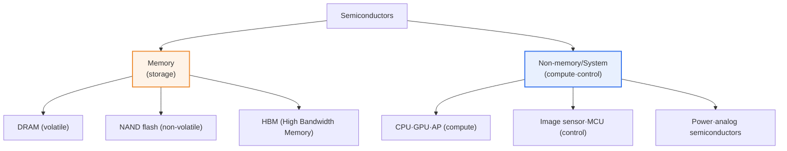
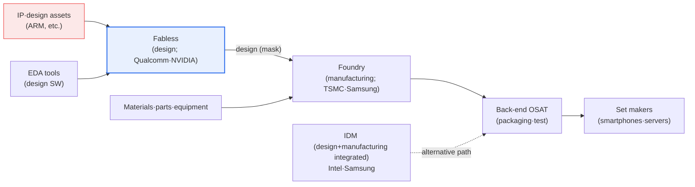

# The Semiconductor Industry — Memory vs. Non-Memory, the Value Chain, and Growth Strategy

## 1. Overview

### A. Definition and Background
> Semiconductors are the brains of every digital device, broadly divided into **memory** chips that store data and **non-memory (system) semiconductors** that handle computation and control. Korea is a memory-chip powerhouse but relatively weak in non-memory, and resolving this structural imbalance is a national task.

The first key to understanding the semiconductor industry is the recognition that "**memory and non-memory are fundamentally different markets in character**." Memory consists of standardized commodity products that store data (DRAM, NAND flash) — a low-variety, high-volume production structure that stamps out large quantities of the same specification. Competitiveness therefore comes down to "**how finely, how cheaply, and how much**" one can produce, which resolves into large-scale facility investment and fine-process technology. Because the rules of this game are capital and process technology, Korean firms — which have shouldered enormous investment and maintained leading-edge processes — have established themselves as world-class players contending for first and second place.

Non-memory (system semiconductors), by contrast, are high-variety, low-volume custom products responsible for computation, control, and conversion (CPUs, GPUs, APs, image sensors, power semiconductors, etc.). Because each customer demands different functionality, the essence of competitiveness is "**how well you design and how many diverse customers you can serve**." The market itself is larger too, accounting for about two-thirds of all semiconductors versus memory's roughly one-third. The problem is that Korea's standing in this large market is low. Design (fabless) and design-IP capabilities are weak, and while manufacturing (foundry) is strong, it faces challenges in securing leading-edge process leadership and a diverse customer base.

Because of this heterogeneity, the semiconductor industry has several distinct characteristics: **extreme capital intensity** (tens of trillions of won for a single leading-edge fab), **rapid technological obsolescence** (generational turnover following Moore's Law), **high yield sensitivity** (a few percentage points of defect rate can determine profitability), and **strong geopolitical exposure** (core equipment, materials, and markets concentrated in specific countries). These characteristics are the root causes of the cyclical volatility, supply-chain risk, and economic-security issues discussed later.

The second key is "**division of labor**." Memory is often handled by a single company integrating design and manufacturing (IDM), but non-memory splits into design-specialist fabless firms and manufacturing-specialist foundries. Thanks to this horizontal division of labor, design firms lacking capital can enter the market on ideas alone, while foundries pool the world's fabless orders to achieve economies of scale. Thus, becoming a semiconductor powerhouse requires a dual strategy: defending the memory advantage while simultaneously growing a non-memory "design ecosystem" to strike a balance. This article delves into (1) the differences between memory and non-memory, (2) the divided structure of the value chain, (3) non-memory growth strategy, and (4) recent AI-semiconductor trends.

## 2. Overall Industry Structure

The big picture of the semiconductor industry can be drawn along two axes: "what is made (product)" and "who handles which stage (value chain)." The structure diagram below expresses product classification, while the diagram in Section 3 expresses the value-chain flow.

Even within memory, character diverges. DRAM is fast but volatile — data disappears when power is cut — and is used as main memory, whereas NAND flash is slow but non-volatile, retaining data without power, and is used in storage devices (SSDs). Recently, **HBM (High Bandwidth Memory)**, which stacks multiple DRAM chips vertically to greatly increase bandwidth, has rapidly emerged for AI accelerators, becoming the decisive link connecting the traditional memory market to AI semiconductors. Non-memory divides into computation (CPU·GPU·AP), control (MCU·image sensor), and power/analog, and is diverse enough to encompass thousands of product types.

## 3. Memory vs. Non-Memory Semiconductor Comparison

The difference between the two markets is not merely one of function but that "**the very rules of competition differ**." Because memory specifications are standardized, differentiation on the product itself is difficult, and the contest ultimately comes down to cost and process miniaturization. Hence the wide swings between boom and bust. When demand concentrates, prices soar; when supply overflows, prices crash — a "cyclical" industry, forming an oligopolistic structure in which a few firms compete through large-scale investment.

Non-memory is the exact opposite. Because chips are designed to customer requirements, once adopted for a specific product they generate stable revenue over a long period, and the amplitude of the market cycle is relatively small. Instead, the barrier to entry lies not in "capital" but in "design capability, software ecosystem, and customer trust," making it hard for latecomers to catch up in a short time. This difference in the rules is precisely why Korea sits at the world's summit in memory yet struggles in non-memory.

| Category | Memory Semiconductors | Non-Memory (System) Semiconductors |
|---|---|---|
| **Function** | Data storage | Computation·control·conversion |
| **Products** | DRAM, NAND flash, HBM | CPU, GPU, AP, sensors, power semiconductors |
| **Production** | Low-variety, high-volume | High-variety, low-volume custom |
| **Competitiveness** | Fine process·facility investment·cost | Design capability·SW ecosystem·customer response |
| **Market character** | Cyclical (large boom-bust swings) | Relatively stable, long-term revenue once adopted |
| **Market share** | ~1/3 | ~2/3 |
| **Korea's standing** | Powerhouse (top tier) | Weak (fragile design) |

As a concrete example, the way memory prices surged during the 2021–2022 pandemic-driven boom and then went through a large-scale loss cycle in 2023 due to slowing IT demand illustrates well the volatility of the memory market. Conversely, non-memory chips such as image sensors and power semiconductors, which stay adopted in specific devices for a long time, maintained gentle growth. This difference is also the basis for explaining "why Korea's semiconductor exports fluctuate so much" — because a significant share of exports is concentrated in cyclical memory.

This cyclicality creates, beyond mere price fluctuation, a **dilemma of investment timing**. Memory firms decide to expand capacity during booms, but since actual mass production takes several years, they often complete construction just as a downturn has set in, deepening oversupply — a "hog cycle" that repeats. Even so, losing fine-process leadership means falling behind in cost competition, so technology investment cannot stop even during downturns. This "investment that cannot stop" raises the memory industry's barriers to entry to extremes and solidifies the small oligopoly, while paradoxically demonstrating why business diversification into non-memory is so urgent. Securing revenue stability requires, as a structural solution, growing the share of non-memory and system semiconductors that can serve as a buffer against the cycle.

## 4. The Semiconductor Industry Value Chain

Non-memory semiconductors have a division of labor between design and manufacturing. Understanding this divided structure is the starting point for growth strategy. The flow diagram below shows the stage-by-stage actors and flow from idea to finished chip.

The **design (fabless)** stage is the source of value added. Fabless firms own no factories and only design chips, leaving manufacturing to foundries. Qualcomm, NVIDIA, and AMD are representative. Design requires EDA (design automation software) and verified design blocks (IP) provided by companies such as ARM; these EDA and IP markets are dominated by a few overseas firms and act as the "invisible gateway" of the design ecosystem. For Korean fabless firms to grow, not only design manpower but also access to this IP/tool ecosystem and the securing of domestic IP must proceed together.

**Manufacturing (foundry)** is contract production that takes the fabless firm's design and stamps out the actual chip. TSMC leads the market with an overwhelming share in leading-edge processes, with Samsung Foundry pursuing behind it. The core of foundry competitiveness is securing "**the leading-edge fine process first, with stable yield**" and "**acquiring a diverse customer base**." Being a generation ahead in fine process (e.g., 5nm→3nm) gains an edge in performance and power efficiency and attracts large customers, so foundries wage a "war of money," continually bearing facility investment on the scale of tens of trillions of won.

Here one must note the **"invisible bottleneck" of EDA and IP**. No matter how excellent the design talent, one cannot design a modern complex chip without the software to design chips (EDA) and verified design blocks (IP). Yet these two markets are effectively controlled as standards by a few overseas firms, forming a powerful entry barrier at the very top of the design ecosystem. This is why fostering Korean fabless firms is not completed by cultivating manpower alone — the design base broadens only when domestic IP is accumulated, EDA accessibility is secured, and universities and research institutes build an open ecosystem that shares design assets. As this is a problem of knowledge accumulation over decades that cannot be solved by short-term investment, national strategy requires patience.

**Back-end (OSAT)** is the stage of cutting finished wafers, packaging the chips, and testing them. It was once regarded as low-value-added subcontracting, but the situation changed as fine processes approached physical limits (atomic size). **Advanced packaging (chiplets·heterogeneous integration, 2.5D/3D)**, which combines multiple chips into one, has emerged as a new key to boosting performance, greatly raising the strategic importance of the back-end. **Materials, parts, and equipment** underpin all these stages; core equipment such as lithography machines is heavily dependent on specific overseas firms, making it a representative example of supply-chain risk. Finally, there is the **IDM (integrated device manufacturer)** model, in which one company does both design and manufacturing, exemplified by memory firms and Intel.

## 5. Vision and Strategy for Non-Memory Growth

Synthesizing the diagnosis above, the direction of strategy is clear: defend the memory advantage while growing the weak areas of design (fabless) and IP, pushing the strong foundry business to the leading edge, and jointly building the materials/parts/equipment, manpower, and ecosystem to underpin all of it. Each strategy in the table below is interlocked, so any one alone has limited effect.

| Strategy | Content | Rationale·Implications |
|---|---|---|
| **Foster fabless firms** | Nurture design startups·talent, secure domestic IP | Source of value added, defense against the cycle |
| **Foundry competitiveness** | Invest in leading-edge fine process, diversify customers | Leading-process edge = attracting large customers |
| **Strengthen ecosystem·division of labor** | Design–manufacturing–back-end cooperation, localize materials/parts/equipment | Supply-chain self-reliance, risk mitigation |
| **National support** | R&D·tax incentives, specialized complexes (clusters), talent development | Solving problems of capital and manpower scale |
| **Advanced packaging** | Compensate for miniaturization limits via chiplets·heterogeneous integration | Back-end as the new key to performance |

In particular, at the national level, an "**ecosystem agglomeration**" strategy is being pursued that builds large-scale semiconductor clusters concentrating design, manufacturing, and materials/parts/equipment firms and manpower in one place. This is an approach in which the state jointly solves the problems of manpower and infrastructure scale that individual corporate effort cannot bridge. The fact that major countries have entered a large-scale subsidy competition to secure domestic production bases — such as the U.S. CHIPS Act and the EU Chips Act — is in the same vein, showing that semiconductors have become a matter of "economic security" beyond mere industry.

One caveat in judging priorities among the strategies is that fabless and foundry stand in a "**chicken-and-egg**" relationship, each needing the other. If domestic fabless firms are scarce, domestic foundries must depend on overseas customers; conversely, if the base of reliable domestic foundries and packaging is shallow, fabless firms have nowhere suitable to entrust their designs. Thus a policy supporting only one side has its effect halved, and a "package-type support" is needed that ties design–manufacturing–back-end–materials/parts/equipment into one ecosystem and grows them all at once. The reason the cluster strategy draws attention is precisely its aim to resolve this interdependence through physical agglomeration. That said, subsidy and tax support can inadvertently invite duplicate investment and oversupply, so selective concentration aligned with market demand and technology roadmaps must proceed in parallel.

## 6. Deep Dive — AI Semiconductors, HBM, and Recent Trends

The decisive variable that has shaken the landscape of the semiconductor industry recently is **generative AI**. Training and inference for large language models require enormous parallel computation and data bandwidth, and what handles this are AI accelerators such as GPUs and NPUs, and — alongside them, supplying data at ultra-high speed — **HBM**. Here an important opportunity has opened for Korea's memory industry. HBM is a high-value-added, high-difficulty memory made by stacking multiple DRAM vertically, and Korean firms — the existing DRAM leaders — dominate the world market. In other words, in the form of "**grafting a memory strength (HBM) onto a growth market called AI**," the cyclical memory business has become a catalyst for being reappraised as a growth business.

Meanwhile, AI-semiconductor competition is not purely a hardware fight. As NVIDIA's case shows, the real entry barrier for AI accelerators lies less in the chip itself than in the **software ecosystem (development tools·libraries)** running on top of it. Once developers grow accustomed to a specific platform, "lock-in" occurs that makes it hard to switch hardware. This is why latecomers struggle to establish themselves in the market even if they build high-performance chips, and it is the basis for why Korea's AI-semiconductor (NPU) strategy must pursue securing a software stack and developer ecosystem alongside chip design.

At the same time, this trend offers implications for non-memory strategy. Because the design of GPUs·NPUs — the brains of AI accelerators — is still led by overseas fabless firms, a "triple-linkage" strategy is valid for Korea: (1) leverage its advantage in AI-use memory such as HBM, (2) nationally grow AI-semiconductor (NPU) design capability, and (3) secure advanced-packaging competitiveness that combines HBM and logic chips. Indeed, since the AI boom, leading-edge foundry, HBM, and advanced packaging have been tied into one value chain, giving rise to an integrated competitive structure in which firms possessing all three areas gain the advantage. However, given the great uncertainties — the durability of AI demand and export controls arising from the U.S.–China tech-hegemony contest — it is safer to place weight on the structural direction of "balanced strengthening of memory, foundry, and packaging" rather than on flat assertions about a specific market condition.

## 7. Considerations and Implications

1. **Fostering the design ecosystem is the top priority.** The memory advantage alone will forfeit non-memory, which is two-thirds of the market. High-value-added fabless design capability, access to domestic IP·EDA, and above all design talent must be cultivated over the long term, approached as a decade-scale investment rather than short-term results.
2. **Supply-chain stability and technological sovereignty are core.** As semiconductors become the center of economic security, localizing materials/parts/equipment to reduce dependence on specific countries for core equipment and materials, and securing a diversified, stable supply chain, have become national strategy. Because a bottleneck in a specific piece of equipment or material becomes a bottleneck for all production, risk diversification is essential.
3. **AI semiconductors and HBM are the new growth axis.** An integrated strategy linking the memory (HBM) advantage with AI-accelerator design and advanced packaging becomes the breakthrough beyond the limits of a cyclical industry. That said, the volatility of AI demand and geopolitical risk must be managed together.
4. **Prepare for miniaturization limits and the shift to advanced packaging.** As process miniaturization approaches physical limits, the center of gravity for performance improvement is shifting from "smaller" to "better bonding (chiplets·heterogeneous integration)." The back-end must be re-recognized as a strategic domain rather than low-value-added subcontracting, and invested in accordingly.
5. **Securing talent is the bottleneck for every strategy.** Whether design, process, or packaging, every strategy is ultimately executed by people. Unless a manpower policy that prevents the avoidance of science and engineering and the outflow of top talent, and attracts overseas talent, is in place, the effects of other investments will be halved.

## References
- Korea Semiconductor Industry Association (KSIA): https://www.ksia.or.kr/
- SEMI (Semiconductor Equipment and Materials International): https://www.semi.org/
- Ministry of Trade, Industry and Energy — Semiconductor industry policy: https://www.motie.go.kr/

---

> **In one line**: Semiconductors divide into *memory for storage (Korea, a powerhouse) and non-memory for computation (weak in design)*, with fundamentally different rules of competition; along a value chain running IP·fabless·EDA → foundry → back-end, **fostering the fabless design ecosystem, localizing materials/parts/equipment, and linking AI semiconductors (HBM·advanced packaging)** are the core strategies for non-memory growth and economic security.
