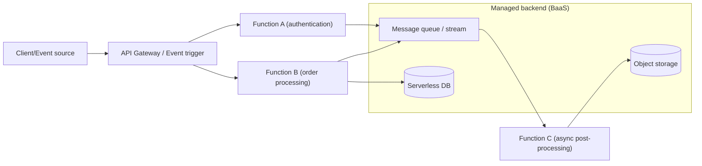
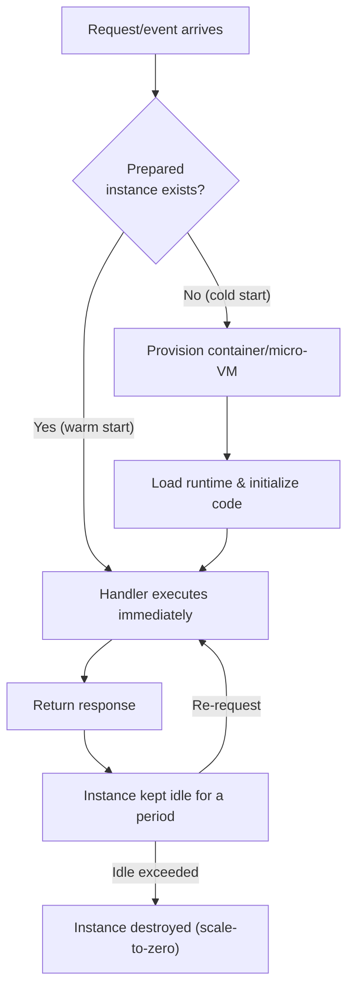

# Serverless Computing (Serverless Computing / FaaS)

## 1. Overview

> **Definition**: Serverless computing is a cloud execution model in which the developer fully delegates infrastructure operations — server provisioning, scaling, patching, etc. — to the cloud provider, **composes applications in units of event-reacting functions or managed services**, and is billed only for the resources actually used in execution (pay-per-use).

The name "serverless" does not mean physical servers disappear; rather, it means **the existence of servers disappears from the developer's concerns (server-less)**. In traditional IaaS·PaaS, instances had to run continuously even with no traffic, incurring costs accordingly, whereas serverless creates and runs a function instance only the moment a request arrives, and scales resources to zero (scale-to-zero) when idle. This is a change that **lowers the minimum unit of resource use from "server rental time" to "one function invocation — tens of milliseconds,"** and its emergence background is intertwined with the spread of microservice and event-driven architectures.

There are three reasons for its emergence. First, the **explosion of operational burden**. As containers and orchestration became widespread, the infrastructure-management surface development teams had to handle grew wider, and the problem of resources tilting toward operations rather than business logic came to the fore. Second, **cost efficiency**. For workloads with large or intermittent traffic variation (batch, webhooks, IoT events), continuously running instances are highly wasteful, and usage-based billing resolves this. Third, **development agility**. Function-unit deployment shortens release cycles, and combined with managed backends (BaaS), lets a service be completed with minimal code. The 2014 announcement of AWS Lambda is the starting point of commercialization, and since then serverless has been expanding beyond FaaS into serverless DBs and serverless containers.

## 2. Serverless Architecture Structure and Components

A serverless application is broadly composed of a combination of **FaaS (Function as a Service), which handles computation,** and **BaaS (Backend as a Service), which provides state and functionality**. Requests enter through an API Gateway or event source, functions execute statelessly, and then interact with managed storage·DB·message queues, delegating state externally.

**FaaS** is a short-lived function execution environment triggered by events. The developer provides only the function code and settings for memory and timeout; the platform handles the rest of the runtime and scaling. Because functions must obey the stateless principle, state such as sessions and caches must be kept in external stores. **BaaS** is a managed service that provides backend functionality — authentication (Auth), databases, storage, notifications, etc. — in the form of APIs, helping a serverless front end complete functionality without server code. **Event sources** are the trigger for function execution, including HTTP requests, storage-object creation, queue messages, schedules (cron), DB change streams, and more.

| Component | Role | Representative examples |
|---|---|---|
| FaaS | Event-driven stateless function execution | AWS Lambda, Azure Functions, Google Cloud Functions |
| API Gateway | Routing·authentication·throttling·request transformation | Amazon API Gateway |
| Event source | Function trigger | S3, SQS/SNS, EventBridge, Kinesis, cron |
| BaaS (state) | Managed DB·storage·authentication | DynamoDB, Aurora Serverless, Firebase |
| Orchestration | Composing function workflows | AWS Step Functions |

## 3. Operating Principle — Execution Lifecycle and Cold Start

The core technical issue of serverless is **managing the lifecycle of function instances**. Resources are kept at zero when there are no requests, but when a request arrives the execution environment must be created on the spot, and the delay incurred during this preparation is the **cold start**.

A cold start arises in three stages — **provisioning the execution environment → loading the runtime → running initialization code (outside the handler)** — and ranges widely from tens of ms to several seconds depending on language, package size, and memory settings. For example, a JVM function with large dependencies has heavy initialization, so its cold start reaches 1–2 seconds, whereas a lightweight runtime is under a few hundred ms. In practice, one moves initialization logic outside the handler to cache it when instances are reused, secures warm instances at all times with **Provisioned Concurrency**, and — in AWS's case — shortens boot time to the millisecond level with the micro-VM **Firecracker**. Scaling is effectively automatic, replicating function instances horizontally in proportion to the number of requests, and one must consider in design that the number of concurrent executions is capped by account and region quotas.

## 4. Comparison with Traditional Models

To understand serverless's position, one must compare the responsibility boundaries with IaaS and containers (CaaS). The table below is a list, but the **reason the differences arise** lies in the shift in abstraction level — "up to where does the developer control, and from where does delegation begin." As abstraction rises, one trades operational burden for fine-grained control.

| Category | IaaS (VM) | Container (K8s) | Serverless (FaaS) |
|---|---|---|---|
| Scaling unit | Instance | Pod/node | Function invocation |
| Scale-to-zero | Impossible (always running) | Limited | Supported by default |
| Billing basis | Time | Time/resource | Execution count·time (ms) |
| Operational burden | High (OS·patching) | Medium | Minimal |
| Execution-time constraint | None | None | Yes (e.g., 15-minute cap) |
| Cold start | None | Low | Yes |

IaaS grants great control but bears OS·middleware operations and pays for idle cost. Containers grant portability and fine control while leaving orchestrator operational burden. Serverless nearly eliminates operations but accepts constraints such as **execution-time caps, cold starts, local-disk and state limits, and vendor lock-in**. Therefore, sustained and predictable high-load workloads may favor containers·IaaS in total cost of ownership, while intermittent, event-driven, spike-type workloads favor serverless — and this **break-even judgment** is the crux of architecture choice.

## 5. Application Cases

Serverless shows particular strength in **image and data post-processing pipelines**. For example, a structure in which a user uploads an image to object storage, an object-creation event triggers a function to generate a thumbnail and record metadata to a DB, automatically scales to hundreds of instances when uploads surge and shrinks to zero when idle, so cost is exactly proportional to usage. It is also widely used for workloads with irregular requests where maintaining an always-on server is wasteful — such as **webhooks·chatbots·IoT event collection** — as well as **scheduled batches (cron)** and **specific endpoints of an API backend**. Recently it is also used in **AI-inference preprocessing·lightweight inference** and the document-processing stages of RAG pipelines. Conversely, it is unsuitable for ultra-low-latency trading where millisecond delay is fatal, long continuous computation (large-scale training), and workloads that maintain large amounts of state.

## 6. Deep Dive — Serverless Expansion and Latest Trends

Serverless is expanding beyond FaaS into **serverless containers** and **serverless databases**. AWS Fargate and Google Cloud Run run containers in a serverless manner (scale-to-zero·usage billing), relaxing FaaS's execution-time and runtime constraints while taking serverless's operational benefits. Serverless DBs such as Aurora Serverless and DynamoDB On-Demand automatically adjust capacity to traffic. On the standardization front, **CloudEvents (CNCF)** standardizes the event-message format to raise cross-vendor event interoperability, and **Knative** provides serverless execution and autoscaling on top of Kubernetes, aiming at open-source-based, vendor-neutral serverless. Micro-VM (Firecracker)·snapshot-restore techniques for cold-start mitigation, **edge serverless (Edge Functions)** that run functions at edge locations, and ultra-lightweight serverless leveraging WebAssembly runtimes are also active areas of research and commercialization. These trends can be understood as generalizing the serverless philosophy of "**computing that exists only when needed**" — beyond a "function-centric" view — to various layers.

## 7. Considerations and Implications

From a professional-engineer perspective, adopting serverless requires comprehensive judgment of the following.

- **Workload suitability and break-even analysis**: Compare the total cost of ownership of serverless·containers·IaaS based on traffic patterns (intermittent/spike vs. sustained high load) and execution-time characteristics, and pre-calculate the break-even point at which the serverless unit price can actually become unfavorable under large-scale sustained traffic.
- **Vendor lock-in and portability**: Because event formats·triggers·BaaS APIs differ by provider, lock-in deepens; adopt standard and open-source layers such as CloudEvents·Knative and secure portability through hexagonal design that separates business logic from vendor SDKs.
- **Performance·latency trade-off**: Assess the impact of cold start on SLAs and respond with provisioned concurrency·initialization optimization·lightweight runtimes, and mix in an always-on model (hybrid) for segments where low latency is an absolute requirement.
- **Observability and operational maturity**: Because numerous distributed functions are hard to trace, make distributed tracing·structured logging·correlation-ID-based observability mandatory, and manage functions·triggers·permissions via IaC (Infrastructure as Code).
- **Security·governance**: Reflect in the design stage the principle of least privilege (IAM) per function, trust verification of event sources, dependency-package vulnerability (SCA) management, and defense against cost blowups·DoS using concurrency caps.

Going forward, serverless is expected to broaden its reach by combining with edge·WebAssembly·serverless containers, and the architect's judgment in balancing the value of "scaling without operations" against the cost of "constraints·lock-in" will decide success or failure.

## References
- AWS Lambda Developer Guide, https://docs.aws.amazon.com/lambda/
- CNCF CloudEvents Specification, https://cloudevents.io/
- Knative Documentation, https://knative.dev/docs/
- CNCF Serverless Whitepaper, https://github.com/cncf/wg-serverless

---

> **In one line**: Serverless is a model that delegates infrastructure operations to the provider and runs event-driven stateless functions (FaaS) and managed backends (BaaS) with usage billing and scale-to-zero; one must judge the benefit of removing operational burden against the trade-offs of cold start·execution constraints·vendor lock-in according to workload characteristics.
