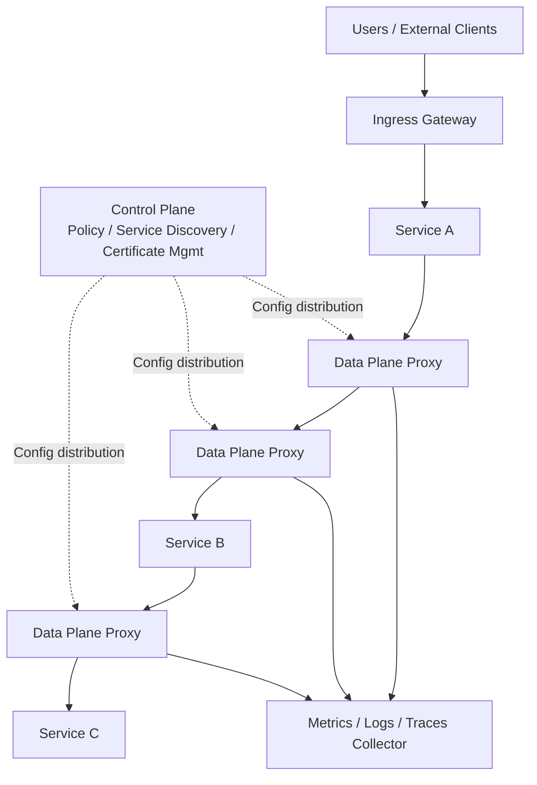
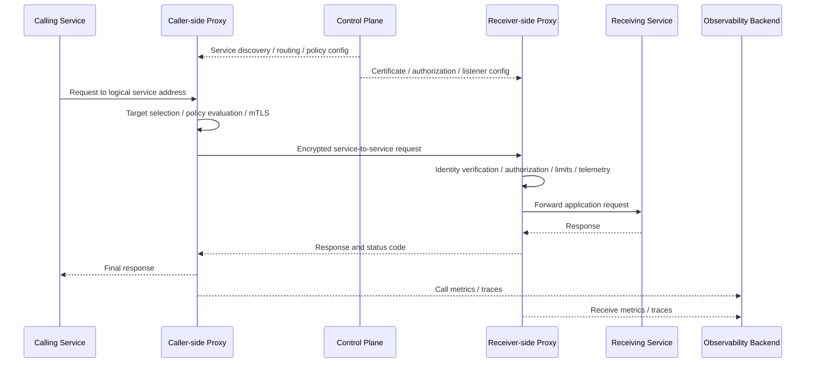

# Service Mesh

## 1. Overview

### A. Definition
> A **Service Mesh** is a dedicated infrastructure layer that separates communication between microservices from application code and consistently provides connectivity, traffic control, reliability, security, and observability.

As microservices multiply, the number of inter-service call paths and policies grows faster than the number of services themselves. When each service independently decides whether it calls over HTTP or gRPC, how it applies retries and timeouts, how it authenticates the caller, and how it identifies the path on which a failure occurred, operational rules quickly become fragmented. A service mesh moves these cross-cutting concerns into an intermediate layer on the communication path so that applications can focus on business logic.

The CNCF describes a service mesh as a dedicated infrastructure layer that handles service-to-service communication securely, quickly, and reliably in cloud native environments ([CNCF Cloud Native Glossary](https://glossary.cncf.io/service-mesh/)). A service mesh should therefore be understood not merely as a network topology that links services together, but as a **manageable communication platform** in which policies are deployed and proxies actually mediate traffic.

### B. Background and Need

In a monolithic system, most calls are in-process function calls and network boundaries are few, so call retries, certificate validation, and distributed tracing are easy to handle with a shared library. Microservices, by contrast, cross multiple processes, nodes, availability zones, and language runtimes. Callers encounter network latency and transient errors, receivers expose APIs of different versions, and operators need to send a portion of traffic to a specific version during a release.

If each team solves these problems separately with client libraries in Go, Java, Python, and so on, feature gaps and version mismatches arise. One service implements exponential backoff while another retries indefinitely; one validates mTLS while another permits plaintext communication. These discrepancies become a common cause of outages and security incidents.

A service mesh externalizes communication policy through proxies and a control plane. Even without changing service code, the proxy can observe requests, select destinations, establish encrypted channels, and collect response times and error rates. Externalization is not a panacea, however. Adding proxies increases latency, memory usage, and operational complexity, so one must first determine whether the number of services and the communication complexity actually justify that cost.

### C. Core Value and Scope

A service mesh provides the following four values in a single communication layer.

1. **Connectivity**: Standardizes the call foundation, such as service discovery, load balancing, and protocol mediation.
2. **Reliability**: Manages timeouts, retries, circuit breaking, fault isolation, and delay injection as policy.
3. **Security**: Applies mTLS and authorization policies based on each service's workload identity.
4. **Observability**: Collects metrics, logs, and distributed traces per request to understand service dependencies.

Its scope centers on east-west traffic within the cluster, but through ingress and egress gateways it can also manage boundaries with external traffic and with other clusters and virtual machines. Accordingly, rather than replacing an API gateway, it is common to combine policies for external entry points and internal services according to their different trust boundaries.

## 2. Overall Structure and Operating Principle

### A. Logical Architecture

A service mesh is logically divided into a **data plane** and a **control plane**. The data plane is the set of proxies that actually forward requests; it is the execution domain where request routing, encryption, retries, policy enforcement, and telemetry generation take place. In the traditional model where the proxy is deployed alongside the service process, the proxy mediates both inbound and outbound communication of the service.

The control plane takes the intent (desired state) to be applied to the data plane and translates service discovery information, routing rules, certificates, and policies into dynamic configuration that proxies understand. The control plane does not sit directly on the data path of ordinary requests; it configures proxies via the control path. This separation makes it possible to design the system so that a transient control plane failure does not immediately halt every request in the already-deployed data plane.

Istio's official architecture documentation likewise explains that in the data plane, Envoy proxies mediate service-to-service communication and collect telemetry, while the control plane manages and configures the proxies ([Istio Architecture](https://istio.io/latest/docs/ops/deployment/architecture/)). Component names may differ between products, but the separation of roles between data plane and control plane is a common design principle of service meshes.

### B. Request Processing Flow

The calling service usually just sends a request to a service name or virtual host; it does not directly manage specific instance IP addresses or the state of failed instances. The caller-side proxy uses the service discovery information and routing rules received from the control plane to choose a destination instance and, if necessary, selects a version based on request headers, paths, or weights.

The receiver-side proxy checks which workload the request came from and evaluates whether the call is permitted for the target service. When mTLS is used, the proxy handles mutual authentication and the encrypted channel, reducing the burden on the application of handling certificates and keys directly. However, business authorization may require application-level information such as HTTP method, path, and user claims, so it cannot all be solved by the proxy's network policy alone.

While a request is being processed, both proxies produce metrics in a common format. Integrating call duration, response codes, retry counts, target workloads, and trace identifiers allows services developed in different languages to be compared for performance and errors on the same basis. However, indiscriminately logging personal data or tokens turns observability into a new data-protection risk, so masking and retention periods must be designed together.

## 3. Key Components and Functions

### A. Data Plane Proxy

The data plane proxy is deployed close to the service and actually forwards packets or requests. In the traditional sidecar model, each application Pod gets its own proxy container, and network rules redirect the application's inbound and outbound traffic through the proxy. This approach minimizes application changes and makes it easy to apply fine-grained L7 policies per service.

The proxy does not replace the application's business logic. It decides where and how to forward a request, but decisions with domain meaning, such as the validity of an order amount or a customer's payment limit, must remain the responsibility of the service. If this boundary is not maintained, proxy configuration effectively becomes a hidden application, making testing and change management difficult.

When using proxies, one must evaluate CPU and memory overhead, latency from additional hops, configuration propagation time, and bypass paths in case of failure. Especially in systems with heavy inter-service calls, a single request passes through multiple proxies, so the cumulative cost from call fan-out can exceed the added latency of any single call.

### B. Control Plane

The control plane reads workload and endpoint information from the service registry or orchestrator and translates operator-defined routing, security, and observability policies into proxy configuration. It also issues and renews the certificates used for workload identity and manages which namespaces and services each policy applies to.

Because the control plane serves as the single source of truth for configuration, change history and approval procedures are important. A single incorrect routing rule can send all traffic to the wrong version, or excessive retries can amplify an outage. Applying Git-based declarative management, policy validation, staged rollout, and automatic rollback allows control plane changes to be governed at the same level as ordinary software deployments.

Control plane high availability is also essential. Even if configuration already pushed to proxies persists, a prolonged control plane outage stops new workload registration, certificate renewal, and policy changes. Therefore, multiple replicas, leader election, backups of the state store, certificate renewal before expiry, and separate monitoring of the control and data paths should be considered together.

### C. Traffic Management

A service mesh controls traffic by decoupling the logical service name from the actual set of instances. Beyond simple distribution like round robin, it can express as policy weight-based distribution, header/cookie/path-based routing, locality- or availability-zone-preferred routing, and mirroring to a specific version.

For example, a canary deployment can route a new payment service v2 to only 1% of all requests at first, check the error rate and p95 latency, and then increase to 10%, 50%, and 100%. If a problem is detected, the routing weight can be switched to 0% to quickly revert to the previous version without rebuilding the application. However, if the database schema is not bidirectionally compatible, reverting traffic alone leaves data issues behind, so deployment order and contract compatibility must be checked together.

Retries and timeouts absorb network errors but can amplify outages if misused. If a caller retries three times with a 1-second timeout and that caller in turn fans out to several services, a single original request can be amplified into dozens of downstream requests. Retries should focus on idempotent read requests, and retry budgets and overall request deadlines should be set to block cascading retries.

### D. Resilience and Fault Isolation

Circuit breaking temporarily stops calls when the error rate or number of concurrent requests to a particular target exceeds a threshold, giving the failing service time to recover. A bulkhead separates connection pools or concurrency limits so that exhaustion in one service does not encroach on the resources of other services. These two features address different failure patterns.

Delay injection and fault injection are ways to verify resilience without waiting for real failures. For example, injecting a 500ms delay into the recommendation service verifies that the order service's timeout and fallback response work correctly. When run in production, the target scope, duration, approver, and stop conditions must be clearly defined, starting with limited traffic during periods of low customer impact.

### E. Service-to-Service Security

A service mesh can standardize service-to-service authentication based on cryptographic workload identity. mTLS not only encrypts communication but also makes both sides authenticate each other, making it closer to Zero Trust principles than an approach that trusts based on network location alone. Automatic certificate issuance and renewal reduce operational burden, but the root trust anchor, key custody, revocation, and expiry monitoring must still be managed separately.

Authentication and authorization should be designed separately. The fact that "Service A proved it is Service A" is authentication, while the decision that "Service A may call B's query API" is authorization. Least-privilege policies should be concretized at the service, namespace, method, and path level, transitioning to a default-deny model that allows only necessary communication.

What the proxy mainly handles is service identity and communication policy. End-user login tokens, purposes of personal data access, and business permissions must be tied to the responsibilities of the API gateway and the application. If the proxy merely checks that a token exists and the application's authorization decision is skipped, the result is authenticated-but-overprivileged access.

### F. Observability and Operational Visibility

The basic metrics a service mesh generates include request counts, success/failure counts, response times, and retry and circuit-breaker counts. Grouping these metrics by service, version, path, and status code makes it possible to identify which version saw increased errors and to distinguish network latency from application latency.

Distributed tracing follows the path of a single user request through multiple services. If proxies preserve the trace ID and span context propagated by the calling service, common tracing is possible even when services are written in different languages. Fixing the trace sampling rate at 100% can inflate cost and storage, so policies such as error-first, high-latency-first, or representative sampling should be chosen.

Observability data is not only useful to operators; it is also the basis for capacity planning and service level management. For example, comparing the payment API's p99 latency and error budget before and after a release allows an objective decision on whether to promote the deployment. Allowing metric names and labels to grow without bound can cause a cardinality explosion that brings down the monitoring system itself, so a label dictionary and retention policy should be established.

## 4. Deployment Models and Comparison with Related Technologies

### A. Sidecar Model

In the sidecar model, a proxy performing identical functions is deployed alongside each application instance. Because the call path moves from the application container to the local proxy and then to the remote proxy, service-specific policies and L7 processing can be applied at a fine granularity. Another advantage is that application and proxy logs can be grouped per Pod during failure analysis.

On the other hand, as the number of workloads grows into the thousands, the number of proxies and the volume of configuration distribution increase with it. Because every Pod has its own proxy, memory reservations, image updates, security patches, and startup ordering become burdensome. Also, since the proxy shares the Pod's resources with the application, misconfigured resource limits can affect the performance of the business container.

### B. Ambient Model

The ambient model, instead of inserting a sidecar into every application Pod, separates a node-level lightweight L4 proxy from an L7 proxy used only when needed. According to Istio's official documentation, in the ambient data plane, ztunnel handles L4 communication and Zero Trust security by default, and waypoint proxies are used selectively when L7 features are required ([Istio Ambient Overview](https://istio.io/latest/docs/ambient/overview/)).

Because it does not inject heavy sidecars into every workload, this approach has room to reduce operational cost and application compatibility burden. However, policies handled at L4 must be distinguished from those requiring an L7 waypoint, and when operating in mixed mode with existing sidecars, traffic paths and policy precedence must be made clear. A model with fewer features is not always simpler, and one must also judge whether the organization's operational capability and debugging tools are mature.

Istio announced that ambient mode reached General Availability in 2024 and documents data plane modes that allow choosing between the existing sidecar model and the ambient model ([Istio Ambient Mode Reaches General Availability](https://istio.io/latest/blog/2024/ambient-reaches-ga/), [Istio Sidecar or Ambient](https://istio.io/latest/docs/overview/dataplane-modes/)). This does not mean a specific product should be adopted unconditionally; rather, it is an example showing that service meshes are evolving toward balancing proxy placement cost against policy granularity.

### C. Model Comparison

| Comparison Item | Sidecar | Ambient | Application Library |
|---|---|---|---|
| Deployment unit | Pod / workload | Node L4 + optional L7 | Application process |
| Code changes | Almost none | Almost none | Required per language |
| L7 policy | Fine-grained by default | Requires waypoint etc. | Depends on implementation scope |
| Resource cost | Proportional to number of workloads | Node- and optional-L7-centric | Included in process resources |
| Language independence | High | High | Low to medium |
| Operational complexity | Growing number of proxies | Must understand modes and paths | Requires library standardization |

Conclusions should not be drawn from the table items alone. Sidecars may suit small meshes that need fine-grained control, whereas ambient may be advantageous when quickly applying common L4 security and connectivity to many workloads. Conversely, for very small systems, a simple library or the platform's default network policies may be more cost-effective than any mesh model.

### D. Comparison of API Gateway, Ingress, and Service Mesh

An API gateway is often the entry point for north-south traffic from external customers or partners, handling authentication, rate limiting, API productization, and version management of external contracts. Ingress is the entry concept that defines paths from outside the cluster into internal services, and depending on the product, it may also provide gateway features. A service mesh focuses on consistent communication policy for east-west traffic between internal services.

Because these three technologies overlap in functionality, an organization may use the same proxy at multiple boundaries. However, external user authentication and internal workload authentication have different threat models, and the public contracts of external APIs differ from the deployment units of internal services. Rather than concentrating all policy in a single component, it is operationally clearer to divide responsibilities by boundary and link logs, trace IDs, and policy models.

## 5. Application Cases and Adoption Procedure

### A. E-commerce Canary Deployment Case

Suppose an e-commerce platform has separated its order, inventory, payment, and shipping services. When introducing payment service v2, the service mesh can send only 5% of requests originating from the order service to v2 while keeping the rest on v1. It observes v2's authorization success rate, p95 response time, retry rate, and error code distribution, and gradually increases the share if the criteria are met.

What matters here is not the ability to shift traffic share itself but defining promotion criteria as measurable SLOs. If the payment success rate falls below target or integration errors with a particular card issuer increase, it rolls back automatically, and the application manages idempotency keys for payment requests so that failures do not lead to duplicate authorizations. The key point is that the mesh's retry policy alone cannot solve the duplicate payment problem.

### B. Internal Security Case in Finance and Public Sector

In a financial or public-sector system where a customer information lookup service communicates with a statistics service, the services must not trust each other simply because they are connected on the network. mTLS is applied based on workload identity, and path- and method-level authorization policies ensure that the statistics service can only call the de-identified aggregate API for customer information.

Policy changes are deployed after approval by the responsible person and validation in a test environment, and certificate issuance/revocation and policy denial events are recorded in audit logs. Raw responses containing personal data are not stored in the observability backend, and trace data uses pseudonymized correlation IDs instead of business identifiers. Only then can the service mesh's security features satisfy both personal data protection and audit trail requirements.

### C. Phased Adoption Procedure

1. **Current-state assessment**: Identify the service inventory, call graph, protocols, average and tail latency, failure paths, and sensitive data.
2. **Goal definition**: Set measurable goals such as mTLS coverage, error budget, observability coverage, and canary deployment time.
3. **Pilot selection**: Choose two or three non-critical services with controlled call volumes and clear team ownership.
4. **Observability first**: Verify request metrics and tracing first to establish a performance baseline before and after proxy introduction.
5. **Phased security**: Validate allow lists in observation mode, then gradually move to default deny and enforced mTLS.
6. **Traffic policy application**: Do not turn on timeouts, retries, circuit breaking, and canary routing all at once; validate each feature separately.
7. **Operational standardization**: Turn policy templates, deployment approval, rollback procedures, incident response drills, and cost metrics into standard operating procedures.
8. **Expansion and re-evaluation**: Re-measure control plane load and proxy cost as the number of services grows, and document exception criteria for where the mesh will not be applied.

## 6. Advanced — Operating Model and Latest Directions

A service mesh is not a project of installing a single technology product but a platform transition for operating communication policy. The platform team provides default templates and guardrails, and each service team declares routing and authorization policies suited to its own SLOs and data classification. If a central team manually approves every policy, it becomes a bottleneck; if each team changes things freely, the overall trust boundary can collapse. Hence a risk-tiered approval scheme is needed.

Observability must link three signals. Metrics quickly show trends in error rate and latency, logs record the detailed cause of a specific request, and traces show the path across multiple connected services. Proxies should record a common trace ID and workload identity across all three signals, but if high-cardinality labels and sensitive headers are not controlled, storage costs and personal data risks increase.

In multi-cluster environments, service discovery, identity schemes, certificate issuers, gateway paths, and failover policies for regional outages must be decided together. Whether each cluster uses a separate trust domain or they are bound into one trust domain changes the certificate model and the blast radius of incidents. Simply connecting clusters and copying the same policies may fail to reflect regional regulations and data sovereignty.

The evolution of the ambient model shows a direction of dividing proxy functions into an L4 security layer and an optional L7 processing layer to tune cost against functionality. However, this creates a new requirement for operators to understand which policy is enforced at which layer. In a PE exam answer, rather than asserting that "sidecars are obsolete and ambient is always superior," it is more appropriate to state that the choice is made based on workload scale, L7 requirements, operational capability, and performance budget.

## 7. Considerations and Implications

### A. Balancing Performance and Cost

Proxy hops, TLS encryption/decryption, and telemetry generation add CPU and latency. p50, p95, and p99 latency, CPU and memory usage, network throughput, and proxy restart rates before and after adoption must be compared under identical load conditions. Looking only at average latency can miss tail latency, so higher-percentile metrics that directly reflect user experience should be used.

### B. Preventing Retry Storms and Failure Propagation

Retries are not a feature for hiding failures but a means of increasing the chance of success within a bounded time. Call deadlines, maximum retry counts, backoff and jitter, idempotency, and circuit breaking must be designed together, and load testing must verify that retries do not exceed the capacity of dependent services. Especially in graphs with many synchronous calls, bulkheads should be placed so that a failure in one node does not exhaust the threads and connection pools of upstream services.

### C. Effectiveness of Security and Policy

Applying mTLS does not automatically guarantee business authorization. Workload identity, user identity, call purpose, and data classification must be linked in the policy model, and the principles of default deny, least privilege, and periodic review must be operated. Audit metrics are also needed to detect certificate and policy expiry, abnormal spikes in denials, and unexpected new call paths.

### D. Control Plane Availability and Change Safety

Even though the control plane is not on the data path of every request, deploying incorrect configuration can have broad impact. Configuration validation, linting, policy conflict checks, test-cluster application, progressive rollout, and automatic rollback should be included in the pipeline. The control plane itself should have multiple replicas and backups, with alerts set in advance for when certificate renewal failures would occur.

### E. Organization and Responsibility Boundaries

If the mesh is operated as a tool of the platform team alone, service teams may not understand the policies and may request exceptions excessively. Conversely, if each service team directly manages detailed proxy settings, common controls can break down. A joint operating model is appropriate, in which the platform team provides standard templates and safe defaults and service teams take responsibility for their service's SLOs, data classification, and call contracts.

### F. Adoption Judgment from a PE Perspective

Mandating a service mesh for every application is not a good architectural principle. In systems with few services and simple calls, proxy operating costs may outweigh the benefits, and serverless or external-SaaS-centric systems may be better served by other integration approaches. Conversely, in environments requiring polyglot microservices, frequent canary deployments, strong service-to-service authentication, and integrated tracing, the value of a common communication layer grows.

The final judgment should be made based on business goals and operational metrics, not feature lists. Compare mean time to recovery, policy coverage, deployment lead time, security audit response time, and cloud cost against the baseline, and address problems the mesh does not improve separately in the application, data, and organizational domains. This is the key to making a service mesh a sustainable means of information system management rather than trendy infrastructure.

## References

- [CNCF Cloud Native Glossary — Service Mesh](https://glossary.cncf.io/service-mesh/)
- [CNCF — Service mesh: A critical component of the cloud native stack](https://www.cncf.io/blog/2017/04/26/service-mesh-critical-component-cloud-native-stack/)
- [Istio — Architecture](https://istio.io/latest/docs/ops/deployment/architecture/)
- [Istio — What is Istio?](https://istio.io/latest/docs/overview/what-is-istio/)
- [Istio — Ambient Overview](https://istio.io/latest/docs/ambient/overview/)
- [Istio — Sidecar or ambient?](https://istio.io/latest/docs/overview/dataplane-modes/)
- [Istio — Ambient Mode Reaches General Availability](https://istio.io/latest/blog/2024/ambient-reaches-ga/)
- [CNCF Cloud Native Security Whitepaper](https://www.cncf.io/wp-content/uploads/2022/06/CNCF_cloud-native-security-whitepaper-May2022-v2.pdf)

---

> **In one line**: A service mesh is an infrastructure layer that consistently manages service-to-service connectivity, traffic, reliability, security, and observability through data plane proxies and a control plane; adoption should weigh performance cost, policy effectiveness, and operational capability rather than features alone.
