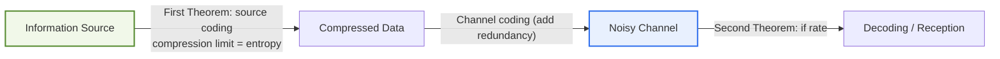
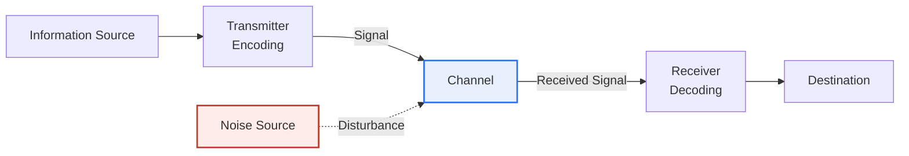

# Information Theory and Shannon's Theorems

## 1. Overview

### A. Concept of Information Theory
> **Information Theory** is the theory that quantitatively measures information and **mathematically establishes the limits of how much information can be compressed and how fast it can be transmitted without error in communication**. It was founded by Claude Shannon in his 1948 paper "A Mathematical Theory of Communication."

The fundamental reason information theory became the foundation of modern communications and computing is that it **made the abstract concept of information measurable as a number and pinned down the theoretical limits of communication**. Before Shannon, there was no way to objectively measure "the amount of information." Telegraph and telephone engineers dealt empirically with bandwidth and speed, but had no tool to state numerically "how much information this message contains." Shannon's decisive turn was to deliberately exclude the meaning (semantics) of information and define the amount of information solely as **uncertainty (entropy)**. In other words, he measured information not by "what it means" but by "how hard it is to predict."

The intuition behind this definition is as follows. The harder it is to predict which event will occur (the more uncertain it is), the more information its outcome provides when actually observed. For example, a rigged coin that always lands heads tells you nothing new when you see the result, so its information is 0 (entropy 0), whereas a fair coin with a 50/50 chance is completely uncertain and yields the maximum information (1 bit) when observed. Likewise, the message "the sun will rise tomorrow" carries almost no information, while "a certain stock will rise 30% tomorrow" has low probability and thus carries a lot of information.

Once information was quantified in the universal unit of the **bit**, it finally became possible to give clear limits to questions such as "how much can data theoretically be compressed?" and "how quickly and accurately can data be sent over a noisy channel?" Shannon's two theorems define these two limits. The theory today underpins data compression (ZIP, JPEG, MP3), error-correcting codes, 5G and Wi-Fi communications, and cryptography, and has further extended to loss functions and feature selection in machine learning.

### B. Entropy — Quantifying the Amount of Information
Entropy, the starting point of information theory, deserves a more concrete look. The information content of an individual event (self-information) with probability p is defined as `I = -log₂ p`. The lower the probability (the rarer the event), the larger the logarithm and thus the information content — a mathematical translation of the intuition above. The **average information** emitted by the entire source is the entropy `H = -Σ pᵢ log₂ pᵢ`. The greater the uncertainty, i.e., the more evenly the outcomes occur, the higher the entropy.

In concrete numbers, a fair coin with heads and tails each at probability 0.5 has entropy `-(0.5·log₂0.5 + 0.5·log₂0.5) = 1 bit`. A coin biased toward heads at 0.9, by contrast, has only about 0.47 bits. That is, a biased source is more predictable on average and carries less information, and precisely this "leftover predictability" is the room for compression.

For example, English text does not use the alphabet uniformly — e and t appear often, z and q rarely — and there are correlations between characters, such as "q is almost always followed by u," so its effective entropy is as low as about 1 bit per character. That is why text originally stored in 8-bit ASCII shrinks substantially under lossless compression. Entropy is thus not merely a theoretical concept; it directly answers the practical question "how much can this data be reduced in principle?"

### C. Fundamental Questions Answered by Information Theory
Organizing the questions information theory posed and answered into three makes its structure clear. First, to "how do we measure the amount of information?" it answered with entropy. Second, to "how far can data be compressed?" it answered with the First Theorem (entropy is the lower bound). Third, to "how accurately and quickly can data be sent over a noisy channel?" it answered with the Second Theorem and the Shannon-Hartley theorem (channel capacity).

These three questions cut across the entire storage and transmission landscape of today's IT systems. Compressing files for storage, sending data wirelessly, and correcting bit errors in storage devices are all designed within this framework. Hence information theory is regarded not as a specific technology but as "the physics of all technologies that handle digital information."

## 2. Shannon's First and Second Theorems

The two pillars of information theory are "how much can be reduced (compression)" and "how accurately can it be sent (transmission)," defined respectively by Shannon's First and Second Theorems. The figure below shows where the two theorems intervene as information travels from the source through the channel to reception.

The general model of a communication system proposed by Shannon subdivides the above flow further. A message produced by the information source is converted into a signal by the transmitter (encoder) and sent over the channel, where a noise source disturbs the signal, and the receiver (decoder) restores it and delivers it to the destination. The significance of this model is that it abstracted communication purely as a problem of signal and noise, excluding "meaning."

In this figure, the First Theorem defines the compression limit at the "transmitter (encoding)" stage, and the Second Theorem defines the transmission limit when passing through "channel + noise source." Because the two theorems govern different stages, real systems adopt a two-stage structure: source coding (compression) reduces data down to its entropy, and then channel coding (error correction) adds carefully calculated redundancy back. This seemingly contradictory "shrink then grow again" process is optimal, because compression removes the source's wasteful redundancy while channel coding adds exactly the "designed redundancy" needed to overcome noise.

### A. First Theorem — Source Coding (Limit of Compression)
The First Theorem (source coding theorem) establishes that **the lower bound of lossless compression is the entropy of the source**. No matter how sophisticated the compression, reducing the average code length below the source's entropy H inevitably causes information loss. Conversely, one can approach the entropy arbitrarily closely, so the goal of a good compression algorithm becomes "how close it gets to entropy."

The practical significance of this theorem is that it reveals the "ceiling" of compression technology. Huffman coding assigns short codes to frequent symbols and long codes to rare ones, bringing the average length close to entropy, and arithmetic coding approaches it even more closely. For instance, if a certain text has an entropy of 1.5 bits per character, the First Theorem guarantees that no lossless compressor can reduce it below 1.5 bits on average. Lossy compression such as JPEG and MP3 should be understood not as "exceeding" this limit but as discarding information humans cannot perceive, producing data different from the original (with lower entropy).

### B. Second Theorem — Channel Coding (Limit of Transmission)
The Second Theorem (channel coding theorem) is considered the most remarkable result in information theory. Even a noisy channel has a maximum transmission rate called the **channel capacity (C)**, and as long as the actual transmission rate R is less than this capacity (R < C), appropriate coding can make **the error probability arbitrarily close to 0**. Contrary to intuition, "nearly perfect" communication is theoretically possible despite noise, provided the rate is kept below capacity.

This result was revolutionary because until then people believed that "on a noisy channel, reducing errors requires lowering the rate indefinitely." Shannon proved that error-free communication and meaningful speed can coexist, which became the starting point of research on forward error correction (FEC).

However, the Second Theorem is only an existence proof that "such a code exists"; it does not tell us "how to build it." The proof relied on the average performance of random codes, so finding codes that are actually implementable and realistically decodable remained a separate hard problem. For decades afterward, finding codes that approach this ideal limit while being computationally practical became the central task of communication engineering, a journey that led to the Turbo and LDPC codes discussed later.

| Theorem | Content | Practical Application |
|---|---|---|
| **First Theorem (Source Coding)** | The limit of lossless compression is the source's **entropy**. Reducing further than entropy inevitably causes loss. | ZIP, Huffman / arithmetic coding, PNG |
| **Second Theorem (Channel Coding)** | If transmission rate R < channel capacity C, appropriate coding can make **errors arbitrarily close to 0**. | LDPC, Turbo codes, Reed-Solomon |

## 3. Shannon-Hartley Theorem

If the Second Theorem showed that "a channel capacity exists," the Shannon-Hartley theorem presents **that capacity as a concrete formula** for a band-limited analog noisy channel (Gaussian channel). Because this formula serves as a practical basis for communication system capacity design, it is the most frequently cited result in information theory.

> **C = B · log₂(1 + S/N)**  (C: channel capacity in bps, B: bandwidth in Hz, S/N: signal-to-noise ratio, linear scale)

This formula shows two ways to increase communication capacity. The first is widening the **bandwidth (B)**, to which capacity is linearly proportional. The second is raising the **signal-to-noise ratio (S/N)**, which carries an important implication. Since S/N sits inside the logarithm, no matter how much signal power is increased, the capacity gain diminishes — "diminishing returns." For example, raising S/N tenfold yields only a limited increase in the log₂ term, suggesting that securing bandwidth or improving modulation efficiency can be more effective than blindly increasing power.

As a concrete numerical example, a channel with 20 MHz bandwidth and S/N = 100 (20 dB) has capacity `20×10⁶ × log₂(101) ≈ 20×10⁶ × 6.66 ≈ 133 Mbps`. This theorem thus serves as the design reference in all communication systems — 5G, Wi-Fi, LTE — for estimating "the theoretical maximum bps achievable with this spectrum and power." How closely a real system's throughput approaches this limit is a measure of communication technology maturity.

One practically important implication of this formula is that blindly increasing transmit power in bandwidth-constrained environments is inefficient. Because S/N is inside the logarithm, doubling power increases capacity by only a few percent. Modern wireless communication therefore approaches this limit by combining bandwidth expansion (millimeter wave), increasing spatial resources with multiple antennas (MIMO), and increasing bits per symbol with high-order modulation (e.g., 256-QAM). A single formula from information theory, in effect, determines the direction of these engineering choices.

The formula also offers insight into extreme situations. Even in deep-space communication or low-power IoT, where S/N is very low (noise overwhelms the signal), channel capacity is not zero but still positive, so error-free communication is possible if the rate is lowered sufficiently. Indeed, deep-space probes send data back to Earth with extremely weak signals precisely by lowering the transmission rate and applying powerful error correction based on this principle.

## 4. Advanced — The Gap Between Theory and Practice, and Extension to AI

### A. Coding Techniques Approaching the Ideal Limit
After Shannon presented the "limit" with the Second Theorem, the history of communication engineering was a journey to get as close to that limit as possible. Early Hamming and Reed-Solomon codes were considerably far from the limit, but the advent of the **Turbo Code** in 1993 first realized a practical code approaching the Shannon limit to within a fraction of a dB.

Next, **LDPC (Low-Density Parity-Check) codes**, proposed in the 1960s, forgotten due to insufficient computing power, and later rediscovered, are now widely used in 5G data channels, satellites, and storage devices (SSDs), delivering performance very close to the Shannon limit. In other words, Shannon's 1948 existence proof was nearly "caught up with" in engineering terms after about half a century. This history is often cited as a classic case in the history of science where theory first sets the goal and engineering follows to realize it.

One caveat is that the assessment "close to the Shannon limit" presupposes a specific channel model (usually Gaussian noise and near-infinite code length). Real wireless environments differ from the ideal model due to fading, interference, and so on, so it should be understood that a condition-dependent gap still exists between theoretical closeness and measured performance.

### B. Extension to AI and Data
The concepts of information theory have gone beyond communications to become core tools of today's artificial intelligence and data science. **Cross-Entropy**, the standard loss function for machine learning classification models, measures the difference between predicted and actual distributions using the concept of entropy, and **KL divergence (Kullback-Leibler divergence)**, which measures the distance between two distributions, also comes from information theory. In addition, **Information Gain**, the split criterion for decision trees, is defined as the reduction in entropy before and after a split, determining "which feature split reduces uncertainty the most."

**Mutual Information**, used in feature selection, is likewise a concept that measures the amount of information shared by two variables in terms of entropy. Shannon's idea of "quantifying uncertainty" has thus gone far beyond the boundaries of communication theory to become a common language across modern data technology. Research continues that interprets the very principle of learning as information compression, such as the Information Bottleneck theory of deep learning, so information theory remains a living analytical framework. [[decision-tree]]

### C. Lessons from the Gap Between Theory and Practice
The fact that Shannon's theorems stopped at "existence proofs" leaves an important engineering lesson. Knowing that a limit exists and knowing how to reach it are separate matters, and the half century of coding research after the two theorems was precisely the process of closing this gap. This became the prototype methodology for today's engineers, who, when setting performance targets, first compute the "theoretical limit" and gauge the current level against it.

In other words, information theory's influence is also methodological, in that beyond specific algorithms it instilled in communications and data fields the very mindset of "first derive the theoretical upper bound, then evaluate technology by how close it comes."

## 5. Considerations and Implications (PE Perspective)

1. **It presents the theoretical upper bounds of communication and compression.** Shannon's theorems define limits that no technology can exceed (entropy = compression lower bound, channel capacity = transmission upper bound), serving as an absolute benchmark for evaluating how close current communication and compression technologies are to the ideal. When verifying performance claims of new technologies, claims to exceed these limits can be rejected in principle.
2. **It is the common foundation of modern digital technology.** Data compression (Huffman, arithmetic, JPEG), error correction (LDPC, Turbo, Reed-Solomon), and mobile communication capacity design are all based on information theory and have evolved toward narrowing the gap between theoretical limits and actual performance. In system design, "efficiency relative to the theoretical limit" can be used as a metric.
3. **Its influence extends into AI and data.** Entropy, cross-entropy, mutual information, and KL divergence are widely used as machine learning loss functions, feature selection criteria, and decision tree split criteria, so the reach of information theory extends beyond communications. For designers of data-driven systems, information theory has become essential knowledge.
4. **It quantifies resource allocation trade-offs.** The Shannon-Hartley theorem expresses the relationship among bandwidth, power, and capacity as a formula, providing the basis for finding the optimal design point within spectrum resources and energy budgets. In particular, the logarithmic diminishing returns of S/N are used to judge when improving bandwidth and modulation efficiency is preferable to increasing power.
5. **The power and limits of a definition that excludes semantics must be recognized.** Shannon's information theory deals only with "uncertainty," not the "meaning" of information, so it is powerful for designing communication reliability but does not encompass the value, importance, or semantic accuracy of information. Therefore, when combining it with recent research trends such as semantic communication, this boundary must be clearly recognized and the theory used complementarily.

## References
- C. E. Shannon, "A Mathematical Theory of Communication", Bell System Technical Journal, 1948: https://people.math.harvard.edu/~ctm/home/text/others/shannon/entropy/entropy.pdf
- Wikipedia, Shannon–Hartley theorem: https://en.wikipedia.org/wiki/Shannon%E2%80%93Hartley_theorem
- Wikipedia, Noisy-channel coding theorem: https://en.wikipedia.org/wiki/Noisy-channel_coding_theorem

---

> **In one line**: Information theory *quantifies information as entropy*, and through Shannon's First Theorem (lossless compression limit = entropy), Second Theorem (if rate < capacity, error → 0), and the Shannon-Hartley theorem (C=B·log₂(1+S/N)) it defines the theoretical limits of communication and compression, further becoming the foundation of modern AI and data technology through cross-entropy, information gain, and more.
