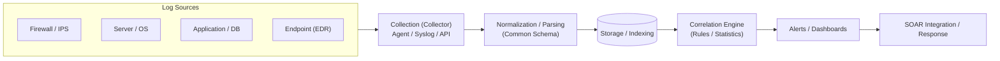
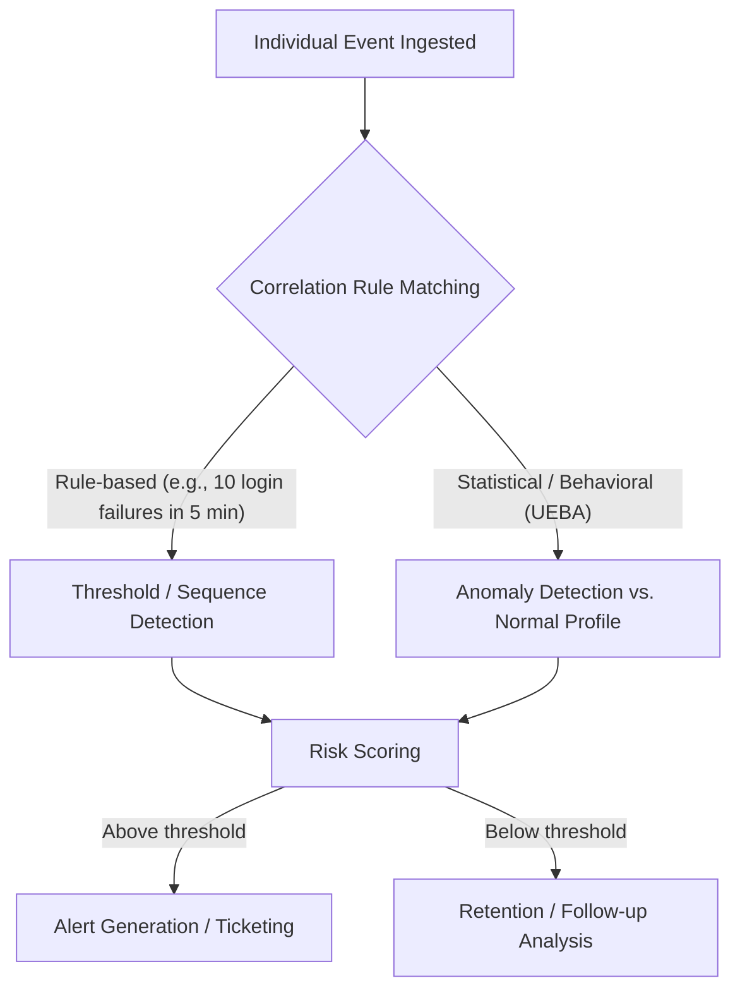

# SIEM (Security Information and Event Management)

## 1. Overview

### A. Definition and Background
> **SIEM** is an **integrated security monitoring platform** that **collects, normalizes, and correlates logs and events in real time** from security devices, servers, networks, and applications scattered across an organization in order to detect threats and provide the evidence needed for compliance reporting and incident investigation.

The fundamental background for SIEM's emergence was the problem that "**security data is exploding, yet there is no means of gathering it in one place and interpreting it meaningfully**." Firewalls, IPS, antivirus, servers, databases, and web servers each pour out logs in different formats. Looking at the logs of any single device, an event may appear to be a "normal login," but overlaying logs from multiple devices on a timeline reveals a single attack scenario: "successful login from an overseas IP → privilege escalation → bulk data transfer." The local view of individual devices cannot capture such **multi-stage, low-and-slow attacks**. SIEM gathers scattered logs into one place, normalizes them into a common format, and ties together causal and correlative relationships between events using rules and statistics to paint the "big picture." Initially, log management (SIM) and real-time event management (SEM) were separate products, but around 2005 the two functions were integrated, establishing today's SIEM concept.

### B. Necessity
As the explosive growth in log volume, the multi-stage and increasingly sophisticated nature of attacks, and the **log retention and audit obligations** required by ISMS-P, the Personal Information Protection Act, PCI-DSS, and others converged, SIEM — which integrates heterogeneous logs to perform detection, investigation, and reporting in one go — became the core infrastructure of the Security Operations Center (SOC). Its value is particularly great as a single evidentiary repository that allows retroactive tracing of "when, where, and what happened" when a breach occurs.

## 2. Architecture and Data Processing Pipeline

SIEM is most accurately understood as a single pipeline through which logs flow in and are converted into threat alerts. Below is the overall structure.

In the **Collection** stage, source logs are pulled in through various methods such as agents, Syslog, WMI, and REST APIs. Because protocols and formats differ by source, collecting reliably without loss is itself the first hurdle of design. In the **Normalization and Parsing** stage, logs of different formats are mapped to common fields such as user, IP, time, and action. If this normalization is poor, subsequent correlation becomes meaningless, so it is no exaggeration to say that 80% of SIEM quality is determined by parser quality. The **Storage and Indexing** stage must compress and index large volumes of logs to satisfy both fast search and long-term retention.

The heart of the system is the **Correlation** engine. Here, individual events are assembled into scenarios. Below is the detailed processing flow of correlation.

Correlation operates along two main axes. One is **rule-based**, matching human-defined sequences and thresholds such as "10 login failures followed by a success on the same account within 5 minutes." It is clear-cut but has the limitation of catching only known patterns. The other is **statistical/behavioral (UEBA, User and Entity Behavior Analytics)**, which learns the usual behavior profiles of users and assets to detect unknown anomalies such as "this account downloading 100 times its usual data at 3 a.m." Recent SIEMs combine the two and accumulate a risk score for each event, generating an alert only when the score exceeds a threshold, thereby reducing **false positives**.

## 3. Core Functions and Components

SIEM's functions go beyond a simple log viewer. Each function interlocks with the others to complete the "detection → investigation → evidence" cycle.

| Function | Description | Practical Significance |
|---|---|---|
| **Log collection / normalization** | Integrates heterogeneous logs into a common schema | Foundation of analysis; parser quality is key |
| **Real-time correlation** | Detects event relationships via rules and statistics | Captures multi-stage attack scenarios |
| **Anomalous behavior analysis (UEBA)** | Detects deviation from normal profiles | Addresses insider and unknown threats |
| **Alerts / dashboards** | Visualizes threats, assigns priority | Supports analyst decision-making |
| **Log retention / search** | Long-term storage, retroactive forensic search | Basis for compliance and incident investigation |
| **Compliance reporting** | Automates ISMS-P, PCI-DSS, etc. reports | Reduces audit response effort |
| **Threat Intelligence (TI) integration** | Matches logs against external IoCs | Immediately detects known malicious indicators |

**Compliance reporting** in particular is one of the practical drivers of SIEM adoption. For example, under Korea's Personal Information Protection Act, access records of personal information processing systems must be retained and reviewed for at least 1 year (2 years for 50,000 or more data subjects, etc.), and SIEM automates the collection, retention, periodic review, and report generation of these access records, greatly reducing the audit response burden. SIEM thus has a dual identity as both a "threat detection tool" and a "compliance evidence tool."

## 4. Comparison with Log Management and SOAR

Because SIEM is often confused with adjacent concepts, one should also understand why the differences arise.

| Category | Simple Log Management | SIEM | SOAR |
|---|---|---|---|
| **Focus** | Collection, storage, search | Collection + **correlation and detection** | **Response automation** after detection |
| **Analytical capability** | Search-centric | Real-time correlation and anomaly detection | Playbook-based actions |
| **Output** | Log archive | Threat alerts and reports | Automated response and cases |
| **Relationship** | Sub-function of SIEM | Center of detection | Consumes SIEM alerts as input |

Simple log management tools (e.g., log servers, basic ELK) stop at "collect and search," whereas SIEM is decisively different in that it layers **correlation and detection intelligence** on top. The relationship with SOAR, meanwhile, is complementary. When SIEM "**detects**" a threat and generates an alert, SOAR receives that alert and performs investigation and blocking through "**automated response**." In other words, SIEM is likened to the eyes (detection) and SOAR to the hands (response). Recently, the market is being reshaped toward **XDR (Extended Detection and Response)**, which integrates EDR and NDR with these two, and **cloud native SIEM (SaaS type)**, which removes the infrastructure burden.

### Application Case
A representative case is a financial company that adopted SIEM for detecting anomalous financial transactions: it bound a sequence of actions that were each normal on individual channels — "login from an unfamiliar device → account information lookup → raising the transfer limit → bulk transfer" — into a single correlation rule and succeeded in blocking it in real time. Conversely, as log sources grew to tens of thousands of events per second (EPS), license costs and storage surged, and a problem also emerged in which operations become impossible unless low-value logs are filtered and tiered. In short, SIEM's success or failure hinges on **collection policy design** — "what to collect and how much."

## 5. Advanced: Latest Trends and Overcoming Limitations

Traditional on-premises SIEM has run into three limitations, and the process of overcoming them constitutes the latest trends. First is the problem of **Alert Fatigue**. As rules multiply, false positives explode and analysts miss real threats. To mitigate this, **AI-SIEM** has emerged, combining machine-learning-based UEBA and risk scoring, and further generative AI, to automatically summarize and prioritize alerts and support investigation queries in natural language. Second is the problem of **cost and scalability**. As log volume explodes in EPS terms and storage and license costs become unmanageable, the industry is moving toward **data-lake and tiering architectures** that store raw data cheaply in object storage and query it when needed, and toward cloud native SIEM that eliminates infrastructure operational burden. Third is the problem of **detection scope**. As assets have scattered into cloud, containers, and SaaS, the view of on-premises-centric SIEM has narrowed, and it is evolving toward **XDR and SOAR integration** that covers cloud workload and API logs and extends to response. In sum, SIEM is evolving simultaneously along three axes: detection accuracy (AI), cost efficiency (data lake / SaaS), and response integration (XDR/SOAR).

## 6. Considerations and Implications

1. **Collection policy determines both cost and effectiveness.** Indiscriminately collecting all logs causes costs to explode and buries signals in noise, so a **value-based collection strategy** — selecting logs that actually contribute to threat detection and compliance and tiering or filtering low-value logs — is essential. This is a matter of tuning the "completeness vs. cost" trade-off to the organization's risk level.

2. **Detection rules (Use Cases) must be continuously tuned.** SIEM is not a product that ends with adoption but an object of "operations" whose rules must be continually refined. It delivers results only when supported by an operating process that maps rules to the MITRE ATT&CK framework to systematically check gaps in detection coverage and periodically lowers the false positive rate.

3. **Combination with human (SOC analyst) capability** is key. However sophisticated the correlation, final judgment and response rest with analysts. Because SIEM augments rather than replaces analysts, the virtuous "detection–analysis–response" cycle is complete only when it is paired with personnel skilled in threat hunting and forensics and with SOAR automation.

4. **Adoption should presuppose an integration roadmap with SOAR, XDR, and TI.** Leaving SIEM as an isolated island keeps post-detection response manual. Return on investment is maximized only when it is adopted and developed from an integrated architecture perspective: improving detection accuracy with threat intelligence, automating response with SOAR, and extending visibility to endpoints and the cloud with XDR.

5. **Security of personal data and the logs themselves** must also be considered. Because SIEM is where sensitive logs converge, it becomes both an attack target and a concentration of personal data. Access control, encryption, and integrity assurance for stored logs, as well as pseudonymization and masking of personal data within logs, must be designed together to prevent SIEM from becoming a new source of risk.

---

> **In one line**: SIEM is an integrated security monitoring platform that *collects, normalizes, and correlates* heterogeneous logs to detect multi-stage threats and provide compliance evidence; it is evolving in combination with SOAR (response), XDR, and AI, and its success depends on the combination of collection policy design, rule tuning, and analyst capability.
