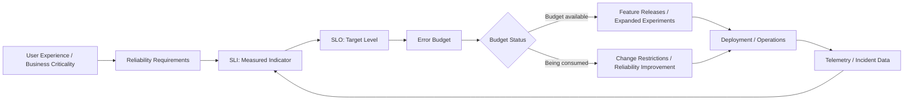
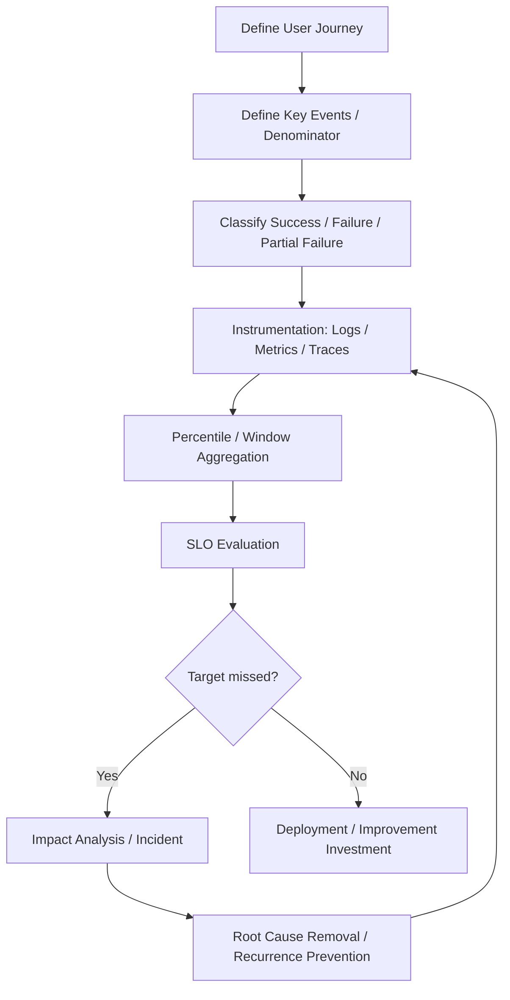

# SRE (Site Reliability Engineering) and Service Reliability Management

## 1. Overview

> SRE is a body of practice that treats the stable operation of software systems as an engineering problem and jointly manages reliability and the pace of change through service level objectives, automation, measurement, and learning from incidents.

A digital service is not a static artifact that is maintained after a single deployment, but a system that changes continuously and interacts with its external environment.
Users evaluate a service less by whether a feature exists and more by whether it responds when needed, preserves data, and delivers predictable quality.
Therefore, the view that the completion of feature development marks the end of a project is insufficient to explain operational quality.

Traditional operations organizations tend to control change to reduce outages, while development organizations tend to increase change to ship features quickly.
When this conflict of goals is resolved through individual effort or night-time firefighting, operator burnout and change avoidance accumulate.
SRE defines reliability not as an abstract slogan but as user-centric indicators and objectives, and manages the room for change available against those objectives as an error budget.

The core of SRE is not the unrealistic perfection of "there must be no failures."
As long as distributed systems and external dependencies exist, some level of failure will occur, so which failures to tolerate and which to block is decided on a risk basis.
Objectives are set differently according to service criticality and business loss, and decision rules are created so that reliability improvement takes precedence over feature releases when objectives are missed.

SRE is not a separate development methodology opposed to DevOps.
If DevOps is a cultural and organizational direction that lowers the barrier between development and operations and improves the delivery flow, SRE concretizes that direction into the operational engineering mechanisms of availability, latency, incident response, and automation.
A Professional Engineer should evaluate whether service level definitions, responsibility boundaries, data-driven decision-making, and learning loops are working, rather than focusing on tool adoption.

## 2. Principles of SRE and Overall Concept Diagram

SRE connects service users, product requirements, system design, operational data, and improvement activities into a single cyclical structure.
First, the experience that users value is expressed as a measurable SLI, and the level to be achieved is set as an SLO.
The gap between the SLO and actual performance is converted into an error budget, and the remaining budget becomes the basis for decisions between deployment speed and investment in stability.

An SLI (Service Level Indicator) is an actual measured value used to observe the service level.
Examples include the ratio of successful requests to all requests, the ratio of requests completed within a certain threshold time, and the ratio of valid messages among processed messages.
CPU utilization can be a useful operational signal, but because it does not directly represent the quality users experience, core SLIs must be distinguished from supporting infrastructure metrics.

An SLO (Service Level Objective) is the target an SLI must achieve over a specific period.
It converts expressions like "provide fast and stable service" into measurable forms such as "monthly valid request success rate of at least 99.9%" or "99% of read requests within 300ms."
Setting the target at 100% can treat even small network delays as failures and incur excessive cost, so the target reflects a balance between user expectations and cost.

An SLA (Service Level Agreement) is a contract or commitment between customer and provider, and unlike an SLO it may include compensation, service credits, and scope of liability.
Setting the internal operational objective (SLO) equal to the external contract (SLA) can eliminate the margin needed for internal improvement.
Conversely, if the SLA is far looser than the SLO, contract violations may be avoided while actual user trust declines, so the relationship between the two targets should be made explicit.

| Category | Question | Primary Users | Design Considerations |
|---|---|---|---|
| SLI | How is current quality measured? | Operations / development teams | Clarify the user journey and the measurement denominator |
| SLO | What level is targeted? | Service owners / teams | Fix the period, scope, exceptions, and aggregation method |
| SLA | What is promised to the customer? | Customers / business units | Reflect compensation and liability conditions in the contract |
| Error budget | How much failure is tolerable? | Product / development / operations | Pre-agree on action rules based on the remaining budget |

Reliability does not consist of availability alone.
Even with high availability, users will not trust a service if responses are excessively slow or data is wrong.
Typically, quality attributes such as availability, latency, throughput, correctness, durability, freshness, and security are combined to fit the business flow.
For example, freshness and relevance of results matter for a search service, while prevention of duplicate authorizations and consistency matter as much as availability for a payment service.

## 3. Service Level Objectives and Error Budgets

### 3.1 Aligning SLIs with User Journeys

When defining SLIs, one should define the task the user is trying to complete rather than first choosing values that are easy to measure inside the system.
A shopping mall user experiences not "is the web server alive?" but "did I succeed from cart to checkout?"
Therefore, when measuring request success rate, one must decide not only on status codes but also on how business errors and partial failures are handled.

The definition of the measurement denominator determines the meaning of the metric.
If bots, health checks, and retried requests are counted in duplicate when computing the ratio of successful requests to all requests, the value will differ from actual user quality.
Conversely, excluding failed requests from the denominator makes the figure look good but hides the user impact.
Filter conditions, sampling, retries, timeouts, and regional traffic should be documented so that the metric does not change arbitrarily during operation.

An availability SLI can be expressed as the number of successful valid events divided by the total number of valid events.
For a latency SLI, it is more appropriate to use percentiles or the ratio within a threshold time rather than the average, to expose long-tail latency.
For a data pipeline, the ratio of data arriving by a set time should be viewed together with record accuracy and duplication rate.
Attempting to represent all quality with a single number can mask the nature of a failure.

### 3.2 Calculating and Operating Error Budgets

The error budget is the amount of failure the SLO allows.
If the monthly SLO is 99.9%, the theoretically permitted error ratio is 0.1%, and the number of permitted errors in the period can be calculated by multiplying the total number of valid requests by this ratio.
For example, with 1,000,000 valid requests per month, the permitted errors are 1,000; this is not a quota that encourages errors but an upper limit for managing risk.

A large remaining error budget does not automatically guarantee quality.
The budget may appear to remain because traffic dropped or instrumentation was missing, so the observation scope and data quality of the SLI should be checked separately.
Conversely, if a temporary large-scale outage exhausts the budget, the cause is analyzed and recovered, and then risky changes are temporarily slowed according to the policy the team agreed on.

The error budget policy must be linked to actions in advance.
For instance, when the remaining budget is sufficient, normal feature deployments proceed; in the warning zone, the size of changes and approval level are adjusted; and in the exhausted zone, changes other than urgent security patches are restricted.
If the policy is vague, product and operations teams must renegotiate at every incident, weakening the decision-making function of the budget.

| Budget Status | Product / Development Action | Operations Action | Management Point |
|---|---|---|---|
| Sufficient | Allow planned features and experiments | Standard monitoring | Record change risk |
| Warning | Staged deployment / additional verification | Analyze candidate causes and trends | Lower the new error rate |
| Near exhaustion | Defer high-risk changes | Check capacity and dependencies | Prioritize recurring incidents |
| Exhausted | Prioritize reliability work | Incident recovery / stabilization | Record exception approvals and exit criteria |

The error budget must not become a scorecard for punishing teams.
Since external dependency failures or uncontrollable shared-platform outages can distort the performance of all teams, responsibility boundaries and exclusion conditions should be set transparently.
However, dressing up the numbers by widening exclusion conditions does not remove real risk, so exclusion reasons and user impact must be recorded separately.

## 4. Operational Automation and Incident Management

### 4.1 Toil and Automation

Toil is operational work that is repetitive, manual, automatable, scales with service growth, and has low long-term value.
Typical examples include copying the same commands at every incident, manually adjusting capacity, or checking alerts and relaying them to people.
Not every repetitive task is toil, and it is risky to simply classify tasks that require judgment and learning, or one-off design work, as automation targets.

The purpose of reducing toil is not to eliminate people but to return people's time to design, prevention, and improvement.
Automation does not end with translating a manual procedure directly into code; it must include permissions, validation, rollback, audit logs, and stop conditions on failure.
Because failed automation can cause even larger outages, gradual application and safeguards should be designed together.

For example, a policy can be put in place to automatically revert to the previous version if the error rate exceeds a threshold after deployment.
However, if increased latency appears only in a specific region, a full rollback could actually affect normal users.
Therefore, it is desirable to evolve automation into a policy engine that reflects observation scope, impact, staged traffic, and human approval conditions.

### 4.2 Incident Response Flow

An incident is an event that threatens or has already violated the normal service level.
The goal from detection to recovery is set in the order of reducing user impact, safely normalizing the service, and then lowering the likelihood of recurrence, rather than achieving perfect root cause identification.
Even while responders search for the cause, mitigation measures that reduce damage — status pages, bypass routes, and feature restrictions — are carried out in parallel.

A typical response operates through the flow of detection, triage, declaration, role assignment, mitigation, recovery, closure, and post-incident review.
The incident commander is not the person who performs all technical work directly but the role that coordinates priorities and communication.
The communications lead conveys confirmed facts and the time of the next update to internal and external stakeholders, reducing speculative announcements.

Severity is defined in advance based on number of users, business loss, duration, regulatory and security impact, and recoverability.
For example, duplicate payment authorizations may be classified as high severity even if few users are affected, because the financial and legal impact is large.
Conversely, a temporary delay in an internal admin screen may be managed at a lower level depending on user impact and recovery path.

A blameless postmortem written after an incident ends analyzes not who made a mistake but under what conditions the failure was possible.
It treats change approval, test coverage, the signal-to-noise ratio of alerts, currency of documentation, permission structures, and even organizational pressure as system causes.
Follow-up actions must have an owner, a deadline, expected effects, and verification metrics, and are not marked complete merely by filing documents.

| Stage | Key Question | Output | Common Failure Point |
|---|---|---|---|
| Detection | What deviated from normal? | Alerts / user reports | Thresholds unrelated to user impact |
| Triage / declaration | How severe is it and who commands? | Severity / commander | Overlapping roles and delayed decisions |
| Mitigation | What should be blocked or bypassed now? | Rollback / feature restriction | Impact expands while only analyzing causes |
| Recovery | How is the normal level confirmed? | Verification results / closure decision | Closing before metrics recover |
| Learning | What conditions should change to prevent recurrence? | Postmortem / improvement backlog | Ending with personal blame or a perfunctory meeting |

## 5. Comparison of SRE and Related Approaches

SRE and DevOps both emphasize collaboration between development and operations, but their focus differs.
DevOps is strong at optimizing the flow in which ideas are delivered as code and fed back from users.
SRE quantifies reliability risk in that flow and provides a quality safety boundary so that deployment speed is not increased without limit.
Therefore, the two approaches should be understood not as competitors but as a combination of DevOps's delivery culture and SRE's operational control.

ITIL emphasizes standardized processes, controls, roles, and records for service management.
SRE emphasizes automation, measurement, experimentation, and engineering improvement, and is advantageous for shortening feedback in fast-changing environments.
In regulated industries, ITIL's approval and audit requirements cannot be ignored, but relying solely on manual tickets for approvals slows response, so evidence and automated controls can be linked in the SRE way.

Traditional monitoring started from checking the state of servers and processes, whereas SRE centers on the outcomes of user journeys and service levels.
Because orders can fail due to errors in an external payment API even when infrastructure metrics are normal, service metrics, dependency metrics, and resource metrics are observed together hierarchically.
The key to comparison is not which tool is superior but where the signals needed for decision-making are produced.

| Perspective | Traditional Operations | DevOps | SRE |
|---|---|---|---|
| Central goal | Stable change control | Improve delivery flow and collaboration | Balance reliability and change velocity |
| Unit of measurement | Server / process state | Deployment / lead time flow | User-centric SLIs / SLOs |
| View of failures | Owner recovery and cause reports | Fast feedback and joint response | Impact mitigation / learning / recurrence prevention |
| Change policy | Pre-approval centric | Automated delivery centric | Risk adjustment based on error budget |
| Automation targets | Repetitive commands / checks | Build / test / deployment | Operational judgment / recovery / guardrails |

## 6. Practical Application Cases

### 6.1 Online Order Service Case

For an online order service, the team set the monthly order completion rate as the core SLI, dividing the number of successful orders by the total number of valid payment attempts.
Rather than simply counting HTTP 200 responses for web pages, it defined success as cases where both payment authorization and order storage were completed.
With a monthly SLO of 99.95%, the permitted failure ratio is 0.05%, allowing a budget of 1,000 based on 2,000,000 valid attempts.

In the first month, payment gateway timeouts accounted for most failures.
Rather than blindly increasing retry counts, the team prevented duplicate authorizations with idempotency keys and then applied exponential backoff and user guidance.
It also detected inconsistencies between payment authorization and order storage via compensation jobs, observing as a separate SLI the cases where users paid but the order did not appear.

When a single deployment consumed 60% of the budget, the product team halted the full rollout of a new discount feature and switched to a canary deployment at 5% traffic.
The development team enhanced correlation IDs in logs and latency by payment stage, and the operations team reviewed alternative payment paths for external dependency failures.
In this case, the error budget was not an abstract rule blocking feature releases but the basis for adjusting the release approach to the scale of risk.

### 6.2 Data Platform Case

Assume a data platform is a service in which sales data must arrive in the analytics tables by 7 a.m. every day.
Measuring availability alone would only confirm that the pipeline process is running.
Instead, on-time arrival rate, record omission rate, duplication rate, and schema validation pass rate are set as SLIs, with SLOs linked to business deadlines.

If a schema change alters the meaning of some columns, the pipeline may finish in a success state while the metrics are wrong.
Data contracts and quality validation are placed in the deployment stage, and failed datasets are quarantined and their status communicated to consumers.
This narrows the gap between the technical event "pipeline succeeded" and the user value "analyzable data delivered."

## 7. Advanced: Reliability Design in Large-Scale Distributed Environments

As microservices multiply, overall service reliability can no longer be calculated simply by multiplying the SLOs of individual services.
In serial call paths, failures of multiple components combine, and in parallel calls, the meaning of partial success and fallback responses must be defined.
Therefore, the critical paths of user journeys are identified, and failure propagation is limited through inter-service contracts, timeouts, retries, circuit breakers, and bulkheads.

Retries absorb transient errors, but when every layer retries simultaneously, a retry storm can occur in which traffic surges.
Retry budgets, maximum counts, exponential backoff, jitter, and idempotency are designed together, and requests that have already exceeded their time limit are not retried further.
Fallback responses that hide failures are used only within business-acceptable bounds, and quality degradation is clearly indicated to users and operators.

A multi-region architecture can isolate failures and reduce recovery time, but it increases data replication lag, consistency model complexity, cost, and operational complexity.
Even if read traffic is switched to another region, data that requires strong consistency, such as payments and inventory, needs a separate leader or business reconciliation procedures.
A Professional Engineer should not assert that "doubling the regions means high availability" but should verify recovery objectives and tolerable data loss per failure scenario.

Reliability is also managed within the deployment pipeline.
Because static analysis and unit tests alone cannot fully uncover operational risk, contract testing, load testing, fault injection, canary deployment, and automatic rollback are combined according to risk.
Staged deployment does not prevent every failure, but it fits well with error budget policy in that it limits the blast radius and provides fast feedback.

Observability data must link logs, metrics, and traces through correlation IDs.
Metrics are good for detecting trends and thresholds, logs provide the context of specific events, and traces show bottlenecks and failure propagation along distributed call paths.
However, retaining all data without limit increases cost and personal data risk, so sampling, retention periods, masking, and access rights are designed together with data governance.

SRE maturity is evaluated by learning speed and preventive capability rather than the number of tools.
Even if it starts with manual on-call and basic alerts, it can gradually evolve through automation of recurring incidents, a service catalog, standard dashboards, game days, and capacity forecasting.
Rather than achieving a high grade in a maturity assessment, what matters is accurately exposing current risks and carrying out the next improvement.

## 8. Considerations and Implications

### 8.1 Realism of Objectives and Business Alignment

An SLO is not a number arbitrarily set by the technical team; it must reflect user expectations and business loss.
Flows with high failure costs such as payments, healthcare, and public safety require high reliability and strong recovery controls, while internal search or experimental features may have relatively different targets.
Demanding the same 99.99% for all services causes costs to surge and reduces the resources available to invest in core services.

### 8.2 Manipulability of Metrics and Data Quality

Achieving a metric and securing actual reliability can be different things.
Shrinking the denominator or excessively excluding exceptions makes the dashboard look good, but user failures do not disappear.
Measurement definitions should be managed together in code and documentation, and metric changes should be accompanied by impact analysis and a validation period.

### 8.3 Sustainability of Organization, Responsibility, and On-Call

On-call should not be emergency duty dependent on particular heroes but a system in which the team jointly owns service design and operational outcomes.
If working hours, paging by severity, backup personnel, rest and compensation, and scope of authority are not clarified, the quality of incident response is sustained by personal sacrifice.
Product, development, security, and data teams must jointly decide the error budget policy and the priority of follow-up actions.

### 8.4 Safety and Control of Automation

Automatic recovery is fast but can propagate wrong signals.
Deployment halts, rollbacks, and traffic blocking should have preconditions, a maximum impact scope, a kill switch, audit logs, and a manual handover procedure.
In particular, security incidents and data corruption require response paths different from simple availability failures, so exception scenarios should be reflected in automation policies.

### 8.5 Trade-offs Among Cost, Performance, and Security

Redundant configurations and high-frequency observation can increase reliability but raise infrastructure, network, and storage costs.
Strengthening encryption and access control can increase latency and operational complexity, and more detailed logs can widen the personal data exposure surface.
The risk reduction per unit cost should be compared according to service criticality and threat model, and the rationale for reliability investment should be explained in business language.

### 8.6 Integration Strategy from a PE Perspective

SRE becomes more effective when combined with cloud native, DevSecOps, observability, chaos engineering, and data governance.
However, rather than adopting related tools all at once, priorities should be set based on user journeys and the largest failure costs.
At the architecture review stage, SLOs should be specified as non-functional requirements, and measurement and response responsibilities should be assigned to each stage of design, development, verification, and operation.

The results of SRE adoption are not judged by incident count alone.
Time to detect, time to mitigate, time to recover, change failure rate, recurring incident ratio, toil hours, and error budget burn trends are viewed together and linked to user impact.
If the numbers improve but the team's night-time pages and manual work increase, the reliability is not sustainable, so operator experience should also be included among quality metrics.

## References

- Google SRE Book: https://sre.google/sre-book/table-of-contents/
- Google SRE Workbook: https://sre.google/workbook/table-of-contents/

---

> **In one line**: SRE is an engineering discipline that links SLIs, SLOs, and error budgets with automation and incident learning to operate service reliability and rapid change at the same time.
