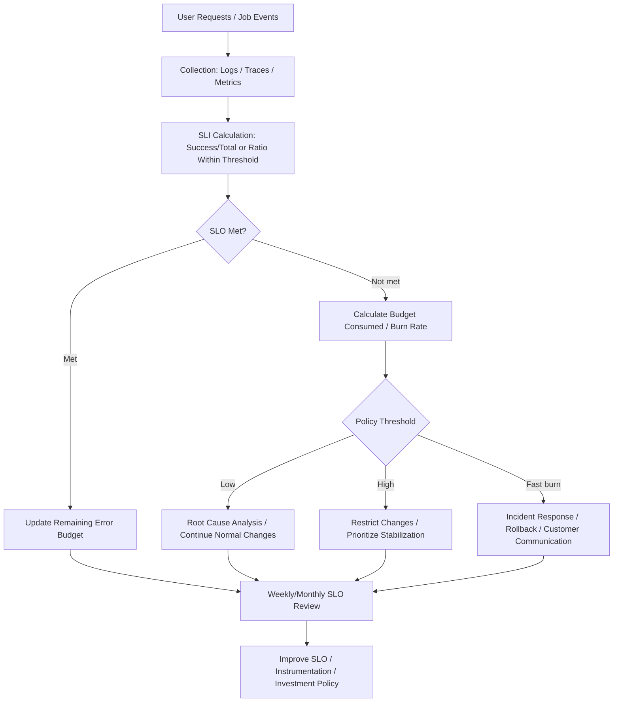
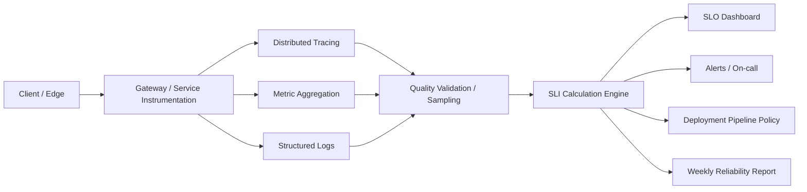

# Service Reliability Management Based on SLO, SLI, and Error Budget

## 1. Overview

### A. Definition

> An **SLI (Service Level Indicator)** is a quantitative metric measured to observe a service's reliability, and an **SLO (Service Level Objective)** is the target level that the metric must satisfy over a target period.
>
> An **SLA (Service Level Agreement)** is a contract that specifies the service level agreed between the service provider and the user, along with the liability and compensation conditions in case of shortfall, and an **Error Budget** is an operational decision criterion that, rather than treating the SLO as 100%, converts it into the tolerable margin of failure and latency.

SLOs, SLIs, and error budgets are not merely a bundle of metrics on a monitoring dashboard.
The essence of this framework lies in turning the tension between development speed and service stability into a measurable policy.
Declaring that a service must always work perfectly means treating every realistic outage and network delay as failure.
Conversely, operating on the premise of simply tolerating outages leaves customer impact and recovery responsibility unclear.
The SLO expresses the attainable quality as a number, and the error budget presents the range of change that can be absorbed within that quality target.

High availability alone does not make a good service.
Perceived reliability varies depending on whether the result the user requested is correct, whether the response is fast enough, whether the data is up to date, and whether the job completes within the set time.
Therefore, SLIs suited to the service's purpose and user journeys must be chosen, and what is and is not measured must be clearly defined.
For example, success rate and latency are important for a login service, whereas for a batch analytics service, the throughput of jobs completing within a set time and data quality may matter more.

### B. Background and Need

First, the operations team's judgment that "it is stable" frequently collides with the development team's judgment that "it can be deployed."
Blocking deployments based only on the feeling that there were no outages slows even small improvements, while optimizing only deployment counts lets customer impact accumulate.
Because the error budget calculates the amount of risk available for change work based on recent SLO attainment, it moves the basis of debate from experience or rank to data.

Second, average-centric monitoring can mask severe failures for some users.
Even if average response time is fine, timeouts may be concentrated in a particular region, tenant, or API.
Designing SLOs around event-level success and percentile latency rather than overall averages represents the failures users actually experience more closely.

Third, the more distributed a service becomes, the more blurred the boundaries of cause and responsibility become.
When the frontend, API gateway, authentication, payment, and database are called in a chain, a delay in one component manifests as failure of the entire user journey.
Only by managing each service's SLO independently while linking it to the objectives of the upstream user journey can the problem of local optimization undermining overall reliability be reduced.

Fourth, the error budget is not a figure that justifies outages but a budget for managing risk.
Risky changes must not be automatically approved simply because budget remains.
The budget must be spent while also considering the change's risk, recoverability, potential for data corruption, regulatory impact, and customer importance.

## 2. Concepts and Relationships of SLI, SLO, and SLA

### A. Construction Principles of SLIs

For an SLI, it is more important to first define "which user events count as success" than the measured value itself.
An availability SLI with request count as the denominator and successful requests as the numerator is easy to understand, but a policy is needed on whether a cache hit and an origin data lookup count as the same success.
Also, calculating success rate from health checks alone can miss authentication, authorization, and data processing failures in actual user requests.

Time-based services can use the ratio of time during which the service was provided normally over the whole observation window.
Request-based services can use the ratio of successful requests among all valid requests.
A latency SLI is more directly connected to user experience when defined as "the ratio of requests within a target threshold" rather than the average of all requests.
In doing so, the threshold, measurement point, timeout, and rules for counting retried requests in duplicate must be recorded together.

Data freshness or accuracy can also be SLIs depending on the service's purpose.
For example, measuring the ratio of responses whose last update time is within a certain window in an inventory lookup service can monitor quality that is not revealed by the mere fact that the server responded.
For a recommendation service, not only the ratio of results returned but also the banned-word filter pass rate or missing mandatory attribute rate can serve as quality metrics.
However, if quality judgment is subjective, the measurement method and validation sample must be defined separately.

### B. How to Set SLOs

Setting an SLO is not a matter of fixing a single number such as "99.9% availability."
It becomes an operable target only when the target service, user set, measurement period, success condition, data source, exception conditions, and actions on shortfall are defined as one set.
For the measurement period, a rolling window or a calendar period is chosen according to purpose, and when the period changes, the interpretation of trends and error budget burn rate also changes.

If the availability SLO is 99.9%, the permitted failure rate is 0.1%.
With 1,000,000 valid requests per day, simple calculation yields 1,000 permitted failed requests.
However, not all failures have the same value and damage, so combining payment authorization failures and failures of a non-core recommendation widget into one SLO can distort decision-making.
This is why SLOs are designed separately for critical user journeys and internal administrative functions.

Higher targets are not necessarily better; the target should be at a level where cost and expected quality are balanced.
Raising the target to 99.99% cuts the permitted failure rate to one-tenth of that at 99.9%, which can greatly change the costs of redundancy, capacity, testing, and on-call response.
Sometimes investments that eliminate the causes where failures concentrate create more value than fine-grained target increases that customers cannot actually perceive.
Therefore, the initial SLO is set by looking at both the measurable current level and customer expectations, and adjusted gradually through operational data.

### C. Difference from SLA

Because an SLA is a contract or formal commitment with external customers, it may carry legal and commercial liability.
An SLO, on the other hand, can be used as an internal operational target and may be stricter than the SLA or more granular per service.
If an SLA promises 99.9% availability, the internal SLO can be set at 99.95% to leave room for detection and improvement before a contract violation.
Setting the SLO equal to the SLA pins internal alerts and customer compensation criteria to the same limit line, making early response difficult.

| Category | SLI | SLO | SLA |
|---|---|---|---|
| Nature | Measured metric | Target level | External agreement / contract |
| Question | What is measured and how? | What level will be maintained? | What is owed if it is not met? |
| Primary users | Development / operations / analytics teams | Service owners / operations teams | Customers / sales / legal / operations teams |
| Example | Ratio of responses within 300ms | 99.9% or higher monthly | Service credits on shortfall |
| How it changes | Review of instrumentation / definition changes | Adjusted via policy / review | Requires contract amendment procedure |

Confusing the three terms leads to a state where the dashboard has many metrics but no policy to decide on.
It is useful to distinguish that the SLI is the language of observation, the SLO is the standard of quality, and the SLA is the language of responsibility among stakeholders.
When documenting this relationship, a Professional Engineer should not merely list numbers but link them to business goals and operational actions.

## 3. Calculating and Operating the Error Budget

### A. Calculation Formula

The error budget is defined as the amount of failure permitted at the target level.
If the availability SLO is 99.9%, the error budget ratio is calculated as follows.

\[
Error\ budget\ ratio = 1 - SLO
\]

For request-based measurement, it can be expressed as follows.

\[
Permitted\ failures = Total\ valid\ requests \times (1 - Target\ success\ rate)
\]

For time-based measurement, the permitted downtime is calculated by multiplying the observation period by the error budget ratio.
Treating 30 days as 43,200 minutes and applying a 99.9% SLO, the theoretically permitted downtime is 43.2 minutes.
This figure does not mean an outage may be left unattended for up to 43.2 minutes; it is a criterion for managing the total service impact including planned maintenance and unplanned outages.
Because policies such as excluding maintenance, excluding scheduled tests, and separating by region vary by measurement method, the scope must be fixed before calculation.

The error budget burn rate enables faster response than the remaining budget.
If 10% of the budget was consumed over a month, it may look normal, but if 10% was consumed within an hour, a major outage may be in progress.
Therefore, cumulative burn rate and short-term burn rate are observed together, and when short-term burn exceeds a threshold, paging alerts or change freezes can be triggered.

### B. Flow of Budget Consumption

First, user events are collected and the SLI is calculated from a trustworthy source.
Next, the error budget is deducted by comparison with the SLO, and operational policies are applied according to the remaining budget and burn rate.
In this flow, if the dashboard updates late or the denominator is missing, the budget may appear to remain, so instrumentation quality is also subject to management.

For budget thresholds, staged actions are more suitable than a single number.
For instance, root cause analysis begins when 50% of the budget remains, an additional approval step is added for high-risk changes at 25%, and stabilization work takes priority as it approaches 0%.
However, if thresholds are designed to automatically block all deployments, even urgent security patches may be delayed, so an exception procedure based on change type and urgency is needed.

### C. Budget-Based Decision-Making

When the error budget is sufficient, a certain level of risk can be allowed for innovation work such as feature deployments, performance experiments, and architecture changes.
Here, allowing risk does not mean allowing random outages, but choosing changes whose impact scope is limited and which can be quickly reverted.
Canary deployments, feature flags, automatic rollback, and pre-validation environments help gain more learning from the same error budget.

When the error budget is insufficient, rather than unconditionally stopping feature development, the priority of reliability work is raised.
For example, if the cause of timeouts is database connection pool exhaustion, rather than just adding capacity, query patterns, retry storms, connection reclamation, and load balancing are analyzed together.
Temporarily lowering the SLO target without resolving the root cause may improve the metric but does not improve the customer experience.

## 4. Measurement Design and Technical Implementation

### A. Defining Events and Denominators

A good SLI has a short formula, is reproducible for the same input, and allows the service owner to explain the result.
The definition of a "normal request" may include not only the HTTP status code but also business success and completeness of required data.
For example, if HTTP 200 is returned but the payment authorization result is `pending`, it cannot be counted as success for the payment completion SLI.

Whether to include internal retries and duplicate requests in the denominator must be decided.
If a single user click is sent three times due to network retries and all three requests are counted in the denominator, a gap may arise between the user's perception and the metric.
Conversely, counting all actual requests received by the server shows how exposed the system was to retry storms.
If both perspectives are needed, the user-event SLI and the infrastructure-request SLI are separated.

Exclusion conditions must be managed transparently.
Maintenance windows, test traffic, and blocked malicious requests can be excluded, but excluding unfavorable data after an outage turns the SLO into a means of metric laundering.
It is desirable to version-control the exclusion list in code and documentation and to require review by the service owner and the observability owner when it changes.

### B. Latency and Percentiles

Average latency can hide a small number of very slow requests.
p50 represents the typical user experience, while p95 and p99 are used as supplementary metrics showing tail latency and the poor experience of some users.
However, rather than using an observed value such as "p99 under X ms" directly as an SLO, setting the target as the ratio of requests within a threshold among all valid requests can be clearer for period-over-period comparison.

Values differ depending on the measurement point.
Latency measured at the client includes DNS, transfer, and rendering and is close to user experience, but it is heavily affected by the network environment.
Latency measured inside the server is advantageous for root cause analysis but cannot explain the total time the client experiences.
Therefore, user journey SLIs and per-component diagnostic metrics are operated together, but the two are not mixed into the same SLO.

### C. Data Pipeline

The collection layer must manage cost and personal data without losing raw events.
Logging the body of every request may help debugging but increases personal data and cost risks.
Instead, identifiers are de-identified, only necessary fields are structured, and raw data retention periods and access rights are separated.

Aggregation delay and sampling also affect SLO interpretation.
Traces may be sampled due to cost, but a policy that preferentially retains error requests and slow requests is needed.
For metrics, using high-cardinality labels without limit worsens storage cost and query performance, so dimensions needed for decision-making, such as service, region, version, and tenant, are selected first.

## 5. Operating Process and Organizational Application

### A. SLO Establishment Procedure

1. Identify key user journeys and business-critical outcomes.
2. Define success events and failure events per journey in prose.
3. Select trustworthy measurement sources among logs, traces, and metrics.
4. Document the SLI's denominator, numerator, threshold, exclusion conditions, and measurement period.
5. Set a draft SLO reflecting the current level, customer expectations, cost, and regulatory requirements.
6. Validate whether the target is realistic by applying it to past outages and peak traffic.
7. Agree on operational actions and exception procedures for each stage of budget consumption.
8. After operating for a period, review false positives, omissions, and business mismatches, and improve.

Initially, it is better to start with key journeys rather than applying the same SLO to every feature.
Defining flows directly tied to customers and revenue first, such as login, payment, and order status, clarifies investment priorities.
Then, expanding to ancillary features and internal systems, common templates needed for metric operations are created.

The SLO document should list not only the owning team but also dependent services and decision authority.
If an outage in the database team affects the order service SLO, the roles of the causing team and the customer communication team must be set in advance.
The purpose of dividing responsibility is not to shift blame but to shorten the recovery path during an outage.

### B. Linkage with Deployment and Change Management

A CI/CD pipeline can use the error budget for deployment approval.
If recent SLO attainment and short-term burn rate are healthy, small-scale canary deployments can be allowed; if burn is fast, the deployment scope can be automatically reduced or approvers added.
However, the pipeline is a means of executing policy, not a substitute for SLO definitions.
Data freshness and calculation failures must be monitored separately so that automatic blocking or automatic approval does not occur due to instrumentation errors.

High-risk changes are accompanied by safeguards beyond the error budget.
Data schema changes can be hard to roll back, so a staged approach of compatible expansion followed by switchover is needed.
Authentication and payment changes may not be sufficiently covered by feature flags alone, so prior approval, limited user groups, transaction halt procedures, and audit logs are added.

### C. Incident Response and Learning

When an outage occurs, customer impact and recovery take priority first, and root cause identification proceeds in parallel with recovery.
SLOs and error budgets become a common language for quickly explaining the severity of an outage.
However, a low error budget figure does not always mean small customer impact, so the number of affected users, transaction amounts, and data corruption are also considered.

Postmortems analyze system conditions rather than individual mistakes.
They ask whether alerts were late, whether a rollback path existed, whether changes were in sufficiently small units, whether testing reflected real traffic characteristics, and whether the state of dependent services could be known.
Recurrence prevention actions are assigned owners and completion dates, and their effect is verified in the trend of the same SLO.

## 6. Comparison and Cases

### A. Traditional KPIs vs. SLOs

Traditional KPIs are strong at showing business productivity such as revenue, throughput, and deployment counts.
However, errors and latency can increase alongside throughput, and looking only at KPIs can reveal quality degradation late.
The SLO sets a quality floor centered on the service outcomes users expect and, used together with KPIs, balances speed and stability.

| Comparison Axis | Traditional Operational KPIs | SLO / Error Budget Framework |
|---|---|---|
| Focus | Output / activity volume | User-centric reliability |
| Interpretation of failure | Outage count / averages | Budget consumption relative to target |
| Dev–ops relationship | Goal conflicts depend on negotiation | Data-driven change policy |
| Improvement direction | More and faster | Learning while controlling risk |
| Limitations | Diffuse expression of customer impact | Metric design / instrumentation cost |

The two frameworks are complementary rather than substitutes.
For example, deployment count indicates innovation speed, while the SLO indicates the quality impact deployments had on customers.
If deployment counts are high and the SLO is maintained, the effect of automation and small changes can be confirmed.
Conversely, if deployment counts increase but the error budget decreases rapidly, it may be the result of optimizing only the speed metric.

### B. E-commerce Order API Case

Suppose an e-commerce order API recorded 9,995,000 successful requests out of 10,000,000 valid requests in a month.
The success rate is 99.95%, and if the target SLO is 99.9%, the request-based error budget for this period is 10,000, so 5,000 has been used and 5,000 remains.
Having budget remaining does not mean approving every change; one must check whether the next deployment is coupled with inventory deduction.

If inventory deduction failures appear later than order creation failures, a simple success rate SLI can miss the problem.
Order acceptance success and inventory confirmation success must be separated into distinct user journeys, and compensating transactions and the processing time of unconfirmed orders must be additionally measured.
This narrows the semantic gap between "API response succeeded" and "the customer's order was actually completed."

If 40% of the error budget is consumed within one hour, it must not be judged normal just by looking at the monthly remainder.
Consumption is broken down by deployment version, region, and dependent database, and the problematic version is halted in canary or rolled back.
At the same time, customers are informed about order retries or possible duplicate payments, and after recovery, idempotency keys and inventory consistency validation are improved.

### C. Batch Analytics Service Case

For a service that runs a demand forecasting batch every hour, what matters is whether results are ready by a set time rather than the immediate response rate of every request.
For example, the SLO can be defined as "99% of jobs have forecast results ready with recent data 30 minutes before business opens."
In this case, job failure, data input delay, model execution delay, and result loading failure must be distinguished, with metrics per cause.

Because batch jobs can be re-run, calculating the error budget solely by the number of failed requests does not reflect the actual cost.
The computing cost of re-runs, decision delays, and time spent on manual corrections by people are managed as separate operational metrics.
The SLO expresses the time commitment of customer outcomes, while cost metrics show the resources spent to keep that commitment.

## 7. Advanced: Hierarchical SLOs in Multi-Service Environments

### A. User Journey and Component Objectives

In a microservice environment, the overall SLO must not be asserted by simply multiplying each service's SLO.
This is because actual call graphs contain parallel calls, optional features, cache hits, retries, and alternative paths.
It is safer to analyze the call structure, directly measure the success conditions of user journeys, and then use downstream service SLOs as reference values for budget allocation.

The key journey SLO represents the outcome of customer value.
Downstream service SLOs represent the technical quality the team can control.
If the upstream target is missed while all downstream services meet their targets, there may be instrumentation gaps or interaction problems; if only some downstream services miss, the improvement priority of those dependencies can be set.

### B. Budget Allocation and Dependency Management

If the upstream order journey has a 0.1% failure budget, the same budget cannot be assigned separately to each of authentication, product, inventory, and payment.
The contributed risk differs depending on whether calls are parallel or sequential, whether a fallback exists on failure, and whether the step is a core customer-visible step.
Budget allocation starts with mathematical calculation but is finalized through policy negotiation reflecting failure propagation paths and recoverability.

Dependency contracts must include not only success conditions but also timeouts and retries.
If an upstream service retries while waiting on downstream latency, a small delay can be amplified into a full outage.
Dividing the timeout budget by segment, limiting retry counts and backoff, and applying circuit breakers and isolation pools can mitigate sudden error budget depletion.

### C. Reliability Investment Portfolio

Error budget data becomes the basis for evaluating which investments improve customer quality.
Introducing caching, improving database indexes, strengthening observability, automatic deployment rollback, and disaster recovery drills have different costs and effects.
Judging only by short-term SLO improvement can miss hidden operational debt and long-term maintenance costs, so investment effects are verified together through trends in burn rate, recovery time, change failure rate, and manual workload.

## 8. Considerations and Implications

### A. Consistency of Metric Design

First, an SLI should reflect outcomes users judge as success, not values that are easy for the system to measure.
If business success cannot be expressed by HTTP status codes alone, domain events and outcome states are included in instrumentation.
Definitions and exceptions are managed at code-review level so that specific traffic is not arbitrarily excluded from the denominator.

Second, if metric definitions differ by service, organization-wide comparison becomes difficult.
Common terminology and calculation templates are created, but the same threshold is not forced on all services.
What should be standardized is the definition method and verification procedure, while target levels are differentiated according to user expectations and business criticality.

### B. Eventual Consistency and User Communication

Third, in distributed systems, data may be briefly delayed even when the SLO is met.
Providing users with an in-progress status, last update time, and how to retry can keep them from experiencing eventual consistency purely as a quality problem.
Operators should check the accuracy of status notices along with technical success rates.

Fourth, outage notices should be written around impact, scope, and response methods rather than technical jargon.
Error budget consumption is useful for internal decision-making, but for customers, explaining which features are unavailable until when and what data protection measures are in place comes first.

### C. Automation and Exception Control

Fifth, budget-linked automation enables fast response, but faulty instrumentation can make the entire organization malfunction.
Meta-monitoring is put in place to distinguish SLO calculation failures, data delays, and observability system outages from service outages.
Changes that must be performed regardless of budget, such as urgent security patches or legally mandated actions, have separate approval and post-review procedures.

Sixth, automatic rollback is not suitable for every error.
Work that has already produced external effects, such as data migrations and external contract changes, requires compensating actions and compatibility maintenance rather than version reverts.
Recovery strategies by change type are turned into runbooks and regularly rehearsed.

### D. Personal Data, Audit, and Cost

Seventh, logs and trace data collected to calculate SLIs can also be subject to personal data protection.
Data minimization, purpose limitation, retention periods, access control, and masking are applied, and raw data unnecessary for operational analysis is not stored.
Where audit trails are required, raw data and derived analytical data are separated, with differentiated access rights and retention policies.

Eighth, the level of instrumentation is adjusted so that observability costs do not exceed the value of the service.
High-cardinality labels and long-term raw retention can inflate costs, so core SLO calculation data and detailed investigation data are divided into retention tiers.
Representative sampling and error/latency-first retention policies are validated so that cost reduction does not impair error analysis capability.

## 9. Summary in One Line

---

> **In one line**: The core of data-driven service operations is to measure user-centric reliability with SLIs, set targets with SLOs, and then adjust deployment, stabilization, and investment according to the burn rate of the error budget.
