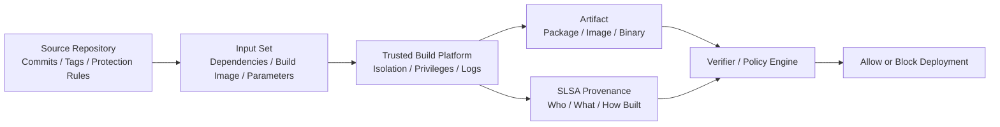
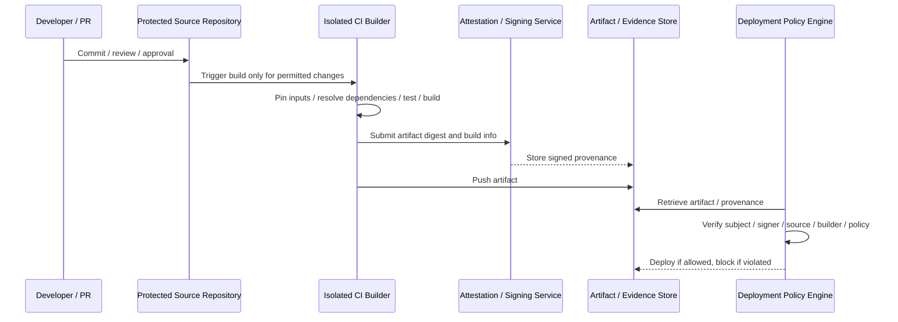

# SLSA-Based Software Supply Chain Security and Build Integrity

## 1. Overview

> **SLSA (Supply-chain Levels for Software Artifacts)** is a security framework that reduces the risk of tampering and contamination in the software supply chain by expressing the trust relationships among source code, build platforms, dependencies, and artifacts through provenance (origin and generation history) and tiered requirements.

Software supply chain attacks exploit trust in the development, build, and deployment process rather than directly breaking into production servers.
Malicious code may be mixed into open source packages developers use, CI runner privileges may be hijacked, or a binary that appears to have been built from legitimate source may be swapped after the build.
By checking only the hash of the final file, an organization has difficulty answering the question "with what, where, and using which inputs was this file made?"

In particular, modern CI/CD pipelines connect source repositories, package registries, container registries, external actions, build caches, signing systems, and multiple cloud accounts.
If privileges at one stage are excessive or the generation history can be forged, an attacker can slip malicious artifacts into the normal deployment procedure.
Supply chain security is therefore not merely a matter for firewalls or runtime antivirus, but a matter of proving and verifying the very process by which software is made.

SLSA divides this problem into "verifiable evidence of how an artifact was made" and "the level to which that evidence can be trusted."
The Build track deals with the relationship between build artifacts and the build platform, while the Source track deals with trust in how source enters and changes within the repository.
Rather than forcing every organization to reach the highest level at once, each track helps measure the current level of control and raise it incrementally.

In an essay answer, describing SLSA merely as a tool or signing product is insufficient.
First, one must distinguish that an SBOM is a list of components while SLSA provenance is evidence of the generation process.
Second, rather than asserting that a signature alone means safety, one must explain the signer, key protection, build isolation, and policy verification together.
Third, one should present a risk-based phased adoption strategy that balances developer convenience and security controls.

### A. Background and Need

The first background is the expansion of the attack surface.
Unlike the era when an application consisted only of code written in-house, today hundreds of packages, build plugins, container images, and deployment actions are combined.
Verifying that a package is a legitimate version and verifying that the package was actually used in the build are separate problems.
SLSA reveals this link through provenance that describes the inputs and the execution environment.

The second background is the difference between a "build that appears reproducible" and a "trustworthy build."
Even if one can rebuild from the same source commit, the result may differ if arbitrary secrets are injected during the build or externally downloaded files change.
Reproducibility is a useful quality attribute, but it does not automatically guarantee that the build actor was legitimate or that the provenance was not forged.
Therefore, reproducibility, signed evidence, and isolated build environments must be designed as distinct controls.

The third background is the change in regulatory, procurement, and customer requirements.
In the public, financial, and healthcare sectors, not only the components and vulnerability handling of delivered software but also development and build controls become important evaluation items.
After an incident, organizations must be able to trace "which build was made from which source and dependencies," and must receive suppliers' claims as verifiable evidence.
Applying SLSA and NIST SSDF together can link development process practices with artifact generation evidence.

### B. Goals and Scope

The goal of SLSA is not to stop every attack, but to detect and deter mistakes and tampering in the supply chain and to let consumers make policy judgments about an artifact's generation path.
For example, an organization can create a policy that "images deployed to production must be built from a protected commit in an approved repository, on the central CI platform, leaving signed provenance."
A policy engine reads the image's provenance and automatically determines whether these conditions are met.

The scope runs through source repository change control, dependency ingestion, build execution, artifact generation, provenance issuance, signing and storage, and pre-deployment verification.
On the other hand, SLSA alone does not replace handling all vulnerabilities in running applications, business approvals, developer security training, or penetration testing.
Clarifying the framework's scope avoids the overconfidence after adoption that "we achieved SLSA, so all supply chain risk has been eliminated."

## 2. Core Concepts and Structure of SLSA

The key to understanding SLSA is the relationship among the artifact, input, build platform, provenance, and verifier.
An artifact is the output consumers install or deploy, such as a binary, package, or container image, and an input is an element that affects the result, such as source, dependencies, build parameters, and build images.
The build platform takes inputs, produces artifacts, and issues evidence describing that process.
The verifier links the artifact's digest with the provenance subject and then decides whether to allow deployment according to organizational policy.

### A. Artifacts and Digests

The verification target should be identified by a cryptographic digest rather than a file name.
File names and version strings can change through repository moves or repackaging, but the digest over the artifact's bytes changes when the content changes.
Therefore, the provenance subject records the artifact's name and digest, and at verification time the digest of the actually downloaded file is recomputed to check for a match.

A digest match is a necessary condition, not a sufficient one.
If an attacker creates fake provenance matching the digest of a malicious file, or steals the signing key of a legitimate build platform, simple string comparison alone does not solve the problem.
The verifier must check the digest, provenance signature, signer identity, build path, input commit, and policy conditions together.

For example, if `payment-api:2.4.1` is a container tag in a registry where it can be overwritten under the same name, the deployment system must pin the immutable digest rather than the tag.
It then checks whether the digest referenced by the provenance matches the digest of the image received from the registry.
This procedure is meaningful in guaranteeing not "which named image was received" but "whether exactly the bytes that were verified are being deployed."

### B. Provenance

Provenance is signable evidence that indicates through which inputs and execution process an artifact was generated.
It typically includes information such as the build definition, external parameters, resolved dependencies, build workspace, build platform identifier, and generated artifacts.
Consumers use this information to judge whether the source commit is permitted, whether the build service is approved, and whether unexpected external inputs crept in.

Provenance does not gain trust merely from a declaration written by developers.
If a user-controlled build step can arbitrarily change the provenance contents, an attacker could actually use malicious inputs and still claim to have used legitimate ones.
Therefore, at higher levels, evidence must be generated within the build platform's control boundary, signing keys must be isolated from user build commands, and it must be confirmed that the evidence is correctly bound to the artifact.

The SLSA-recommended provenance is a format used together with the in-toto attestation framework.
An attestation is the envelope carrying a claim about an artifact, and the predicate carries the specific meaning of that claim, such as a build or test.
This structure can be extended beyond build provenance so that different types of evidence — vulnerability scans, test results, license checks, and so on — are handled within the same policy system.

### C. Build Track and Source Track

SLSA v1.2 distinguishes the Build track and the Source track.
The Build track evaluates in levels whether the build platform generates provenance, whether that provenance accurately describes the artifact and build inputs, and how resistant the build environment is to tampering.
The Source track deals with where source code came from and what change controls it went through to become a trusted source state.
Separating the two tracks allows "a case where the build was secure but a malicious commit was built" and "a case where the source was approved but the build platform was tampered with" to be analyzed separately.

Since SLSA v1.0, Build levels are described from L0 to L3.
L0 is a state with no guarantees, and L1 requires the existence of build provenance.
L2 is the level where a hosted build platform generates and signs provenance, raising defense against post-build tampering.
L3 requires strong isolation and forgery resistance of the build platform, further lowering the risk of tampering during the build.

| Category | Core Guarantee | Representative Risk Mitigated | Adoption Question |
|---|---|---|---|
| Build L0 | No particular guarantee | State without systematic controls | Can the artifact's generation path be explained? |
| Build L1 | Provenance exists | Mistakes / lack of traceability | Does every release leave a generation history? |
| Build L2 | Signed provenance and hosted build | Evidence tampering after build | Are the signer and CI identity trustworthy? |
| Build L3 | Hardened, isolated build platform | Manipulation during build | Are keys, workspaces, and boundaries between builds protected? |

These levels are not an overall maturity score for product security.
For example, even with an L3-level build platform, overall risk remains if the application uses vulnerable libraries or access control on production servers is weak.
Therefore, organizations should map tracks and levels to asset criticality and attack scenarios, and manage them together with SBOM, vulnerability management, SSDF, and runtime security.

### D. Producer and Consumer

The Producer includes the build platform that makes software and issues provenance, as well as the organization using that platform.
The Producer's responsibility is to accurately identify build inputs and outputs, generate provenance meeting the required level, and protect signing keys and the build environment.
The Consumer is the organization or service that installs packages or deploys images, and it must use provenance in actual policy decisions.

If consumers do not verify, provenance remains a decorative log.
For example, even if provenance is stored alongside in the registry, security controls do not work if the deployment pipeline pulls the latest tag without checking the signer or source repository.
Consumers must define permitted builders, branches, repositories, organizations, build parameters, and dependency conditions as policy, and distinguish blocking, exception, and approval procedures on failure.

## 3. Supply Chain Attack Scenarios and SLSA Responses

A characteristic of supply chain attacks is that developer mistakes and external attacks exploit the same paths.
By stealing CI tokens through email phishing, taking over the release account of an open source repository, or causing dependency confusion that confuses package names, attackers can deliver malicious artifacts without going against the normal development flow.
SLSA does not magically eliminate attacks; it clarifies the trust boundaries attackers must cross and leaves evidence for after-the-fact verification.

### A. Malicious Dependencies and Dependency Confusion

An attacker can create a public package with the same name as an internal package so that the build tool selects the external package first.
Alternatively, an attacker can take over the maintainer account of a legitimate package and publish a new version containing malicious code.
Here, an SBOM tells which packages are included in the final artifact, but one must additionally verify from which repository, digest, and build process each package came.

The response consists of restricting dependency repositories to an allow list, reviewing lockfiles and checksums, and performing provenance and signature verification during dependency ingestion.
Even if external packages are cached in an internal proxy, unverified files must not be trusted unconditionally.
Not only the dependency's name but also its origin, version, digest, signer, and transitive dependencies must be subject to policy.

### B. Theft of CI/CD Credentials and Build Runners

If an attacker reads cloud deployment keys or provenance signing keys on a CI runner, malicious artifacts can be produced through the normal pipeline.
In particular, if secrets are exposed to external PRs or untrusted input processed by build scripts, source change privileges and release privileges can be stolen in a chain.

The response is divided into least privilege per build stage, short-lived tokens, limiting the scope of secret injection, approval of trusted branches, ephemeral runners, and network egress restrictions.
Signing keys are not placed as files in the workspace where build commands run; instead, a signing service within the trust boundary is designed to sign only restricted requests.
The provenance records which builder ran, and the verifier blocks deployment if it was not an approved builder.

### C. Post-Build Artifact Replacement

An attack that swaps files in a registry or deployment repository after a legitimate build is a problem in which the final consumed item differs even though the generation process was legitimate.
To prevent this, the artifact digest is bound as the provenance subject, the provenance is signed, and the downloaded bytes are re-hashed at consumption time.
Combining immutable tags in the registry, signature verification, transparency logs, and separation of access rights can reduce the impact of a single repository compromise.

Here, the crux of a signature is "who signed it."
Since it is not difficult for an attacker to sign a malicious file with their own key, the verifier must check the certificate, OIDC subject, and build workflow identifier the organization trusts, as well as the signing time.
How to treat existing artifacts when keys are rotated or revoked, and how to divide the trust scope before and after a key compromise, must also be determined as operational policy.

| Attack Scenario | Point of Compromise | Required Evidence / Controls | Verification or Response |
|---|---|---|---|
| Malicious open source release | Dependency repository / maintainer account | Package origin, checksum, dependency provenance | Apply allowed repositories and signature / vulnerability policies |
| Dependency confusion | Package resolution order | Internal repository priority, namespace policy | Block external names / pin proxy |
| CI runner compromise | Build execution environment | Builder identity, isolation, least-privilege logs | Allow only approved builders and provenance |
| Provenance forgery | Evidence store / signing key | Signature, key protection, transparency | Verify signer / subject / policy conditions |
| Artifact replacement | Registry / deployment repository | Digest binding, immutable storage | Re-verify digest right before deployment |

## 4. CI/CD Implementation and Verification Procedure

Implementing SLSA is not "adding a tool to the pipeline" but redesigning the trust boundaries of the build path.
First, catalog which artifacts are important, which inputs affect the result, and which builders to trust.
Then provenance generation, signing and storage, and consumer verification should be attached incrementally.

### A. Baseline and Asset Classification

Forcing the same controls on every repository can excessively slow small teams' development flow.
Conversely, applying a low bar to an internet-facing payment API or publicly distributed images carries high incident costs.
Therefore, artifacts are classified by criticality, external exposure, personal data processing, change frequency, supply chain dependency, and recoverability, and target levels are set.

For example, internal development tools can start with provenance generation to secure L1-level traceability, while financial service images deployed to customers can require signed evidence, central CI, isolation, and short-lived credentials.
Setting risk-based targets in this way allows explaining the relationship between actual threats and controls instead of a "SLSA level number race."
The baseline should also include exception approvers and expiry dates, and permanent exceptions should be periodically re-evaluated so they do not effectively become control bypasses.

### B. Pinning Source and Build Inputs

Source inputs are pinned in a form whose changes can be tracked, such as a commit digest or a protected tag.
Recording only that the latest state of `main` was built makes it hard to reproduce exactly which commit was selected at build time.
External actions and build images are also pinned by digest or verifiable version rather than by tag, and package resolution results are controlled with lockfiles.

Input pinning is not work solely for reproducibility.
It is a security control that lets the verifier confirm the relationship between the source commit declared in the provenance and the actual artifact.
However, since not all environment variables can be statically pinned, external parameters should be explicitly enumerated and separately reviewed to ensure sensitive information does not leak into the provenance.

### C. Provenance Generation and Storage

After the artifact is made, the build platform computes the digest of the result file and generates provenance within the trust boundary.
The evidence includes information such as the build platform identifier, source location and commit, build definition, input list, result subject, and generation time.
The retention period, backup, access rights, and deletion policy for artifacts and provenance are also set so that past evidence can be retrieved when a supply chain incident occurs.

An evidence store has requirements different from a general log store.
It must be able to detect whether logs were modified, and it must manage the public keys and certificate chains needed for signature verification.
The security team should monitor provenance generation success rate, verification failure rate, anomalous signing key usage, and unexpected builders to detect failures of the controls themselves.

### D. Consumer Verification and Policy Decisions

The verifier first compares the artifact digest with the provenance subject.
Next, it confirms whether the provenance signature was generated by a trusted key or identity and whether the signed content was not tampered with.
It then evaluates, in order, the source repository, branch, and commit, the builder identifier, the build level, permitted inputs, and vulnerability policies.

Separating policy results into allow, block, and manual approval is more suitable for operations.
For example, production deployment can be blocked immediately unless it comes from an approved repository and builder, while the development environment can be allowed with a warning and ticket issuance.
However, expiry time, approver, post-review, and impact scope must be recorded so that emergency deployment exceptions do not automatically become permanent allowances.

### E. Failure Handling and Recovery

If deployment proceeds silently when provenance is missing or signature verification fails, SLSA controls are neutralized.
The policy engine must return the failure reason along with the artifact ID, rule, evidence checked, and remediation guidance.
Developers must be able to know which fields to fix, and the security team must aggregate repeated failures as pipeline improvement tasks.

When a key or builder compromise is confirmed, simply signing with a new key is not enough.
Provenance and artifacts generated during the compromise period must be identified, affected dependencies and deployment environments traced back, and allow lists, keys, and tokens revoked and replaced.
The richer the provenance, the more it helps narrow the impact scope and decide which artifacts to rebuild.

## 5. Comparison and Integration with Related Technologies

### A. SLSA and SBOM

An SBOM expresses the components, versions, and relationships included in an artifact as a list.
It is therefore strong at confirming "what is inside" and performing vulnerability and license impact analysis.
SLSA provenance explains "through which source, dependencies, and build platform the artifact was made."
The two are not substitutes but should be linked together to the same artifact.

For example, even if an SBOM records `openssl 3.x`, it does not automatically prove whether that package came from an internally approved repository, was downloaded from some other external URL, or is actually included in the image digest.
Conversely, even if provenance describes a trusted build process, it does not conveniently provide a list of vulnerable libraries inside the output.
SBOM is placed in composition analysis, and provenance in generation path verification.

### B. SLSA and NIST SSDF

NIST SSDF is a process framework that organizes secure development practices into the practice groups of Prepare, Protect, Produce, and Respond.
SLSA focuses, within that, on concrete controls and evidence formats that measure and prove the integrity of the software supply chain and artifact generation.
An organization can establish policies, roles, and vulnerability response processes with SSDF and leave verifiable evidence about builds and releases with SLSA provenance.

When comparing the two frameworks, one must not assert that one certifies or fully contains the other.
SSDF compliance alone does not guarantee that an artifact's provenance is not forged, and SLSA L3 alone does not complete threat modeling, secure coding, and vulnerability response.
In a PE answer, it is appropriate to describe process governance and technical evidence generation as complementary.

| Category | SLSA | SBOM | NIST SSDF |
|---|---|---|---|
| Central question | How was it made, and can it be trusted? | What does it contain? | Are secure development practices being operated? |
| Representative output | Provenance / attestation | Component list | Policies / procedures / practice evidence |
| Strengths | Build path / signature / integrity verification | Vulnerability / license / impact analysis | Organizational process and development lifecycle |
| Limitations | Does not remove application vulnerabilities themselves | Does not by itself guarantee generation path or signature trust | May lack machine-verifiable build evidence |
| Integration | Link SBOM attestation to artifact digest | Consumer verification together with provenance | Used as the overarching system for roles / policy / training / response |

### C. Signatures and Provenance

A digital signature is a means of confirming data integrity and the fact of issuance by a specific key.
However, if the holder of the signing key signed a malicious file, or the verifier trusts an arbitrary key, the signature does not lead to a safe conclusion.
Provenance carries build inputs, platform, and results inside a signed claim, and the verifier judges both the signer identity and the policy compliance of the contents.

Therefore, one should say not "it is signed, so it is safe" but "the claim that a trusted builder made the expected artifact from permitted inputs has been verified."
This distinction is especially important in certificate management and policy engine design.
Key rotation and revocation, certificate expiry, organizational moves, and builder workflow changes must be included in operational scenarios.

## 6. Application Cases and Expected Benefits

### A. Container-Based Payment Service Case

Assume an organization operating a payment service deploys container images every week.
Previously, builds were based on Git tags and the production cluster pulled `payment-api:latest`, but tags were reused and the same runner also executed external PRs.
The organization first set as its baseline protected release branches, approved central CI, image digest pinning, SBOM generation, and provenance signing.

When a build completes, the image digest, source commit, builder workflow, base image, and dependency information are linked to the provenance and SBOM attestations.
The deployment policy checks whether the signer is the organization's release builder, whether the source is an approved commit on a protected branch, whether the image has no critical vulnerabilities, and whether the provenance subject matches the actual image digest.
If even one condition fails, production deployment is blocked, and in the development environment an approval ticket is created.

The effect of this design does not stop at simply blocking attacks.
Incident investigators can trace back from a production image to the source commit and builder, and can identify in bulk the artifacts produced during a period when a particular builder was compromised.
Development teams, too, can see failed policies and how to fix them in CI results instead of a vague procedure where "the security team checks manually."

### B. Open Source Package Supplier Evaluation Case

Suppose a company receives packages from an external vendor and includes them in its internal products.
Rather than writing only a vulnerability notification obligation into the contract, requiring the vendor to provide package digest, SBOM, and provenance for each release and to disclose its approved build platform and signing identity increases verifiability.
The purchasing organization feeds the evidence provided by the vendor into its internal policy engine to evaluate source, builder, signature, and vulnerability conditions.

However, a vendor's claim of a framework level must not be trusted as-is.
One must confirm to which scope of artifacts which level applies, what the exceptions, manual steps, and external inputs are, and from when evidence has been retained.
It is desirable for procurement, legal, development, and security to jointly reflect in the contract a minimum evidence list and procedures for rebuild, notification, and withdrawal in case of incidents.

## 7. Advanced: SLSA v1.2 and Latest Application Directions

According to the official SLSA documentation, v1.2 describes the L0–L3 requirements of the Build track together with the Source track, and presents recommended formats such as provenance and verification summary attestations.
In practice, rather than an organization declaring a high number, one should confirm which threats each level's requirements reduce and whether those controls are observable in the actual pipeline.

The Source track is important in that it treats pre-build source trust as a separate problem.
Even if the build is fully isolated, if an attacker merges a malicious commit into an unprotected repository, a trusted builder can build the malicious source normally.
Conversely, even with strong source change control, trust in the output is insufficient if the builder can use arbitrary external inputs or forge provenance.
Therefore, the three boundaries of source change, build, and deployment are separated and evidence is linked to each.

Subsequent application of SLSA is extending toward dependency ingestion and build environment evidence.
Leaving evidence in provenance about where and through what verification dependencies were accepted allows the integrity of the ingestion path to be codified as policy, going beyond simple package name checks.
Hardware-based measurement and attestation and build environment state verification are also being discussed, but requirements in draft or experimental stages should be adopted distinctly from approved stable specifications.

In a PE answer, when mentioning the latest version, it is safe to state the date of application and the official document version together and not to present draft features as settled obligations.
A realistic organizational roadmap can be designed in the order: inventory release artifacts → make provenance visible at L1 → strengthen to L2 with central CI and signing → aim for L3 with isolation, key protection, and policy verification → integrate Source and dependency tracks.

## 8. Considerations and Implications

### A. Governance and Responsibility

If responsibility for SLSA adoption rests only with the security team, development teams may perceive the inspection tools as external controls and bypass them.
Responsibilities of source owners, build platform operators, release approvers, and deployment consumers should be separated via RACI, and the owner of evidence at each stage made clear.
Even if the build platform issues provenance, the responsibilities of the development team that selects inputs and the operations team that verifies before deployment do not disappear.

### B. Balancing Security and Development Productivity

Applying the highest level of isolation and manual approval to every commit can sharply reduce development speed.
Conversely, merely leaving warnings on risky artifacts weakens the effectiveness of controls.
Policy strength should be differentiated across development, staging, and production, and repeated violations reduced through automatic remediation, templates, and self-service builders.

### C. Key and Identity Management

Provenance signing keys are core assets of the supply chain, so designs that distribute long-lived fixed private keys to multiple runners must be avoided.
Short-lived identities, key management systems, external key custody, signing audit logs, and key rotation and revocation procedures are combined.
Verification policies should be configured to trust the relationship between organization, workflow, and builder identities and the artifact rather than the key itself, and impact analysis should be performed when identities change.

### D. Exceptions and Legacy

There are cases where old build systems or external vendors cannot provide provenance.
In such cases, rather than permanently allowing the exception, isolated repositories, manual verification, additional scanning, limited deployment scope, and rebuild plans are recorded as temporary compensating controls.
Exceptions include the risk acceptor, rationale, expiry date, and alternative controls, and are automatically re-reviewed at new releases or contract renewals.

### E. Measurement and Continuous Improvement

Measuring success solely by "number of repositories achieving a SLSA level" can skew toward perfunctory evidence generation.
Operational metrics such as provenance generation rate, ratio of verified deployments, mean time to resolve verification failures, number of unapproved builder detections, and time to identify affected artifacts in a compromise are viewed together.
Policy failures are classified as developer mistakes or platform defects, and recurring failures are reflected in pipeline templates and platform defaults.

### F. Integration Strategy from a PE Perspective

SLSA connects with SBOM, SCA, signing, secrets management, CI/CD, containers, Kubernetes admission control, and SIEM.
Verifying provenance at the deployment gate, sending violation events to SIEM, and computing risk scores together with vulnerability, configuration, and runtime policies increase traceability from generation to operation.
However, rather than bolting on many tools, what matters is integrating so that evidence is actually used in policy decisions, using the artifact ID and digest as the common key.

## 9. Expected Exam Directions and Answer Structuring Strategy

Questions may use various phrasings such as "software supply chain security measures," "comparison of SLSA and SBOM," "ensuring integrity of CI/CD pipelines," and "provenance-based deployment verification."
An answer develops stably by presenting the supply chain trust problem in the definition and background, and connecting source, inputs, builder, provenance, artifact, and verifier in the concept diagram.

In the body, after explaining the Build/Source tracks and L0–L3, link the attack scenarios of dependency confusion, CI compromise, and artifact replacement to controls.
Then presenting the CI/CD implementation procedure, the comparison with SBOM and SSDF, and a container or package case avoids a mere listing of terms.
In the conclusion, present risk-based adoption, keys and identities, exceptions, measurement, and operational integration as considerations, and emphasize that both "evidence generation" and "consumer verification" must be present.

## References

- SLSA official specification v1.2: https://slsa.dev/spec/v1.2/
- SLSA Build track basics and levels: https://slsa.dev/spec/v1.2/build-track-basics
- SLSA build artifact requirements: https://slsa.dev/spec/v1.2/build-requirements
- SLSA Provenance v1.0 format: https://slsa.dev/spec/v1.0/provenance
- in-toto Attestation Framework: https://github.com/in-toto/attestation
- NIST SP 800-218 SSDF v1.1: https://csrc.nist.gov/pubs/sp/800/218/final
- NIST SP 800-218 Rev.1 SSDF v1.2 initial public draft: https://csrc.nist.gov/pubs/sp/800/218/r1/ipd

---

> **In one line**: SLSA is a supply chain security framework that proves the software generation path — invisible through SBOM alone — using provenance and tiered build and source controls, enabling consumers to verify digest, signature, input, and builder policies so that only trustworthy artifacts are deployed.
