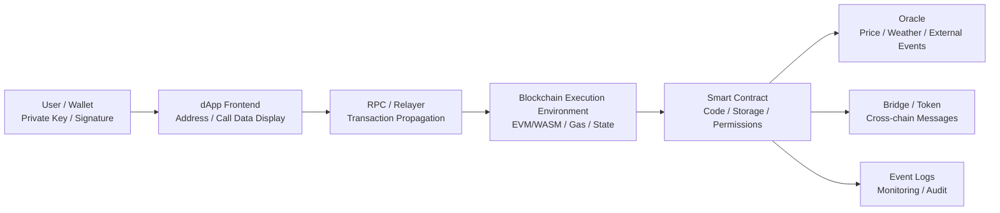
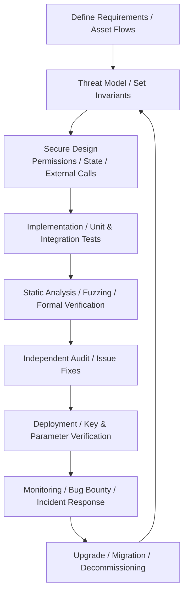

# Smart Contract Security and Audit Strategy

## 1. Overview

> A **Smart Contract** is a program deployed on a blockchain network that deterministically executes predefined conditions and state transitions; it is a digital contract execution mechanism that replaces participants' reliance on trusted intermediaries with code, consensus, and cryptography.

A smart contract does not simply mean code stored on a blockchain. It is the entire execution system in which a transaction signed by a user is submitted to the network along with call data, each node computes the same execution result from the same input and the same current state, and then the agreed state is updated. Therefore, once source code is deployed it is difficult to change, and a small logic error can simultaneously affect the assets, permissions, and transaction records of many users.

In a traditional web service, when the server operator discovers an error, it can restore the database or roll back the code. In a smart contract, by contrast, arbitrary modification by the operator is limited due to block finality and replication, and admin keys, proxy upgrades, and governance votes become separate control points. In other words, the phrase "code is law" should be understood not as meaning that the code is perfect, but that because the code's execution results automatically move assets and rights, the responsibility for prior verification becomes much greater.

The scope of security is also not limited to contract code. It must include wallet and key management, external dependencies such as oracles and bridges, the frontend and signing requests, the deployment pipeline, operational monitoring, and emergency stop and recovery procedures. This is because even if contract functions are secure, economic loss occurs if an admin private key is stolen or a price oracle is manipulated.

Smart contract security is a domain where **integrity, asset safety, availability, and determinism** weigh more heavily than confidentiality. Due to the public ledger nature of blockchains, code and calls can be observed, and attackers experiment with vulnerabilities repeatedly. Therefore, access control, state invariants, input validation, reentrancy prevention, price data reliability, gas limits, and upgrade authority must be tied into a single threat model.

In an exam answer, merely listing "vulnerabilities" is insufficient. It becomes an essay-type answer only when one explains where assets are held, which functions change state, at what point external calls occur, and whether they revert atomically on failure, and then continues to describe controls across the design, implementation, verification, deployment, and operation stages.

### 1.1 Background and Need

Smart contracts developed from the need to automate payments, lending, trading, voting, and asset issuance without intermediaries. The advantage that participants can verify the same ledger and execute the same rules without trusting one another is attractive in finance, supply chain, and digital assets.

However, decentralization does not mean dispersion of responsibility. If a deployed contract has a bug, the assumption that "the administrator will fix it" may not hold. In particular, for DeFi contracts that hold assets, a price calculation error or missing permission check in a single function can cascade into collateral withdrawal, token minting, or governance takeover.

Security investment should be viewed not as a cost but as a control that reduces the nonlinearity of losses. For example, adding a few unit tests alone cannot verify oracle manipulation or theft of upgrade keys. Risk can be lowered step by step only by combining threat models and invariants, independent audits, testnet operation, limited initial caps, and real-time detection.

### 1.2 Key Characteristics

- **Deterministic execution:** Since all validating nodes must compute the same result for the same block state and input, non-deterministic responses from external APIs must not be trusted directly.
- **Coupling of assets and code:** Because contracts can directly hold tokens, deposits, and permissions, logic errors translate directly into monetary loss.
- **Public verifiability:** Because bytecode and transactions are observable, attackers can perform the same testing and reverse engineering.
- **Immutability and limited modification:** Even if deploying a new version is possible, compatibility with existing state and addresses, admin authority, and migration must be designed together.
- **Gas and resource constraints:** All execution is subject to the block gas limit and cost constraints, so infinite loops, bulk array processing, and denial of service are dangerous.

## 2. Smart Contract Structure and Trust Boundaries

A smart contract system should be understood as the combination of user wallets, the application frontend, RPC nodes, the blockchain execution environment, and external oracles and bridges. Because each component has different trust assumptions, failing to distinguish boundaries misses the loophole where "on-chain code is secure but off-chain inputs are manipulated."

### 2.1 User, Wallet, and Signature Layer

In the wallet, the user checks the target address, function selector, parameters, and fees of the contract call and signs with the private key. If the private key is exposed, an attacker can create transactions with the legitimate user's authority even if the contract is secure. Therefore, hardware wallets, multisig, transaction limits, and withdrawal address allowlists are controls separate from code audits.

The frontend should show token amounts and purposes in a way users can easily read. If a malicious web page induces the user to sign an unlimited approval or permission delegation they did not recognize, the user may hand over asset-theft authority while thinking they are calling a legitimate contract. Reducing the mismatch between the wallet's raw calldata and the human-readable description is important.

Signatures must distinguish the message's intent, chain, contract, and expiry. Without domain separation and nonces, a signature made on one chain can be reused on another chain or in another function. Structured signatures such as EIP-712 help clarify the correspondence between what is displayed to the user and the verifiable fields, but applying them does not by itself replace the permission model.

### 2.2 Execution, State, and Event Layer

A contract is a state machine with code and persistent storage. A function call reads, validates, and modifies state and, if needed, calls other contracts. Since all validating nodes must obtain the same result, computation must be based only on the current block state, caller, input, and agreed block information.

State changes must be committed atomically or reverted on failure. However, if subsequent code after an external call fails, reentrancy or partial state changes can cause problems. Therefore, the Checks-Effects-Interactions order — recording state effects first and placing external calls last — becomes the basic design principle.

Event logs are an important means of observation for user interfaces and analytics systems, but they are not the same as the authoritative state in contract storage. If events are omitted or record wrong arguments, indexers may present a view different from the actual state. Clear events should be emitted for asset movements, permission changes, upgrades, and emergency stops, and linked to monitoring rules.

### 2.3 External Dependencies and Trust Boundaries

Because a blockchain cannot know real-world prices, shipments, or identity information on its own, oracles are needed. If an oracle depends on a single exchange price or a single operator, short-term manipulation can distort collateral valuation and liquidation. Multiple sources, time-weighted prices, outlier filters, and price freshness checks must be designed together.

A bridge links locking/burning on one chain with minting/releasing on another. This process involves the validator set, message ordering, replay prevention, and asset supply invariants. If bridge keys or the validator threshold collapse, losses on a far larger scale than a single contract bug can occur, so a separate threat model is needed.

RPC and the frontend are infrastructure the user does not directly control. A malicious RPC can distort balances, gas, and simulation results, or the frontend can construct calls to a different address. TLS, comparison across multiple RPCs, hash verification of deployment artifacts, and frontend integrity protection are complements to on-chain controls.

## 3. Lifecycle and Security Verification Procedure

Smart contracts have a long lifecycle from requirements definition to decommissioning and migration. An audit should not be a one-time deliverable right before deployment but a continuous control system in which design invariants and tests carry through into code, deployment, and operation.

### 3.1 Requirements and Threat Model

The first step is not a feature list but drawing the asset flows. Identify deposits, collateral, reward tokens, admin authority, price data, and cross-chain messages, and mark between which addresses and functions each asset moves. As a result, the security question "who can change what, when, and by how much" can be clarified.

The threat model includes external users, malicious contracts, privileged operators, oracle providers, validators, and bridge relayers. One must assume that an attacker can call multiple functions in a single transaction, move a price and restore it within the same block, or manipulate gas and return values at boundaries where failures occur.

Invariants are the common language of testing and monitoring. For example, propositions such as "total supply equals the net sum of minting and burning," "borrowed amount cannot exceed collateral value," "in the paused state, no state-changing function other than withdrawal executes," and "a nonce is consumed only once" are linked to formulas, check code, and alert rules.

### 3.2 Secure Implementation and Testing

In implementation, input ranges and permissions are validated first, and the order of state changes and external calls is made explicit. Do not confuse `msg.sender` with `tx.origin`, and for functions that need to confirm whether an address is a contract, include checks for code existence and interface verification. Integer type ranges, units (decimals), rounding direction, and division by zero are also handled explicitly.

Unit tests with only normal scenarios are not enough. Unauthorized calls, zero/max values and boundary times, failed token returns, reentrant callbacks, oracle delays, insufficient fees, and possible chain reorganizations must be tested. What matters is not whether a single function passes but whether state transitions combining multiple calls always preserve invariants.

Fuzz testing and invariant-based testing broaden the input space. For example, combining deposit, borrow, repay, and liquidate thousands of times in random order while checking conservation of total assets and liabilities can uncover order-dependent errors that are hard to anticipate manually. When a test fails, one should preserve not just the seed but the reproducible transaction sequence and block state.

### 3.3 Static Analysis, Formal Verification, and Independent Audit

Static analysis quickly finds patterns such as dangerous external calls, potential reentrancy, missing access control, and unused return values. However, passing a tool's rules does not make the economic design secure. "Does the collateral ratio calculation match the intended policy?" is a question of domain invariants rather than simple syntactic patterns.

Formal verification is an approach that expresses state transitions and invariants as mathematical propositions to prove properties for all permitted inputs. It is effective for parts whose scope can be bounded, such as core vault modules or token supply conservation, but if assumptions about external oracles, governance, and economic actors are wrong, the applicability of the proof results is also limited.

An independent audit reviews assumptions and attack paths the development team missed from an external perspective. Audit reports should not merely list the severity of findings but include affected assets, reproduction steps, fix commits, regression tests, residual risks, and operational recommendations. If the code changes after the audit, the scope of changes should be compared again, and key changes should be re-audited.

## 4. Major Vulnerabilities and Response Principles

### 4.1 Reentrancy Attack

Reentrancy is an attack in which, while a contract is calling an external address, the counterpart contract calls the original function again to exploit the window in which state has not yet been updated. If a withdrawal is sent before the deposit balance is deducted, a malicious recipient callback can withdraw the same balance again. The root cause is that internal state remains in an intermediate state while external code executes.

The response is designed as a combination of the Checks-Effects-Interactions order, reentrancy locks, and withdrawal limits and withdrawal queues. Deducting the balance first and placing the external call last reduces the withdrawable balance even if re-called in the same transaction. However, adding only a single lock and neglecting complex inter-contract calls can miss cross-function reentrancy or read-only reentrancy.

Since call methods can differ by token standard and recipient implementation, return values should be checked and hook calls from unexpected tokens should not be trusted. It should be tested in which order the withdrawal function performs token transfer and event recording, and whether everything reverts on failure.

### 4.2 Access Control and Concentration of Authority

A simple admin check like `onlyOwner` is useful when the authority holder is clear, but if a single admin key performs upgrades, minting, and fund movements, it becomes a single point of failure. One should review whether the initialization function runs only once, whether the admin addresses of the proxy and implementation contracts match, and whether permission change events are emitted.

High-risk operations apply multisig and time delays so that theft of one key does not immediately lead to asset movement. In role-based access control, the authority to grant and revoke roles is separated, and the permissions of operators, upgraders, and emergency pausers are minimized. Separating permissions increases operational complexity but reduces the blast radius of compromise and the potential for internal misuse.

The emergency stop function is not a panacea either. Stopping all functions may even block legitimate users' withdrawals, so the minimum functions allowed during pause and the unpause procedure must be defined in advance. If the pause key is stolen, it can become a denial of service, so multisig, approval thresholds, and automatic expiry are considered together.

### 4.3 Oracle, Price, and Economic Attacks

If a contract reads collateral value or exchange rates from an oracle, not only price accuracy but also freshness and manipulation cost must be reviewed. If the spot price of a single pool is used as-is, an attacker can profit by moving the price with a large trade, immediately borrowing or liquidating, and then reverting the price.

Multiple data sources and time-weighted prices mitigate the effect of single-point manipulation. Combining price movement caps, maximum borrowing limits, liquidity thresholds, stale price blocking, and fallback for abnormal prices can limit the impact of oracle failures and manipulation. However, using heavily delayed prices creates the trade-off that liquidations are delayed even in legitimate sharp drops.

Flash loans allow borrowing and repaying large sums within a single transaction, so even an attacker without capital can amplify vulnerabilities in price, governance, and collateral calculations. The response is not to ban flash loans themselves but to avoid making important decisions based solely on the momentary state of a single block, applying time delays, average prices, voting power snapshots, and liquidity caps.

### 4.4 Integer, Precision, and Unit Errors

Because tokens differ in decimal places and amount units, confusing the scales of `wei`, token base units, dollar prices, and interest rates can cause assets to be over-minted or liquidations to malfunction. The order of multiplying two values and then dividing, the rounding direction, and the possibility of overflow in intermediate values must be analyzed.

Even with the arithmetic checking features of modern languages, logical precision errors are not prevented. For example, repeatedly rounding down when dividing 100 by 3 can accumulate small amounts in the system, and rounding in a direction favorable to certain users enables arbitrage. It is safer to separate units of amount, ratio, and time by type or library.

### 4.5 External Calls, delegatecall, and Proxies

Unconditionally trusting the return values and behavior of external contracts can break state due to malicious tokens or incompatible implementations. Call success, return data format, gas forwarding, and reentrancy potential must be explicitly checked. Low-level `call` is flexible but can hide errors, so wrappers and validation code are placed alongside it.

delegatecall executes other code in the caller's storage and permission context. It is useful for proxy upgrades, but fatal incidents can occur due to storage slot collisions, authority to change the implementation address, missing initialization, or wrong function selectors. The storage layout of the implementation contract must be preserved, and state migration before and after upgrades must be tested.

A proxy's upgradability carries both the benefit of bug fixes and the risk of weakened immutability. Users should be able to confirm whether the contract is permanently fixed, who can upgrade it, and whether upgrades go through delay and notice. Hiding upgrade authority does not turn technical trust into governance trust.

### 4.6 Gas, Denial of Service, and Front-running

A loop whose array length is left to external input can exceed the gas limit, causing the function to fail forever. A typical case is when, as the number of users grows, reward distribution, liquidation, or vote tallying no longer fits into a single transaction. Pagination, pull-based claims, work splitting, and caps and escape paths must be designed.

Transactions in the public mempool can be exposed to mining/validation ordering and price manipulation. Sandwich attacks, in which an attacker inserts trades before and after a user's trade to capture price differences, and front-running between approval and execution transactions can occur. Damage is limited through slippage limits, deadlines, commit-reveal schemes, private propagation paths, and minimum received amount checks.

Denial of service does not simply mean a function is slow. An attacker can make storage abnormally large to raise subsequent processing costs, or block liquidations that are executable only under certain conditions. State size, call cost, and recoverability on failure should be managed as operational metrics.

### 4.7 Signatures, Replay, and Phishing

Off-chain signatures reduce gas costs and make orders and permits convenient, but if the message's domain, chain ID, contract address, nonce, expiry, and purpose of action are not clear, they become material for replay attacks. Signature verification functions must clearly reject empty signatures, wrong lengths, and signer recovery failures.

Unlimited `approve` and `permit` increase user convenience but can give a malicious contract continuing authority to move assets. Permission expiry and minimum allowances, revocation after use, and human-centered descriptions on the wallet screen must be applied. Since social engineering cannot be solved by code alone, a UI that verifies the effect of what the user is about to sign is also a security control.

## 5. Comparison and Application Cases

### 5.1 Comparison of Smart Contracts and Traditional Server Applications

Both architectures require input validation, permissions, and testing, but they differ in how failures and changes are controlled. A server can be patched quickly by the operator but requires trusting the operator and the database. A smart contract offers strong independent verification and transparency of execution results but has a short patch window and makes post-deployment state compatibility difficult.

| Category | Smart Contract | Traditional Server / DB | Practical Implication |
|---|---|---|---|
| Executor | Many validating nodes | The operating organization's servers | Distinguish determinism from operational trust |
| Change | Immutable or controlled upgrade | Patch / rollback possible | Strengthen prior testing and upgrade governance |
| Data | Public ledger / state / logs | Access-controlled DB | Confidentiality requires separate encryption / off-chain design |
| Cost | Transaction gas / block resources | Server / DB resources | Move repetitive / bulk work off-chain |
| Failure response | Pause / migration / governance | Backup / recovery / rollback | Predefined recovery scenarios needed |

Therefore, a hybrid structure is realistic in which only the minimal state and rules requiring consensus are kept on-chain, while large files, personal data, and complex analytics are kept off-chain. When using off-chain data, the integrity of results must be linked through hashes, Merkle proofs, signatures, and oracles; simply "storing in a DB and recording only the address" may lack verifiable evidence.

### 5.2 Case 1: Collateralized Lending Protocol

A collateralized lending contract manages the states of deposit, collateral valuation, borrowing, repayment, and liquidation. For example, with collateral worth 10 million KRW and a safe collateral ratio of 70%, the theoretical borrowing limit is 7 million KRW, but considering sharp price drops and oracle delays, the actual limit may be capped at 6 million KRW.

An attacker can manipulate the price with a flash loan at a moment when the price pool's liquidity is shallow, take an oversized loan at the manipulated price, and then revert the price. Therefore, multiple sources and time-weighted prices are used instead of a single pool price, and a circuit breaker restricts new loans and liquidations when price deviation exceeds a threshold.

The liquidation function must be callable by anyone for prompt recovery, but if liquidation rewards and gas fees are insufficient, liquidators may not participate. Liquidations should not all be packed into one transaction but split by position, and invariant tests including malicious token callbacks, reentrancy, and rounding losses should be performed.

### 5.3 Case 2: NFT Marketplace and Approval Authority

An NFT marketplace must confirm whether the seller holds the asset, whether the price and expiry time are valid, and whether the buyer's signature is bound to a specific chain and contract. If the token ID, quantity, price, fee recipient, nonce, and deadline are not included in the sale signature, the same signature can be reused at a different price or on a different chain.

If a purchase transaction remains in the public mempool for a long time, an attacker can reorder the seller's and buyer's transactions or preempt the same NFT with a higher gas price. The contract must consume each signature nonce only once, include the chain ID and contract address in the EIP-712 domain, and validate upper bounds on price and fees.

From a user experience standpoint, "approval" and "purchase" are separated so as not to leave unlimited authority, and approval revocation or time limits are provided after the transaction completes. It is also important for the deployment pipeline to automatically verify that the collection address displayed by the frontend matches the actual call address.

### 5.4 Case 3: Upgradeable DAO

If a DAO replaces its implementation contract by vote, upgrade authority and voting power calculation become the key risks. Snapshot blocks, quorums, and voting delays are used to prevent an attacker from borrowing large amounts of voting power in one block to participate in a proposal, or moving tokens just before voting ends to change the outcome.

Upgrade proposals should publish in human-readable form the target address, function calls, changed storage layout, and permission changes, and even after a vote passes, a timelock should secure time for users and monitoring systems to exit or respond. Separating the authority for emergency stops from that for normal upgrades secures both rapid incident response and the independence of long-term governance.

When replacing a proxy implementation, verify that the meaning of existing storage slots is preserved, that the initialization function is not re-executed, and that the new implementation does not bypass admin authority. This should not be judged from a source code diff alone but confirmed through testnet state migration and storage layout checks.

## 6. Advanced — Standards-Based Audit Framework and Answer Structure

A smart contract audit is not the work of reducing the number of automated tool warnings, but an assurance activity that links business rules, code, deployment authority, and operational evidence. The OWASP Smart Contract Security Verification Standard (SCSVS) provides verification perspectives by domain — design, code, governance, permissions, communication, cryptography, oracles, block resources, bridges, DeFi, and more — for EVM-based contracts, so it can be used as a basis for structuring a project's control list.

In practice, the asset tier and maximum loss are determined first, and then the audit scope is decided. Since a simple points contract and a collateral vault worth hundreds of millions of KRW cannot be reviewed to the same depth, verification resources are concentrated on high-risk paths for asset custody, minting, upgrades, and bridges. When narrowing scope, excluded code and assumptions must be stated so that the phrase "audit completed" does not imply the safety of the entire system.

The automated pipeline runs, in stages, compiler warnings, formatting and linting, static analysis, unit tests, fuzz and invariant tests, gas regression, dependency pinning, and source verification. Even if CI passes, the address, chain ID, initial parameters, permissions, and proxy implementation hash must be re-checked right before deployment. Even a simple mistake of a deployment script pointing to a different network can become a monetary incident.

Audit results record, along with severity, the attack conditions, impact scope, reproduction tests, fix status, and residual risk. After fixing findings, the same tests are rerun as regression, and the impact analysis is updated even when configuration, oracles, or the frontend change rather than code. Bug bounties and on-chain monitoring complement the audit for newly arising vulnerable interactions after it ends.

A PE answer is more logical when structured in the following order. First, present the definition of smart contracts and their immutability, publicness, and gas constraints as background. Second, draw a structure diagram of wallet–frontend–RPC–execution environment–oracle to distinguish trust boundaries. Third, describe reentrancy, permission, oracle, arithmetic, gas, and signature vulnerabilities in terms of cause–attack–response.

Fourth, connect the lifecycle of requirements, threat model, invariants, testing, audit, deployment, and monitoring with comparison cases. Finally, organize asset limits, multisig and timelock, cryptography and key management, pause and recovery, and off-chain personal data protection as considerations, and close with a one-line conclusion. Here, rather than just enumerating vulnerability names, one should explain "why it occurs in this structure and which controls reduce the residual risk."

## 7. Considerations and Implications

- **Code immutability and upgrade governance:** Upgradability is advantageous for patches and feature expansion, but admin keys and proxies become new trusted parties. Multisig, timelocks, change notices, and rollback or migration plans should be applied, and the current implementation address and permissions should be published so users can verify them.

- **Least privilege and key management:** Do not concentrate minting, withdrawal, and upgrade authority in a single owner; separate roles. Hardware custody, multisig, key rotation, emergency revocation, signer rotation, and audit logs must be managed as operational policy, and it should be made clear that a contract audit does not compensate for failures in private key management.

- **Economic safety and limits:** Even without technical reentrancy, attacks are possible if the economic design of collateral ratios, fees, token supply, and liquidation incentives is flawed. Initial TVL, minting volume, withdrawal volume, price deviation, and single-transaction limits should be set conservatively and raised in stages as usage and liquidity grow.

- **Independent verification of oracles and bridges:** Since external data and cross-chain messages are not generated inside the contract, verify multiple signers, multiple sources, freshness, replay prevention, and supply invariants. Evaluate whether the bridge's trust assumptions match the service's level of decentralization and whether the validator threshold imposes a realistic attack cost.

- **Operational monitoring and response:** Monitor in real time admin permission changes, large withdrawals, abnormal prices, repeated failures, deployments of new implementations, and sudden gas usage. Do not merely create alerts; conduct incident response drills that include pause approvers, user notices, withdrawal restrictions, forensics, evidence preservation, and resumption criteria.

- **Personal data and regulatory boundaries:** Recording personally identifiable information directly on a public ledger can conflict with requirements for deletion, correction, and access control. Keep personal data minimally off-chain and place only verifiable hashes, proofs, and references on-chain, and prepare separate operational procedures for key loss, withdrawal of consent, and legal retention requests.

- **Crypto agility and supply chain:** Secure the reproducibility of compiler versions, libraries, deployment plugins, and open source dependencies, and record the hashes of source, bytecode, and deployment artifacts. Design key, domain, and nonce schemes so that transitions can be made in stages even if cryptographic algorithms and wallet signature methods change.

- **Transparency of residual risk:** The existence of an audit report does not mean zero risk. Disclose to users the audit date, commit, scope, exclusions, unresolved items, admin authority, and oracle assumptions, and re-evaluate risk acceptance with every system change.

## References

- OWASP Smart Contract Security Verification Standard — https://scs.owasp.org/SCSVS/
- OWASP Smart Contract Security Testing Guide — https://owasp.org/www-project-smart-contract-security-testing-guide/
- OWASP Smart Contract Top 10 — https://owasp.org/www-project-smart-contract-top-10/
- Ethereum Foundation, Smart contract security — https://ethereum.org/en/developers/docs/smart-contracts/security/
- Solidity Documentation, Security Considerations — https://docs.soliditylang.org/en/latest/security-considerations.html
- Ethereum Improvement Proposal 712, Typed structured data hashing and signing — https://eips.ethereum.org/EIPS/eip-712

---

> **In one line**: Smart contract security is not merely fixing code vulnerabilities but a comprehensive security design that protects trust in deterministic execution by controlling asset flows, permissions, oracles, keys, upgrades, and operations through invariants and an audit lifecycle.
