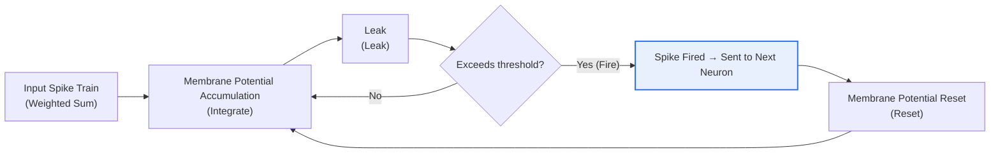
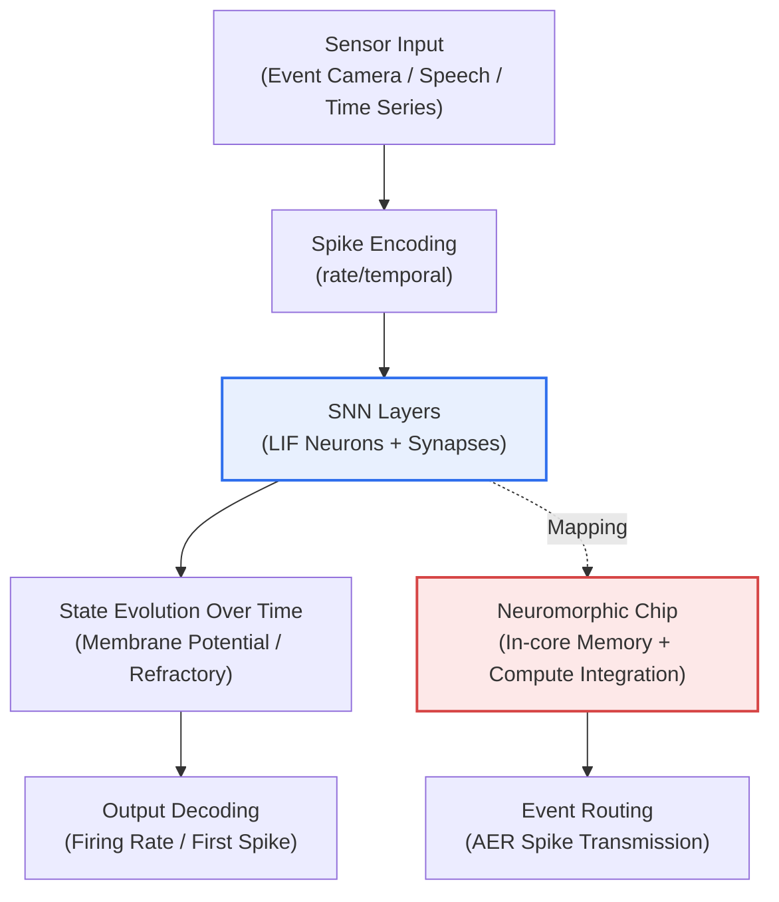

# Spiking Neural Network (SNN)

## 1. Overview

### A. Definition
> An **SNN (Spiking Neural Network)** is a third-generation neural network that mimics the way biological neurons **transmit information by firing electrical signals (spikes) at specific moments**; it is an event-driven neural network that represents data not by the magnitude of values but by temporal information — **when and how often** spikes occur.

The fundamental reason SNNs attract attention is that they "**resemble the brain more realistically and operate at low power**." Conventional artificial neural networks (second generation, ANN/DNN) have neurons compute and transmit continuous real values at every moment. This is accurate, but multiply-accumulate (MAC) operations run without exception even when inputs are close to 0, so they consume a lot of power. Now that the training and inference costs of large language models have spilled over into data center power problems, this "always-on computation" structure is pointed to as a fundamental limit to scaling.

The actual human brain, by contrast, operates on around 20W — less than a single incandescent light bulb — despite having about 86 billion neurons. One secret is **sparsity**. Neurons normally stay quiet and fire a spike only momentarily when a stimulus exceeds a threshold, effectively performing no computation the rest of the time. SNNs mimic this, operating in an event-driven way that **computes only when there are spikes**. As a result, power consumption drops dramatically in situations where most inputs are "no spike."

Moreover, since the timing of "when" a spike occurred is itself information, SNNs can naturally handle data whose essence is the time axis, such as time series, speech, and event camera signals. However, the greatest challenge is that spikes are discontinuous (either 0 or 1), so gradients are mostly 0 or undefined, making it difficult to directly use the derivative-based learning (backpropagation) that has underpinned second-generation neural networks. Ultimately, SNN aims to **realize ultra-low-power AI in combination with neuromorphic hardware**, but it is a technology whose success hinges on learning techniques that turn that potential into actual accuracy.

### B. Background and Need
As second-generation deep learning surpassed human performance in images and language, models and data grew explosively, and at the cost of that, power, heat, and cost also surged. In the cloud, cooling and power become bottlenecks; at the edge (smartphones, wearables, drones, robots), the battery does. At this point, which cannot be handled by "bigger models" alone, attempts to raise **energy efficiency (power consumed per operation)** by changing the computational paradigm itself form the background of SNN and neuromorphic research. As applications requiring **real-time, low latency, and low power** simultaneously — autonomous driving, industrial IoT, always-on voice detection — increase, SNNs are being re-examined as practical technology beyond academic curiosity.

### C. Generational Comparison
The table below summarizes the generations of neural networks, but it is worth noting in prose that the essence of the generational distinction is the change in "what information is represented with." The first-generation perceptron output only 0/1 via a step function, limiting its expressiveness; the second generation dramatically raised expressiveness and trainability with continuous activation values and backpropagation, but at the cost of the burden of constant computation. The third-generation SNN returns to discrete spikes, but this time tries to secure expressiveness by adding the axis of "time," making it not a simple regression but a new compromise.

| Generation | Neural Network | Information Representation | Learning | Characteristics |
|---|---|---|---|---|
| **1st Gen** | Perceptron | Binary output (step) | Limited | Only linear separation possible |
| **2nd Gen** | ANN/DNN | Continuous activation values | Backpropagation | High performance / constant computation / high power |
| **3rd Gen** | **SNN** | **Spikes / timing** | Surrogate gradient, STDP, etc. | Event-driven / low power / learning challenges |

## 2. Neuron Model and Operating Principle

The behavior of an SNN neuron is summarized in four steps: "**Integrate, Leak, Fire, Reset**." The most widely used is the **LIF (Leaky Integrate-and-Fire)** model. The neuron multiplies spikes coming from preceding neurons by synaptic weights and keeps adding them to its membrane potential (Integrate). Over time, the membrane potential gradually leaks away, tending to return to a baseline (Leak); this leak term creates a temporal filter that distinguishes "old input" from "recent input." Without leakage, the neuron would eventually fire unconditionally, and temporal information would be lost.

The moment the membrane potential exceeds the threshold, the neuron fires a single spike (Fire) and resets the membrane potential to its initial value (Reset). Sometimes a refractory period is set immediately after firing, during which the neuron does not respond to any input. As this simple rule repeats, spikes occur densely when strong inputs converge and sparsely when they are weak. In other words, **input strength is naturally encoded into firing frequency and timing**.

Methods of representing information as spikes (coding) fall into two main types. **Rate coding** represents a value by the number of spikes (firing rate) within a fixed time window. It is easy to implement and robust to noise, but counting enough spikes takes time, costing latency and power. **Temporal coding** carries information in the firing time itself, such as "how quickly the first spike arrived." It can pack much information into a few spikes and is fast and efficient, but is sensitive to timing noise and tricky to train. Real systems compromise between the two according to problem characteristics. There are also Izhikevich and Hodgkin-Huxley models that are more biologically sophisticated than LIF, but due to their heavy computation, simple LIF-family models are mainly chosen for large-scale SNNs.

## 3. Overall Structure and Neuromorphic Architecture

An SNN system follows the flow of **encoding that converts input into spikes → temporal processing in SNN layers → decoding that converts results back into values**. The front-end encoding is important because most data in the world consists of real values (pixel brightness, audio amplitude). These must be converted into spike trains via rate/temporal methods before the SNN can process them. As an exception, an **event camera (DVS, Dynamic Vision Sensor)** emits events only at the moment a pixel's brightness changes, so it is itself a spike stream without separate encoding, making it a good match for SNNs.

The key point is that an SNN is a **dynamic system whose state evolves over time**. If a second-generation neural network is a static function producing one output per input, in an SNN the state changes over multiple timesteps as membrane potentials rise and fall and spikes are exchanged. Therefore, even with the same number of neurons, it must be understood by unrolling along the time axis like a recurrent neural network (RNN). This dynamic characteristic gives strength in time-series processing but at the same time creates the complexity of having to "propagate errors backward through time" during training.

The low-power advantage of SNNs is realized only when they meet hardware. In von Neumann CPUs/GPUs, compute units and memory are separated, so most power is spent moving data back and forth (the memory wall). **Neuromorphic chips**, by contrast, **integrate computation and memory in one place at the neuron and synapse level** and asynchronously activate only the neurons that spiked. Spikes are transmitted only as address-events — "which neuron fired when" — using methods like AER (Address-Event Representation), reducing both communication volume and power. In short, SNN is the algorithm and neuromorphic is the hardware that runs it most efficiently; the two are meaningful when designed together. [[neuromorphic]]

## 4. Learning Methods — Three Paths Over the Wall of Discontinuity

The greatest technical barrier for SNNs is learning. Spike firing is like a step function, with a gradient of 0 in most regions and non-differentiable at the threshold. Backpropagation propagates errors by multiplying gradients, so if the gradient is 0, the learning signal vanishes. Approaches to circumvent this have developed along three main paths.

**First is the Surrogate Gradient approach.** In the forward pass, spikes are generated with the real step function, but only in the backward pass is the step function differentiated "in place of" a smooth curve (e.g., the derivative form of a sigmoid). Combined with BPTT (Backpropagation Through Time), which unrolls along the time axis and then backpropagates, it has become the de facto standard for training SNNs end-to-end on deep learning frameworks today. Its accuracy is the highest, but its limitation is that training itself occurs on GPUs, so the power savings in the training phase are not large.

**Second is STDP (Spike-Timing-Dependent Plasticity).** It directly uses the biological rule "if the presynaptic neuron fires first and the postsynaptic neuron fires shortly after, strengthen the connection; if the order is reversed, weaken it." Learning takes place without labels (unsupervised) using only local information, making it suitable for on-chip learning in hardware, but it is hard to converge toward a global objective (accurate classification), so performance lags on large-scale problems.

**Third is ANN-to-SNN conversion.** First, a well-trained second-generation ANN is built, and then its weights are transferred to a rate-coding-based SNN. By mapping ReLU activation values to firing rates, it has the advantage of easily obtaining high accuracy. However, maintaining accuracy requires a sufficient number of timesteps, increasing inference latency and power, and there is the fundamental trade-off that temporal information is not actively exploited. In practice, these three paths are chosen or combined depending on the goal (accuracy, or ultra-low power and ultra-low latency).

## 5. Comparison with ANN and Application Cases

The difference between SNNs and second-generation ANNs arises not from simple performance superiority but from **a difference in "what is being optimized."** ANNs are optimized for accuracy and ease of training, whereas SNNs are optimized for energy efficiency and temporal responsiveness. Hence, comparing only accuracy benchmark numbers generally puts SNNs at a disadvantage, but switching the axis to "inferences per watt" or "event response latency" changes the story.

| Category | 2nd Gen ANN/DNN | 3rd Gen SNN |
|---|---|---|
| Information representation | Continuous activation values | Discrete spikes / timing |
| Computation | Constant computation (dense) | Event-driven (sparse) |
| Power | High | Very low (when combined with hardware) |
| Learning | Backpropagation (mature) | Surrogate gradient / STDP / conversion (evolving) |
| Strength domains | Large-scale recognition / generation | Time series / events / low-power edge |

Three concrete cases can be cited. First, Intel's neuromorphic chip **Loihi 2** and the research framework Lava have reported results **lowering energy per operation by tens of times or more** compared with conventional GPUs/CPUs on tasks such as keyword spotting and gesture recognition (absolute values are not generalized, as they vary widely by task and measurement conditions). Second, IBM's **TrueNorth** was designed to perform real-time pattern recognition at a power level of tens of mW while containing about 1 million neurons and 256 million synapses, symbolically demonstrating the low-power potential of neuromorphics from early on. Third, the **event camera (DVS) + SNN** combination processes thousands to tens of thousands of events per second with microsecond-level latency, proving effective in applications such as high-speed object tracking and drone avoidance where frame-based cameras are burdened by latency and power. In this way, SNN is positioning itself not as a technology that "replaces ANNs on every problem" but as one that **delivers overwhelming efficiency in niches where power, latency, and temporality are decisive**.

## 6. Advanced — Latest Trends, Standards, and Ecosystem

The first recent trend is the **maturation of a joint hardware-software ecosystem**. Intel released the open source framework Lava alongside Loihi 2, and PyTorch-based libraries such as snnTorch, SpikingJelly, and Norse have popularized surrogate gradient training, allowing researchers to handle SNNs with familiar deep learning tools. This change has greatly lowered the barrier to entry for SNN research.

Second is the emergence of **large-scale neuromorphic systems**. Intel has greatly expanded the scale of neurons and synapses through a large research system (Hala Point) combining many Loihi 2 chips, which is becoming a testbed for gauging whether SNNs can move beyond small edge experiments toward large-scale problems. Third are attempts at **integration with Transformers and LLMs**. Research in the Spiking Transformer family, which reinterprets the attention structure on a spike basis, has emerged to explore the possibility of low-power large-scale models. However, since these are still at an early stage relative to the second generation in terms of accuracy and maturity, it is advisable not to accept specific performance figures definitively, given that they vary widely by publication and conditions.

Fourth is the combination with **on-device and always-on AI**. SNN and neuromorphic approaches are being considered as strong alternatives for applications that must run constantly on battery, such as always-on voice detection in smartwatches, real-time noise suppression in hearing aids, and anomaly detection in industrial sensors. [[on-device-ai]]

### Expected Exam Directions and Answer Structuring Strategy
SNNs may be tested in the AI and data domain together with neuromorphic and low-power AI, or in the context of generational change in deep learning. Developing the answer along the following axes makes it easier to secure depth.

- **Definition and differentiation**: First pin down the essence of "spike-, time-, and event-based" in contrast to second-generation ANNs.
- **Operating principle**: Describe LIF (Integrate-Leak-Fire-Reset) and rate/temporal coding along with diagrams.
- **Core challenge**: Connect discontinuity → difficulty of backpropagation → the three paths of surrogate gradient, STDP, and ANN conversion.
- **Hardware linkage**: Explain the "conditions for realizing" low power via neuromorphic chips (Loihi, TrueNorth), the memory wall, and AER.
- **Application and outlook**: Conclude with suitable domains such as edge, event cameras, and on-device AI, and the trade-offs.
- **Related topics**: Build an extended answer by bundling with neuromorphic computing, on-device AI, and green AI.

## 7. Considerations and Implications (PE Perspective)

1. **Algorithm-hardware co-design is a prerequisite.** The low-power advantage of SNNs can actually be a loss on GPUs (spike processing overhead). Low power is realized only on neuromorphic chips, so a co-design strategy that determines the algorithm and target hardware together is essential at adoption. Adopting SNNs without deciding on hardware loses most of the benefits.

2. **The three-way trade-off of accuracy, latency, and power must be managed explicitly.** Increasing timesteps raises accuracy but also raises latency and power. This balance point must be set differently according to application requirements (e.g., reaction latency in autonomous driving vs. battery life in wearables), and there is no single right answer.

3. **Judge problem fit first.** SNN is not a panacea. It is strong on problems where the time axis is essential (events, time series) or power is extremely constrained, while the mature second generation remains advantageous for static large-scale image classification and generation. Adoption should be decided by **alignment with problem characteristics**, not by "technology trends."

4. **Phased adoption that accounts for maturity and ecosystem risk is needed.** Because learning techniques, tools, and standards are still evolving, talent acquisition, debugging, and verification are harder than with the second generation. A phased approach of PoC → specific low-power edge application → expansion, and a strategy of spreading risk through hybrids with second-generation ANNs (SNN only on critical low-power paths), are realistic.

5. **Outlook: a pillar of sustainable AI.** As AI power consumption emerges as a social cost, SNN and neuromorphic computing, which fundamentally raise energy efficiency, are key candidates for "green AI" and edge intelligence. They are likely to develop in parallel — in the short term in niche low-power applications, and in the long term as a path to making large-scale models more efficient.

## References
- Intel Neuromorphic Computing / Loihi 2 · Lava: https://www.intel.com/content/www/us/en/research/neuromorphic-computing.html
- IBM TrueNorth (Science, 2014): https://www.science.org/doi/10.1126/science.1254642
- snnTorch (surrogate gradient tutorial): https://snntorch.readthedocs.io/
- Wikipedia — Spiking neural network: https://en.wikipedia.org/wiki/Spiking_neural_network

---

> **In one line**: An SNN is a *third-generation event-driven neural network that mimics neuron spike firing and firing timing*; it achieves ultra-low power and low latency by computing only when spikes occur, but because its discontinuous nature prevents direct use of backpropagation, it is advancing through dedicated learning techniques such as surrogate gradients, STDP, and ANN conversion and through co-design with neuromorphic hardware (Loihi, TrueNorth), proving its true value in edge and event applications where temporality and power are decisive.
