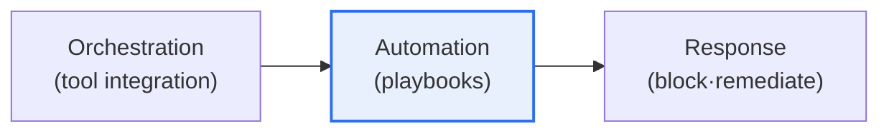
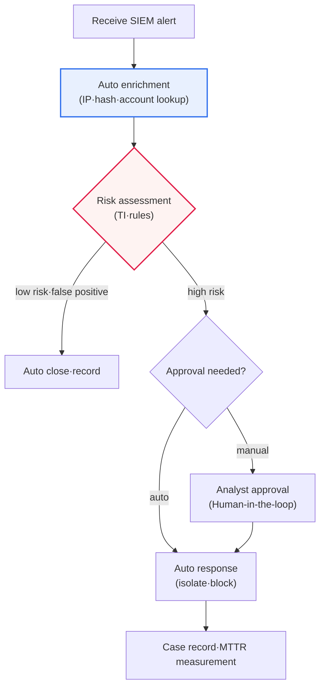

# SOAR (Security Orchestration, Automation and Response)

## 1. Overview

### A. Definition

> **SOAR** integrates the entire process from security threat detection to response into **Orchestration, Automation, and Response**, tying together scattered security tools and repetitive tasks into a single workflow to automate and streamline security operations (SecOps).

If we dissect the definition of SOAR, each of its three axes targets a different problem. **Orchestration** solves the problem that "tools are fragmented," **automation** solves the problem that "repetitive work exhausts people," and **response** solves the problem that "remediation is slow." In other words, SOAR is less a single product than an "operating framework" that redesigns how the SOC (Security Operations Center) works, shifting it from a people-centric to a workflow-centric model. This is what distinguishes SOAR from a mere collection of automation scripts.

### B. Background

The fundamental background behind SOAR's emergence is the reality that "**security alerts are exploding, yet there is a shortage of staff to respond**." Today's SOC is flooded with thousands to tens of thousands of alerts per day from countless security appliances such as firewalls, IPS, EDR, and SIEM. With analysts checking each one individually, jumping between multiple consoles to look up IP reputations, cross-checking logs, and manually applying blocks, time and manpower fall hopelessly short. As a result, real threats get buried in the flood of alerts—so-called "**alert fatigue**"—responses are delayed, and skilled analysts burn out on simple, repetitive work and leave.

SOAR breaks this vicious cycle through automation. It connects scattered security tools via APIs so they can be handled from a single pane (orchestration), automatically performs repetitive investigation, classification, and response tasks according to predefined procedures (playbooks) (automation), and swiftly blocks, isolates, and remediates threats (response). This frees analysts from simple lookups, copying, and pasting, letting them focus on truly important judgment and threat hunting, and it dramatically accelerates response speed (MTTR).

### C. Necessity

As the quantitative explosion of cyber threats, the structural shortage of security staff, and the fragmentation of multiple security tools converge, SOAR has shifted in status from "nice to have" to "operations collapse without it." In particular, as tools proliferate, the number of consoles analysts must switch between grows, which paradoxically lowers productivity—the "**tool sprawl**" problem worsens. SOAR directly resolves this by integrating these tools at a single higher layer.

## 2. Components and Key Functions

Looking at how SOAR works at a glance, orchestration that ties together heterogeneous tools forms the foundation, playbook automation runs on top of it, and response actions are ultimately executed—a three-tier structure.

| Component | Content |
|---|---|
| **Orchestration** | API integration and consolidation of heterogeneous security tools (SIEM·EDR·firewall·TI) |
| **Automation (playbook)** | Defining response procedures as playbooks and executing them automatically |
| **Incident Response (IR)** | Threat investigation, isolation, blocking; case (ticket) management |
| **Threat Intelligence (TI)** | Supporting judgment and classification through threat intelligence integration |
| **Dashboard·Metrics** | Managing response status and metrics (MTTR·MTTD) |

**Orchestration** is SOAR's foundation. It connects tools from different vendors—SIEM, EDR, firewalls, ticketing systems, threat intelligence platforms—via APIs and connectors, automatically passing the output of one tool as the input to another. For example, it automatically chains the flow of extracting a malicious IP from an alert raised by the SIEM → querying its reputation in the TI platform → and, if the result is malicious, applying a block rule via the firewall API—all without a person moving between consoles. Without orchestration, automation remains merely "partial automation confined within each tool."

**Automation (playbooks)** is the heart of SOAR. A playbook is a workflow that defines, in code and diagrams, response procedures such as "when this type of alert arrives → investigate it this way → branch conditionally like this → and respond this way." It automatically executes standardizable repetitive tasks (IP reputation lookups, account lockouts, file hash checks, isolation, etc.) without human intervention (or with minimal approval only). A single well-designed playbook cuts initial investigation that once took tens of minutes down to a few seconds.

**Incident response (IR) and case management** help people handle the parts that are not automated. SOAR groups related alerts into a single "case (incident)" and accumulates investigation history, evidence, and timelines in one place, enabling collaboration and audit. This is important from the perspective of "documenting and standardizing" the response.

**Threat intelligence integration and measurement** underpin the quality of judgment and the maturity of operations. They automatically cross-reference external threat intelligence to filter out false positives, and quantitatively manage operational efficiency with metrics such as MTTD (Mean Time To Detect) and MTTR (Mean Time To Respond).

## 3. Playbook Execution Structure (Detailed Process Diagram)

SOAR's real value lies in the process by which a playbook receives an alert and automatically branches and responds. Below is a detailed process diagram of a typical playbook execution flow.

The first stage of the playbook, **enrichment**, is the process of attaching context to an alert. It automatically looks up indicators (IoCs) contained in the alert—IP, domain, file hash, user account, etc.—against TI platforms, asset databases, and directories, gathering the material for judgment such as "is this IP known to be malicious?" and "what privileges does this account hold?" When this stage is automated, the time analysts once spent manually digging through multiple consoles disappears.

In the **triage** stage, the enriched information is synthesized with rules and TI scores to assess risk and branch. Low-risk cases and obvious false positives are automatically closed while leaving records to ensure audit traceability, and high-risk cases are passed to the response stage. This automatic branching filters out the "flood of false positives"—the core cause of alert fatigue—and reduces analysts' cognitive load.

In the **response** stage, automatic versus manual is divided according to the impact of the action. Easily reversible actions such as temporarily locking an account or isolating a suspicious file are executed automatically, while actions with large service impact such as a full firewall block or server isolation are safer with a **Human-in-the-loop** approval gate. Finally, every action is recorded in the case and MTTR is measured, feeding into a feedback loop for operational improvement.

## 4. Relationship with SIEM and Comparison

The most common confusion in understanding SOAR is its boundary with SIEM. The table is a summary; the key point is that the two are not competitors but a **complementary relationship** that divides "detection" and "response."

| Category | SIEM | SOAR |
|---|---|---|
| **Focus** | Log collection·correlation·detection | Response automation·orchestration |
| **Role** | Threat detection·alert generation | Post-detection investigation·triage·response |
| **Relationship** | Input to SOAR (provides alerts) | Receives SIEM alerts and responds automatically |

SIEM is the **eye of detection** that collects, normalizes, and correlates massive logs to find "what is suspicious." But SIEM itself has weak remediation capability—it merely generates alerts and hands the subsequent investigation and response over to people. It is precisely at this point—"the gap after detection"—that SOAR fills. When SIEM "detects" a threat, SOAR receives that alert and "automates" enrichment, classification, and response. That is why, in practice, SIEM (detection) and SOAR (response) are commonly deployed as a pair.

Recently, however, this boundary has been blurring. The market is being reorganized in a direction where SIEM products absorb their own SOAR capabilities and cloud-based unified SecOps platforms bundle detection, investigation, and response together. On top of this, with the emergence of **XDR**, which extends EDR to multiple sources, the integration of the entire "detection–response" stack is accelerating. Because the specific product landscape of this integration trend changes rapidly, it is advisable to check the latest market trends at the time of adoption.

## 5. Expected Benefits and Adoption Considerations

| Category | Content |
|---|---|
| **Expected benefits** | Shorter response time (MTTR), reduced analyst workload, consistent response, 24/365 automated response |
| **Adoption considerations** | Playbook design quality, risk of automatic response on false positives (approval process), tool integration standardization, staff competency |

The core of the expected benefits is not simply "speed" but "**consistency and scalability**." People's response quality wavers with condition and skill level, but a validated playbook responds with the same procedure even at 3 a.m. Moreover, even as alert volume grows, an organization can respond without linearly increasing staff, securing scalability against rising threats. Indeed, organizations that automated initial investigation and enrichment reportedly cut per-case handling time from tens of minutes to seconds, which frees analysts from repetitive work and creates room to reassign them to high-value activities such as threat hunting.

On the other hand, adoption has pitfalls. The biggest risk is the "**amplifying effect of bad automation**." Applying automatic response to false positives can block legitimate services and cause self-inflicted outages, and this mistake spreads at automation speed on a massive scale. That is why high-impact actions must have approval gates. Also, if connectors and APIs for each tool are not standardized, integration and maintenance costs rise, and without staff competent to design and improve playbooks, SOAR becomes an "expensive shell."

### Reference: Representative Application Scenarios

SOAR's effects become clear in concrete scenarios rather than abstract concepts. A representative example is the "**phishing email report handling**" playbook. When a user reports a suspicious email, SOAR automatically extracts the sending IP, URL, and attachment hash from the email header, queries the TI platform and sandbox, and if judged malicious, purges the same email from all users' mailboxes at the mail gateway, registers the URL on the proxy block list, and then replies to the reporter with the result. A procedure that takes more than 30 minutes manually is reduced to tens of seconds when automated.

As another example, the "**suspicious login response**" playbook, when the SIEM raises an "impossible travel" alert, has SOAR automatically look up the account's recent activity, and if the risk is high, forcibly terminate the session and temporarily lock the account, then request identity verification from the user. In this way, SOAR compresses the repetitive procedure of "detect–investigate–act–notify" into a single workflow, and depending on the organization, per-case initial response handling time is reported to have been cut from tens of minutes to a few seconds (the figures vary greatly by organization and playbook maturity, so they should be understood as rough reference values).

## 6. Advanced: Integration with AI and Evolution Toward the Autonomous SOC

SOAR's latest evolutionary direction is **integration with AI and generative AI**. Traditional playbooks required humans to predefine every branch, but combining large language models (LLMs) advances them to the level of summarizing alerts in natural language, searching for similar past incidents to recommend responses, and automatically drafting initial investigation reports. This lowers the barrier to writing playbooks and expands the scope of automation into areas of judgment that were hard to formalize.

Further, the industry is moving toward the concept of the **Autonomous SOC**—a model in which humans handle only exceptions while AI agents autonomously perform most repetitive responses. This direction, however, is discussed alongside clear checks. If an AI misjudges and responds automatically, its damage also spreads automatically, so how to maintain "explainability" and "human oversight (final human approval)" remains the key challenge. Relatedly, SecOps platform integration (SIEM+SOAR+XDR) and cloud migration are also underway, and because the specific maturity and adoption rates of these latest trends are fluid, it is appropriate to understand them as directions rather than certainties.

## 7. Considerations and Implications (from a Professional Engineer's Perspective)

1. **Playbook quality determines success or failure.** Because the effect of automation depends entirely on the playbook, accurate and validated response procedures must be designed and continuously improved (based on post-operation retrospectives). A bad playbook does not help the response—it automatically amplifies the damage instead.

2. **A balance between full automation and human intervention is needed.** Unconditionally automating a response to false positives can block legitimate services, so a semi-automated (Human-in-the-loop) design that routes high-impact actions through human approval is safer. Setting the boundary of "what to automate and what to leave to humans" is the core of the strategy.

3. **Tool integration standardization and an integration strategy are important.** SOAR's value is proportional to the breadth of its integrated tool ecosystem. Standardizing connectors and APIs and co-designing an integration architecture with SIEM, XDR, and TI is what actually resolves the fragmentation (tool sprawl) problem.

4. **AI integration drives intelligence and autonomy.** It evolves in the direction of combining generative AI and machine learning to advance threat analysis, playbook recommendation, and automated investigation, ultimately aiming at the autonomous SOC. However, explainability and human oversight must be secured together to control the risks of automation.

5. **Performance measurement and a continuous improvement system must underpin it.** Quantifying operational maturity with metrics such as MTTD, MTTR, auto-close rate, and false-positive rate, and having a feedback loop that iteratively improves playbooks and the scope of automation based on that data, is the key to establishing SOAR as an "operational capability" rather than an "adoption project."

## References

- Gartner, "Security Orchestration, Automation and Response (SOAR)" Glossary — https://www.gartner.com/en/information-technology/glossary/security-orchestration-automation-response-soar
- NIST SP 800-61 Rev.2, "Computer Security Incident Handling Guide" — https://csrc.nist.gov/pubs/sp/800/61/r2/final
- MITRE ATT&CK — https://attack.mitre.org/

---

> **In one line**: SOAR is a system that integrates and automates scattered security tools and repetitive tasks through *orchestration, automation, and response*, with **playbooks** automatically executing workflows that enrich, classify, and respond to alerts to shorten response time (MTTR). It complements SIEM (detection), its success hinges on **playbook quality and the balance of human intervention (Human-in-the-loop)**, and the latest trend is evolution toward the autonomous SOC through AI integration.
